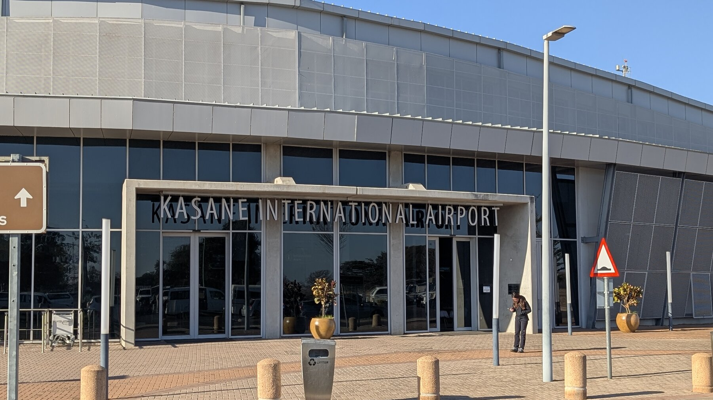

Planning a safari in Southern Africa is harder than it looks.  Charter flights, concessions, and camp logistics mean most travelers should use a specialist planner.   

### East Africa or Southern Africa

Most African safari planning starts with two choices:

East Africa -- Tanzania and Kenya -- is built around the [Great Migration](https://www.expertafrica.com/tanzania/info/serengeti-wildebeest-migration): more than a million wildebeest and zebra moving in a massive circuit between the Serengeti and the Masai Mara. We visited in 2013 with our children and it was extraordinary.

But our planner warned that August river-crossing season is now extremely crowded. Photos [recently](https://www.wildwonderfulworld.com/post/understanding-overtourism-and-the-great-migration) show nearly a hundred vehicles at a single crossing. When we went, we remember maybe three to five trucks. The Serengeti in peak season no longer feels especially remote.

Many planners now steer travelers toward different times of year. Spring brings the calving season -- thousands of baby wildebeest -- though without the dramatic river crossings. 

Southern Africa: here there are two common choices.    
   1. One is to stay in the country of South Africa, featuring Kruger National Park and quite a few private reserves that have a remarkable collection of wildlife.  This is very accessible -- you can rent a car and self-drive around Kruger with lodges at various price points.  But with that accessibility comes a bit (a lot?) more crowds.  We did none of this, we focused on culture and people (and wine) in South Africa.  
   2. The Okavango Delta in Botswana.  The Okavango Delta in Botswana is one of the largest inland waterways on earth -- and one of the least crowded places to see wildlife with still-excellent tourism infrastructure.

East Africa is about scale and spectacle; the Okavango is about intimacy and quiet.

Gorillas in Rwanda or Uganda is on our list for 2027.

### Finding the Right Operator

Planning a Botswana safari on your own is genuinely difficult -- there are charter planes to coordinate, no self-driving, and logistics that span multiple countries and time zones.  I can imagine (at least) 3 different categories of companies to organize your trip -- if you search for "safari operators" there are quite a few companies wanting to help spend your money:

* Using a travel operator that operates around the world; we used to use [Big Five](https://bigfive.com/) for planning for exactly that reason.  We got disenchanted with them.  They did a perfectly solid job organizing our 2011 Costa Rica and 2013 Tanzania trip. But when we planned our next trip, they assigned us the same "trip planner" -- meaning she was expected to be an expert on every country on earth, which is unrealistic.  We have since sought companies that specialize in a region, so the person you're talking to has actually *been* to where you're discussing and is not reading off a web page.  
* Africa-based tour operators -- we really were interested in this, because we wanted as much of our $ as possible to stay in Africa.  We came close to choosing [Roar Africa](https://www.roarafrica.com/luxury-african-safari-campaign) who we found online, one of their main selling points is that most of the people you deal with in Africa are Roar employees so there's one company to deal with. We still were able to talk to a seemingly-knowledgeable salesperson who lives in the US -- but while she had been to Africa unlike our Big 5 salesperson, she had been ... exactly once.    
* US-based travel planners who specialize in Africa and partner with African operators -- this was in the end what we chose.  A friend recommended [Next Adventure](https://www.nextadventure.com/), a Berkeley (CA) husband-and-wife (and 2-3 other employee) travel planner that does "only" Africa.  Next Adventure's main proprietor Kili got her name when her parents found out they were pregnant on Mt Kilimanjaro.  She has been to Africa literally dozens of times, but also understands her clients well, and for us could say "Think of Cape Town as more like San Francisco, and Johannesburg as more like Los Angeles" which resonates.  Our Roar salesperson had been to Africa once; Kili had been to every single place she was recommending, and many others besides -- that gave us a lot of comfort.

Kili and the team were excellent listeners. We started with a simple idea -- Okavango Delta and Victoria Falls -- and then worked through timing, budget, and possible camp combinations.

They initially proposed several different itineraries and then refined them as we discussed tradeoffs. Camps vary enormously in price and style, even within the same region. Our two Botswana camps were very different, one nearly twice the price of the other.

Having someone who knew the camps personally made the decisions much easier.

Note that Next Adventure partners with multiple companies on the ground in Africa for the actual guiding and logistics.  In our case the company that operated our two Botswana camps was [Natural Selection](https://naturalselection.travel/), who are on the ground in the right timezone, and Natural Selection was our first point of contact.  We have wondered if we had just gone directly to Natural Selection whether the price point would have been different -- but on the other hand, we didn't know to find them/pick them, and/or calling them 9 time zones away would have been less convenient.  We're not entirely sure who handled the Zimbabwe and South Africa logistics -- but we didn't have to care. Every transfer, flight, and handoff went without a hitch.

Note we likely could have organized the South Africa (non-Botswana) part on our own (e.g. without Next Adventure), and potentially saved some money ... but it was easier just to have one organizer, and Kili knows Cape Town well.

In advance, Next Adventure gave us both a 25-page binder and an easy-to-navigate website and mobile app.  It was easy to figure out where we were supposed to be and when.  

### How We Structured the Trip

Our key goal was to see the Okavango Delta (one of the best places anywhere to see African wildlife), and if you're near there then see Victoria Falls, by some measures the largest waterfall on earth.  We organized our trip around those two pillars.  Here's our basic outline:

* 4 nights in Cape Town.  Partially it's 9 time zones from California and we wanted to get over jet lag in a city.   In 2013, we were in "the bush" 24 hours after our Africa arrival, and it's exceedingly hard to get over jet lag with lions roaring right outside your canvas tent.  Cape Town deserves its own time -- see our [Cape Town page](cape-town.html).    
  * Note that two of our friends who later met us in Zimbabwe went to Johannesburg instead of Cape Town, which has more apartheid history (including the Apartheid Museum and both Mandela's and Tutu's home in Soweto), but generally has the reputation of being less attractive nature-wise.  Joburg has a *reputation* of being less safe, though that appears to be very location-specific, e.g. there are safer and less safe regions of each city, so we don't know for sure how based in reality that reputation is.  
* 2 nights in Victoria Falls. We arrived mid-afternoon one day just due to flight logistics from South Africa, so we ended up with roughly 1.5 days there, which worked out perfectly.  
* 7 nights in the Okavango -- we did 3 nights at one camp and 4 at another.  

> Honestly, by day 9 of safari (because we did 2 days near Victoria Falls), it's hard to get as excited as you were a week ago at Yet Another Zebra -- but our very last game drive, at 5:30pm of day 9, was when we saw our one male lion, so it's just so hard to know what the right timeline is.  

More time gives you more opportunity; a friend was in Tanzania a year earlier and saw his one cheetah pursuit on day 11\.  9 days in the bush felt about right for us.    
* 4 nights in the Cape Winelands, the wine region an hour north and east of Cape Town.  We wanted, after 9 days on safari and before getting on a 15-hour flight to Atlanta, to have some downtime (our friends went home straight from the safari due to job considerations).  This was somewhat anticlimactic after all the safari animals, but quite pleasant.  2-3 nights would be totally reasonable.

### Getting Between Places

Note that we booked both our intercontinental flights (Delta SFO=\>Atlanta=\>Cape Town and back), but also our internal-to-Africa but across-national-border flights (Cape Town \=\> Victoria Falls; Maun \=\> Cape Town).  We flew Airlink, which is a South Africa-based commercial carrier, from South Africa to Botswana and then back 9 days later.  We flew Airlink between South Africa and Botswana -- unremarkable in the best sense, about what you'd expect from a regional carrier.

Next Adventure booked the charter flights within Botswana.  We never interacted directly with MackAir, who did all the transfers within Botswana -- they were booked for us, and as far as we can tell are the only option, it was the only operator we saw on the Botswana airstrips.  

By and large Mackair does a nice job.  MackAir schedules charter flights based on demand each day. You find out at dinner the night before what time you're leaving -- that's it.  No choice, no negotiation.  

Most of the time this worked perfectly. Our only disappointment was the final leg from North Island to Maun: instead of a direct 25-minute flight, we made three stops and spent 75 minutes in a small plane.

We were mostly on 14-seat prop planes.  Not fabulous, a bit cozy, but more than fine.  Other than the Kasane airport in Botswana, which was quite modern-feeling, all of our flying was in and out of airstrips plopped in the middle of the Okavango -- no services, no bathroom.

### When to Go (and the Tradeoffs)

Worth remembering: all these locations are in the Southern Hemisphere.  We went roughly the end of July through mid-August, and it worked great.  We had to balance 3 factors: best times for Okavango, best times for Victoria Falls, and best time for Cape Town.  Those are not the same month (we visited Cape Town in off-season), but still the right overall choice for our priorities:  

For the Okavango, most guides recommend visiting between June and October. These months are the dry season in terms of sky and air -- but somewhat confusingly, the delta itself is filling with water.

The floodwaters come from rains that fell months earlier in the mountains of Angola and slowly make their way downhill into Botswana. By August the water levels are near their peak, which is why some sites call this the Okavango "flood season." When we visited, many of the tracks were underwater and our vehicles regularly drove through 12-24 inches of water.

Dry skies also mean thinner vegetation, which makes wildlife easier to spot. The animals concentrate around the remaining water sources, so sightings tend to be more reliable.

August is winter in Botswana, which means chilly mornings but pleasant afternoons:

* **6-9am game drives:** often around 40°F, genuinely cold in an open vehicle  
* **Afternoons:** usually around 80°F and very comfortable  
* **Later in the season:** temperatures climb into the 90s  

We were happy to trade cold mornings for clear skies and excellent wildlife viewing.

For Victoria Falls, it's about water flow; see [this article](https://www.go2africa.com/destinations/victoria-falls/when-to-go).  The peak "flow" is late in the rainy season, roughly March and April.  But from the Zimbabwe side (which we visited; the falls are between Zimbabwe and Zambia), the thunder of the falls is so much that from the ground the mist may obscure the falls at the absolute peak.  We loved our August visit -- we got plenty soaked seeing the falls, and the mist obscured parts of it.  At peak flow, the mist is soooo strong that it can almost entirely hide the falls ... I'm not sure that's better.   

This means we were visiting Cape Town in their winter; we got lucky with minimal rain, but it's the rainy season and you might not.  But that was the compromise we were willing to make. 

### What to Actually Pack

What we can add to the many available safari packing lists is that at the price point of our two Okavango camps, there is free laundry.  The clean laundry came back back same-day, so you leave some stuff out before you depart at 630am, and late that afternoon it's perfect.  So ... at that point you really don't need to bring a lot at all, two safari outfits might be sufficient.

Many guides will tell you that in winter it's cold in Botswana, and take that seriously.  Our camp operators had large blanket-style ponchos available for the morning drives (with highly-appreciated hot-water bottles), but we used those *over* two shirts and a puffy jacket -- it's a raw 40 degrees or so first thing in the morning, and the trucks don't even have sides let alone windows.  You'll shed clothes all morning, but you want warm clothes for the first 2 hours for sure.

One other note: one nice thing about the Okavango is it's not nearly as dusty as the Serengeti -- honestly we'd come back after a day 'out on drive' ... and not feel all that dirty.  We remember feeling differently in Tanzania.

All guides will say that you are required to use soft-sided luggage (e.g. duffel) and that the weight limit is very serious of 20 kg (44 lbs).  The gate agent *did* weigh us on our first MackAir flight (from Kasane to Sable Alley), and they were serious about it -- we had to move a laptop between bags to make the limit.  Had we been 5 lbs over, we're not quite clear what the consequences were, but were glad not to find out.

### Tipping

Your trip planner will likely have a set of "suggested tips".  At each lodge, you give all tips at the end of your stay.   There is a box where at the end of your camp stay you can put the "tip for all the staff that isn't your guide", and typically you can give the tip to your guide directly.  South Africans prefer Rand (their currency); in Botswana we were encouraged to use USD, so we never took out a penny of the Botswana currency.

We found it helpful to bring a bunch of envelopes prepared ahead of time -- e.g., "Camp \#1 staff' and "Camp \#1 guide' with the $ counted out, made things less stressful while we were out on vacation.

### What a Safari Day Actually Looks Like

A typical safari day is stranger than it sounds -- you spend most of it sitting, yet it's genuinely intense.  There are walking safaris in various places, and/or we did 3 boat trips on this journey, but by and large, a typical day is two game drives, one morning and one late afternoon -- because that's when you can see the animals, and in mid-day most of the animals are hiding or resting relatively speaking.  So for us a typical day was:

* Wake up at 5:30 (first camp) or 6:00am (second camp).  Have either coffee or light breakfast, get in your vehicle by 6:45am for morning drive, just before dawn.  
* 6:45-11:15ish morning drive, punctuated by a delightful coffee break around 9ish.  All of this is dependent on what you're seeing.  If there's a great leopard viewing at 8:45, they don't cut it short for 9am coffee -- but there was a predictable 15 minutes each morning for the driver to find a spot where he could see around us (for safety), get out some coffee and usually a few snacks (biscuits, jerky, hard-boiled eggs, etc), and we could stretch our legs.  Similarly the drive would end "as appropriate"; one day we were almost back to camp and then had the best elephant sighting of the whole trip, and the guide just parked and let us immerse ourselves in it, and we got back "late" to camp \- who cares.  
* 1130-3:00 or so -- downtime.  Time to go back to your room, shower (it's both too cold and too early to shower before the morning drive), rest, enjoy a lunch in the 1230-2 range.  We had a number of camps with plunge pools and the like, but these are not for August, the water was frigid.  One of our camps had massages which was delightful, and all of our camps had nice chairs/couches to just relax, as well as nice decks on each tent.  There were pools in front of each Okavango camp, with hippos, elephants, and kudu (a large antelope) coming through in full view of the lunch spot.  
* 3:30 -- "tea" -- this part of "Botswana used to be a British protectorate" seems on full display.  
* 4-645 or so (Sunset) -- afternoon game drive.  Also as a leftover of British time, the "sundowner" (cocktail in the bush) is very much a part of each afternoon drive.  We did these every day in the vehicle -- our guide would find a great spot, usually  with a herd of zebra or giraffe or similar in close view, and pour drinks in the front seat to pass back right around 5:30 or 6:00 each day.  Not too stressful.  
* 6:45 45 minutes by the fire pit, usually meeting other groups and playing the "what did you see today" game.  Mostly great, give or take the "do you want to see the Zebra I shot?" from a drunk couple (unfortunately American) one night.  There is no hunting in the Okavango, but there are "hunting safaris" available elsewhere.
* 730-9:00 dinner  
* And by 9:00 ... you're usually tired, the camp gets quiet quickly.

There's little physical activity -- but at least for us, when we were in the vehicles, we are *on alert* -- partially because there's not much else to do (no cell service\!) -- but partially because at any moment there might be a leopard, or a jackal, or a rare antelope around the corner.  Mixed with some amount of reptilian-brain action that these are predators and that elephants are large -- there's a low-level alertness you can't quite turn off.

By and large the "alert" isn't so much a feeling of not being safe -- on our second safari, we never felt anxious.  There's a strange sense of calm; even though Botswana features open-sided trucks so there's really not much protecting you.  

> We figure that if a few tourists were mauled each year, we'd know it -- and it's just not at all something that seems to happen.  

The guides all say that the animals see trucks as a silhouette (and they're vigilant about not having arms and legs hanging out), and for reasons we don't quite understand ... the animals don't see potential prey.  All that being said ... 3 weeks after our return, we saw this [lovely news article](https://abcnews.go.com/GMA/Living/tourists-speak-after-elephant-charges-safari/story?id=126284923) about an elephant charging and nearly killing a few kayakers in the Okavango.  Evidently in that case the tourguide didn't see that a mother elephant had two nearby calves, thus enraging the mother.  But that seems to be quite unusual (hence it was a worldwide news story), and we never worried, even as a leopard or lion walked right up to our truck.

Note that at all 3 camps, and I believe this is 100% the norm: you will have the same guide for the entire time at that camp.  The person who meets you at the airstrip is likely your safari guide, boat captain, and driver.  I suspect that on rare occasions there is a reassignment due to mismatch in style, but we liked all three of our guides.    One thing we learned on our first safari stop is that many (all?) of the staff have "tourist-friendly" nicknames.  All the staff who introduce themselves at African lodges have what I can only assume is their "safari name" (not their given) -- so our three guides were "CJ", "Parks", and "Pressure", and we met another guide who gives his name as "007".  

> It felt rude to ask "007", or any of the other staff members we met at any of our lodge destinations, what his mother calls him.

