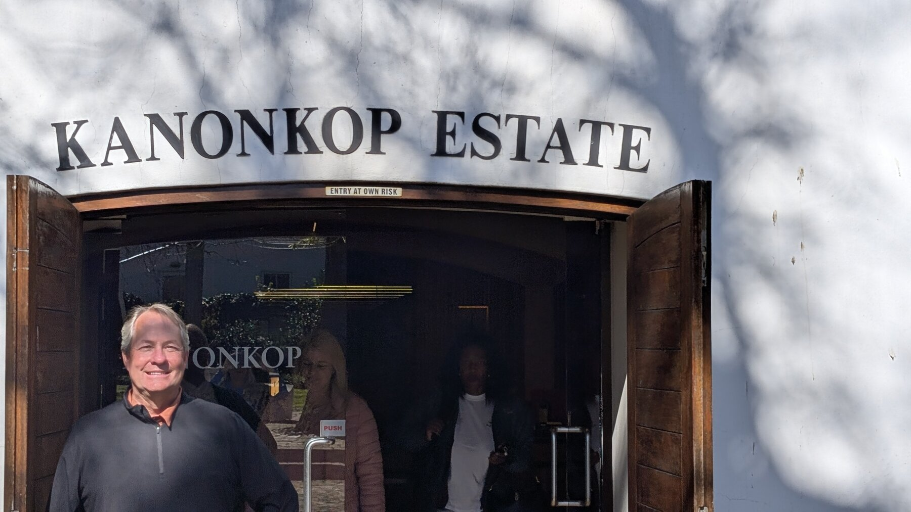
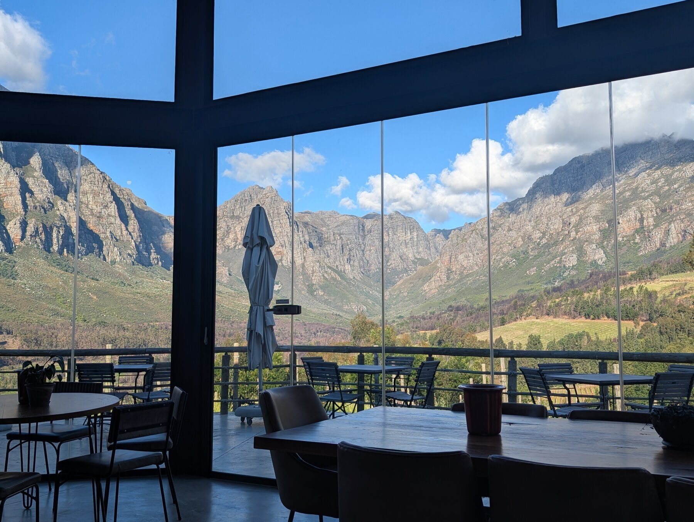
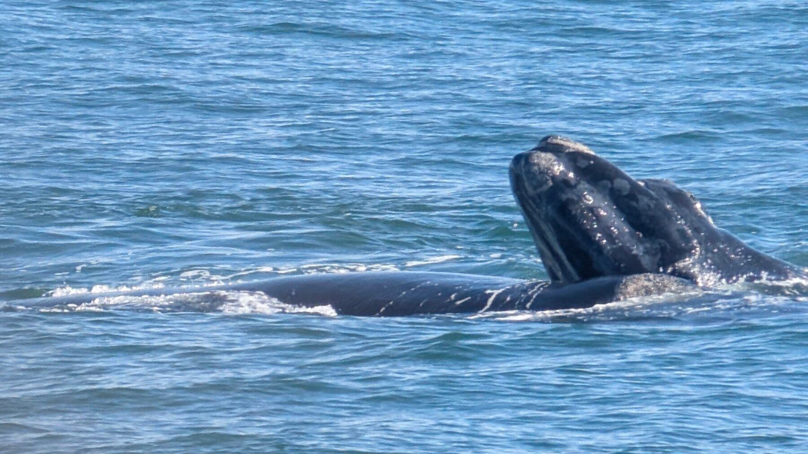
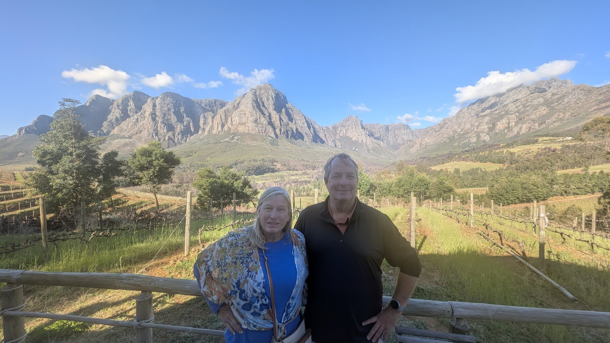
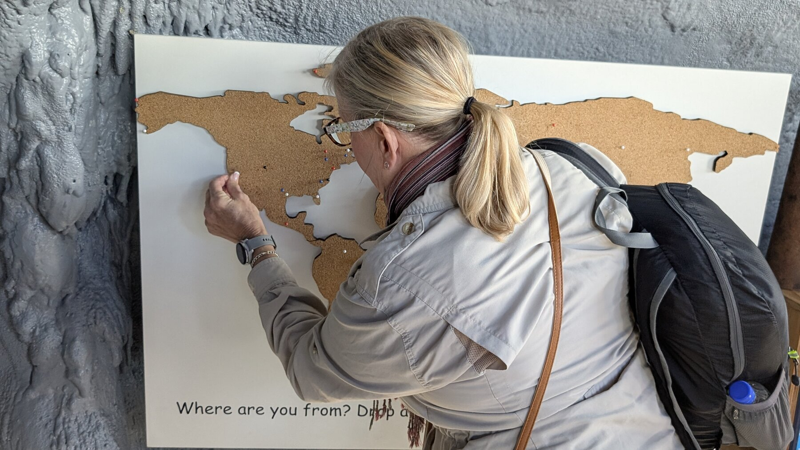
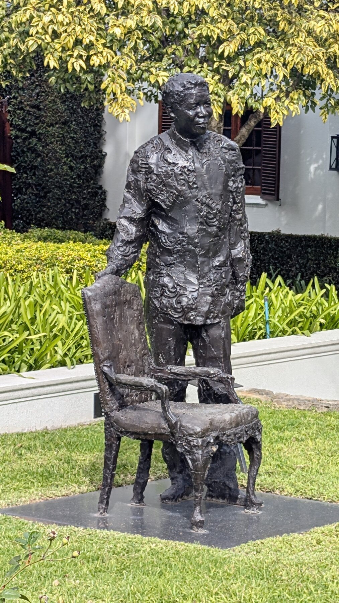
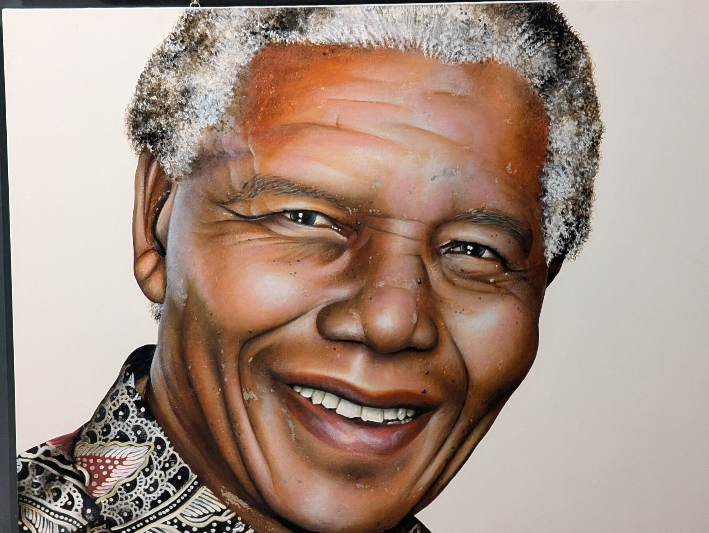
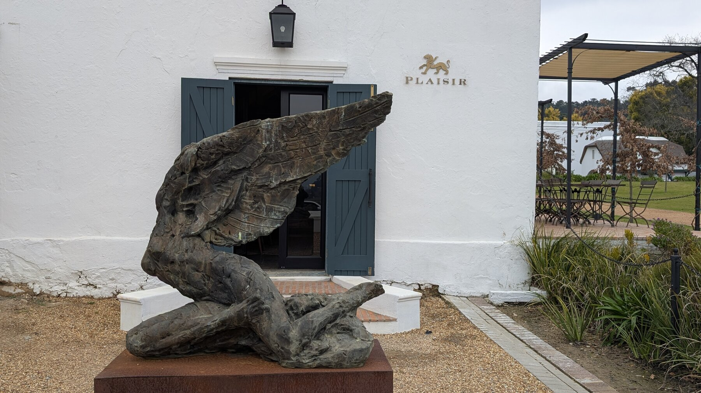
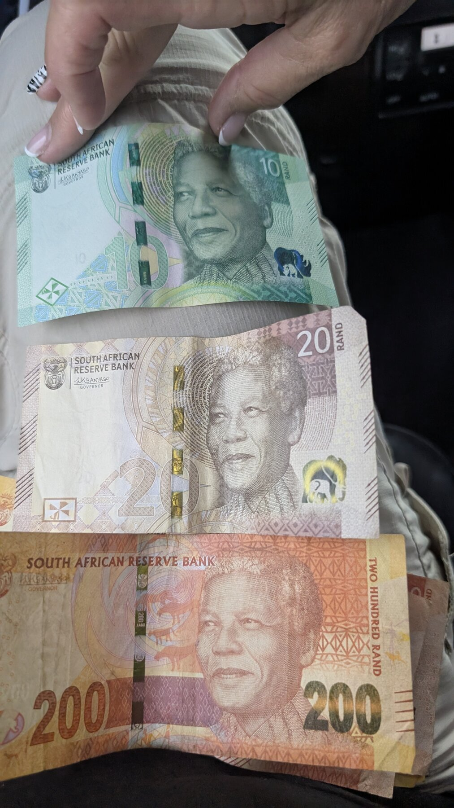

## Overview

We had 4 nights there after the safari.  We had limited ambitions for this other than to relax; we knew it was winter so hanging around the pool wasn’t going to happen.  

## What We Did

The two main towns of the Cape Winelands are Stellenbosch and Franschhoek.  We spent a few hours in Stellenbosch on a day tour and found it pleasant, but we were glad to have stayed in Fraschhoek – it is/was very sleepy, but very walkable.  

We did two day tours from Franschhoek.  The first was a standard winery tour – 3 wineries plus a wine lunch.  We particularly enjoyed [Kanonkop](https://kanonkop.co.za/), which a friend of Kevin’s had recommended as having the best Pinotage she tasted – suffice it to say we made some investments there.  Pinotage is a grape native to South Africa \- it’s a blend of Pinot Noir and what was once called Hermitage, better-known as Cinsault.  For whatever set of reasons, it’s easy to make a bad Pinotage and many houses do, but Kanonkop made some very very tasty wines.  We finished the day at [Rainbow’s End](https://rainbowsend.co.za/), with just gorgeous views.

The second day trip was to the coastal town of Hermanus for whale watching.  This is often listed as a day trip from Cape Town, but if you look at a map it’s actually closer to Franschoek.  This had the added advantage that on the way back from Hermanus, we drove through the “Hemel en Aarde” (Heaven and Earth) valley, which due to its coastal location is cooler and is where some excellent Pinot Noirs are made.  We stopped at a winery in that valley which was lovely.

Hermanus is a fairly typical quaint coastal town.  The whale watching is excellent – Southern Right Whales swim right ¼ mile off the coast, so it’s easy to see them (which is amazing, since Northern Right Whales are nearly extinct).  They’re not as spectacular as Humpbacks (few are), but it was exciting to see them.  We also saw a Bryde's whale, which was exciting as they are rare and elusive.

For both of these day trips, we lucked into an outstanding driver, Theunis Minnie; we booked him through an agency but of course he does better if you go directly to him – here is [his contact info](https://www.pathfind.media/vcard/theunis).  Theunis is a lifelong South African of Dutch ancestry, and was extremely knowledgeable about wine, history, and culture.  We had had a few rough experiences with locals attitude-wise (a direct quote from a previous driver: “all blacks here don’t want to work”), and we also have found around the world that people want to ask us about Trump and … it’s fatiguing.  So we were unenthused by the end of the trip to engage in “politics” with people, but Theunis had such insights into government, democracy, how South Africa had evolved since apartheid (his age is such that his first vote was in the 1994 Mandela election), etc – that we had outstanding conversations.  Highly recommended.

## Where We Stayed

From our boutique hotel [The Last Word](https://www.expertafrica.com/south-africa/winelands/the-last-word-franschhoek) there were easily 5 or 15 high quality restaurants within a 5-minute walk.  

## Food & Dining

We particularly enjoyed dinners at [Reubens](https://www.reubens.co.za/) (the best spot we tried) and [Allora](https://www.allora.co.za/) which is Italian.  A lot of the restaurants in town are 5-course prix fixe kinds of setups, which is no longer appealing to us, but the two we mentioned are just good excellent food.

## Practical Tips

Franschhoek itself is very walkable for the main "restaurant area" -- we were delighted to wander in the afternoon/evenings.  However, there are few wineries that are decent walking distance from town -- if your goal is wine tasting, then "someone" likely needs to drive, whether it's you or a hired driver.

*Add your photos here*

---

*Last updated: February 2026*

