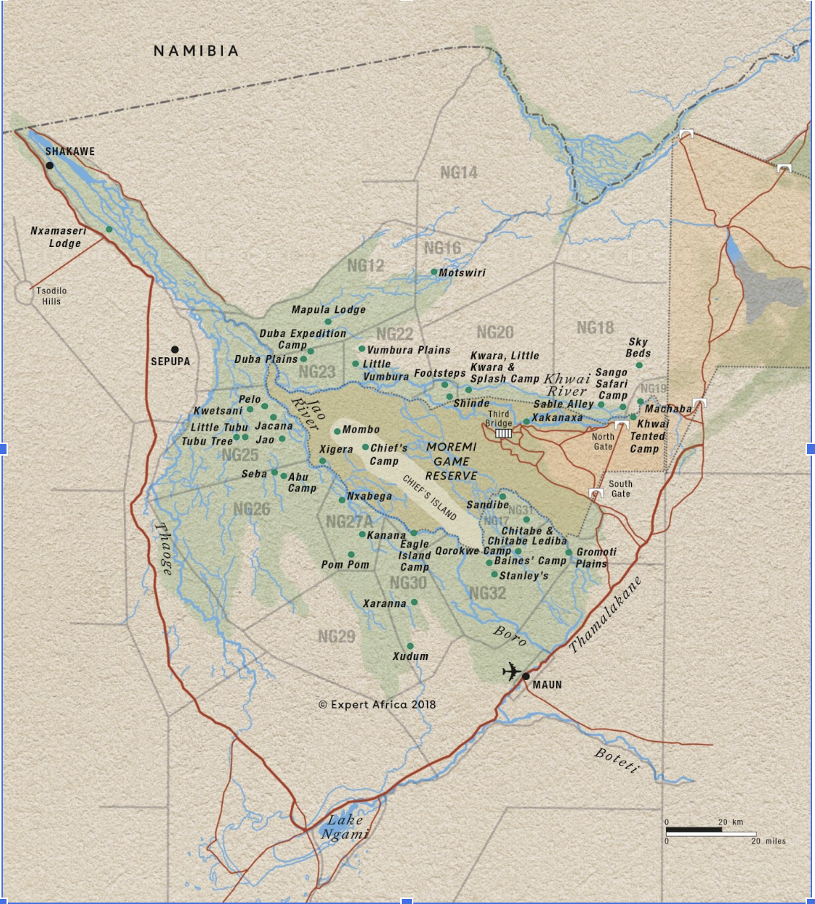

I’m not an expert and had a hard time understanding about why the Okavango Delta is setup as it is.  It is *not* a National Park (and Botswana does have several), rather it’s a complex network of private game reserves and “concessions”, each I think in some way owned by the people who live in that part of the Delta – but I’ve also read that the government relocated some indigenous people away (1960s?) so that the animal populations would stay large – so I really don’t quite understand the governance.  The net is that it feels incredibly quiet – the camps are tiny, and spread out.

See this map which shows the various reserves in the Okavango.  We stayed at two separate camps – Sable Alley (visible in the upper right part of the delta), in “Khwai River”, aka NG18, and then “North Island”, which is in NG23, near the “Duba Plains” in this map.  

Note that if you do an internet search for ‘best area of the Okavango’ or the like, you often see “Chief’s Island” or “Moremi Game Reserve” which are more in the center – I can’t compare those to where we went, but I think our organizer feels that NG23 more to the west is less crowded than the better-known Moremi game reserve, with just as good animal options.

The net/net is that we stayed in two lodges (Sable Alley and North Island) that are in two different reserves ([Khwai reserve](https://okavangodelta.com/destinations/khwai-pivate-reserve/) and [NG23](https://okavangodelta.com/destinations/duba-concession/)) that are managed differently in ways that are beyond this author’s understanding.

On Botswana day 1, we drove from Victoria Falls to the Botswana border, having to go through a 5-step process (probably 15 minutes total) including washing our shoes (Botswana is a heavily cattle-based economy, and they are very protective from Foot and Mouth disease), then getting to the surprisingly-modern (brand-new) Kasane airport for the 40-minute flight to the Khwai reserve, home of [Sable Alley](https://naturalselection.travel/camps/sable-alley-okavango-delta/), where we spent 3 nights.

## The People of Botswana 

My one disappointment was that we didn’t meet more local people.  There are villages in the Okavango, but they were at each lodge an hour-long bumpy ride from our lodge – there was an option to visit from Sable Alley, and we did not choose it.

All the staff who introduce themselves at African lodges have what I can only assume is their “safari name” (not their given) – so our three guides were “CJ”, “Parks”, and “Pressure”, and we meet another who gives his name as “007”.  Interestingly, CJ is of the [San](https://en.wikipedia.org/wiki/San_people) tribe, which makes up less than 3% of the population of Botswana.  They are one of the most ancient people on earth; early white settlers called them “Bushmen” (and featured a San tribesman patronizingly in “The Gods Must be Crazy”), and they were semi-nomadic until the 1960s before the government largely convinced them (?) to settle into villages.  This meant that CJ (maybe in his 40s?) remembers his grandfather who … lived much of his life as a hunter-gatherer, unchanged as far as I know from how his tribe had lived for thousands of years.  CJ’s outdoor sense was very evident – he perceived things us suburban folks never would, from which direction animals were looking, to alarm calls, to footprint directionality – he really knew what he was doing.

At the lodges, there was usually a small subset of imported senior staff who had trained in hospitality and spoke impeccable English.  Then the majority of the staff were from local villages, and usually spoke quite limited English.  Very friendly … but communication was sparse.