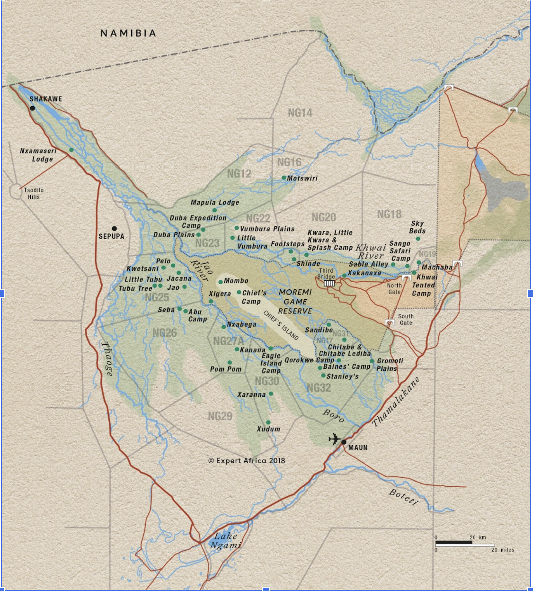

The Okavango Delta is not what most people picture when they picture safari.  It looks nothing like the classic Serengeti landscape.

There's no open savanna and no distant horizon to scan for wildlife. Instead the delta is dense and flooded — water channels, thick vegetation, and animals that may be only ten feet away but completely hidden.

Guiding here requires a different skill set. Our guides read tracks, listened for alarm calls, and watched the direction animals were looking. It's a very different style of safari.

We stayed at two camps across seven days. Neither was a lodge in any conventional sense — they were small collections of tents set into the landscape, separated by vast private concessions and accessible only by small charter plane. This is not an accident of geography. It's a deliberate, carefully managed structure, and understanding it changes how you appreciate what you're experiencing.

The Okavango Delta is not a National Park — Botswana has several of those. It's a network of private concessions, each managed differently, some community-owned, some not, with a governance structure I'll be honest I don't fully understand. What it produces is quiet: tiny camps spread far apart, very few vehicles, very few other people.

See this map which shows the various reserves in the Okavango.  The water flows from the northwest towards the southeast, fanning out across the flat terrain.

We stayed at two separate camps
* [Sable Alley](https://naturalselection.travel/camps/sable-alley-okavango-delta/) (visible in the upper right part of the delta), in ([Khwai reserve](https://okavangodelta.com/destinations/khwai-pivate-reserve/), aka NG18 in the map
* [North Island](https://naturalselection.travel/camps/north-island-okavango-delta/), which is in [NG23](https://okavangodelta.com/destinations/duba-concession/), near the "Duba Plains" in this map.  

Many reviewers recommend as the best section of the Okavango "Chief's Island" or "Moremi Game Reserve", which are more in the center of the delta.  I can't compare those to where we went, but our organizer feels that NG23 more to the west is less crowded than the better-known Moremi game reserve, with just as good animal viewing.  We certainly felt incredibly *un*-crowded near North Island.

## The People of Botswana 

My one disappointment was that we didn't meet more local people.  There are villages in the Okavango, but they were at each lodge an hour-long bumpy ride from our lodge – there was an option to visit from Sable Alley, and we did not choose it.

At the lodges, there was usually a small subset of imported senior staff who had trained in hospitality and spoke impeccable English.  Then the majority of the staff were from local villages, and usually spoke quite limited English.  Very friendly … but communication was sparse.  Very friendly, lots of smiling and nodding, but not a lot of conversation with nuance.

Near North Island, we noticed villagers gathering grass near the camp in what appeared to be a combination of income and tradition. At one point we saw locals walking through the Okavango in the middle of the day, far from a village.  We didn't fully understand how they stay safe wandering the bush in groups of 2 and 3. One of our group noted they tended to wear extremely bright clothing, in contrast to the all-khaki of official safari wear. We speculated they might prefer to be seen by wildlife so it moves away, the opposite of our goal.

## Recommended Reading

If you have a chance, read [Cry of the Kalahari](https://bookshop.org/p/books/cry-of-the-kalahari-mark-owens/11275458) before you go.  It's about a young American couple of wildlife biologists studying in Botswana in the 1970s — before the camps, before the tourism infrastructure, when the delta was genuinely remote. Reading it before you go changes how you look at what's been built there since.

## Closing

We left knowing we'd seen a version of it — the comfortable, well-managed, tourist version. What the delta was before that, and what it costs to keep it this way, is something we're still thinking about.