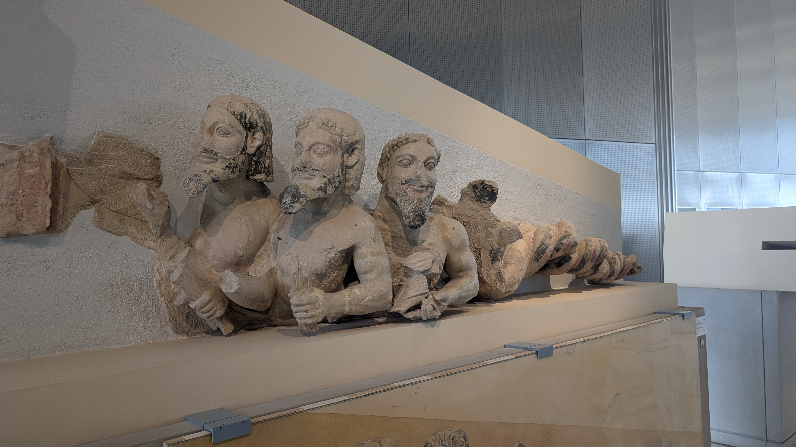
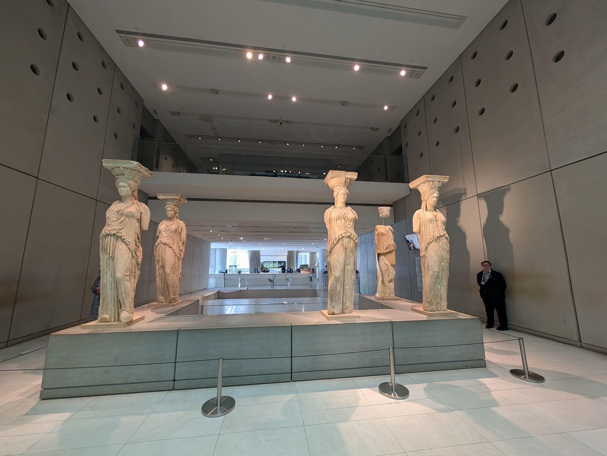
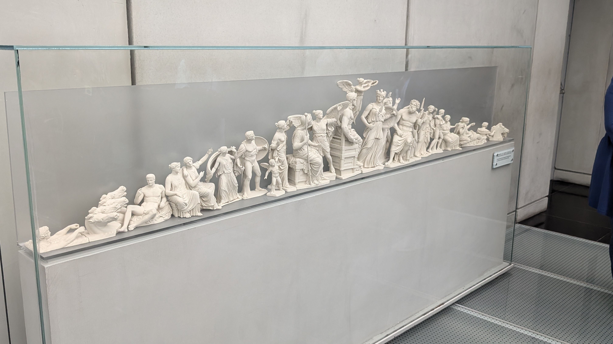

### Where we Stayed

At a friend’s recommendation, we stayed at the Electra Metropolis, and found it excellent in every way. We spent extra for the “Acropolis Suite”, which was expensive, but the corner room had just incredible views of the full Acropolis. If you choose not to blow $ on that … the rooftop restaurant which serves breakfast, dinner, and late night drinks has all that same view for every customer without the upgraded room. A number of other hotels in that district feature roughly the same rooftop restaurant.  We have no idea if this one is the best but we were pretty happy with it.

##  Getting Around in Athens

We had pretty mixed experiences with our 2 taxi rides – be prepared for tough communication. You can order a taxi through Uber, I sorta wish I had. Taxis are cheap tho, that was great. We didn’t try the subway, it didn’t really go anywhere helpful for us.

## Things to See in Athens

National Archaeology museum – we spent about 2 hours there, maybe 2 ½. See this [museum map](https://www.namuseum.gr/wp-content/uploads/2022/03/nam-brochure-ΕΝ-low.pdf) online. The rooms are chronological (e.g., room 1 has the oldest piece, room 35 the newest). Pacing-wise, the first 10-15 rooms are the highlight in our humble opinion.  

> Don’t pace yourself evenly at this museum.  Instead, spend a ton of time in the first few rooms, especially the Mycenaean room (#4) which is right in your face as you enter.  The Mycenaean collection has incredible artifacts, just that room alone would make that museum a must-see. 

If you’re a technology nerd (yes, that’s your humble author), the [Antikythera mechanism](https://en.wikipedia.org/wiki/Antikythera_mechanism) is near the end (room 35?).  This is arguably the world’s oldest computer, it’s well-explained. 

Rick Steves says it’s easy to walk through in order, but that’s not entirely true, be careful there are some strange cul de sacs; for example, there’s a scale statue from Parthenon at the end of a cul de sac that probably most people miss – it’s in room 20.

We thought the Plaka district at the foot of the Acropolis was great, there are sure super touristy ‘lanes’, but there are also really nice restaurants that seem to have actual Athenians there, we particularly loved [Thespis](https://thespis.gr/) that we went to twice (OMG their beef skewers were to die for).

The Acropolis:
- We found a guide through toursbylocals (she was good, but not so good we’d automatically recommend her) who gave us a 4-hour tour from 4-8pm, we used 3.5 of that easily. That was for both the Acropolis museum and up top – she gave us a lot of detail in the museum that I would have been sad not to have, we really learned a lot.
- Regardless of whether you hire a guide or not, you have to buy timed tickets for the museum and the actual Acropolis – separately. Rick Steves recommends “end of day” for less crowds, and that way you’re doing 4-6 in the air conditioned museum, and up top outdoors 6-8pm – that worked really well. We found about 1.5-2 hours in the museum just right, and then the 10 minute walk up the hill for our times entry at 6pm to the top also worked.
- Up top was by all means gorgeous, but realize there are only 2-3 buildings actually intact up there, you can only spend so much time up there before you run out of things to talk about with your guide (and of course about 20 photo ops).

Other ancient ruins in Athens
- In general the Agora was interesting, but less than I anticipated
  - the good Stoa of Attolos near the entrance is an 1950s reproduction of the original building, and has a small but excellent museum.
  - The Temple of Hephaestus is remarkable, it’s one of the best-preserved ancient Greek temples, and just extraordinary.
  - We did the Agora without a tour guide, and found it hard to visualize much – maybe with a guide you get more out of it.
- We were a block from the Tower of Winds but somehow managed to miss it, which I regret, it sounds interesting.
- I wanted to go see the massive ruins of the Temple of Olympian Zeus, but it’s across a crazy 8-lane road and we ended looking at it from afar. Honestly, when we looked down at it from the Acropolis, I felt like maybe I didn’t miss that much.

The Benizelos Mansion is billed as "the oldest house in Athens". It has sections that are 16th century … it's not "amazing", but we were glad we spent 20 minutes of our time since it was right near our hotel.

*Add your photos here*

