Athens is one of those cities where the history isn't background -- it's the foreground, literally. The Parthenon is visible from the street, from rooftop bars, from your hotel room if you pick the right one. We spent 3 nights there at the end of the trip and it was just about right. The archaeology alone justifies it; the city around it is better than we expected.

## The Acropolis (Plan for 4 hours)

The Acropolis is the one site in Athens that requires no justification, but it does require a plan.  Our guide recommended a 4-hour tour from 4-8pm.  We used 3.5 of that easily; Rick Steves also recommends "end of day" both for fewer crowds and less heat.  That 4 hours covered both the Acropolis museum -- at the foot of the hill -- and the Acropolis itself.  

With this schedule you're spending 4:00-6:00 in the air conditioned museum, and walking outdoors 6:00-8:00pm -- that worked really well. 1.5-2 hours in the museum felt right.  The 10-minute walk up the hill for our timed entry at 6pm to the top was nicely choreographed.   Whether or not you hire a guide, you need timed tickets for the museum and the Acropolis -- bought separately.

We found our private guide on toursbylocals.  She brought the museum to life in ways we'd have been sorry to miss.  She was good, but not so good we'd automatically recommend her.

The museum carefully reconstructs how the Parthenon's sculpture originally fit together, and holds some of the original pieces removed from the Acropolis for preservation.  The most striking are the Caryatids -- the sculpted female figures that supported the porch of the Erechtheion temple. The originals are in the museum; reproductions stand on the hill.

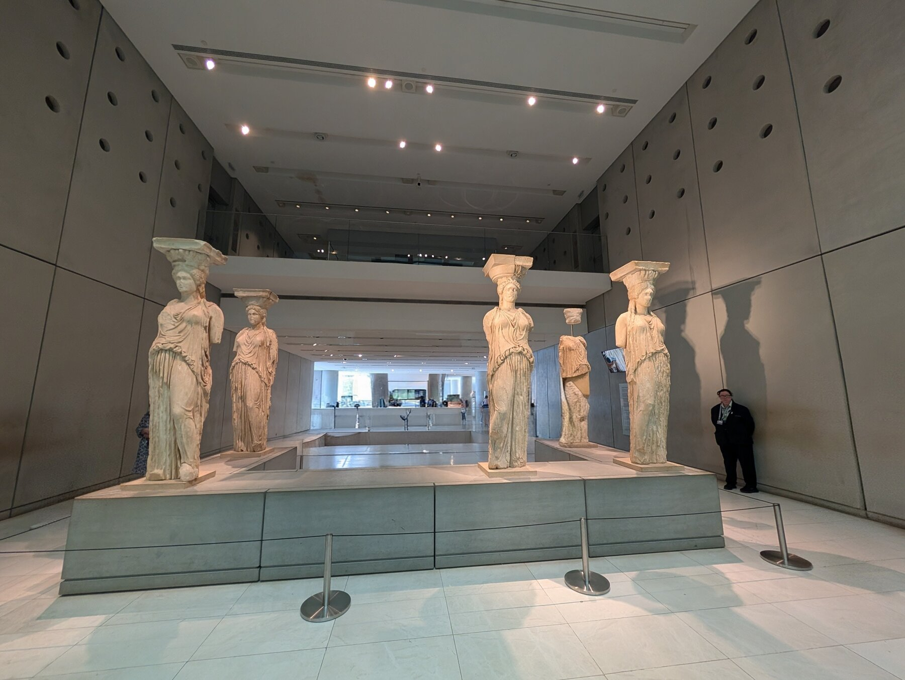

The museum also includes sculptures from an earlier temple built on the Acropolis.  These are from 570BC, 140 years before the Parthenon that we know. Evidently paint lasts longer on limestone than marble -- it's surprising to see color on items this old, even if it's fragmentary.

The museum then focuses on the later Parthenon.  The first exhibit is an artist's reproduction of the Parthenon's east pediment, based on 17th-century sketches.  The far left of this group is one of the key pieces that made its way to the British Museum.

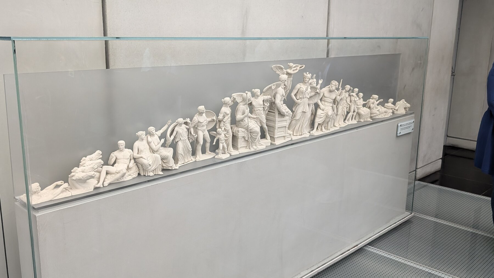

The crescendo is a full-scale display of the east pediment -- what remains of it after 2,500 years.

> These are reproductions.  The originals of these are in London, expropriated by British Ambassador Lord Elgin in the early 19th century. This Athens museum makes it quite clear where they belong.

The top of the Acropolis was as memorable as we imagined.  Realize there are only two buildings actually intact up there.  We saw the Parthenon first as we entered the complex.  

> Though we've seen images of it our entire lives, it still stops you, even with scaffolding obscuring its west face.

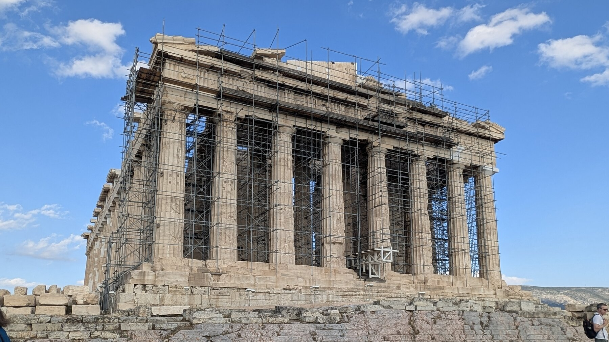

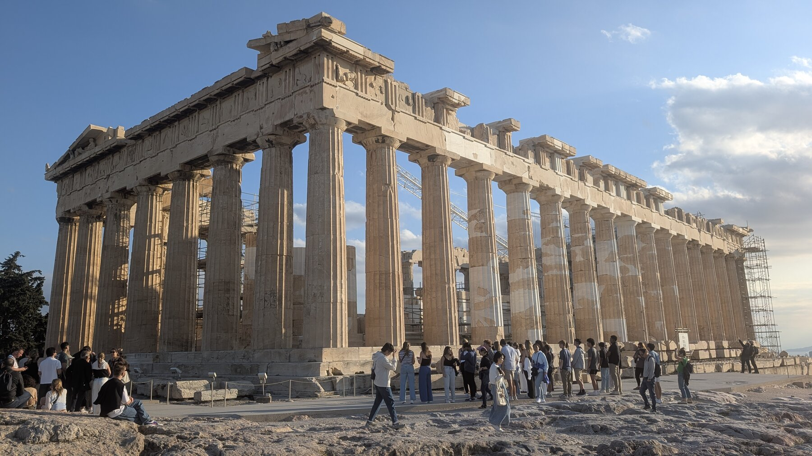

The Erechtheion is a temple of Athena Polias, less than 100 yards from the Parthenon.

As remarkable as it is, you can spend only so much time up there before you run out of angles for photos, or topics to talk about with your guide.

## The Ancient Agora and Other Sites Below

The ancient Agora covers 30 acres and feels more like a park than an archaeological site -- shaded paths, scattered ruins, and almost no crowds. After the Acropolis and the Plaka, the quiet was welcome.

The Stoa of Attalos near the entrance is a 1950s reproduction, but a useful one -- it gives you a sense of what an intact ancient building actually looked like at full scale. The museum inside is small and manageable, a good counterpoint to the sprawling National Archaeology Museum.

The real draw is the Temple of Hephaestus, arguably our favorite single site in Athens. 

It's the best-preserved ancient temple in Greece -- roof intact, most columns standing -- which gives it the complete silhouette that the Parthenon can only suggest. Yet somehow we shared it with maybe 4 other visitors.

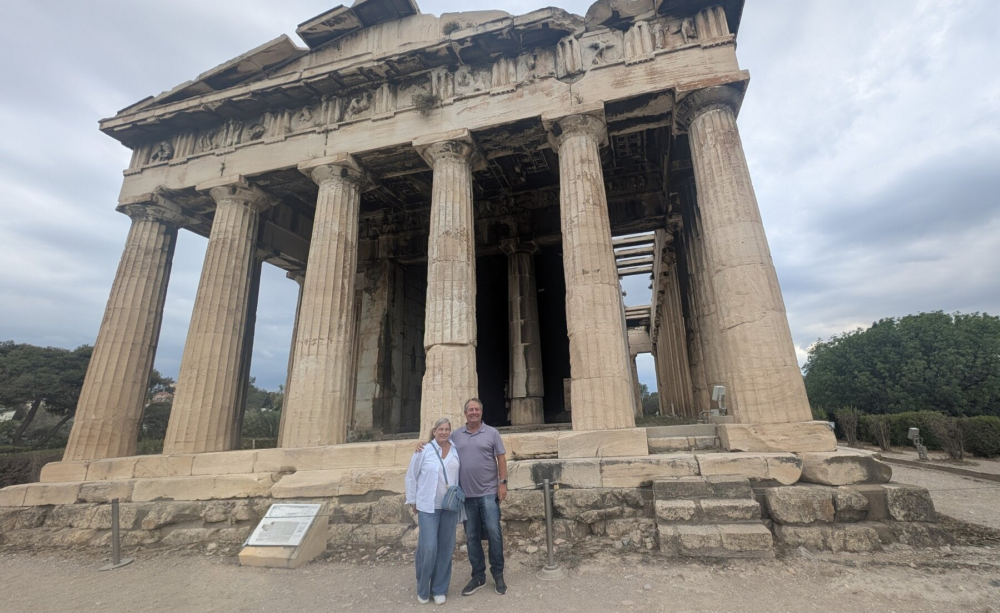

We visited without a guide and found the rest of the Agora hard to visualize -- it's more ruin than remains. A guide might unlock more of it, but the Temple of Hephaestus needs no interpretation.

We missed the Tower of Winds entirely -- a block away from the Agora, somehow overlooked. The Temple of Olympian Zeus we saw only from the Acropolis; it lies across an 8-lane road, and from above, the long-distance view felt like enough.

Also at the foot of the Acropolis, the Plaka's main lanes are overrun with souvenir shops selling the same Parthenon figurines -- nothing made in Greece, nothing worth stopping for. 

But move a block or two off the tourist arteries and it gets remarkably quiet: old stone architecture in a mix of styles, resident cats sunning on walls, no one trying to sell you anything. Head uphill and the tourists thin out almost immediately. Like Santorini, the crowds are the price of admission -- and like Santorini, what's behind them is worth the effort.

## The National Archaeology Museum (Front-Load Your Tour)

We spent a solid 2 hours at the National Archaeology Museum. See this [museum map](https://www.namuseum.gr/wp-content/uploads/2022/03/nam-brochure-ΕΝ-low.pdf) online. The rooms are chronological (e.g., room 1 has the oldest piece, room 35 the newest).  

The collection is front-loaded -- spend most of your time in the first 10-15 rooms, especially the Mycenaean room (#4) which is right in your face as you enter.  

The Mycenaean collection is so dense with gold and history that it's worth the admission price on its own.

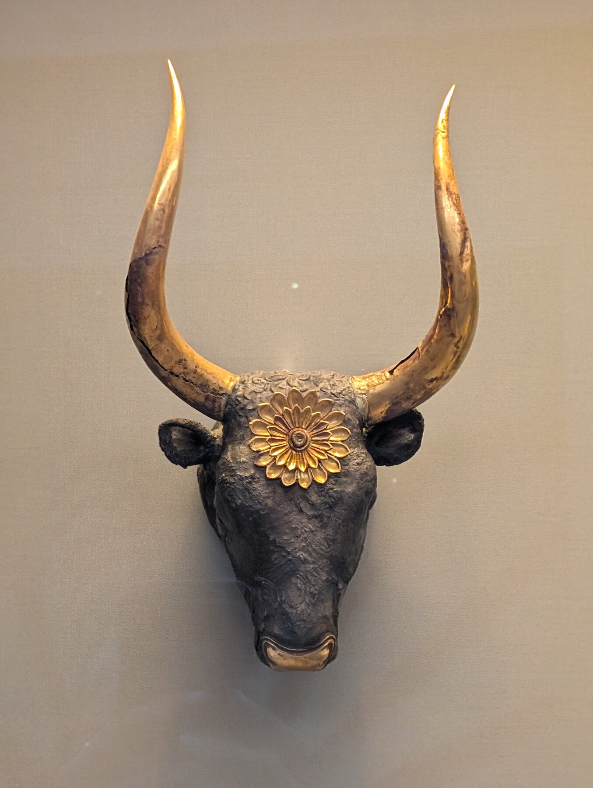

Moving past the Mycenaeans, the collection shifts toward the better-known, more familiar sculptures of classical Athens.

If you're a technology nerd like me -- Tiffany was unmoved -- the [Antikythera mechanism](https://en.wikipedia.org/wiki/Antikythera_mechanism) is near the end, in room 38.  This is arguably the world's oldest computer, built some time in the last 2 centuries BC.  It was found in a shipwreck in 1901, and looks it -- corroded and fragmentary, but the gears are still visible.

It would be a remarkable invention even if 2000 years newer.  Its 37 bronze gears predicted eclipses decades in advance, modelled the irregular orbit of the moon, and tracked Olympiads.   I knew of it, but didn't know it was housed in this museum until it was right in front of me -- it's smaller than I always imagined.  I enjoyed being able to put my nose right near it and see these tiny gears that somehow survived 2000 years at the bottom of the Aegean.

Rick Steves says it's easy to walk through the museum in order. That's not entirely true -- watch for dead ends.  For example, there's a scale statue of Athena from the Parthenon at the end of a cul de sac that probably most people miss -- it's in room 20.

## Food in Athens

We didn't explore Athens dining broadly. Restaurant Thespis in the Plaka pulled us back twice.  The beef skewers earned the return trip, which says something in a city we had only 3 nights in.  

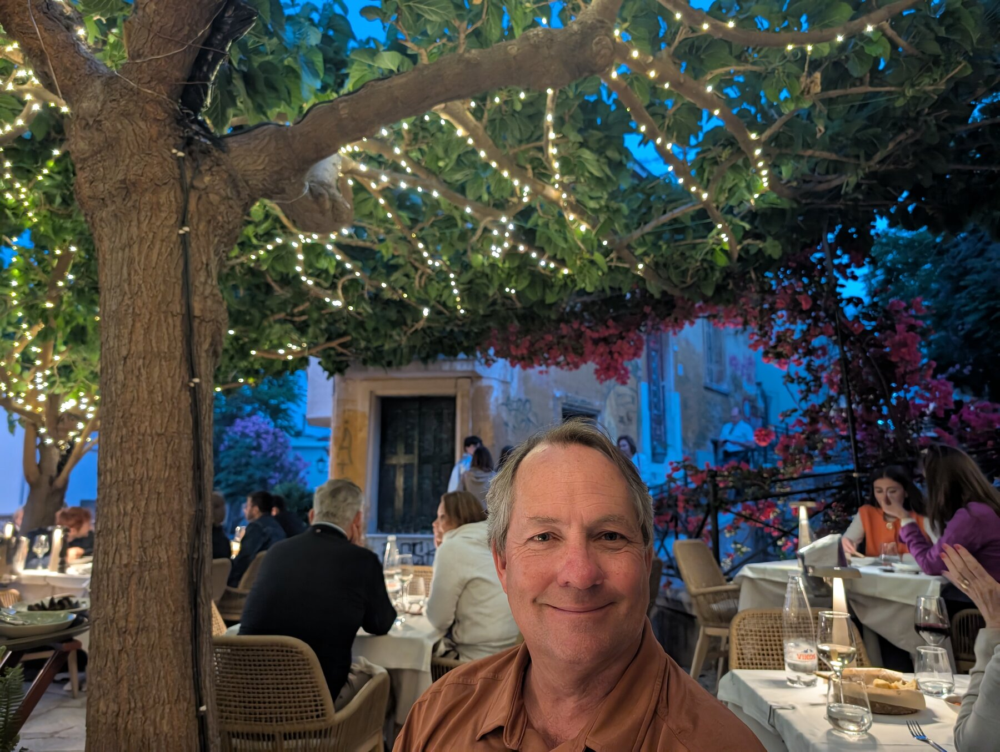

Plaka has many small family spots for the usual Greek fare -- if you follow the usual advice to stay off the main tourist drags, several were tasty.  

## Where We Stayed

At a friend's recommendation, we stayed at the Electra Metropolis. The hotel is built upside down -- lobby and restaurant on the top floor, rooms below -- which focused appropriately on the view.  We splurged on the Acropolis Suite, a corner room with unobstructed views of the full Acropolis. The building feels contemporary without losing the sense of being in Greece, and remarkably quiet given the city outside.

If you choose not to invest in a top-tier room, the rooftop restaurant serves breakfast, dinner, and late-night drinks with the same view for every customer -- no suite required.

Several hotels in the district have similar rooftop setups. We can't compare -- but we ate breakfast at the Electra every morning without once considering an alternative.

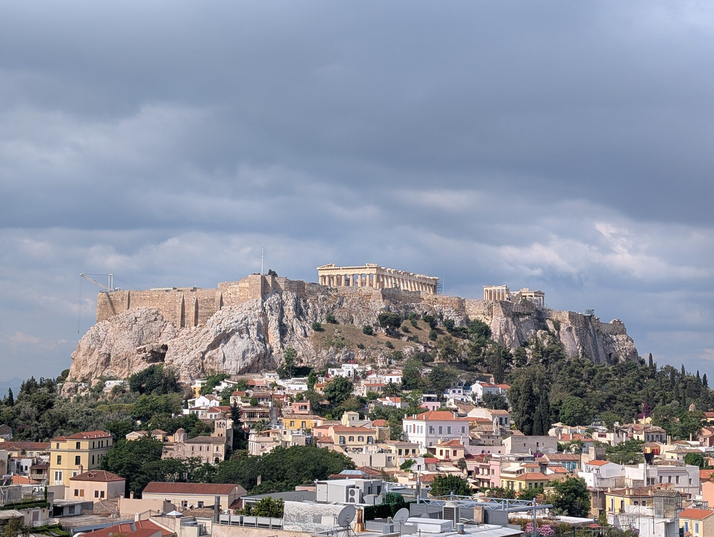

The neighborhood had its own small surprises. The Benizelos Mansion, billed as the oldest house in Athens and one of the few survivors of Ottoman Athens, was a block from the hotel. It has sections that are 16th century.  

The upper floor has an open-air wooden gallery where you can imagine the original residents catching a breeze; the enclosed balcony projecting over the courtyard feels like it was built for eavesdropping. After days of temples and ruins, it was oddly grounding to stand in someone's actual house -- a well-worn marble staircase, a courtyard that still feels private, and somehow no noise from the road outside.

When we visited, a film crew had taken over for a period production -- actors in Ottoman-era costumes threading through 16th-century rooms. 

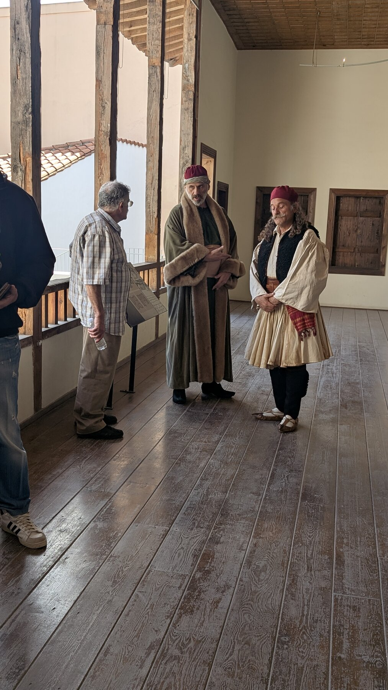

It was 20 minutes we hadn't planned, and exactly the kind of accidental moment Athens does well.

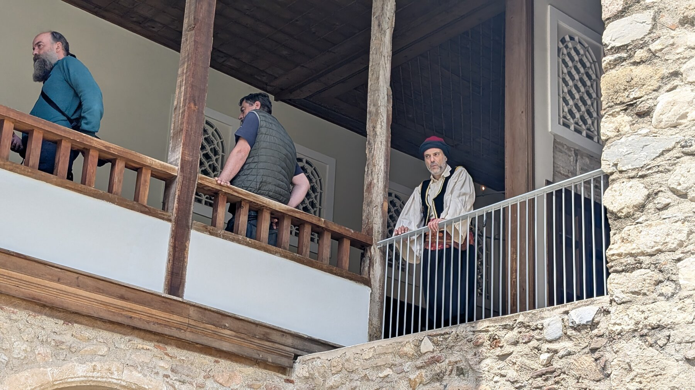

##  Getting Around in Athens

Order taxis through Uber -- we didn't, and the communication with drivers about destinations was harder than we anticipated. Fares are cheap either way. The subway didn't serve anywhere we needed to go.

Athens didn't need to win us over -- the Acropolis does that on its own. What surprised us was how much the city around it held up. Three nights gave us enough time to see what mattered without exhausting the goodwill. We left satisfied rather than restless, which for a city that could easily overwhelm with its own history, felt like the right note.

:::nutshell Athens
verdict: Would Plan Around
duration: 3 days
Stay Overnight: Electra Metropolis -- memorable Acropolis views from the suite and rooftop restaurant.
Don't Miss: National Archaeology Museum (Mycenaean room first); Acropolis at sunset with a guide; Thespis in the Plaka.
Best Time of Day: Late afternoon -- museum 4-6pm, then up the Acropolis just before closing.
Worth the Splurge: The Acropolis Suite at Electra Metropolis -- the corner view is everything.
Return Visit: Not a priority -- this feels like a great place to see once.
:::

*Add your photos here*

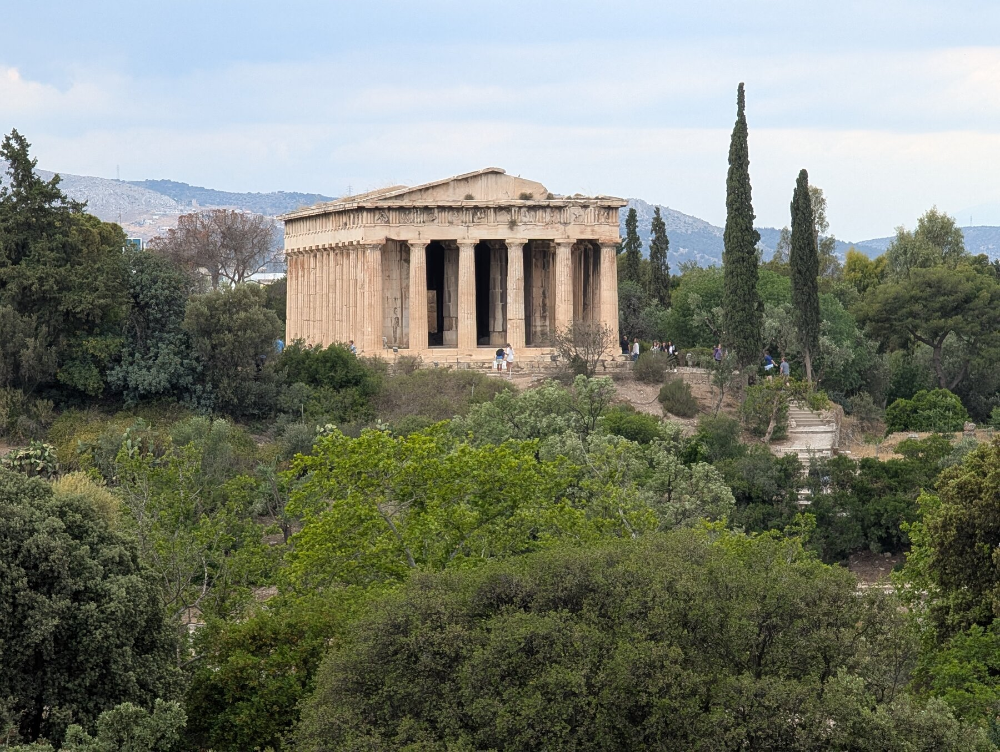

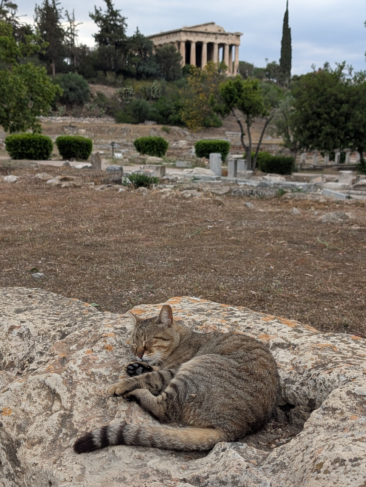

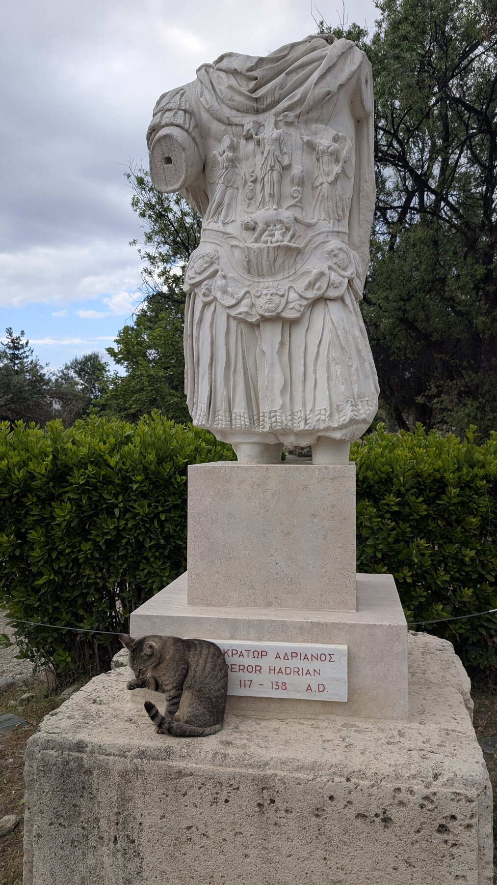

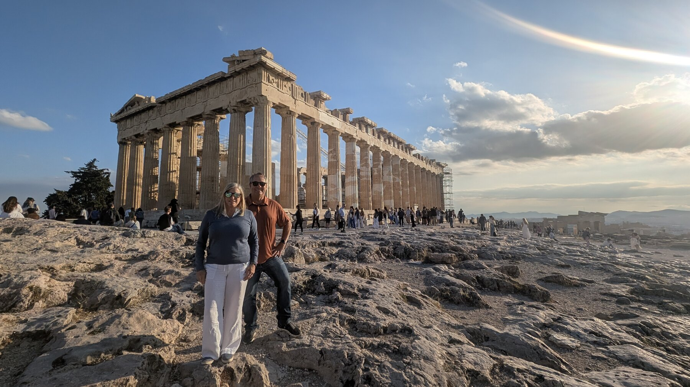

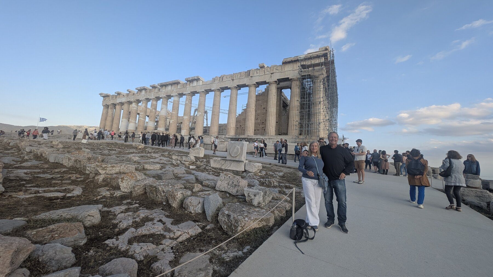

