Athens is one of those cities where the history isn't background -- it's the foreground, literally. The Parthenon is visible from the street, from rooftop bars, from your hotel room if you pick the right one. We spent three nights there at the end of the trip and it was for us just about right. The archaeology alone justifies it; the city around it is better than we expected.

##  Getting Around in Athens

Order taxis through Uber -- we didn't, and the communication was harder than we anticipated. Fares are cheap either way. The subway didn't serve anywhere we needed to go.

## The Acropolis

The Acropolis is the one site in Athens that requires no justification, but it does require a plan.  Our guide recommended a 4-hour tour from 4-8pm, we used 3.5 of that easily; Rick Steves also recommends "end of day" both for fewer crowds and less heat.  That four hours covered both the Acropolis museum -- at the foot of the hill -- and the Acropolis itself.  

With this schedule you're spending 4:00-6:00 in the air conditioned museum, and walking outdoors 6-8pm -- that worked really well. We found about 1.5-2 hours in the museum just right, and then the 10 minute walk up the hill for our timed entry at 6pm to the top nicely choreographed.  Regardless of whether you hire a guide or not, you have to buy timed tickets for the museum and the actual Acropolis -- separately. 

We found our private guide on toursbylocals; she gave us a lot of detail in the museum in particular that we would have been sad to miss.  She was good, but not so good we'd automatically recommend her.

The museum does an excellent job reconstructing how the Parthenon sculpture program originally fit together, and holds some of the original pieces removed from the Acropolis for preservation. The most striking are the **Caryatids** -- the sculpted female figures that supported the porch of the Erechtheion temple. The originals are in the museum; reproductions stand on the hill.

The museum also includes sculptures from an earlier temple built on the Acropolis.  These are from 570BC, 140 years before the Parthenon that we know. Evidently paint lasts longer on limestone than marble -- it's surprising to see color on items this old.

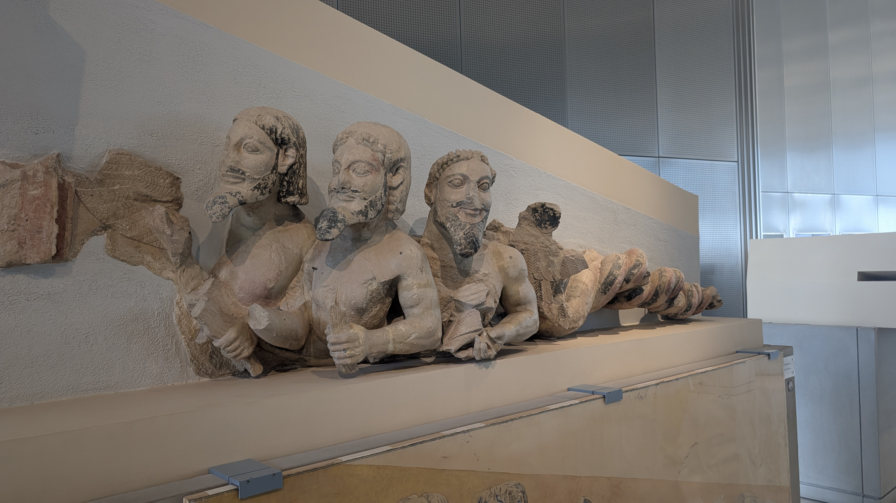

The museum then focuses on the later Parthenon.  This is an artist's reproduction of the Parthenon's east pediment, based on 17th-century sketches.  The far left of this group is one of the key pieces that made its way to the British Museum.

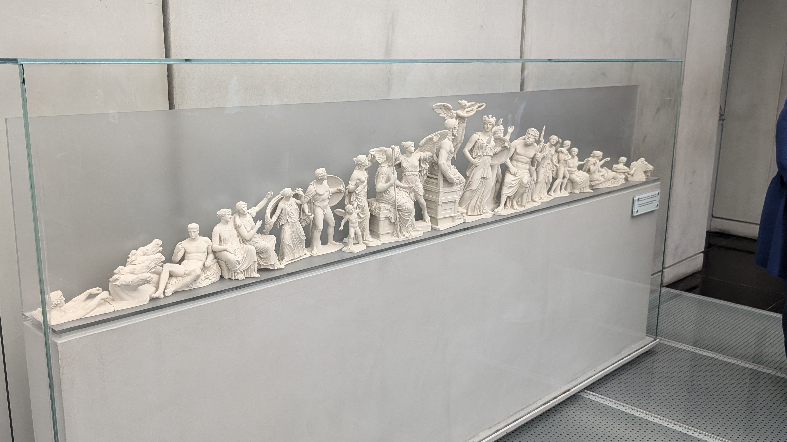

These are reproductions of sculptures from the Parthenon.  

> The originals of these are in London, expropriated by British Ambassador Lord Elgin in the early 19th century. This Athens museum makes it quite clear where they belong.

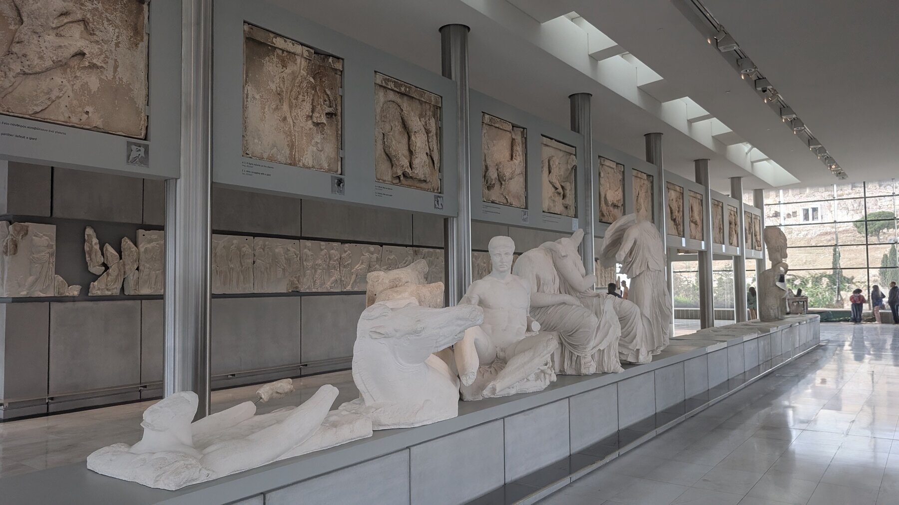

The top of the Acropolis was as memorable as we imagined.  Realize there are only two buildings actually intact up there.  We saw the Parthenon first as we entered the complex.  Though we've seen images of it our entire lives, it still stops you, even with scaffolding obscuring its west face.

The Erechtheion is a temple of Athena Polias, less than 100 yards from the Parthenon.

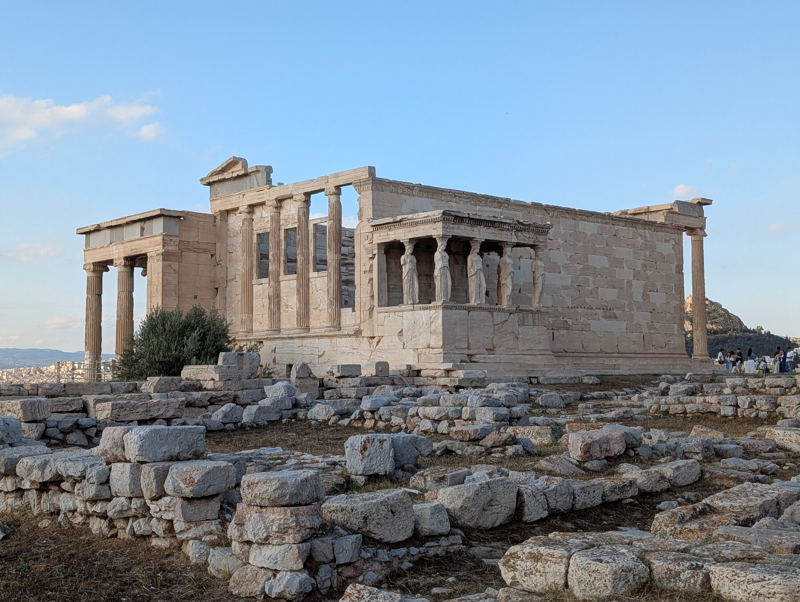

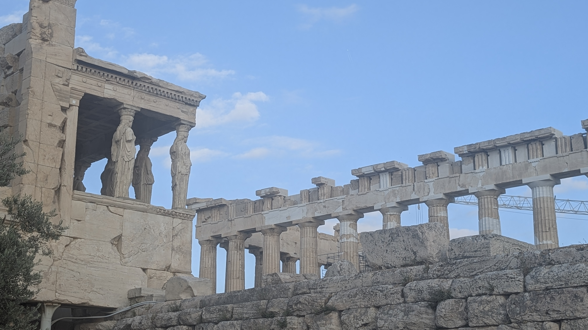

As remarkable as it is, you can spend only so much time up there before you run out of angles for photos, or topics to talk about with your guide.

## Other Ancient Ruins

The ancient Agora was the original commercial gathering spot of Ancient Athens.  In general the Agora was interesting, but less than I anticipated, it's more ruin than remains.

The attractive Stoa of Attalos near the entrance is a 1950s reproduction of the original building, and houses a small but excellent museum.

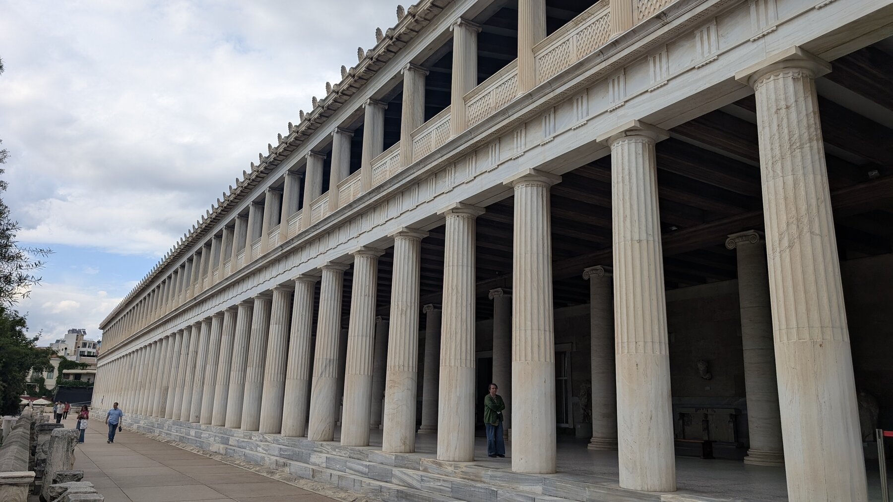

The Temple of Hephaestus near the Agora is so well-preserved that you can actually see the 5th-century BC architectural details that are missing or weathered away on the Parthenon.

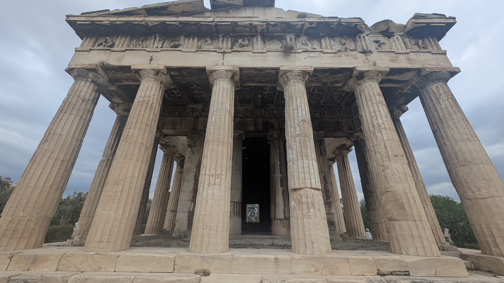

We visited the Agora without a tour guide, and found it hard to visualize much -- perhaps with a guide you get more out of it.

We were a block from the Tower of Winds but somehow managed to miss it, which I regret, it sounds interesting.

I wanted to go see the massive ruins of the Temple of Olympian Zeus, but it's across a busy 8-lane road and we ended looking at it from afar. Honestly, when we looked down at it from the Acropolis, I felt like seeing it from afar was enough.

The Benizelos Mansion is billed as "the oldest house in Athens". It has sections that are 16th century ... it's not "amazing", but we were glad we spent 20 minutes of our time since it was right near our hotel.

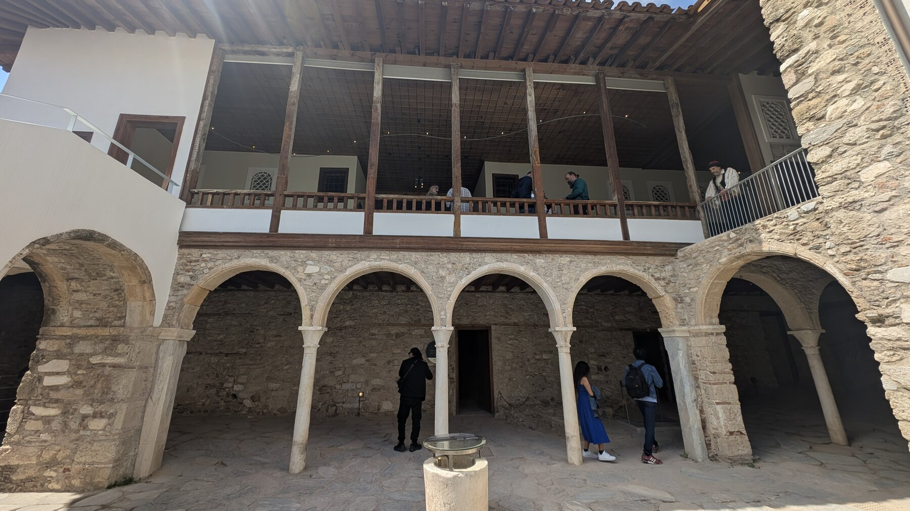

When we visited the Benizelos House, they were filming a period movie, so we got to see some period costumes.

## Other Athens Sites

We spent a well-invested two+ hours at the National Archaeology Museum. See this [museum map](https://www.namuseum.gr/wp-content/uploads/2022/03/nam-brochure-ΕΝ-low.pdf) online. The rooms are chronological (e.g., room 1 has the oldest piece, room 35 the newest).  Don't pace yourself evenly at this museum.  Instead, focus on the first 10-15 rooms, especially the Mycenaean room (#4) which is right in your face as you enter.  

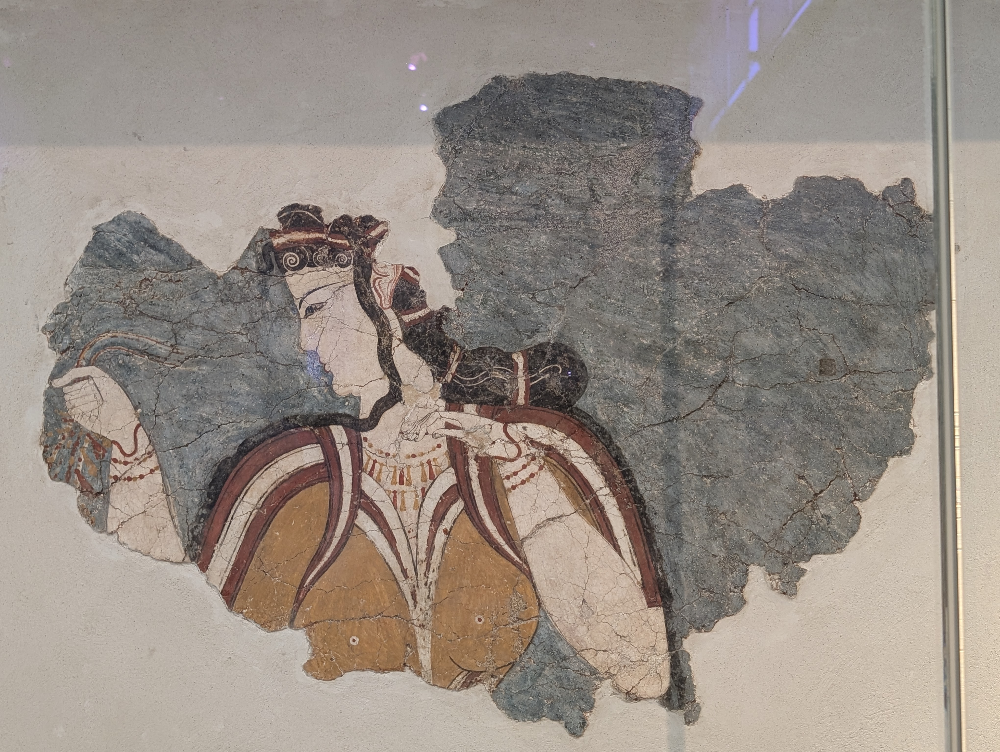

> The Mycenaean collection is so dense with gold and history that it's worth the admission price even if you skip the rest of the museum.

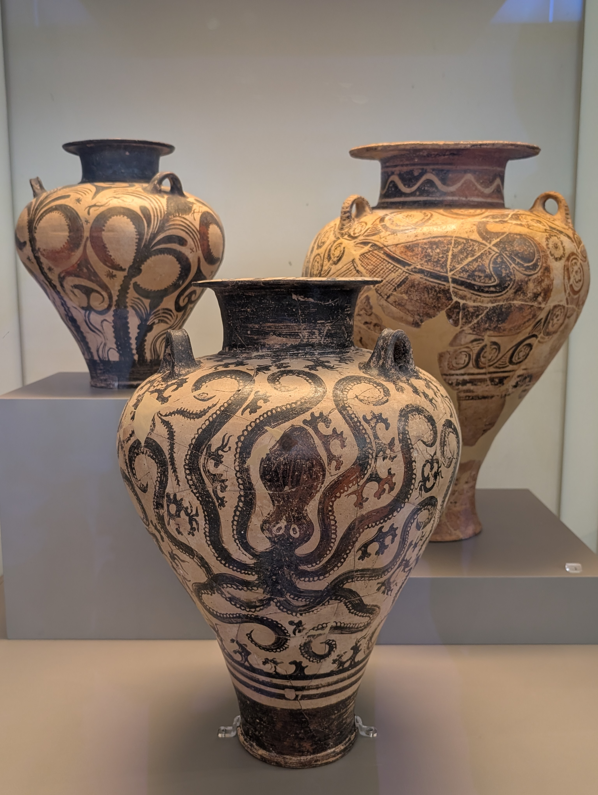

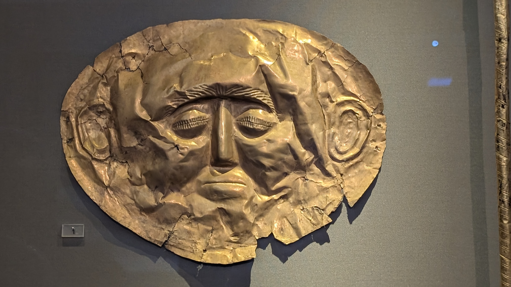

Moving past the Mycenaeans, the collection shifts toward the better-known, more familiar sculptures of classical Athens.

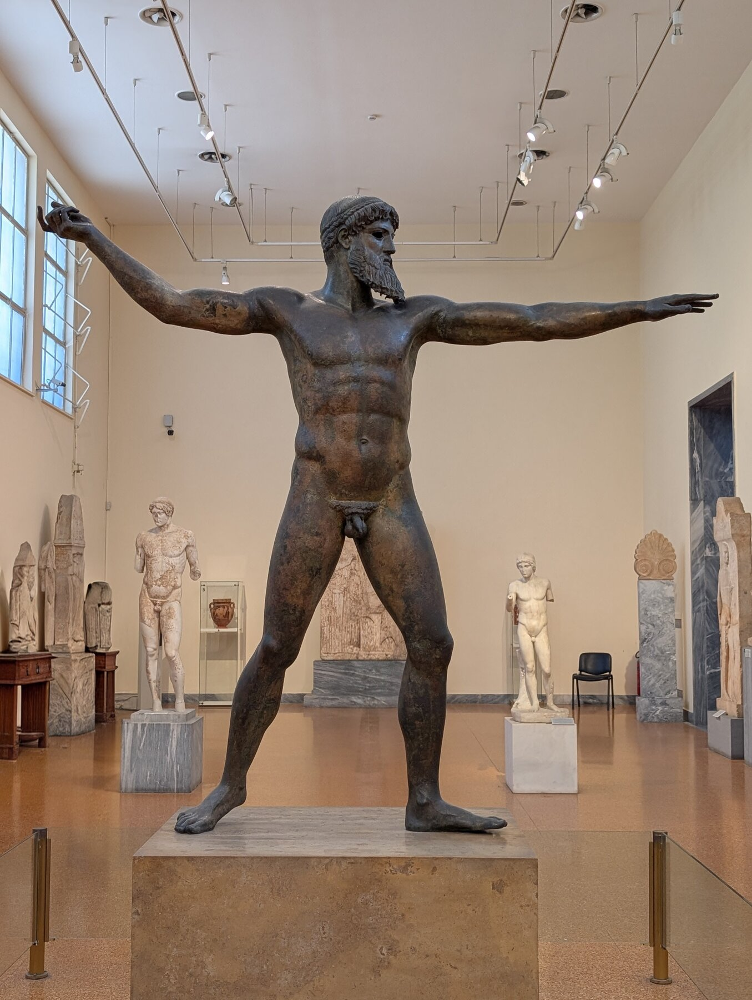

If you're a technology nerd (yes, that's your humble author), the [Antikythera mechanism](https://en.wikipedia.org/wiki/Antikythera_mechanism) is near the end (room 35?).  This is arguably the world's oldest computer, it's well-explained. 

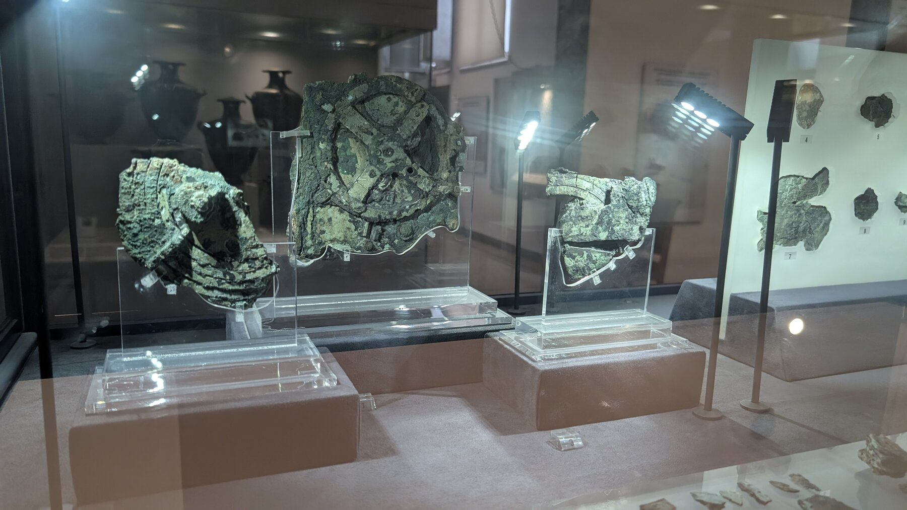

Rick Steves says it's easy to walk through this museum in order, but that's not entirely true, watch for some strange dead ends; for example, there's a scale statue of Athena from the Parthenon at the end of a cul de sac that probably most people miss -- it's in room 20.

We thought the Plaka district at the foot of the Acropolis was enjoyable, there are very touristy "lanes", but there are also really nice restaurants that seem to have actual Athenians there.

## Food in Athens

We didn't go out of our way to find Athens "fine dining" restaurants, but found some excellent spots to eat.  In particular, we chose Restaurant Thespis in the Plaka at the foot of the Acropolis for our first dinner.  We enjoyed the beef skewers so much that we returned two nights later.  

## Where We Stayed

At a friend's recommendation, we stayed at the Electra Metropolis, and found it excellent in every way. We spent extra for the "Acropolis Suite", which was expensive, but the corner room had spectacular views of the full Acropolis. 

If you choose not to invest in a top-tier room ... the rooftop restaurant which serves breakfast, dinner, and late night drinks has all that same view for every customer without the extra cost. 

A number of other hotels in that district feature roughly the same rooftop restaurant.  We have no idea if this one is the best but we were pretty happy with the Electra.

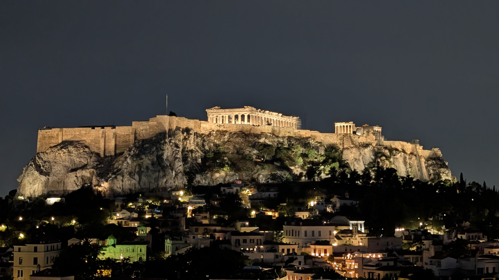

:::nutshell Athens
verdict: Would Plan Around
Stay Overnight: Electra Metropolis -- memorable Acropolis views from the suite and rooftop restaurant.
Don't Miss: National Archaeology Museum (Mycenaean room first); Acropolis at sunset with a guide; Thespis in the Plaka.
Best Time of Day: Late afternoon -- museum 4-6pm, then up the Acropolis 6-8pm per Rick Steves.
Worth the Splurge: The Acropolis Suite at Electra Metropolis -- the corner view is everything.
Return Visit: Yes -- we missed the Tower of Winds and barely scratched the Agora.
:::

*Add your photos here*

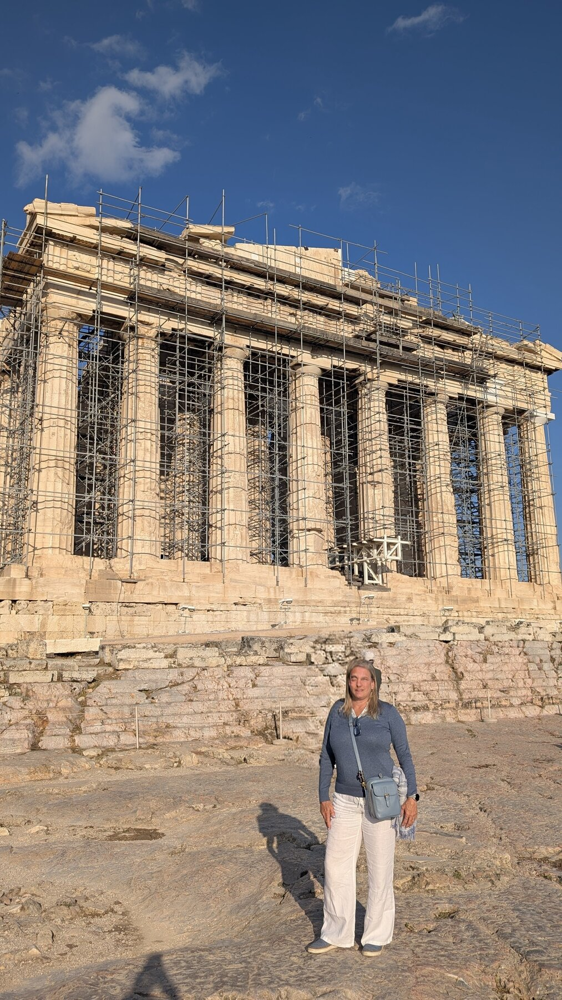

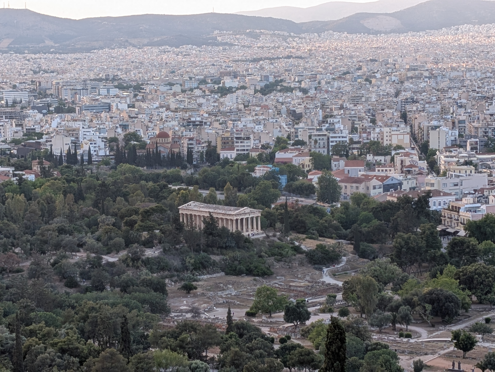

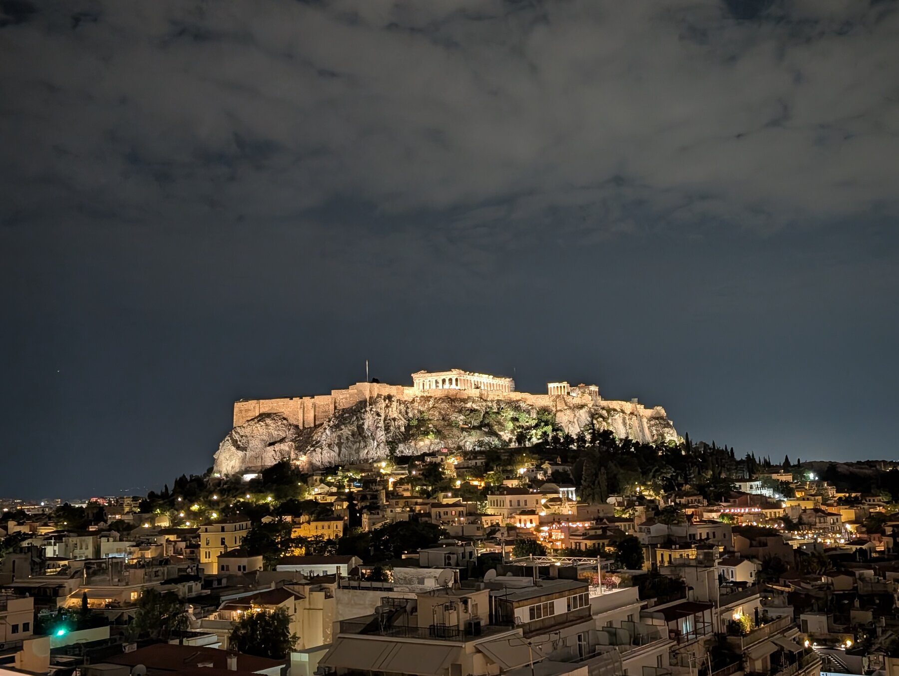

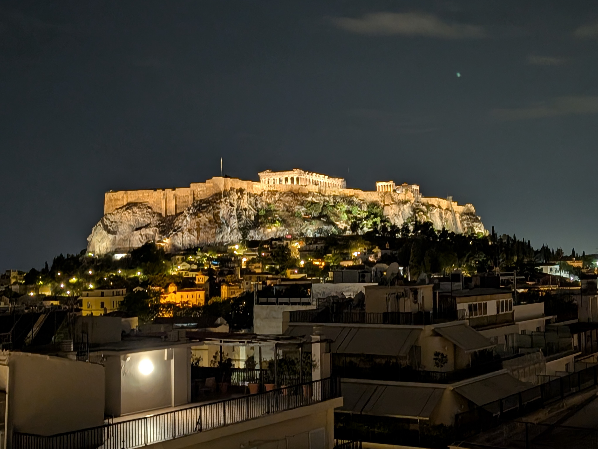
