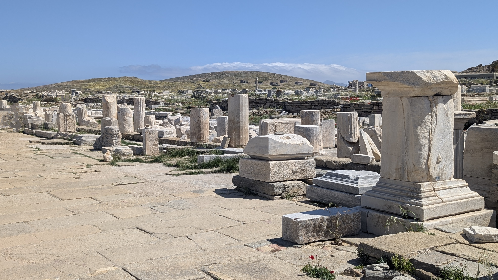
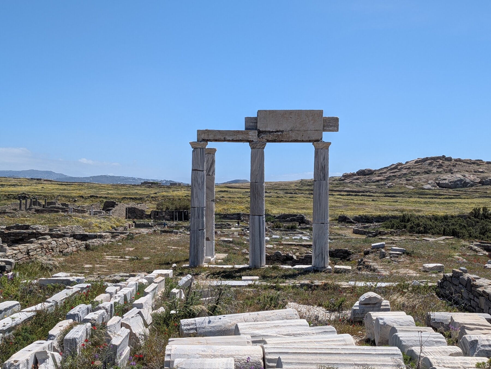
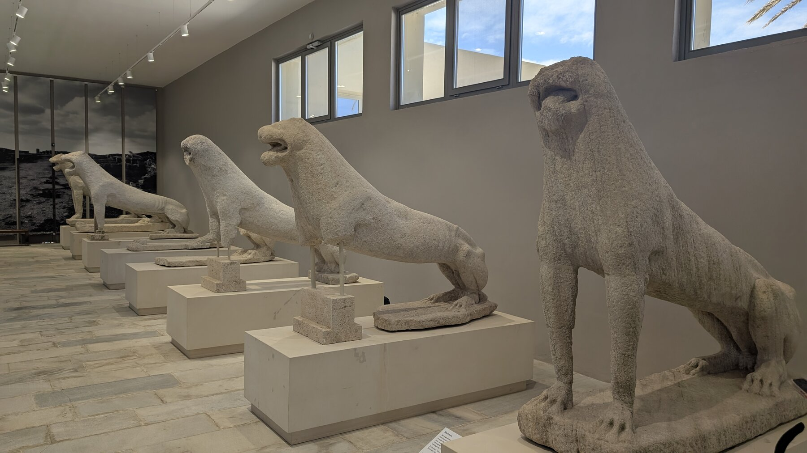

If you’re interested in archaeology and ancient ruins, Delos should be a priority, it has remarkable history and an impressive museum. It was a prominent religious and trading town for centuries in both Greek and Roman times.  The ruins are definitely *ruins*, very few intact buildings, but it's very evocative and the history is fascinating.

Our one disappointment was that the signage in Delos wasn’t great, and we found doing it without a tour guide frustrating. There are day trips you can find from Mykonos (Delos is only 15 mins from Mykonos) that include a tour guide … if I coulda figured that out I would have, but we weren't starting in nearby Mykonos.  Because we had no guide, I felt like I got ~40% out of Delos what I might have with a good guide (but I’m a history nerd, others might need less detail). 

We did a 1-day 3-way boat ferry from Paros to Delos & Mykonos with [Polos tours](https://polostoursparos.com/daily-cruises/delos-mykonos/).  This was a somewhat mixed bag -- it was extremely efficient, in that we saw two islands that we really wanted to see as a (long) day trip from Paros, and it was all very well-run.  On the other hand, there were no 'guides' per se, and we wished we'd had a guide in Delos.  Polos tours is a ferry ride which optimizes seeing both Mykonos and Delos which was great, but doesn’t help with tour guides. I’ve read that sometimes there are tour guides waiting outside the Delos gates, but that wasn’t true in early May … and who knows if they’re good?

