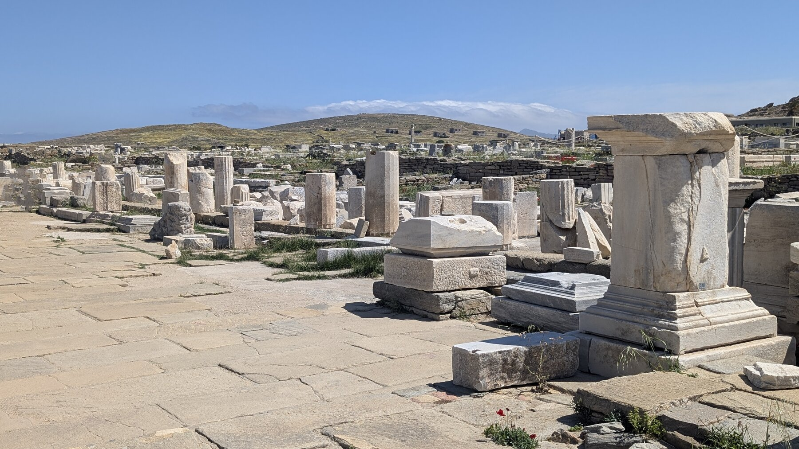
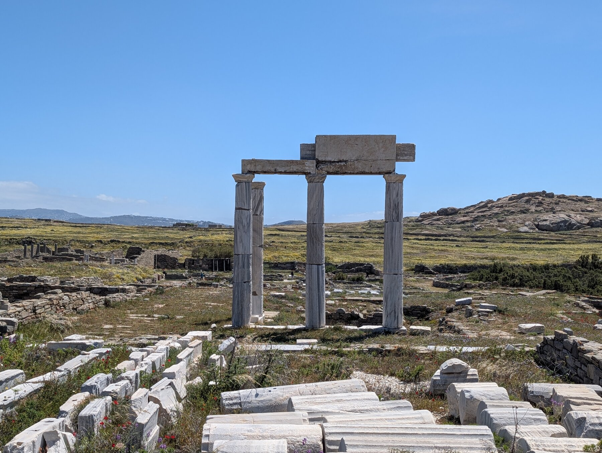
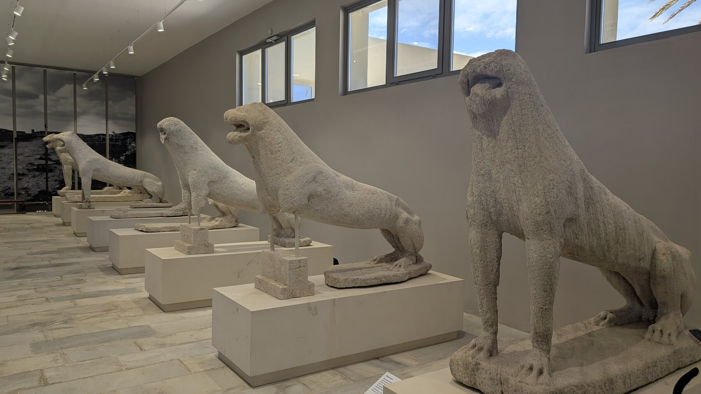
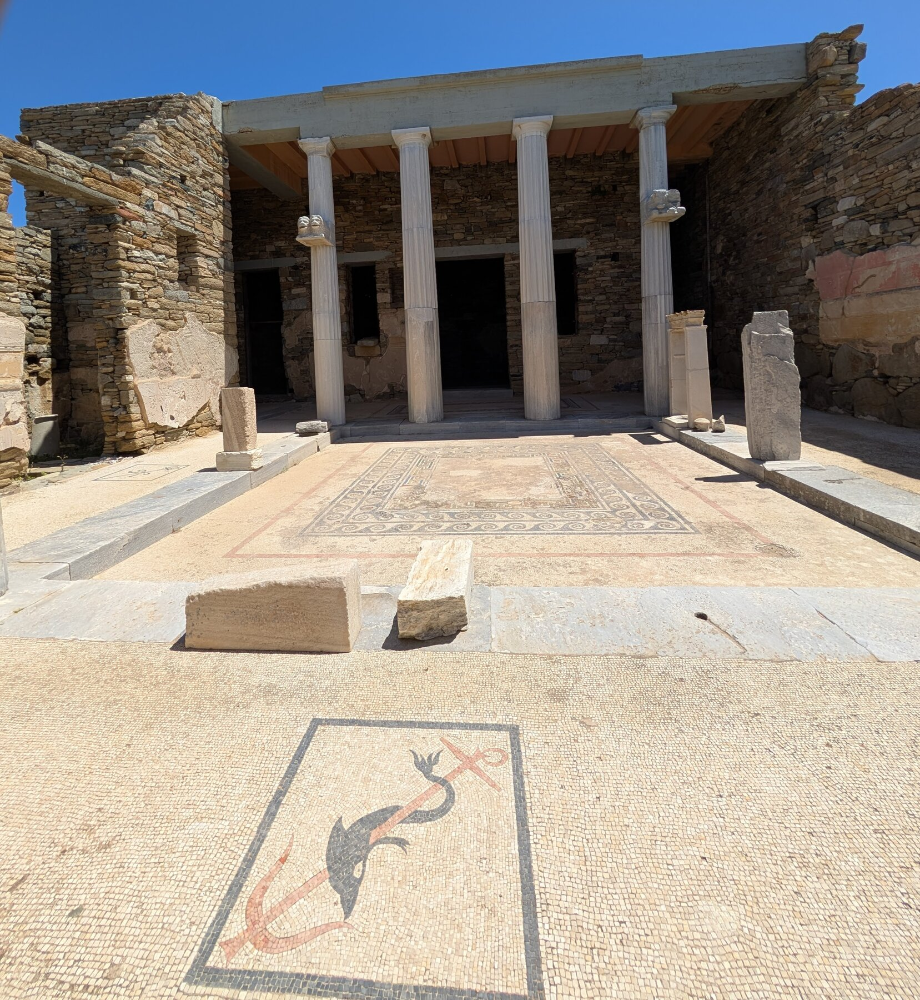
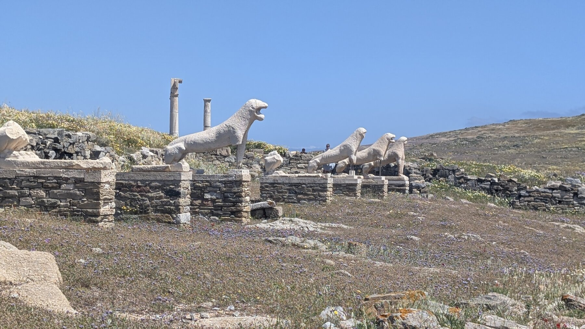
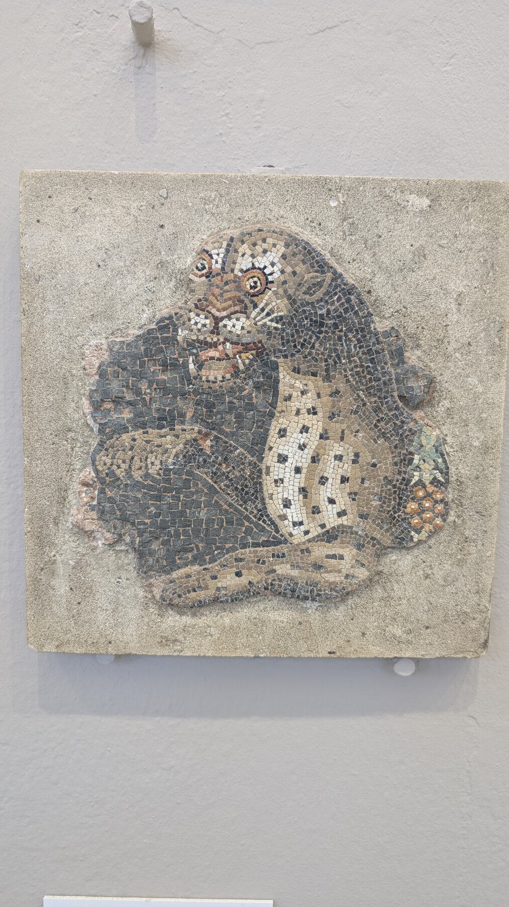
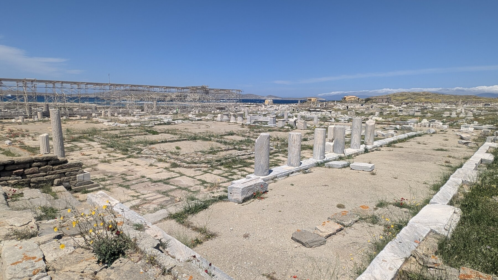

Delos is one of the most significant archaeological sites in the Aegean -- a religious center for a thousand years, a trading hub that once rivaled any port in the Mediterranean. The onsite signage doesn't come close to conveying that, which is why a guide matters more here than almost anywhere else we visited.

It was a prominent religious and trading town for centuries in both Greek and Roman times. Almost nothing is intact. But the footprint of the town -- the street grid, the building foundations, the theater -- is large enough to suggest what it once was.

Because Delos is only a 15-minute ferry from Mykonos, there are day trips you can find that include a tour guide ... if I could have figured that out I would have, but we weren't starting in nearby Mykonos.  

We visited via a 3-way boat ferry from Paros to Delos & Mykonos with [Polos tours](https://polostoursparos.com/daily-cruises/delos-mykonos/).  The routing was smart: two islands in one long day from Paros.  It just doesn't include a guide, which matters more at Delos than Mykonos.  We've read that freelance guides sometimes wait outside the gates. None did in early May. And even if they had, there's no way to vet them.

> I felt like I got ~40% out of Delos what I might have with a good guide (but I'm a history nerd, others might need less detail). 

The famous lions, now safely in a museum -- there are replicas outdoors where they once stood.

:::nutshell Delos
verdict: Glad We Went
duration: 2 hours
Stay Overnight: Not possible -- Delos is an uninhabited archaeological site. Day trip only.
Don't Miss: The museum; the lion replicas outdoors where they once stood.
Best Time of Day: Morning -- before the afternoon heat on a fully exposed site.
Worth the Splurge: A tour guide, if you can find one. We didn't and got much less out of the experience.
Return Visit: Yes, but with a proper guide next time.
:::