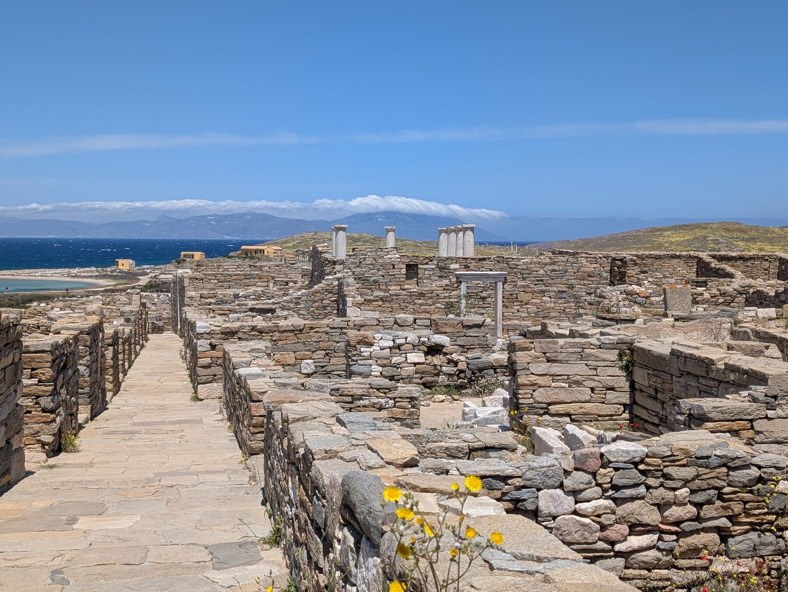
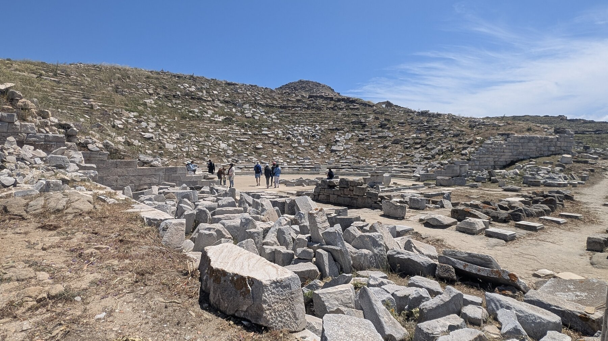
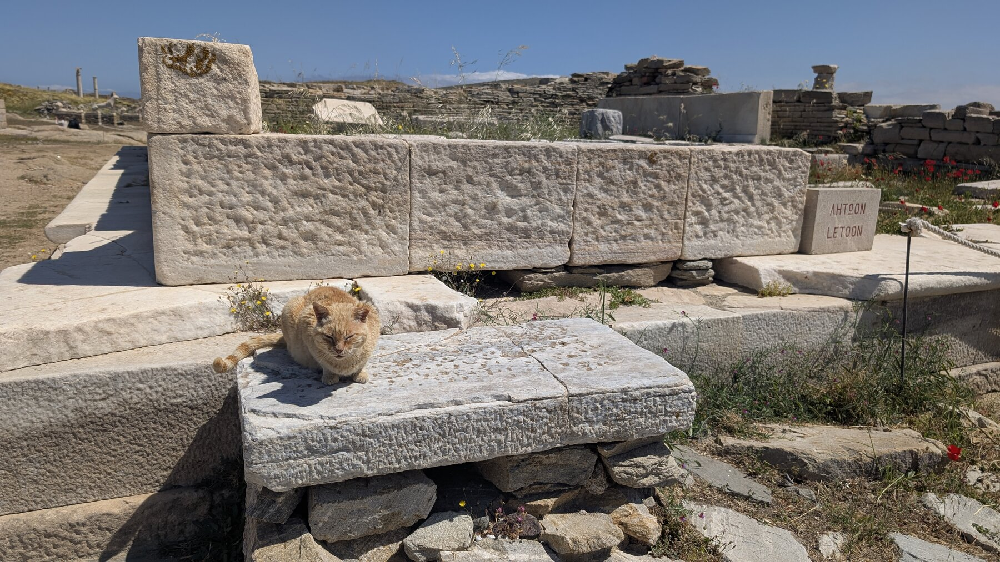

Delos is one of the most significant archaeological sites in the Aegean -- a religious center for a thousand years, a trading hub that once rivaled any port in the Mediterranean. Little is intact, and the onsite signage doesn't come close to conveying that, which is why a guide matters more here than almost anywhere else we visited.

The scale surprises. This wasn't a shrine on a hill. It was a proper town, densely built, with commercial quarters and residential blocks stacked close together. 

> But without a guide, you're reading foundations like a foreign alphabet -- recognizing the shapes without grasping the meaning.

The famous Delian lions were carved from Naxian marble around 600 BCE -- a political flex as much as a religious offering, placed to guard the lake where Apollo was supposedly born.  The outdoor versions are plaster replicas.  

The on-site museum is small but a highlight -- the original lions are inside, weathered down to shapes that barely read as lions anymore. Their erosion makes them more affecting than if they were pristine.

## Where the Money Lived

The sanctuary and the lions are the public face of Delos. But most of the site is something else — a city where people lived, traded, and decorated their floors.

The Theater Quarter reads more like a neighborhood than the sanctuary ruins -- this was where merchants and shipowners lived, in a tax-free port they'd helped build.

We learned afterward what a guide would have told us on the spot: most houses doubled as businesses, shops and taverns facing the street while the family lived behind the walls around a private courtyard. The layout is visible in the photo -- a stone-paved main street with foundations rising on either side, each block a self-contained household. Two thousand years later, you can still tell where the front door was.

The House of the Dolphins is one of the better-preserved residences -- the mosaic in the foreground, a dolphin wrapped around an anchor, was likely a protective emblem for the merchant family who lived here in the 2nd century BCE. The central courtyard was the heart of the house, open to the sky, with columns that once supported a second floor. After so many foundations and civic ruins, the courtyard reminds you that people actually lived here -- and lived well.

The Panther Mosaic from the House of the Masks is a showpiece -- a leopard wearing a wreath and collar, tamed in service to Dionysus. It's not a wild animal; it's a domestic one, which makes the craftsmanship feel less like decoration and more like portraiture. What the portrait meant to its owner, though, we could only guess. A guide would have known.

The theater that anchored this neighborhood held up to 6,500 spectators and took 70 years to build. The front-row marble seats still have back support — reserved for dignitaries, comfortable even now. Climb to the top tier and the ruins below resolve into a readable street grid. From there, you can see how much of Delos was a functioning city, not just a sanctuary.

## Organizing Your Day in Delos

Because Delos is only a 15-minute ferry from Mykonos, day trips from there include a guide. We would have preferred that option, but we weren't starting from Mykonos.

We visited via a 3-way boat ferry from Paros to Delos & Mykonos with [Polos tours](https://polostoursparos.com/daily-cruises/delos-mykonos/).  The routing was smart: two islands in one long day from Paros.  It just doesn't include a guide, which matters more at Delos than Mykonos.  We had read that freelance guides sometimes wait outside the gates. None did in early May. And even if they had, there's no way to vet them.

Several audio guides are available online. We didn't use one and regret it -- worth downloading before you go.

> I probably extracted roughly 50% of what Delos has to offer -- and I'm the history nerd in this pair.

Delos deserves better than we gave it. Two hours and no guide left us reading surfaces when we should have been reading stories. We'd go back — but next time, prepared.

:::nutshell Delos
verdict: Glad We Went
duration: 2 hours
Stay Overnight: Not possible -- Delos is an uninhabited archaeological site. Day trip only.
Don't Miss: The theater district and its House of the Dolphins; the museum; the lion replicas outdoors where they once stood.
Best Time of Day: Morning -- before the afternoon heat on a fully exposed site.
Worth the Splurge: A tour guide, if you can find one. We didn't and got much less out of the experience.
Return Visit: Yes, but with a proper guide next time.
:::