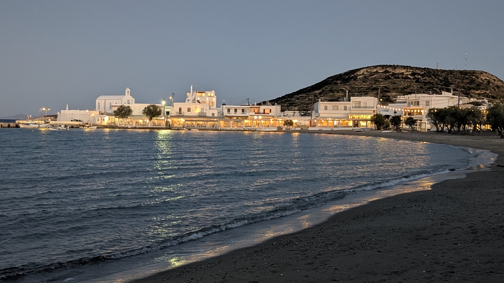
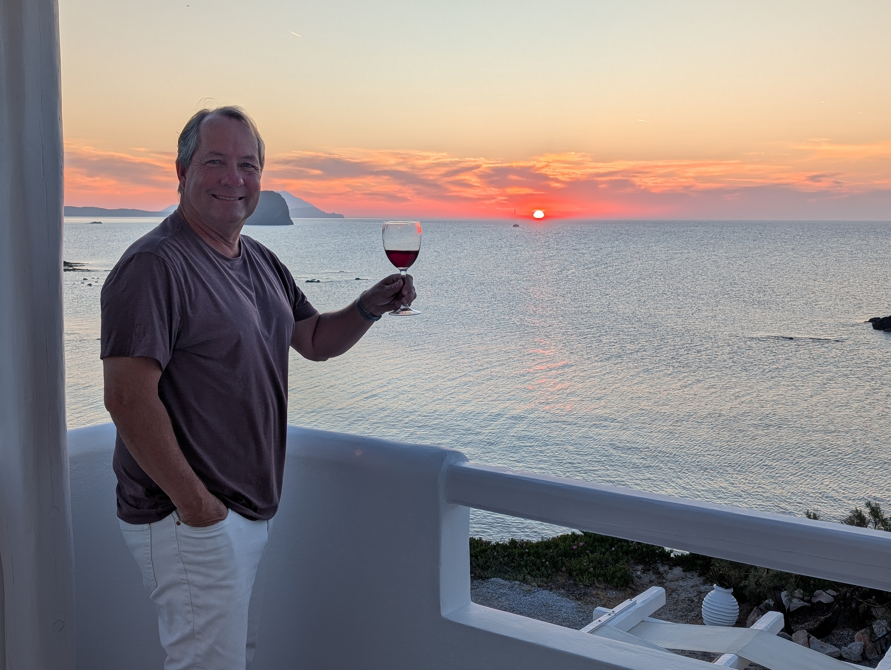
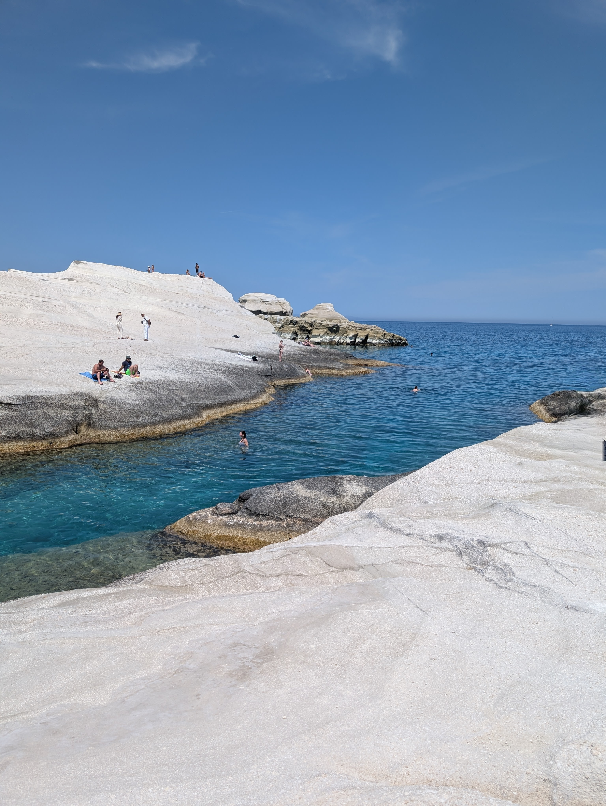

Milos is less on the top tier of visited Cycladian islands than Santorini, or Mykonos, or Paros, but we thoroughly enjoyed it.  It has fewer tourists and feels more “Greek” than some other islands we visited.

There are two main towns in Milos that attract tourists.  Pollonia is nice, quaint, and pretty, while Adamantas (sometimes spelled Adamas) is the much busier ferry port. They’re maybe a 15-20 minute drive apart.

## Where We Stayed

We stayed at Tania Milos in Pollonia and *loved* it. Super homey feeling (we were chatting often with Tania herself), great staff, but also unbelievable location, just stunning water views from at least some rooms, and from the lovely breakfast. It was a 8 minute flat/easy walk from the Pollonia restaurant row.

At Tania Milos, We had the “Deluxe Room with Full Sunset Sea View” which yes is the most expensive room in that hotel, but Milos is generally less pricy, especially off-season (the best room was less than $300/night in our shoulder season) so we thought it was a great bargain, the balcony has perfect sunset views. 

## Getting Around
We rented a car and I don’t know how one would enjoy the visit without one.  There were few taxis, and things are pretty spread out.  

One caution is that our helpful car rental representative gave us a ‘free upgrade’ to a larger vehicle, and we wished (see below) we had had a narrower car.  Also the rental agency told us you couldn’t take the car off-road — we just figured that everyone must ignore this (not that we’re recommending it!), because so many of the popular places to visit are, in fact, off-road.

## What to Do

- We booked a catamaran cruise around the island with Odysseus Cruises – and they cancelled at 7pm the night before due to lack of staffing (early May grrr). Getting a catamaran cruise is supposed to be one of the things to do, unfortunately … we didn’t experience that.
- Driving on Milos is mostly good, but don’t do what we did; we rented a car and the helpful Budget employee ‘upgraded’ us to a bigger car, but there are a lot of narrow roads, so bigger isn’t necessarily better.
- I thought it was worth driving to the capital Plaka to see where there’s a replica Venus de Milo – know as Aphrodite de Milos here, near where she was found – depending on how into art you are.  She has a great view of the water from her hill.
- Be careful near Plaka, there are some narrow lanes – don’t always optimize for ‘fastest’ route on Waze, it’ll take you on some roads that are 3” wider than your car, try to stay on the biggest/most major roads.

- There are some nice beaches, 
  - I made a quick ‘n dirty map for myself [here](https://www.google.com/maps/d/edit?mid=10STMCKq4Tnfg4n-Z_B0SCEIKhQogt8I&usp=sharing) based on some online recommendations of “best beach in Milos”.
  - We especially recommend Sarakiniko beach which is maybe a 5-8 minute walk downhill from the parking lot but sooo photogenic. 
  - Note that Milos is *very* hilly – so that for example it looks on the map that Fyriplaka beach is right near Paliochori beach, but there’s no “circle” road on this island, you drive 10 minutes back into the interior then back out to the next beach. The road down from the interior to Fyriplaka is a bit hairy, you’re going down a steep road right near a quarry with massive trucks around you.
  - Many of these beaches have offroad components; when we rented our car we were told “not to drive offroad” or something like that … I can only assume most tourists ignore that, since many of the best beaches on Milos … require offroading (this was true in Paros as well, as an aside).

## Food and drink
  - The locals (?) say Yialos is the best restaurant in the main waterfront row in Pollonia, we thought it was excellent. Some sites (TripAdvisor, others) list this as “Gialos’, but the menu very definitely had a Y. 
  - There is an Asian (sushi) restaurant in Pollonia called Hanabi, I think the locals aren’t thrilled for whatever set of reasons, but we enjoyed it as a change from the Greek fish restaurants which all have sorta the same menu.
  - Medusa restaurant in Mandraki is well-known (various celebs have eaten there) and worth the detour for lunch (and probably dinner) – lovely views, nice food (15? minute drive from Pollonia).
  - [Kostankis](https://kostantakiswinery.com/) winery is a 10-min walk from Pollonia – it was very good, super friendly young staff. It’s the only winery on Milos, and was a nice intro to local varietals.  

This text will wrap around the image. The inline CSS style ensures the image floats to the left, and the `margin-right` adds some space so the text doesn't stick to the image. This approach is more reliable in environments that support inline styles. 

 

