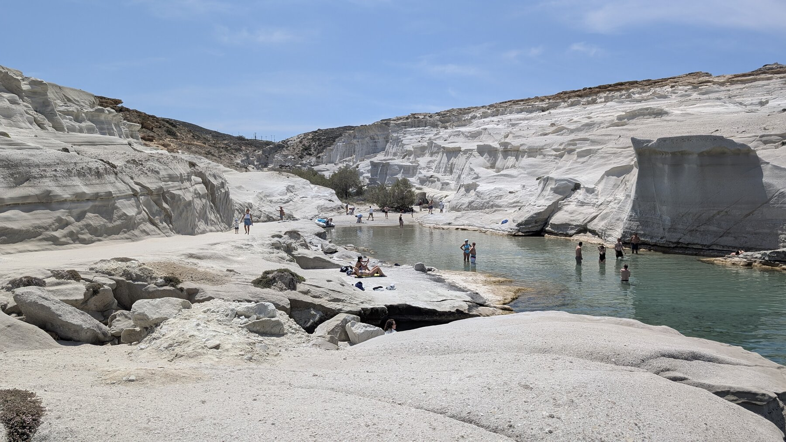
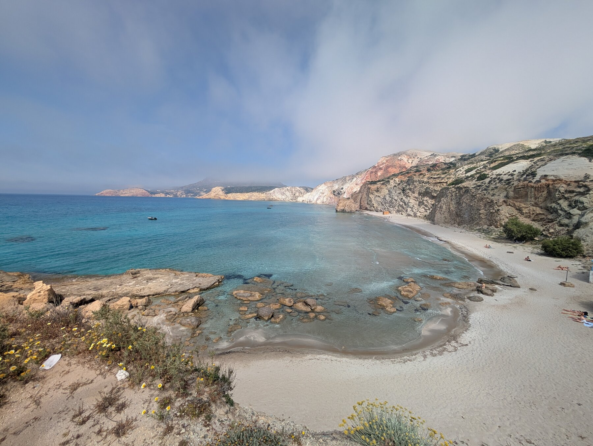
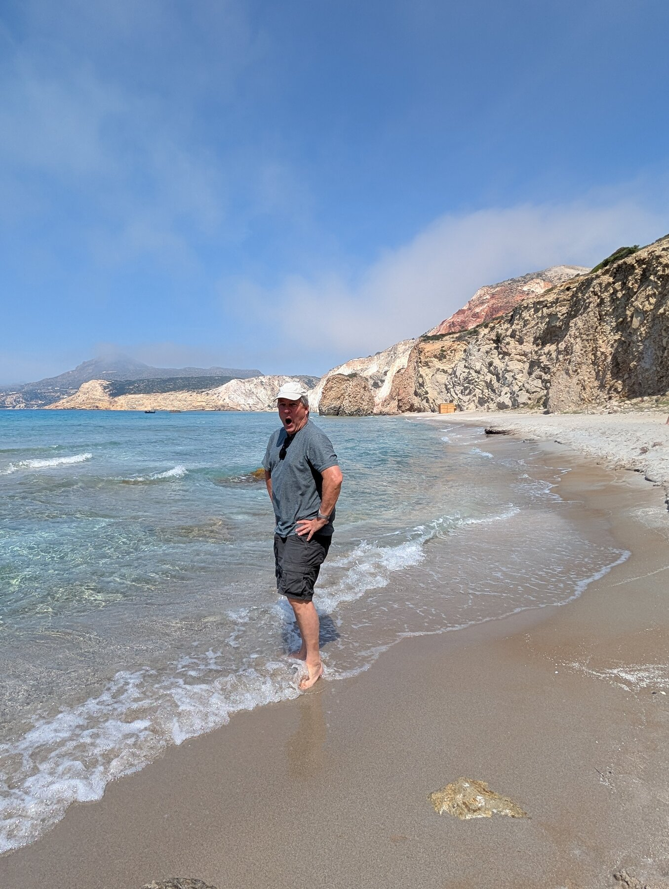
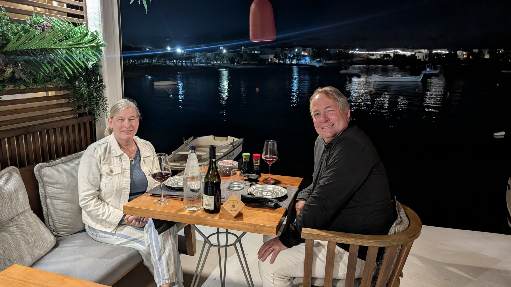
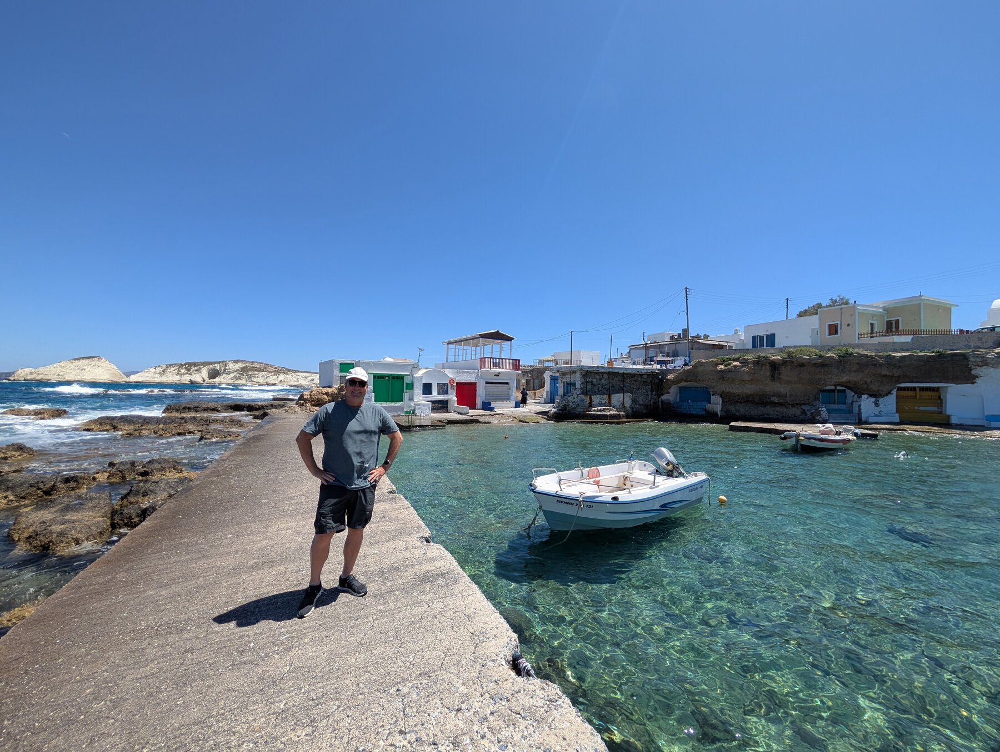
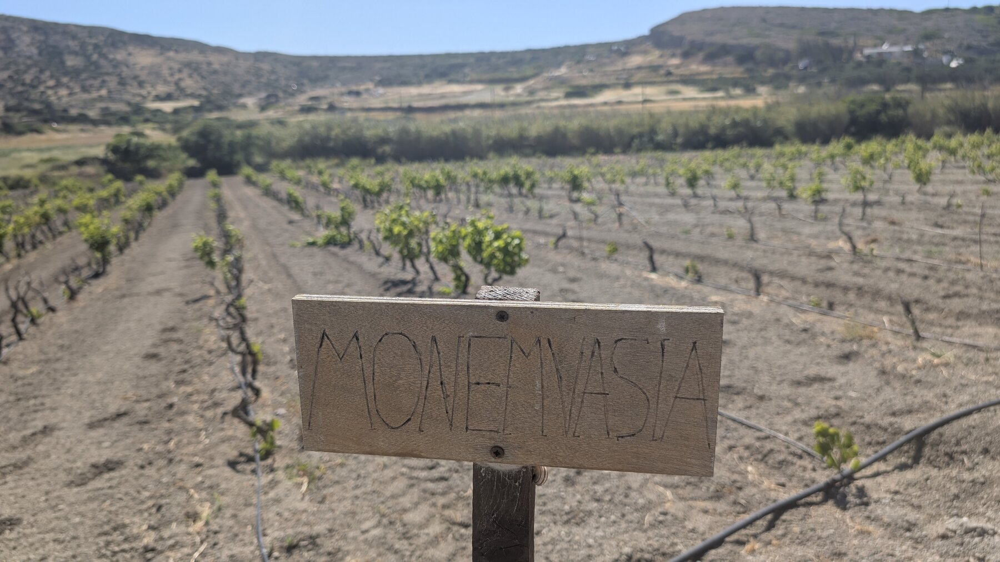
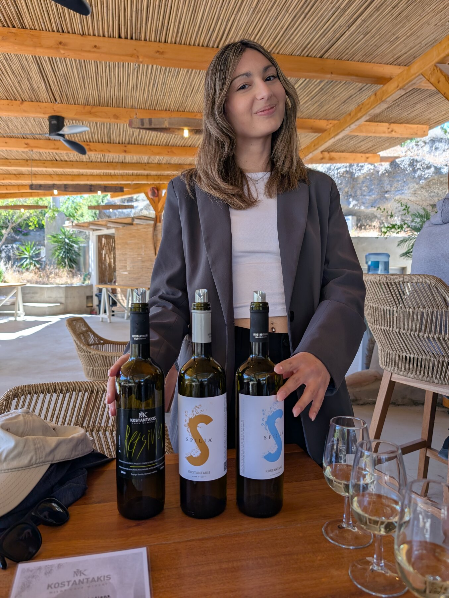

Milos is quieter than the more famous islands in the Cyclades, and wears it well. Pollonia, the fishing village where we stayed, has a restaurant row only 100 yards long. The tourist infrastructure is modest, and there are no tour buses. That's not a gap -- it's the pace that Santorini and Mykonos traded away long ago.

> Milos isn't a "stroll town, stumble into sights" island. It's a "pick a target, drive, and commit" island. 

If you're willing to rent a car and explore, Milos easily rewards 2 or 3 days.

## Where We Stayed

Most visitors base themselves in Adamantas, the busy ferry port also known as Adamas, or Pollonia, a quiet fishing village 15 minutes away. We chose the quiet Pollonia.

Hotel [Tania Milos](https://www.taniamilos.gr/) is owner-run in the best sense -- Tania herself is the concierge, the local expert, and the reason we would return. It is only an 8-minute walk on level ground from the restaurants. 

The sea-view rooms face west. So does the breakfast terrace -- same water, same light.  The "Deluxe Room with Full Sunset Sea View" is the most expensive room in the hotel.  But at under $300 a night in shoulder season, the balcony sunset views made it feel like a bargain.

It's the kind of place that works because the island works this way -- owner-run, unhurried, scaled to a village that hasn't outgrown itself.

## Getting Around

Rent a car -- Milos doesn't really work without one.  Taxis are scarce, and the island's sites and beaches are spread out.  This is the tradeoff for an island that hasn't built itself around tour buses.

Driving is straightforward on the main roads; the stress comes from the last mile to beaches. Don't accept the "upgrade" to a bigger car -- many roads are narrow, and the extra width adds anxiety.  Also the rental agency told us you couldn't take the car off-road.

> We assume everyone must ignore the rental requirements, because so many of the popular beaches to visit are, in fact, off-road.

Be careful driving near Plaka.  On GPS, avoid the "fastest" -- it will happily route you onto narrow lanes that are barely car-width.

## Exploring Milos

The signature day trip on Milos is a catamaran cruise, as many of the iconic sites are undrivable.  We booked ours with Odysseus Cruises.  They cancelled at 7pm the night before -- not enough crew. So we can't report on it firsthand.  The cancellation was telling -- Milos doesn't yet have the volume or redundancy of a bigger island. We found no backup operator waiting to scoop us up. 

The replica Venus de Milo in Plaka is worth the drive if art history matters to you.  The piece is known locally as Aphrodite de Milos, and the copy stands near where the statue was originally discovered.   She looks out over the water, armless and unbothered.

## Beaches of Milos
  
Milos has more beaches than you can visit in 2 days, and the best ones require the worst roads.  
  
Sarakiniko "beach" deserves special attention. A 5-8 minute walk downhill from the parking lot gets you to the water.  It's the most unusual beach we saw in the Cyclades.  

The island winds have carved its smooth, grayish-white volcanic rocks into shapes unlike anything else; the landscape really does look lunar.   

The rock formations have created a natural amphitheater, but calling it a beach feels misleading -- think in terms of clambering over rounded rock terraces, not setting your umbrella.  Flip flops might not be the best choice here; something sturdier helped us.

The white rock throws the light back at you from every angle, and contrasts strongly with the brilliant blues of the Aegean.  We sat on a natural bench overlooking the water and just appreciated the moment for 20 minutes without needing more.

The day we were there, a small food truck served snacks and drinks by the free parking lot.

Sarakiniko is the most popular attraction on Milos, so a midday visit means crowds even outside high season.

Milos is rugged and hilly, and the roads to its beaches remind you the island hasn't polished its rough edges for visitors. Fyriplaka beach looks close to Paliochori on the map, but you can't drive along the coast -- you drive back into the interior and then out again. The descent to Fyriplaka is hairy: a steep road near a quarry, often with massive trucks around you.

Fyriplaka is a more classic beach after visiting Sarakiniko. 

In early May, seasonal workers were preparing the beach bar for summer, but we had the sand nearly to ourselves. Another month and the scene would be different -- but that isn't the Milos we experienced.  Without the hum of the beach bar or the crowds, what you notice is the soft sand coupled with the cliffs -- tall, layered in color, and close enough to feel like walls. 

This [map](https://www.google.com/maps/d/edit?mid=10STMCKq4Tnfg4n-Z_B0SCEIKhQogt8I&usp=sharing) shows where the varied beaches cluster -- or more accurately, where they don't.

## Food and Drink

In Pollonia's short stretch of restaurants, [Yialos](https://yialos-milos.gr/) is the name locals give first.  It is a more polished version of the typical Greek fish tavern, with a better-than-expected wine list. You'll find it listed as 'Gialos' on TripAdvisor -- the menu spells it with a Y.

[Hanabi](https://hanabimilos.gr/), a sushi restaurant in Pollonia, drew skepticism from locals -- but we enjoyed it as a change from the Greek fish restaurants, which all have similar menus.

[Medusa](https://medusamilos.gr/) restaurant in Mandrakia is worth the 15-minute drive from Pollonia.  Mandrakia itself is a tiny fishing village with a circular harbor surrounded by colorful boat garages.

The restaurant terrace sits right above the crashing waves of the Aegean Sea. The food is traditional and fresh enough to make this a popular destination.  Octopus hangs on lines outside, drying in the sea breeze before it reaches the grill.

[Kostankis](https://kostantakiswinery.com/) winery is a 10-minute walk from Pollonia and the only commercial winery on Milos. Its tasting garden overlooks a small rustic vineyard of local varieties. 

Tastings are relaxed and informal.  What makes Kostankis worth the walk is the focus on rare Greek grapes.  Monemvasia, Malagouzia, and Mavrotragano are not found at many Cycladic wineries, and here are often blended to create limited-edition labels.  Malagouzia was a particular favorite -- almost extinct in the 1970s, it was rescued and has an intense bouquet reminding us of Viognier. 

One winery, a handful of local grapes, no gift shop -- Kostankis is Milos in miniature.

Milos delivered on its promise of a quieter pace. The short restaurant row in Pollonia, the family-run winery, the lack of tour-bus infrastructure -- these aren't gaps in development. They're the island's appeal. If you're deciding between Milos and a more famous Cycladic stop, the question isn't whether Milos is "good enough". It's whether you want that extra layer of calm.

:::nutshell Milos
verdict: Glad We Went
duration: 2 days
Stay Overnight: Tania Milos in Pollonia -- direct sunset views from the balcony, under $300 per night in shoulder season.
Don't Miss: Morning light at Sarakiniko beach; Kostankis winery.
Best Time of Day: Sunset from the Tania Milos balcony.
Worth the Splurge: The Deluxe Room with Full Sunset Sea View -- a bargain by island standards.
Return Visit: Yes -- we missed the catamaran cruise.
:::

