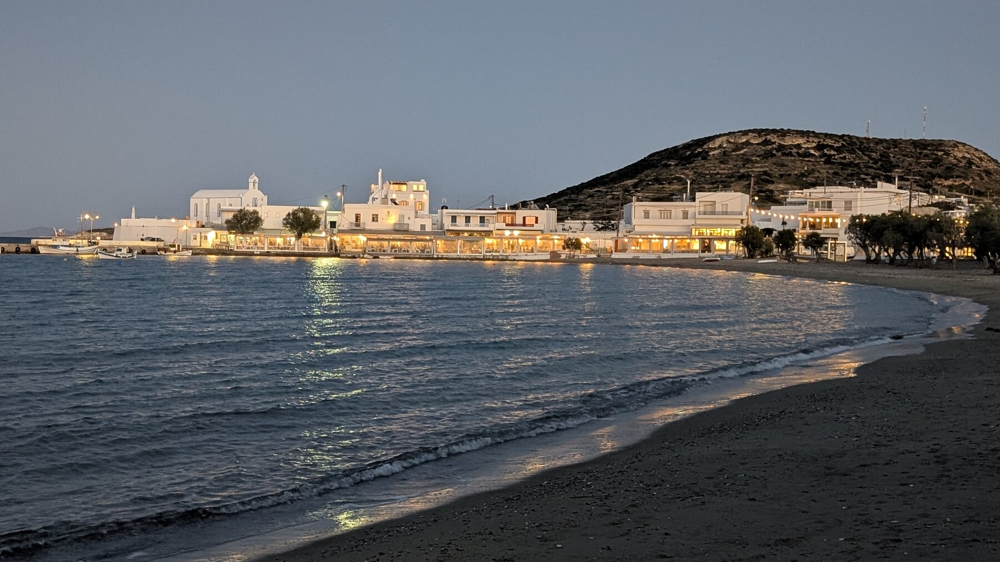
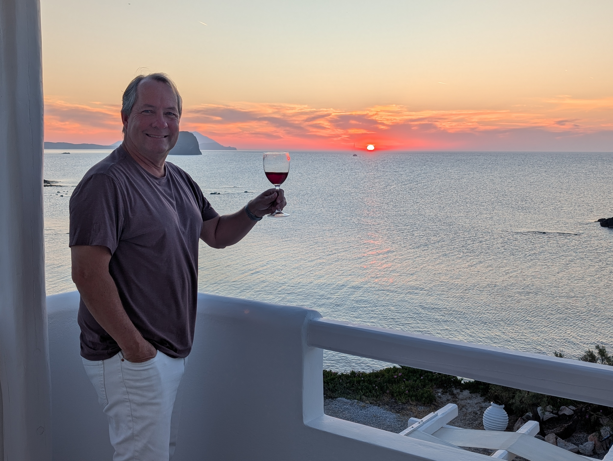
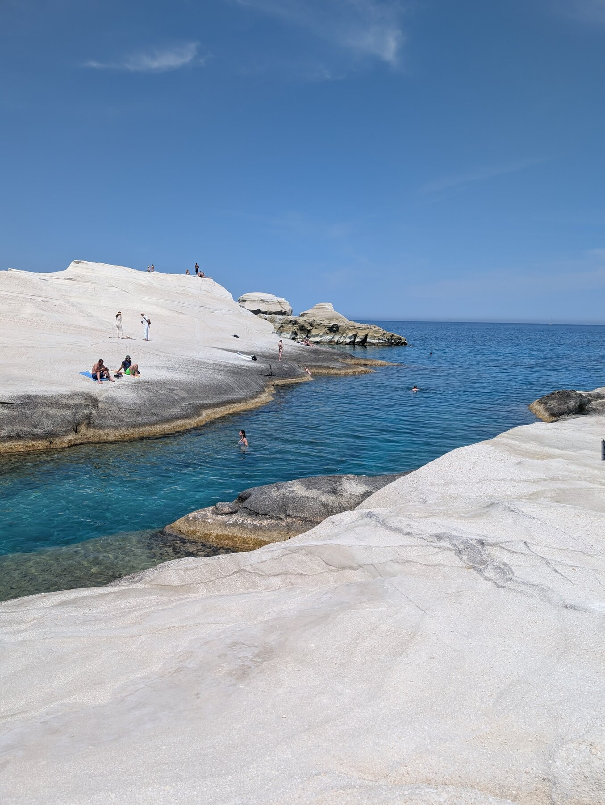

Milos is quieter than the famous Cycladic islands, and wears it well. The tourist infrastructure is modest. The town of Pollonia, where we stayed, has a restaurant row only 100 yards long. That smaller scale gives the island a pace that Santorini and Mykonos traded away long ago. If you're willing to rent a car and explore, Milos easily rewards two or three days.

There are two main towns in Milos that attract tourists.  Pollonia, where we stayed, is a quiet fishing village, while Adamantas (sometimes spelled Adamas) is the much busier ferry port. They are a 15-20 minute drive apart.

## Where We Stayed

Tania Milos in Pollonia has a homey vibe, with Tania herself providing friendly advice. The hotel is positioned far enough from the port to remain quiet, yet the walk to dinner is only eight minutes on level ground. By opting for a sea-view room, you get a clear western vantage point that carries over to the breakfast area, where the tables look directly over the water.

At Tania Milos, we had the "Deluxe Room with Full Sunset Sea View" which is the most expensive room in the hotel.  But at under $300 a night in shoulder season, the balcony sunset views made it feel like a bargain.

## Getting Around
We rented a car, and it's hard to imagine enjoying the island without one.  There were few taxis, and the island's sites and beaches are spread out.

Driving on Milos is mostly good, but don't do what we did; we rented a car and the helpful employee "upgraded" us to a bigger car.  There are a lot of narrow roads, so bigger isn't necessarily better.  Also the rental agency told us you couldn't take the car off-road.

> We imagine that everyone must ignore this (not that we're recommending it!), because so many of the popular beaches to visit are, in fact, off-road.

Be careful near Plaka, there are some narrow lanes.  Don't always optimize for "fastest" route on GPS, it'll take you on some roads that are 3" wider than your car, try to stay on the biggest/most major roads.

## Exploring Milos

One of the most popular things to do in Milos is a catamaran cruise around the island's coastline.  We booked ours with Odysseus Cruises.  They cancelled at 7pm the night before due to lack of staffing. So we can't report on it firsthand.  

If you're interested in art history, it's worth driving to the capital, Plaka, to see a replica of the Venus de Milo -- known locally as Aphrodite de Milos -- overlooking the water near where she was discovered.  She has a great view of the water from her hillside perch.

## Beaches of Milos
  
I made a quick map for myself [here](https://www.google.com/maps/d/edit?mid=10STMCKq4Tnfg4n-Z_B0SCEIKhQogt8I&usp=sharing) based on some online recommendations of "best beach in Milos".
  
We especially recommend Sarakiniko beach. It's a 5-8 minute walk downhill from the parking lot and one of the most unusual beaches we saw in the Cyclades.

Milos is very hilly. For example, Fyriplaka beach looks close to Paliochori on the map, but there's no "circle" road -- you drive back into the interior and then out again.  The road down from the interior to Fyriplaka is hairy, you're going down a steep road right near a quarry with massive trucks around you.
  
## Food and Drink

Among the short row of options in Pollonia, Yialos is the most frequent recommendation from residents. It is a more polished version of the typical Greek fish tavern, with a better-than-expected wine list. Some sites (TripAdvisor, others) list this as "Gialos", but the menu very definitely had a Y. 

There is an Asian (sushi) restaurant in Pollonia called Hanabi, the locals seem unenthusiastic about it, but we enjoyed it as a change from the Greek fish restaurants which all have similar menus.

Medusa restaurant in Mandraki is well-known, Justin Bieber and Tom Hanks are among many who have been seen there.  It justifies the 15-minute detour from Pollonia for lunch (and probably dinner), with views right above the water's edge coupled with fresh, traditional food.

[Kostankis](https://kostantakiswinery.com/) winery is a 10-min walk from Pollonia and the only winery on Milos.  It provides a relaxed tasting of local varietals in a family-run cave. 

:::nutshell Milos
verdict: Glad We Went
Stay Overnight: Tania Milos in Pollonia -- direct sunset views from the balcony, under $300/night in shoulder season.
Don't Miss: Sarakiniko beach; Kostankis winery, a 10-minute walk from Pollonia.
Best Time of Day: Sunset from the Tania Milos balcony.
Worth the Splurge: The Deluxe Room with Full Sunset Sea View -- a bargain by island standards.
Return Visit: Yes -- we missed the catamaran cruise and barely scratched the surface.
:::

