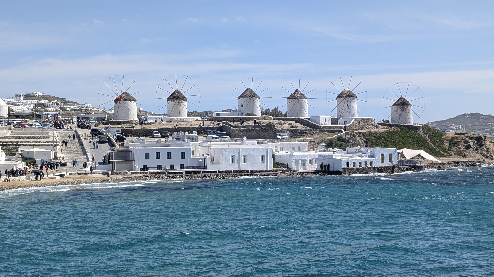
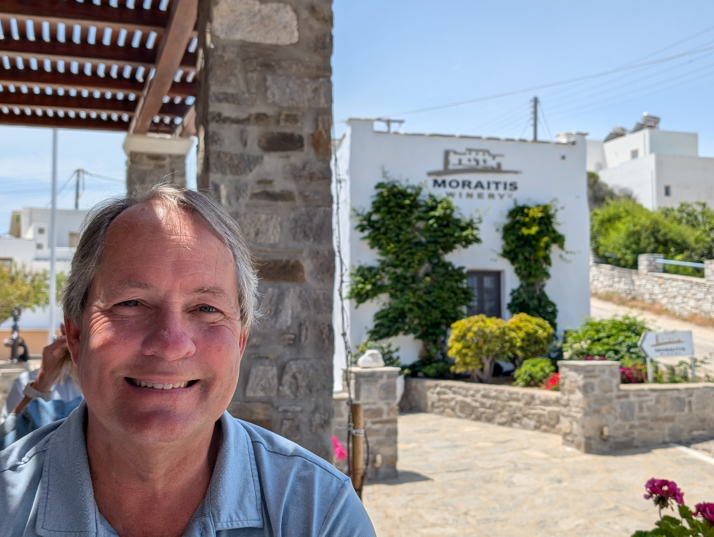
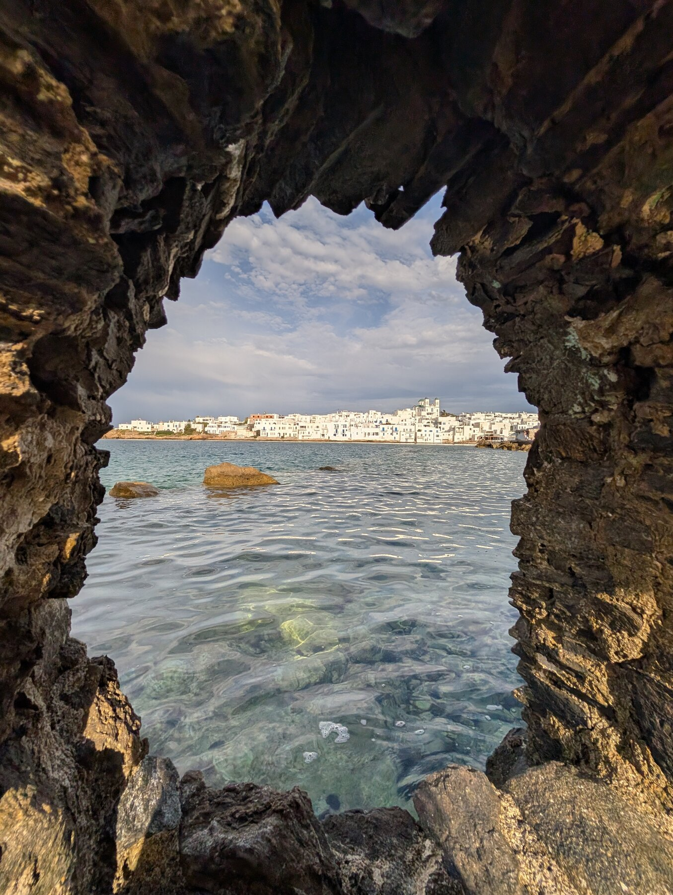

We did a 1-day 3-way boat ferry from Paros to Delos & Mykonos with [Polos tours](https://polostoursparos.com/daily-cruises/delos-mykonos/). 

3 hours in Mykonos isn’t long enough for the island, but … it was far better than nothing. We didn't prioritize Mykonos because, like Santorini, it is so "over" discovered.  But we now know why it's so well-appreciated, it's quite gorgeous.  We had a good time. Tiffany very much enjoyed the shopping ;). 

