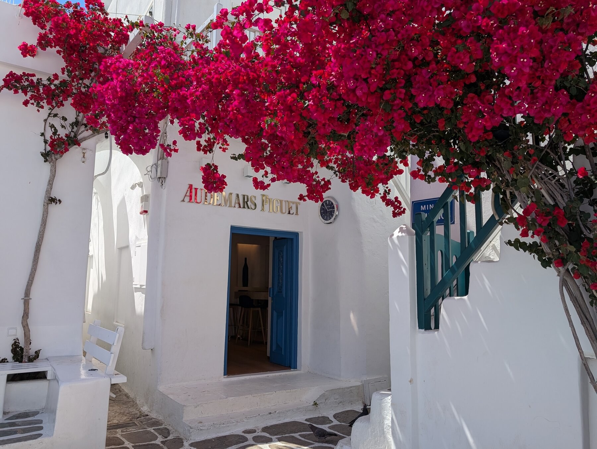
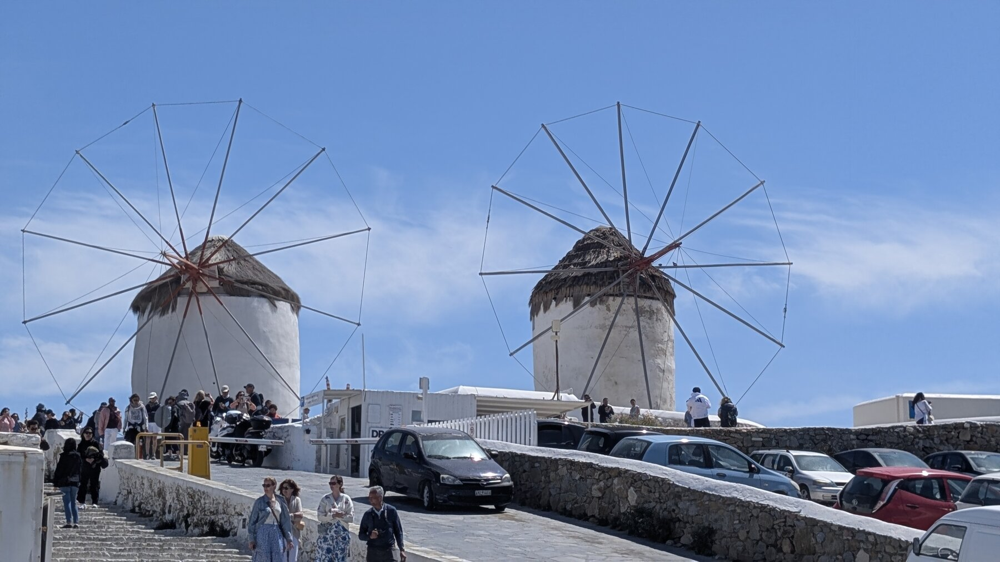
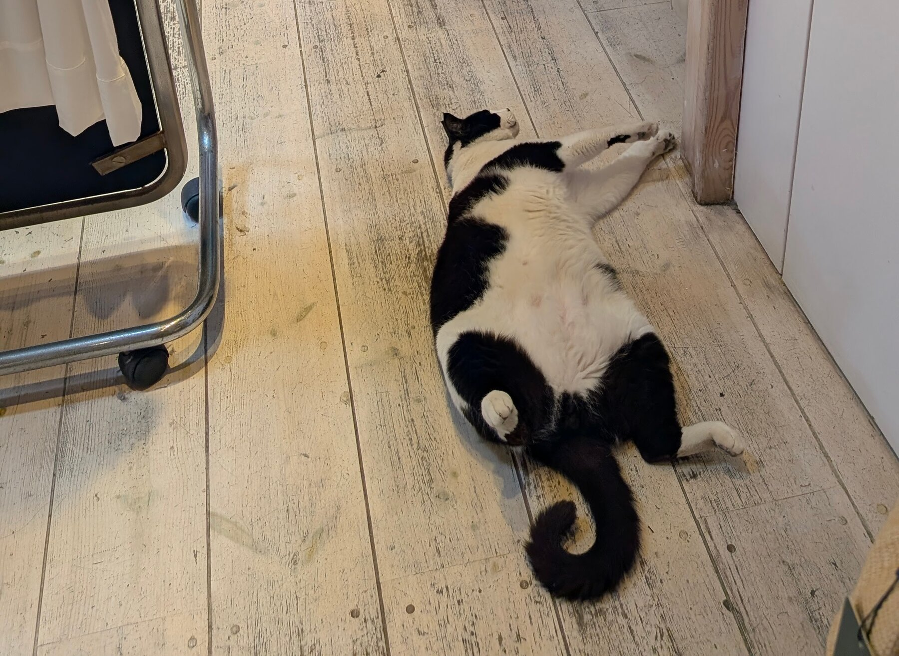
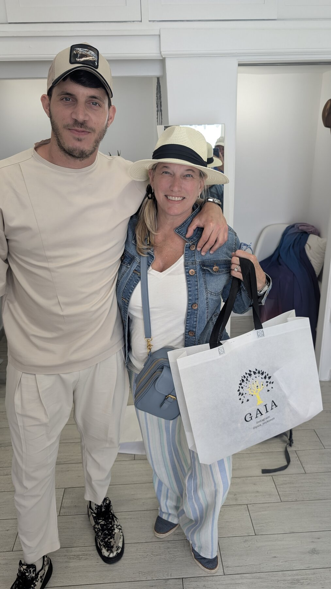
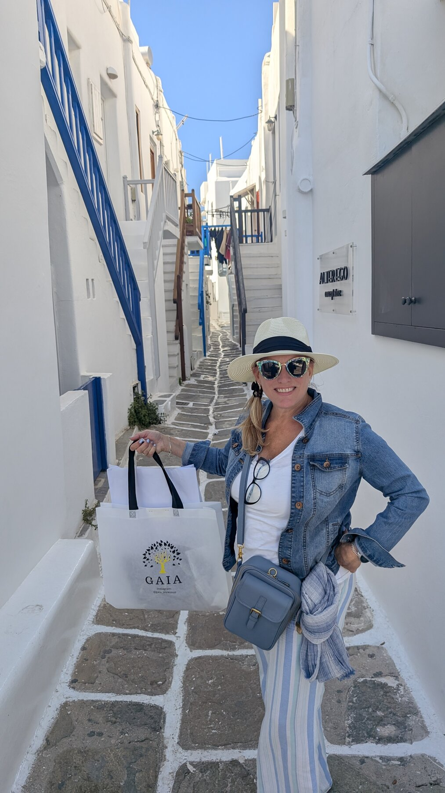

We didn't prioritize Mykonos -- like Santorini, it felt overdiscovered before we ever arrived. But 3 hours on a day-trip from Paros was enough to understand why it earns the crowds, even if it wasn't enough to properly explore.

Chora is the main town of Mykonos -- "Chora" just means "the town" in Greek, and most islands have one. This one earns the name. It's a radial maze of whitewashed lanes fanning out from the harbor -- paths branch and reconnect at odd angles, small squares appear without warning, then collapse back into alleys. Supposedly the layout was designed to confuse pirates. We got lost repeatedly and it never mattered.

The 16th-century windmills are the obvious landmark, and worth a picture, but the town below held us longer.

## The Lanes That Kept Tiffany Busy

The wandering turned into shopping, which surprised us.  Mykonos is one of the better shopping stops in the Cyclades, and not for the reasons you'd expect. The narrow lanes of Chora are lined with small, independent boutiques rather than the international brands that have overtaken most European resort towns. Many are Greek-owned; some are run by the designers themselves.

The aesthetic fits the island -- breezy linens, soft cottons, hand-finished details, pieces that look better slightly rumpled after a day in the salt air. Tiffany bought a dress from the designer, and came away with a story about the fabric and the season along with the purchase. That kind of transaction is hard to find in most tourist towns.

> We don't usually shop much on travel.  Here, the shops kept Tiffany busy.  That's an endorsement.  And a warning.

## Little Venice

Little Venice is where the maze opens up. After the narrow lanes of Chora, you turn a corner and there's nothing between you and the Aegean -- 18th-century merchant houses built right on the water, wooden balconies hanging over the sea. No promenade, no buffer. Just buildings, then waves.

The merchants who built these houses used the lower floors for storage and trade. Now those rooms are bars and cafes -- but the low ceilings, thick walls, and narrow doorways remind you these weren't designed for cocktail service. You duck through thresholds that were built for 18th-century frames, not modern ones.

We were there mid-afternoon, too early for the famous sunset, but the crowd was already building -- chairs angling west, drinks appearing on balcony tables.

Little Venice isn't a hidden gem and doesn't pretend to be. The sunset will be crowded and the drinks will be expensive. Go anyway -- it looks exactly like the photographs, and that turns out not to matter.

## A Stop for a Gyro

Sakis Grill House sits in the middle of Chora's maze, impossible to miss if you're shopping nearby. It's been there since the mid-1980s, and looks it -- counter service, tight outdoor seating, orders out in minutes.  It's fast, loud, and slightly chaotic.

The gyro is the thing to get: warm pita, meat carved off the spit, tzatziki, and fries stuffed inside. Messy, salty, and exactly right after a few hours of walking. By Mykonos standards, it's practically free.

> We ate sitting awkwardly on a wall and went back to shopping. Sometimes that's the best review a place can get.

## How to Get There

We chose not to spend the night on Mykonos.  The day-trip tour from Paros on [Polos tours](https://polostoursparos.com/daily-cruises/delos-mykonos/) links Delos and Mykonos in a single circuit.   A busy day, but it meant seeing both without re-packing a suitcase.

Three hours was enough to understand why this island still has an audience that isn't just chasing a photo.

:::nutshell Mykonos
verdict: Glad We Went
duration: 3 hours
Stay Overnight: We didn't -- 3 hours was enough to see why people love it, not enough to really explore.
Don't Miss: Getting lost in Chora's maze -- the pirate-proofing still works; the shopping (per Tiffany).
Best Time of Day: Mid-afternoon worked for shopping and wandering, not for sunset.
Worth the Splurge: Shopping -- the boutiques are genuinely unique.
Return Visit: Maybe -- we'd want more time to see more of the island, but the crowds are real.
:::
