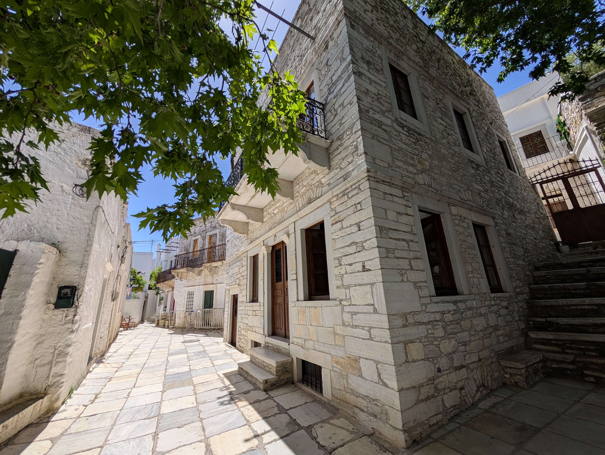
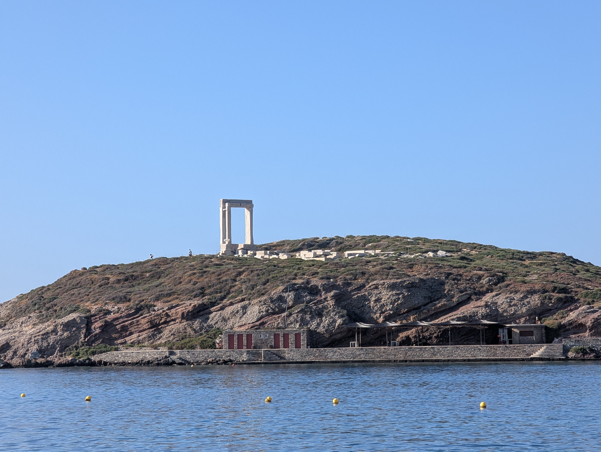

### Naxos

We did not stay in Naxos, but arranged a ferry schedule to be able to spend 6 hours in Naxos which was delightful.  The Santorini=>Paros ferry actually stops in Naxos.  We were able to get a morning ferry (roughly 930-11) to Naxos, and then we had a driver pick us up to take us around for a half-day, with our luggage safely in his trunk.  Then it was only a 30-minute ferry ride around dinnertime to Paros.

Before the trip, we spent a lot of time deciding whether to stay in Paros or Naxos, and while we don’t regret our decision (we liked Paros a lot) … our 6 hours in Naxos made us wish we’d stayed there longer.  Naxos is surprisingly different from Paros – it has an underground water supply, so it has the most agriculture in the Cyclades (including OMG the best cherry tomatoes we’ve ever tasted).  

Like anywhere in Greece seemingly, Naxos has a lot of interesting history.  There are many ancient churches dotted around the landscape; a highlight to us was the 4th century [Panagia Drossiani](https://www.greeka.com/cyclades/naxos/sightseeing/drosiani-church-naxos/). It’s tiny so it’s a 15-minute stop not 2 hours, but highly worth the detour.  

Naxos was known in the ancient world for its vast quarries of high-quality marble.  Throughout Greece, and particularly the Cycladic islands, the material was used for both sculpture and architecture.

Apeiranthos is a scenic mountain village in Naxos.  When it was being built in the 10th century, the best available and affordable material was … marble from nearby quarries.  It’s known as the ‘marble town’ and they used marble for everything, even including outdoor sidewalks.

We can’t recommend enough our tour guide Alex, see him [here](https://www.toursbylocals.com/tours/greece/naxos/tour-details/naxos-highlights---half-day-private-tour-664d2315ebf20b195748906d).   Toursbylocals takes a pretty hefty cut, if you reach out to him directly at Whatsapp \+30 694 514 5018 and name-dropped Kevin & Tiffany, I suspect he’d be quite happy to provide you a tour, we have friends already (late 2025) who hired his services.  We found him delightful company, he was born in Naxos but grew up in Athens, and spent part of his childhood in England, so his English is colloquial and excellent.  He seemed to know everyone everywhere we went, Naxos is a small island.

