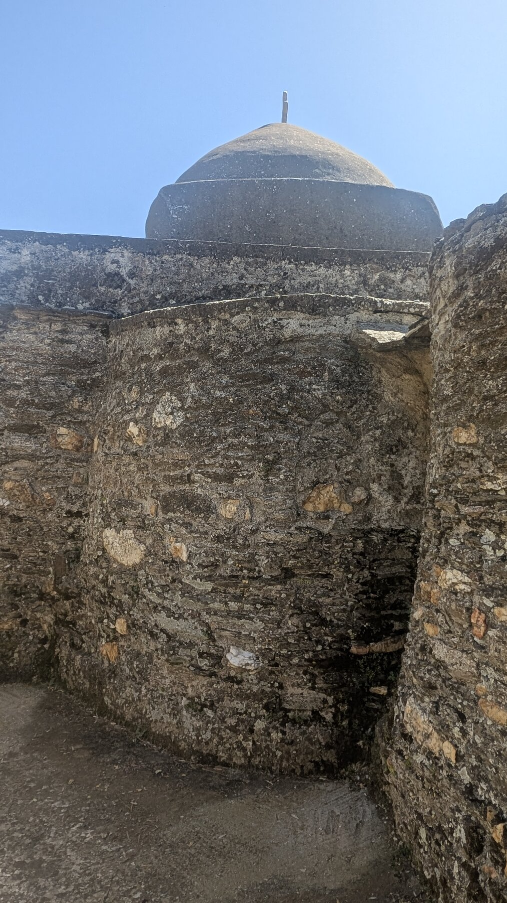
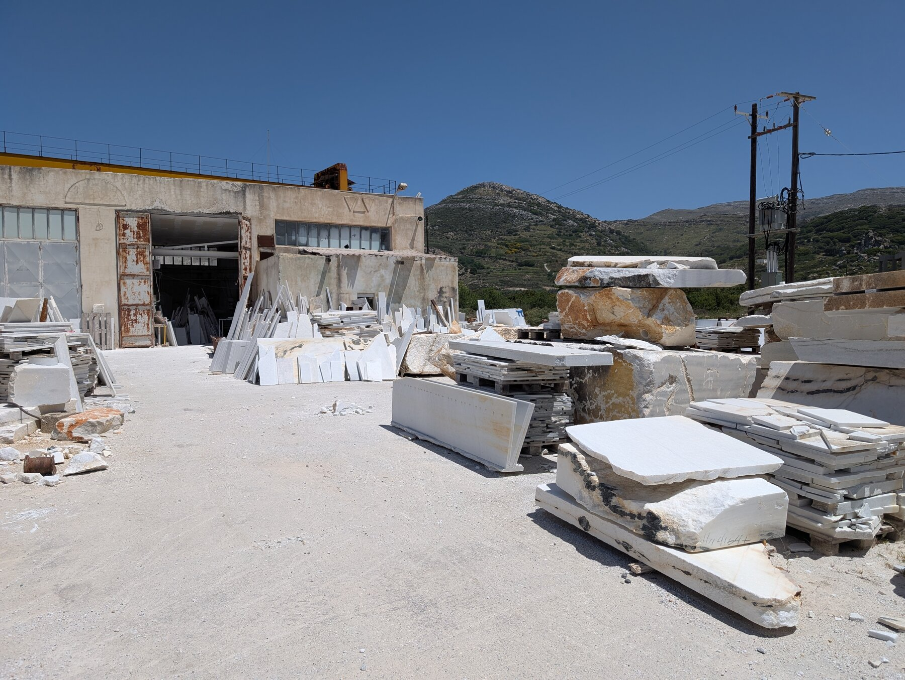
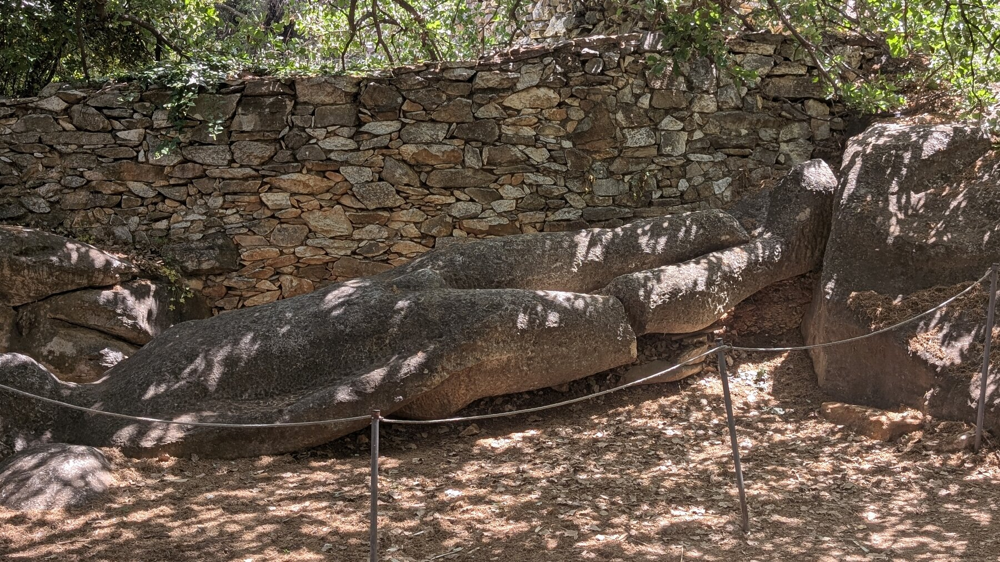

We didn't stay in Naxos. Instead, we arranged our ferry schedule to spend 6 hours there between Santorini and Paros.  The Santorini to Paros ferry actually stops in Naxos.  We were able to get a morning ferry (roughly 9:30-11:00) to Naxos, and then we had a driver pick us up to take us around for a half-day, with our luggage safely in his trunk.  Then it was only a 30-minute ferry ride around dinnertime to Paros.

Before the trip, we spent a lot of time deciding whether to stay in Paros or Naxos.  

> While we don't regret our decision (we liked Paros a lot) ... our 6 hours in Naxos made us wish we'd stayed longer.  

Naxos sits in sharp contrast to Paros; its underground water supply makes it the most agricultural island in the Cyclades, it feels almost lush after Milos.  We didn't expect the cherry tomatoes to be the most memorable thing we ate in Greece. They were.

Many ancient churches dot the landscape. [Panagia Drossiani](https://www.greeka.com/cyclades/naxos/sightseeing/drosiani-church-naxos/) is a 4th-century church that requires only a 15-minute stop but justifies the detour for its scale and age. 

Panagia Drossiani sits just outside the mountain village of Moni, and you almost miss it -- a cluster of squat stone chapels, low-domed and fused together over centuries, pressing into the hillside like they grew there. It's one of the oldest Christian sites in Greece, and looks it: walls don't quite align, ceilings are low, and the geometry feels organic rather than planned.

Inside, your eyes need a moment. The frescoes emerge slowly from the dim -- some of the earliest Christian wall paintings in Greece, faces that feel direct and slightly haunting, less refined than later Byzantine work. There's no theatrical lighting, no interpretation panels. Just cool stone and images that have been there for over a thousand years.

After the visual drama of coastal Naxos, Drossiani is a reset. It's not engineered for visitors, and that's exactly what makes it worth the detour.  

Naxos was known in the ancient world for its marble quarries. 

The stone is unusually white and fine-grained, with a slight translucency — you can see why early Greek sculptors preferred it. The quarries also produced enormous defect-free blocks, which is how a 10th-century mountain village called Apeiranthos ended up building everything out of marble, sidewalks included.

Apeiranthos sits at nearly 2,000 feet on the slopes of Mount Fanari, and feels nothing like the coast. The whitewashed sugar cubes of the shoreline give way to stern stone towers with Venetian balconies -- defensive, permanent, built from the mountain itself. 

> The marble-paved lanes have been polished by centuries of footsteps into a soft sheen that's elegant and treacherous in equal measure. 

We stopped for lunch at a terrace where the narrow streets fell away to a view of the Naxian mountain ranges -- the kind of spot where you forget you're on an island.

## Hire Alex

We used Alex as our guide; see him [here](https://www.toursbylocals.com/tours/greece/naxos/tour-details/naxos-highlights---half-day-private-tour-664d2315ebf20b195748906d).   

ToursByLocals takes a substantial cut, so reaching out directly may be cheaper (Whatsapp \+30 694 514 5018). We have friends who have since (late 2025) booked him independently.  Born in Naxos, partly raised in England, now back on the island -- his English is colloquial.  As we journey around the island, he seemed to know everyone we encountered. Hire him if you can.

:::nutshell Naxos
verdict: Wish We'd Stayed Longer
duration: 5 hours
Stay Overnight: We didn't, and regretted it. 6 hours was a tease -- Naxos deserves at least 2 nights.
Don't Miss: Panagia Drossiani (4th-century church); the marble village of Apeiranthos; the cherry tomatoes.
Best Time of Day: Hard to say from a half-day, but the morning ferry from Santorini worked well.
Worth the Splurge: A private tour with Alex -- his local knowledge made the half-day count.
Return Visit: Top of the list for a return to the Cyclades.
:::

