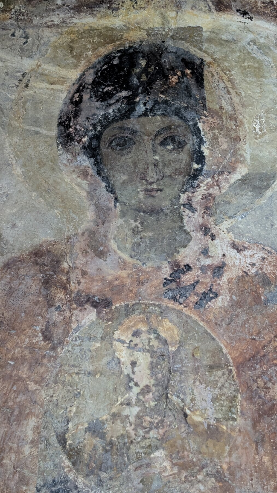
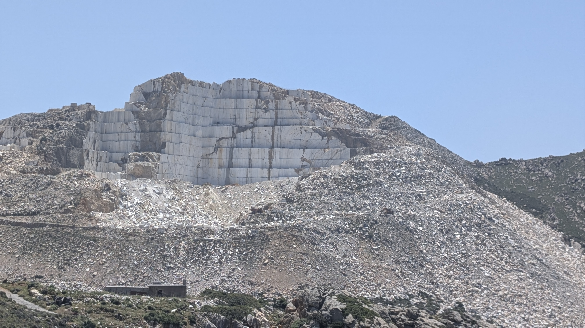
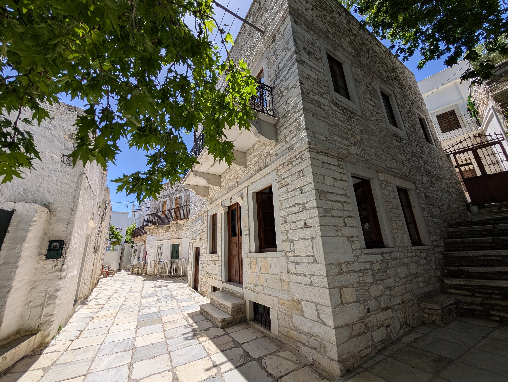
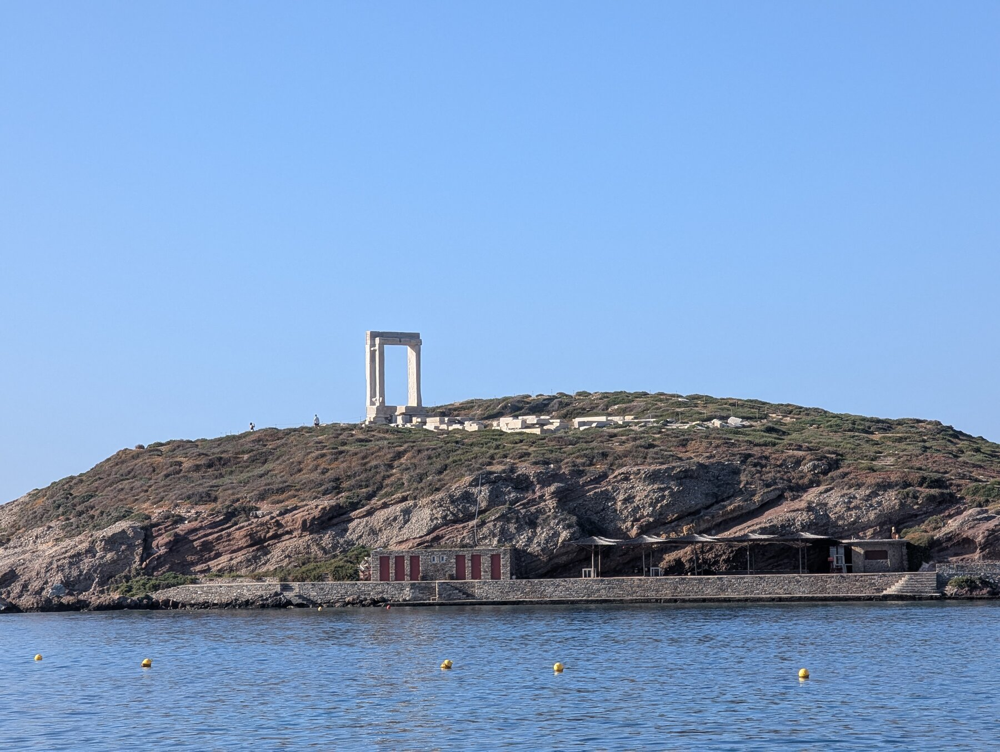

We didn't stay in Naxos. Instead, we arranged our ferry schedule to spend six hours there between Santorini and Paros.  The Santorini to Paros ferry actually stops in Naxos.  We were able to get a morning ferry (roughly 9:30-11:00) to Naxos, and then we had a driver pick us up to take us around for a half-day, with our luggage safely in his trunk.  Then it was only a 30-minute ferry ride around dinnertime to Paros.

Before the trip, we spent a lot of time deciding whether to stay in Paros or Naxos.  

> While we don't regret our decision (we liked Paros a lot) ... our 6 hours in Naxos made us wish we'd stayed longer.  

Naxos sits in sharp contrast to Paros; its underground water supply makes it the most agricultural island in the Cyclades, it feels almost lush after Milos.  We didn't expect the cherry tomatoes to be the most memorable thing we ate in Greece. They were.

Naxos has the usual density of Greek history.  There are many ancient churches dotted around the landscape; [Panagia Drossiani](https://www.greeka.com/cyclades/naxos/sightseeing/drosiani-church-naxos/) is a 4th-century church that requires only a 15-minute stop but justifies the detour for its scale and age. 

Naxos was known in the ancient world for its vast marble quarries.  The marble from Naxos is exceptionally pure white and fine-grained, with a slight translucency that gives finished sculptures an almost luminous, skin-like quality.   The Naxian quarries produce unusually large, defect-free blocks. The combination of beauty, workability, and sheer block size made it the premier sculptural material of the early Greek world.

Apeiranthos is a scenic mountain village in Naxos.  When it was being built in the 10th century, the best available and affordable material was simply marble from nearby quarries.  It's known as the "marble town" and they used marble for everything, even including outdoor sidewalks.

We used Alex as our guide; see him [here](https://www.toursbylocals.com/tours/greece/naxos/tour-details/naxos-highlights---half-day-private-tour-664d2315ebf20b195748906d).   

ToursByLocals takes a substantial cut, so reaching out directly may be cheaper (Whatsapp \+30 694 514 5018). We have friends who have since (late 2025) booked him independently.  He was born in Naxos, grew up in Athens, spent part of his childhood in England -- his English is colloquial, and he seemed to know everyone we encountered. Hire him if you can.

:::nutshell Naxos
verdict: Wish We'd Stayed Longer
duration: 5 hours
Stay Overnight: We didn't, and regretted it. Six hours was a tease -- Naxos deserves at least two nights.
Don't Miss: Panagia Drossiani (4th-century church); the marble village of Apeiranthos; the cherry tomatoes.
Best Time of Day: Hard to say from a half-day, but the morning ferry from Santorini worked well.
Worth the Splurge: A private tour with Alex -- his local knowledge made the half-day count.
Return Visit: Top of the list for a return to the Cyclades.
:::

