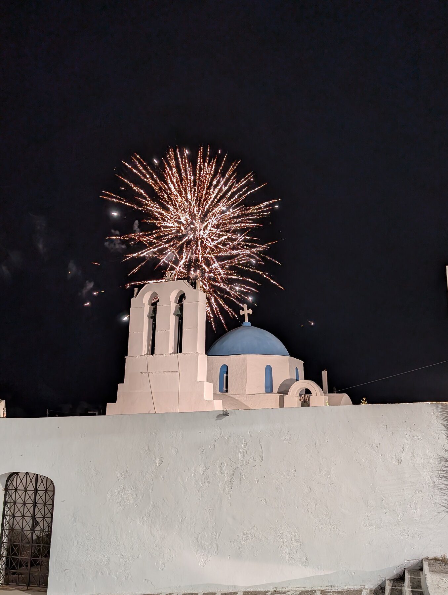
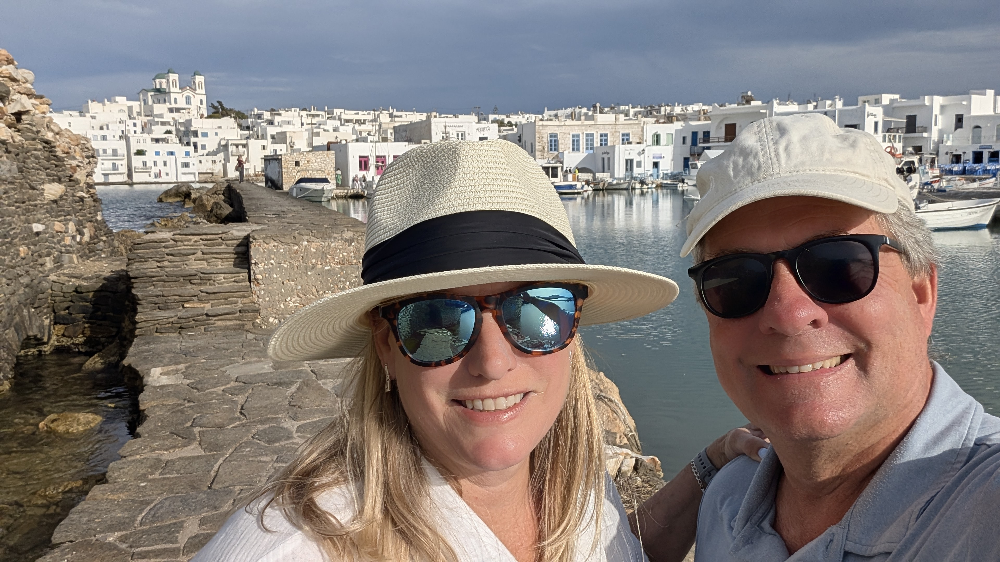
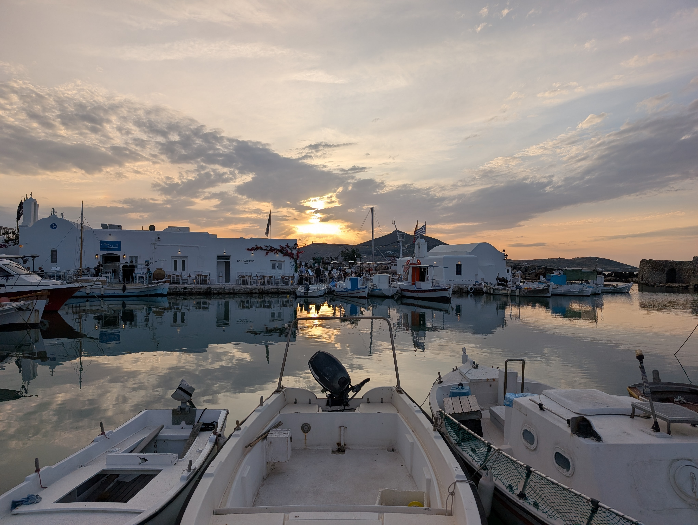
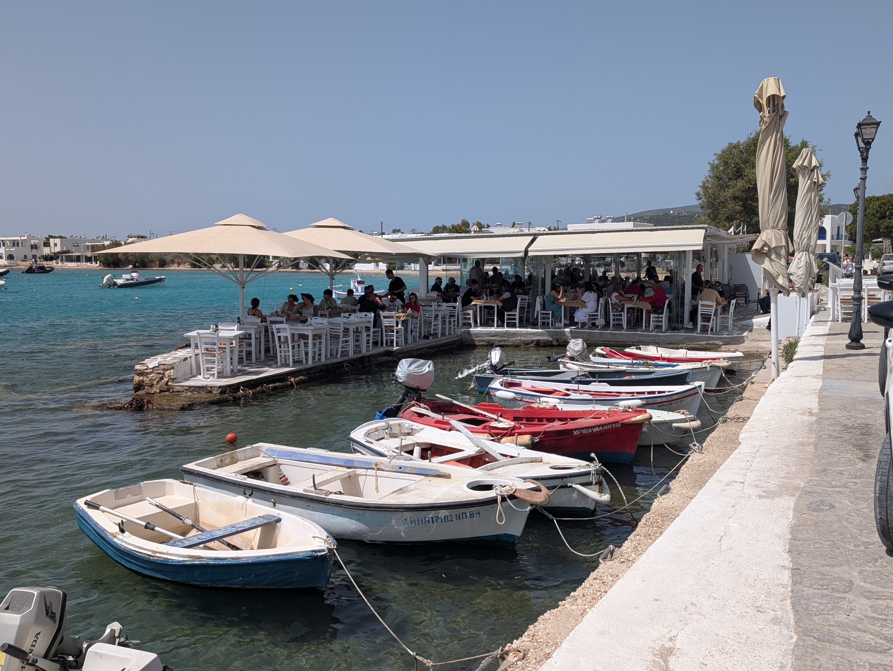
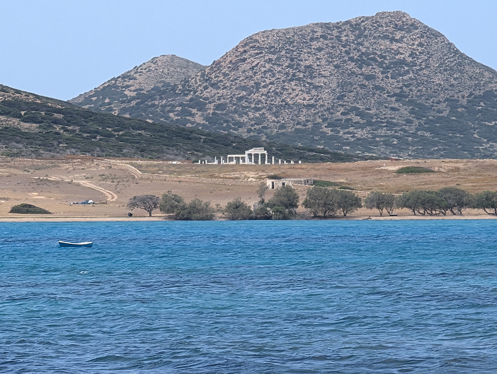
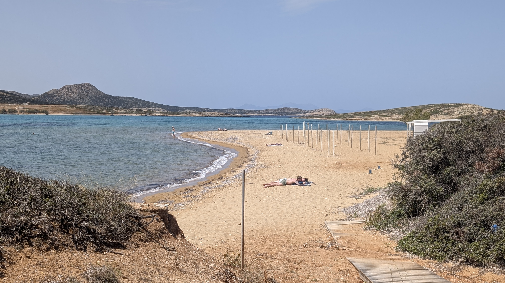
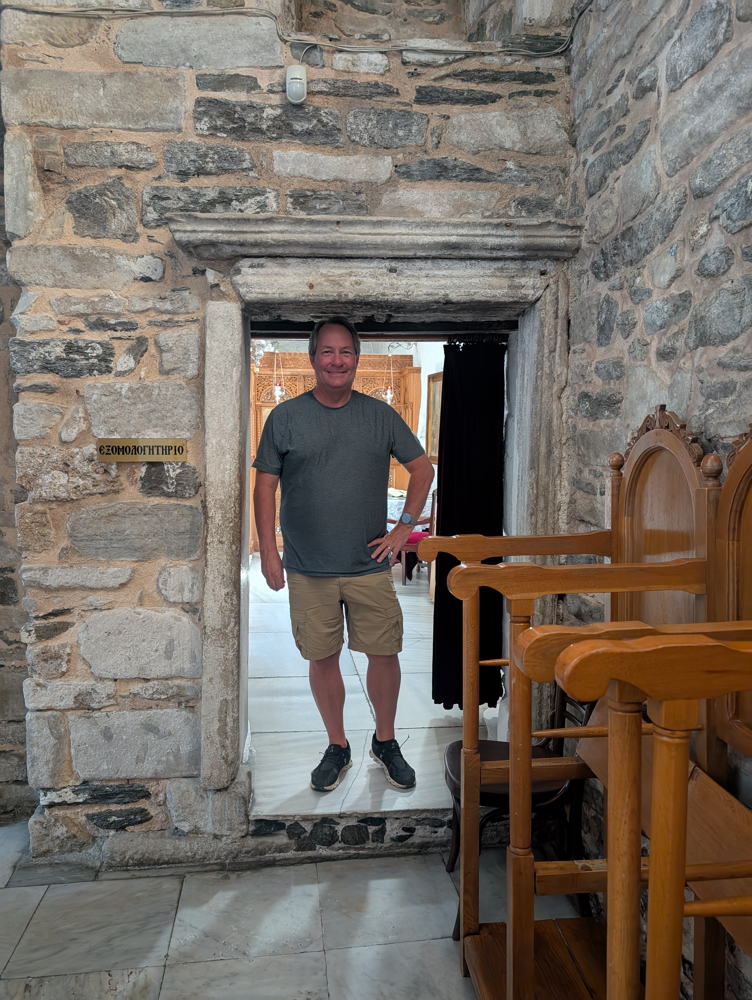
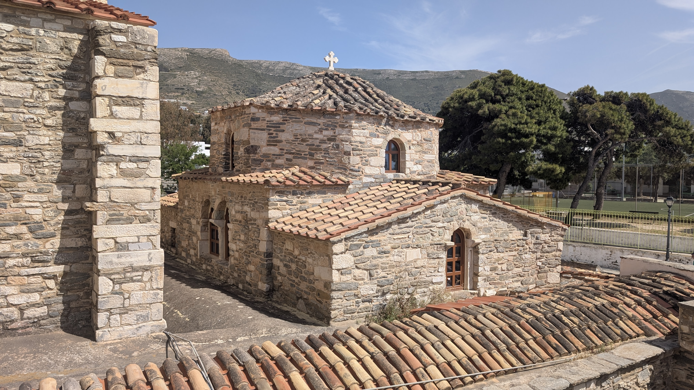
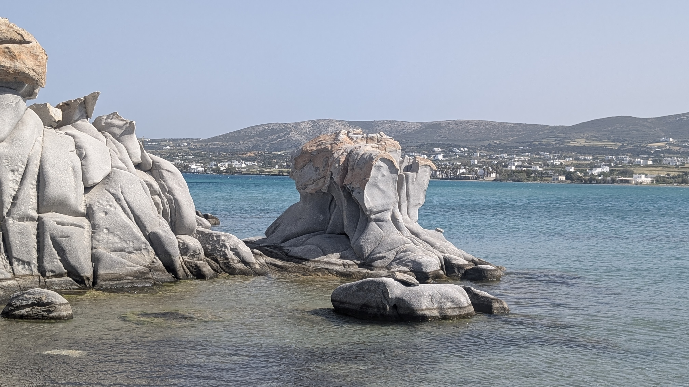
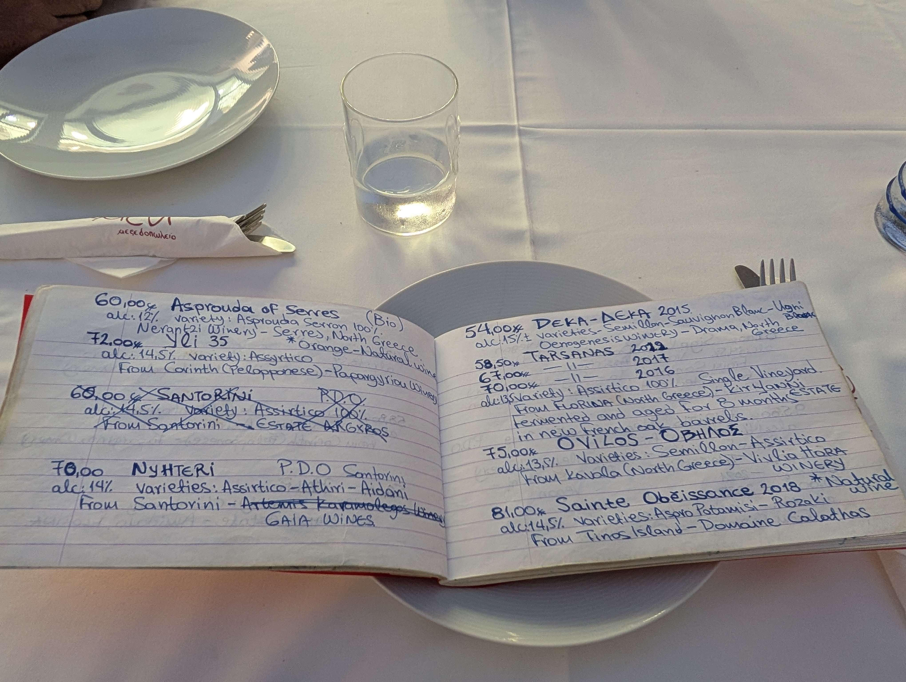

We spent a good bit of time before our trip trying to pick out one island to spend the longest time on, and picked Paros as a compromise between Milos (lovely, but small, not a ton to do) and places like Mykonos and Santorini that are over-discovered,  and were likely nicer a few decades ago.  There are so many others and we can’t compare all of them at all, but Paros
was a great spot and well worth 5 days there.  We had a car for 2 days and did a day trip (see separate pages) to Delos and Mykonos, but Paros is well-located so was an excellent base for the longest stretch of our Cyclades stay.

## Naoussa Port

Naoussa is a delightful town, seems much prettier than the ferry town of Parikia. 
The high-end resorts seem to be almost entirely clustered around Naoussa.

We stayed near Naoussa, and honestly spent quite a bit of time just hanging out around Naoussa which was excellent, especially on the heels of bouncing around on a cruise and then Milos/Santorini/Naxos the previous week.  It's just a near-perfect small town -- enough things to see to keep your attention, but very walkable and manageable.

## Things to See in Paros

We think it was 100% the right choice to rent a car, though per above we didn't need it for several days where our entire goal was just to hang out at Naoussa port. We rented a car for 2 days and wandered a lot, we saw quite a bit.  The island is large enough to be interesting but still pretty doable as day trips.
- Lefkes was well worth a visit, a small mountain town that is a bit touristy, but was very picturesque for us. We spent 1-2 hours just to wander and shop, longer depending on whether you eat a meal there (we didn’t).

- Aliki is a nice little beachy area with a bunch of nice restaurants right near the water.

- We went to ‘Golden Beach’ which fit under the category of “maybe it’s amazing when the beach clubs are open”, but didn’t blow us away in early May
- I wish we’d gone to the small village of Marpissa, I read about it later, but we sorta screwed up and missed it.
- We drove over to Antiparos (10-minute small car ferry, departs on the half-hour) which as promised was sleepy. There are quite a few beaches; some of which didn’t impress us a lot, but again it was offseason.
  - We drove the maybe 25 minutes from the ferry to “Plage Ag Georgios”, a smallish beach that’s about as far from the ferry as you can get on this small island. We ate right there at Mpakas Fish Tavern, which has a great view of the water. You can also from there see Despotiko, an uninhabited island with a newly-excavated Greek temple area that is from the 8thC BC (e.g., 400 years older than the Parthenon). 
  - There are a few “waterfront” taverna in Antiparos town, right near the ferry. We had a lunch at [Taverna Yorgi](https://www.tripadvisor.com/Restaurant_Review-g3569526-d6673076-Reviews-Taverna_Yorgi-Antiparos_Town_Antiparos_Cyclades_South_Aegean.html) maybe 250 yards inland on the main street, and found its atmosphere delightful, we saw locals (kids leaving school, etc) wandering and living their life more than one might see on the waterfront.

- The 5th-century part of “The Church of 100 Doors” is right near Paros town and was amazing, super early Christian church, very different feel from western European churches as it’s Orthodox. 

- Kolympethres beach has quite striking rock formations.

- Some friends visited a year before us and rented a bare boat to go around Paros on their own; we chose not to because we had some crazy windy days.  They rented it from [The Sailors Ride](https://thesailorsride.gr/our-boats/electra-compass-160e) – note smaller boats don’t require a license.

## Where We Stayed

We stayed at Avant Mar and highly recommend it – it’s a 5-8 minute walk from Naoussa, but feels a 
bit “resorty” (in a refreshing way) unlike many places in the Greek Islands – comfortable, nice pool (chilly when we were there), a nice beach with service, great staff. It opened in 2023, and feels it in a good way, very clean/modern.

## Food and Drink

We *loved* Yemeni restaurant in Naoussa – incredible Moussaka. It’s not “right on the water” like the 5-6 most-visible restaurants, so the view isn’t as special, but we went twice we liked it so much.

On the water, there’s a bar whose name I can’t find, but it’s right in front of Linardo (which is on Google Maps), right near where you walk out to the Venetian castle ruins. This is a perfect spot to watch the sun set over the water.   It’s this [location in Google maps](https://www.google.com/maps/place/Lydia's+Charming+House/@37.1250863,25.2380653,3a,75y,90.79h,90t/data=!3m8!1e1!3m6!1sCIHM0ogKEICAgIDu1M27JA!2e10!3e11!6shttps:%2F%2Flh3.googleusercontent.com%2Fgpms-cs-s%2FAB8u6HYjAocGF-8D9cIN-n5zhL7UIGkF1KO3Fh3qTarQaIXtNZBYzuDXh43VcNaLYku1uCKEA1rV-7BxL_hdZDGEoSAECadB2NtuFwQ1gsdJsUyKq0R4Psm7OdUkNtLIPnm4tyB-Bys%3Dw900-h600-k-no-pi0-ya90.79006991102646-ro0-fo100!7i5376!8i2688!4m6!3m5!1s0x149875fdcf0ff4ad:0xd4224d7849615f74!8m2!3d37.1201951!4d25.2390991!16s%2Fg%2F11rwx_7s7j?entry=ttu&g_ep=EgoyMDI1MDUxNS4wIKXMDSoASAFQAw%3D%3D), next to Barbarossa.  Nice staff at least in May 2025.

Siparos is a taxi ride (not a walk) from Naoussa, but had a great view for sunset, and was a great restaurant. Note that taxis around there are stupid expensive, if you want to drive it’d be better (depending on what you choose to drink with dinner), we didn’t have a car that evening.

Moraitis winery is a moderate-length walk from Naoussa, but was a very very nice experience.  It’s a very small family-owned business

Sakis Grill House was what I found searching for “best gyro in Mykonos”, and it sure is popular, and we thought it was excellent (gyros, souvlaki).

