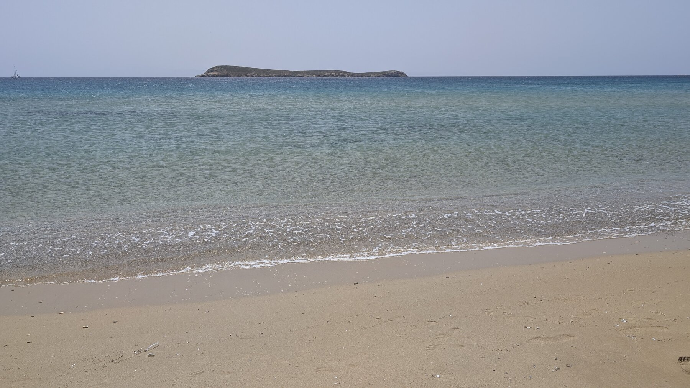
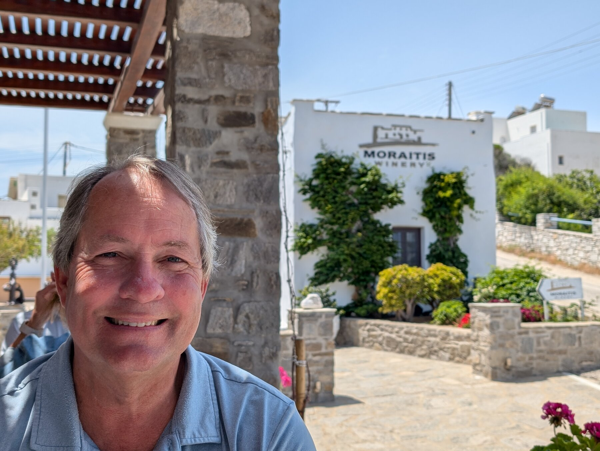

Paros was our deliberate choice for the longest stay in the Cyclades -- a place to stop island-hopping and see if one island could hold our attention for 5 days.  We chose it over Mykonos (too focused on glamor), Milos (geographically striking, but small), and Santorini (over-discovered).  

We did rent a car for 2 days, and separately made day trips to [Delos](delos.html) and [Mykonos](mykonos.html), but Paros justified its 5 nights as a natural home base in the Cyclades.  We spent several of our days barely leaving the tiny Naoussa port -- and didn't mind at all.   

## Naoussa Port

Naoussa trades the functional bustle of the Parikia ferry port for a more refined harbor: restaurants that justify their prices, whitewashed shops, and 14th-century Venetian ruins.

The Venetian fort is partially submerged, and at low tide we walked out to its weathered walls -- built to fend off Ottoman incursions, now slowly losing to the Aegean.   A few of Naoussa's restaurants sit inside repurposed Venetian warehouses -- the stone walls are original, even if the wine lists aren't.

Most of the higher-end villas and resorts sit in the north around Naoussa -- close enough to Parikia to be convenient, far enough to forget the ferry exists.

We stayed a 5-minute walk from the harbor. Most of 3 days unfolded within the compact grid -- shops, waterfront restaurants, nowhere to rush.  

> After a week bouncing between three islands, staying put felt like the point, not the compromise. Naoussa stayed interesting simply by repeating well -- the harbor at different light, the same few streets, the ever-present cats, dinners that blurred together in a good way.

From the fort, Naoussa looks like what it is -- a fishing village that dressed up without losing its essence.

## A Car Tour of Paros

We based ourselves in Naoussa but rented a car for two days to explore the rest of the island. Paros is large enough that the interior and the southern coast feel like different places -- worth the drive, especially since taxis are expensive.

Some stops held our attention for an afternoon; others told us what we needed to know in twenty minutes.

Lefkes is the island's highest village, found in the center of Paros.  Its main street is paved with locally quarried Parian marble -- high-purity stone that catches the sun and flashes underfoot.

The small central district is touristy, but unhurried compared to the coastal towns. We spent an hour or two wandering and shopping. We didn't stay for lunch, though the terrace views toward the Aegean tempted us.

## Beaches

Golden Beach didn't offer much in May -- a broad sandy stretch waiting for its beach clubs to open. Kolympethres and Aliki were different stories.

Aliki is a compact fishing village that feels more grounded than Naoussa. The restaurants here exist because the fishing fleet does.  We watched fishermen mending nets on the pier while someone grilled their morning catch a few steps away.

Kolymbithres beach stands out for its rock formations -- genuinely unusual.  Unlike the volcanic ash and pumice that form the white "lunar" landscape of Milos, Kolybpithres is defined by massive, silver-grey granite boulders that have been sculpted by the sea into smooth, abstract shapes.  

Rather than one long stretch, the beach is made up of several small, sandy pockets tucked between the boulders.  Because it is tucked into a deep bay, the wind is noticeably lighter, and the water flatter.

We missed Marpissa entirely -- a hilltop village we only read about after leaving. Based on what we've seen since, it's the one stop we'd add next time.

## The Ancient Heart of Paros

Back in Parikia, one stop justifies the detour.  The Panagia Ekatontapiliani, aka "The Church of 100 Doors" is at the edge of town.  

The oldest section of this Christian church likely predates the adoption of Christianity as the state religion of the Roman Empire in 391.  As the complex has evolved, it has become a visual record of PaleoChristian, Byzantine, and post-Byzantine styles. 

The entire complex is architecturally dense.  But it is the 4th-century crypt that stops you. Low-ceilinged and unadorned. The air is cooler, the silence is heavier, and you realize you are standing in a space that has survived nearly 1,700 years of change.

## Antiparos: Paros' Small Drivable Neighbor

Antiparos is a 10-minute car ferry from Paros, running every half hour, but it operates on a different clock entirely. The shift is immediate -- fewer choices, less structure, and no real sense of itinerary. Even Naoussa starts to feel polished by comparison.

Antiparos' small beaches blurred together in early May -- no chairs, no services, nothing to anchor a stop.

We drove the 25 minutes from the ferry to "Plage Ag Georgios", a smallish beach that's about as far from the ferry as you can get on this small island.

 We enjoyed a drink at Mpakas Fish Tavern, which has a sand-in-the-toes intimacy that most of Paros and Antiparos can't match.
 
From the tavern tables, the view settles on Despotiko -- a scrub-covered ridge that looks desolate until you spot the white marble of the Sanctuary of Apollo. It is an Archaic site from the 8th Century BC, predating the Parthenon by four centuries. 

> We sat with cold drinks, staring at a religious center that was already ancient when Socrates was born.  

We skipped the short boat ride over -- likely an oversight.

 

  Lunch at [Taverna Yorgi](https://www.tripadvisor.com/Restaurant_Review-g3569526-d6673076-Reviews-Taverna_Yorgi-Antiparos_Town_Antiparos_Cyclades_South_Aegean.html), 250 yards inland on the main street, gave us something the waterfront didn't -- kids leaving school, locals wandering unhurried. It felt like a town, not a destination.  In small doses, this is exactly the appeal -- but also what made us happy to base ourselves back in Naoussa.

## Where We Stayed

We stayed at [Avant Mar](https://www.avantmar.com/), a 5-8 minute walk from Naoussa. It's high-end -- pool, quiet beach, attentive staff.  It opened in 2023 and still feels it -- Parian marble, clean lines, everything gleaming.  After a week of charming but small Cycladic hotels, Avant Mar's polish and personalized service were welcome for 5 nights.

Avant Mar arranged our rental for us -- pickup and dropoff right in the hotel lot.

## Food and Drink

Paros eats better than its size suggests, but more importantly it eats easily. In Naoussa especially, good options cluster tightly -- in May, you can walk, look around, and settle in without much planning.

Dinner at Yemeni in Naoussa confirmed why it's hard to get a seat.  The moussaka gets its weight from a bechamel so thick and savory, it transforms the entire dish.

Yemeni is not "right on the water" like the 5-6 most-visible restaurants, so the view isn't as special.  But we went twice; we liked it that much.

Our favorite sunset seat in Naoussa was the unnamed bar between Linardo and Barbarossa -- right where the walkway leads toward the Venetian ruins.  The view stacks well -- brightly colored fishing boats, harbor, then open water catching the last light.  See [this location](https://bit.ly/4uAT3YP).  Attentive staff when we visited.

Siparos has a tranquil location on the water's edge just a short taxi ride from Naoussa.  Book a table at sunset for its premier views across the bay, and select a fresh-caught whole fish. Drive if you can -- we couldn't that evening, and paid for it.

Moraitis winery is a 10-minute walk inland.  Family-run, and unhurried -- the tasting felt personal rather than transactional.  The wines were some of the better Malagousia and Assyrtiko we tasted in the Cycladic islands.

## How Paros Works

Naoussa is the right base unless ferry logistics force you toward Parikia. Rent a car for a couple of days -- enough to see the interior and a few beaches -- then return to walking. Taxis are expensive enough to make the rental worthwhile.

The island rewards a loose grip on the itinerary. Pick one or two destinations each day, leave space around them, and don't overthink dinner -- in Naoussa, a short stretch of harbor will take care of most evenings. Choose your sunset spot early and stick with it.

We came to Paros planning to slow down, and the island rewarded us for it. Naoussa's compact grid never got boring -- it just got familiar, which is different. We left knowing we'd missed things (Marpissa, much of Antiparos), and that felt fine. Paros suits the traveler who wants the Cyclades without the performance -- good food, good light, real towns, and no pressure to prove you've seen everything. A good island doesn't demand completeness. It makes you want to come back.

:::nutshell Paros
verdict: Would Plan Around
duration: 5 days
Stay Overnight: Avant Mar near Naoussa -- resorty in a refreshing way, easy walk to town, opened 2023.
Don't Miss: Naoussa port at sunset; Lefkes mountain village; 4th-Century crypt at the Church of 100 Doors; Yemeni restaurant.
Best Time of Day: Late afternoon into sunset at the waterfront bar near the Venetian fort.
Worth the Splurge: Avant Mar Executive Suite
Return Visit: Yes -- we missed Marpissa and barely explored Antiparos.
:::

