Paros was our deliberate choice as the Cycladic island to spend the longest, and slow the pace. We chose it over Mykonos (too focused on glamor), Milos (lovely, but small), or Santorini (over-discovered). Then we spent three of our five days barely leaving the tiny Naoussa port — and didn't mind at all. We did rent a car for two days and made day trips to [Delos](delos.html) and [Mykonos](mykonos.html), but Paros earns its place as the natural home base for this stretch of the Cyclades.  

## Naoussa Port

Naoussa is a delightful town, far more attractive than the ferry town of Parikia. 
The high-end resorts of Paros are largely clustered on this Northern part of the island, only a 15-minute drive from the ferry.

We stayed at a hotel that was a 5-minute walk from Naoussa, and spent a lot of time just hanging out around the shops and sites of Naoussa Port.  Staying in one place was just what the doctor ordered, especially on the heels of bouncing around on a cruise for 10 days and then Milos, Santorini, and Naxos the previous week. Naoussa has enough to see and do to keep your attention, but remains walkable and manageable.

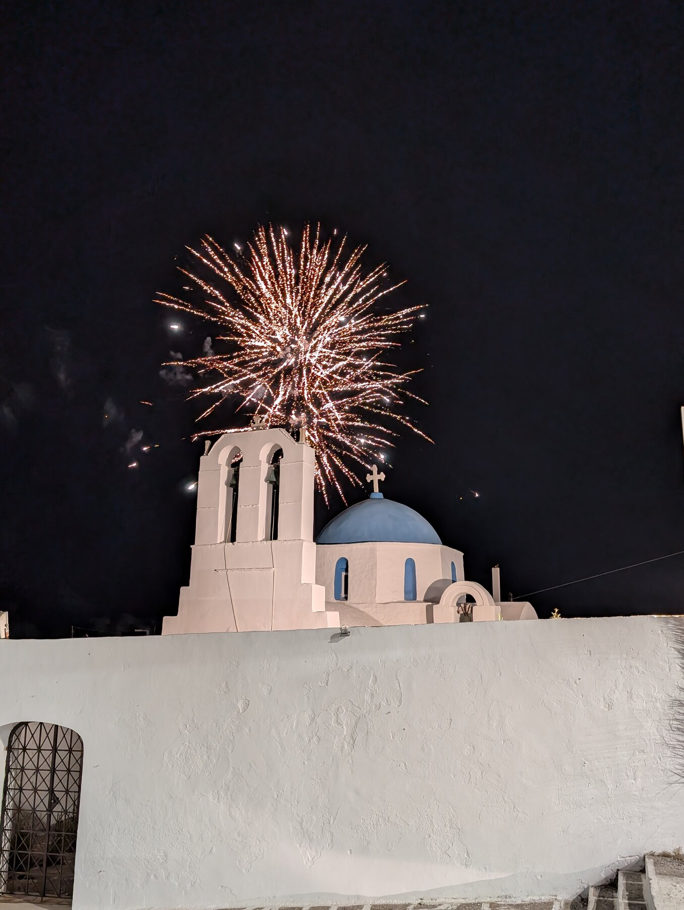

Near Naoussa is a 14th-century Venetian fort; this is the view of Naoussa port from that fort.  

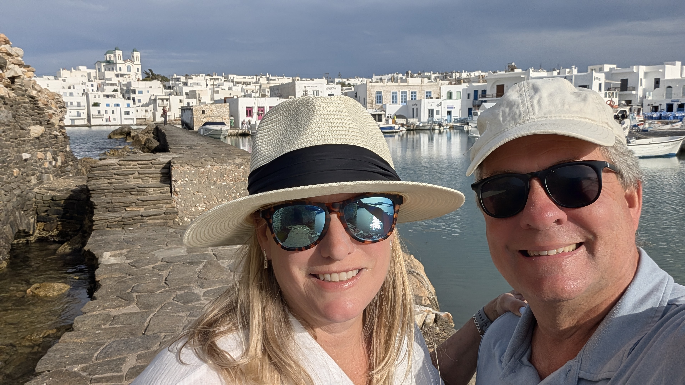

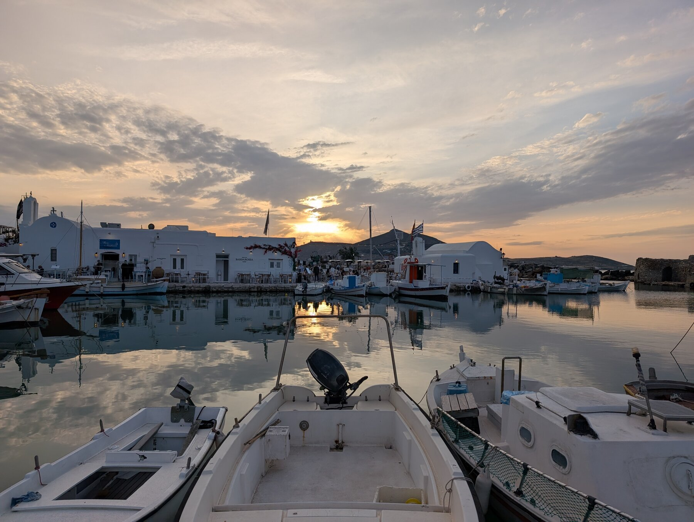

## A Car Tour of Paros

While we spent several days walking around Naoussa, we were happy to rent a car for two middle days.  The island is large enough to be interesting but still worth visiting with day trips.

Lefkes is a small mountain town in the center of Paros.  Its small central district is touristy, but was very picturesque for us. We spent 1-2 hours just to wander and shop, we did not stay for lunch but there were many spots that looked excellent.

Aliki is a nice little beachy area with a cluster of seaside restaurants.

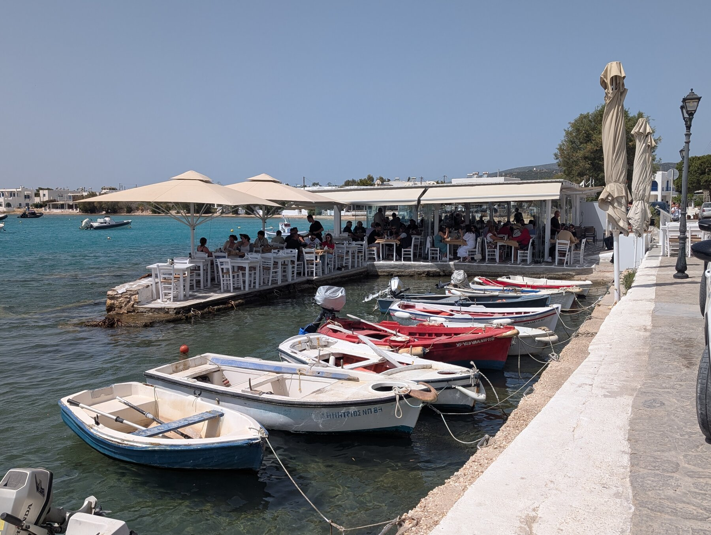

We went to ‘Golden Beach’ which fit under the category of “maybe it’s special when the beach clubs are open”, but didn’t blow us away in early May.

Kolympethres beach has quite striking rock formations.

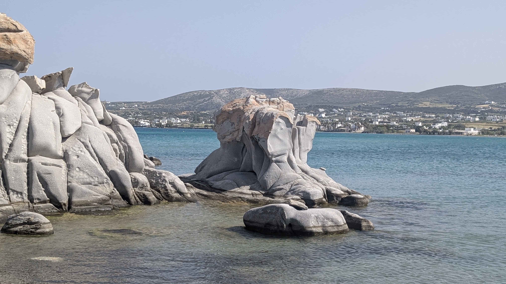

I wish we’d gone to the small village of Marpissa, I read about it later, but we missed it, an oversight we regret.

The Panagia Ekatontapiliani, aka “The Church of 100 Doors” is right near Paros town.  It's a very early Christian church, with oldest features that likely predate the adoption of Christianity as the state religion of the Roman Empire in 391.  As the complex has evolved over the centuries, it is now a mix of PaleoChristian, Byzantine, and post-Byzantine styles.  The entire complex is beautiful, but the most compelling part is the crypt, believed to date from the 4th century.  

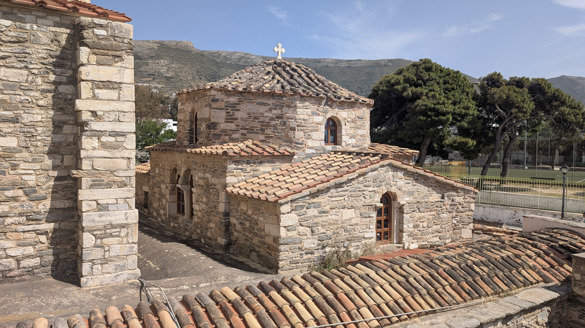

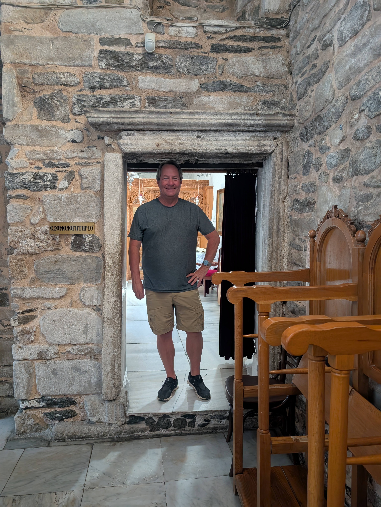

Some friends visited a year before us and rented a bare boat to go around Paros on their own; we didn't really have this option because our days were mostly too windy for calm boating.  They recommend [The Sailors Ride](https://thesailorsride.gr/our-boats/electra-compass-160e) – note smaller boats don’t require a license to self-drive.

## Antiparos: Paros' Small Drivable Neighbor

Antiparos is a 10-minute ride on the small car ferry, which departs on the half-hour.  Antiparos was as promised sleepy; it's famous for being a hiding place for such A-listers as Tom Hanks (who has owned a villa there since 2004), Matthew McConaughey, Madonna, and Springsteen. It makes Paros feels like Santorini -- the infrastructure is modest, but the views are beautiful.

Antiparos features quite a few small beaches.  Many of these didn’t impress us a lot in early May, but as we said about all the islands, it was before the season started so the chairs and services were not in evidence.  We drove the 25 minutes from the ferry to “Plage Ag Georgios”, a smallish beach that’s about as far from the ferry as you can get on this small island.

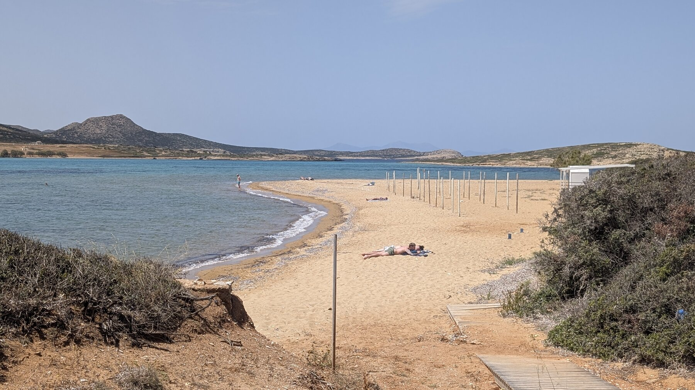

 We ate right there at Mpakas Fish Tavern, which has a great view of the water. From the tavern, one can gaze at Despotiko, an uninhabited island with a newly-excavated Greek temple area that is from the 8thC BC (e.g., 400 years older than the Parthenon). 

 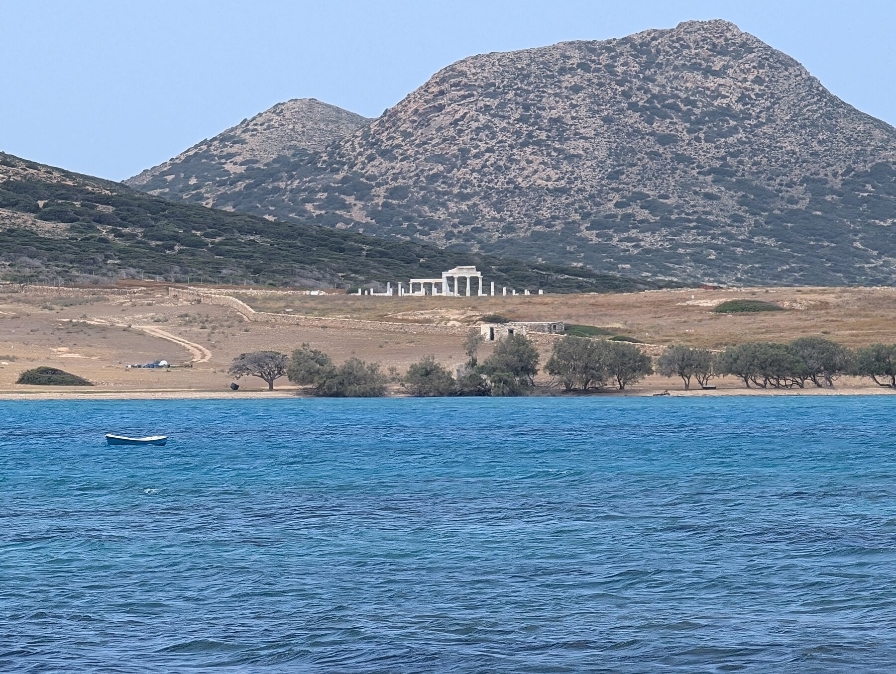

  
  > We had a lunch at [Taverna Yorgi](https://www.tripadvisor.com/Restaurant_Review-g3569526-d6673076-Reviews-Taverna_Yorgi-Antiparos_Town_Antiparos_Cyclades_South_Aegean.html) 250 yards inland on the main street, and found its atmosphere delightful, we saw locals (kids leaving school, etc) wandering and living their life more than one might see on the waterfront.

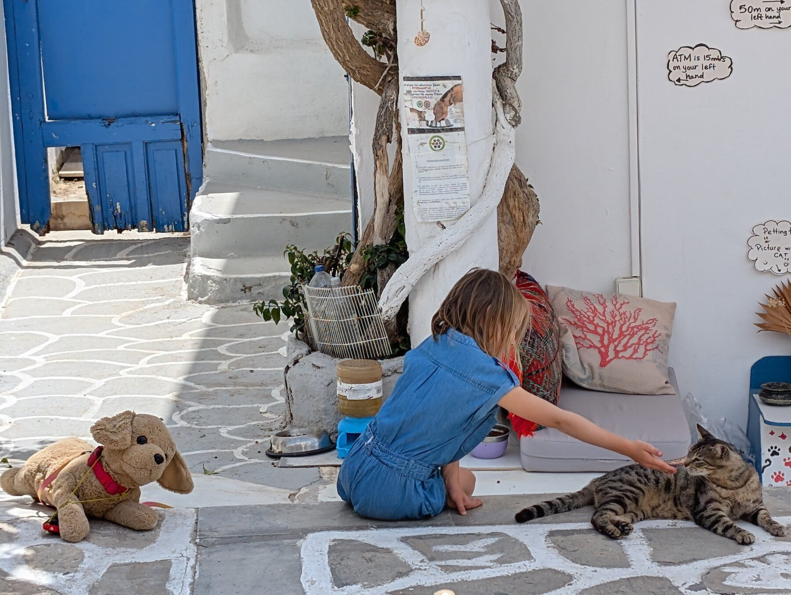

## Where We Stayed

We stayed at Avant Mar and highly recommend it – it’s a 5-8 minute walk from Naoussa, but feels a 
bit “resorty” (in a refreshing way).  Unlike many other places we stayed in the Greek Islands, it is modern and comfortable, with a nice pool (though chilly when we were there), a nice beach with service, and great staff. It opened in 2023, and feels it in a good way, everything is still gleaming.

## Food and Drink

We *loved* Yemeni restaurant in Naoussa – incredible Moussaka. 

> Yemeni is not “right on the water” like the 5-6 most-visible restaurants, so the view isn’t as special, but we went twice we liked it so much.

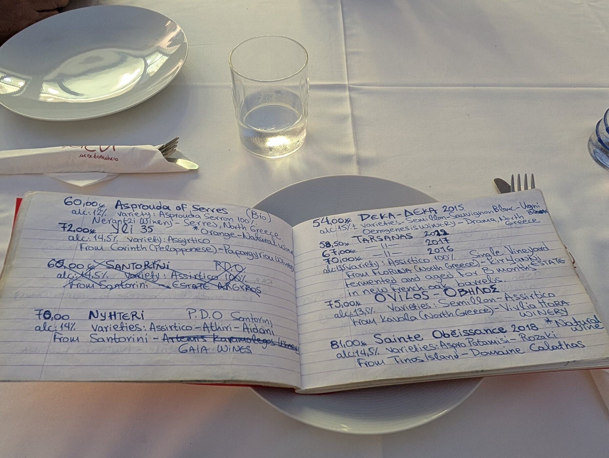

On the water, there’s a bar whose name I can’t find, but it’s right in front of Linardo (which is on Google Maps), right near where you walk out to the Venetian castle ruins. This is a perfect spot to watch the sun set over the water.   It’s this [location in Google maps](https://www.google.com/maps/place/Lydia's+Charming+House/@37.1250863,25.2380653,3a,75y,90.79h,90t/data=!3m8!1e1!3m6!1sCIHM0ogKEICAgIDu1M27JA!2e10!3e11!6shttps:%2F%2Flh3.googleusercontent.com%2Fgpms-cs-s%2FAB8u6HYjAocGF-8D9cIN-n5zhL7UIGkF1KO3Fh3qTarQaIXtNZBYzuDXh43VcNaLYku1uCKEA1rV-7BxL_hdZDGEoSAECadB2NtuFwQ1gsdJsUyKq0R4Psm7OdUkNtLIPnm4tyB-Bys%3Dw900-h600-k-no-pi0-ya90.79006991102646-ro0-fo100!7i5376!8i2688!4m6!3m5!1s0x149875fdcf0ff4ad:0xd4224d7849615f74!8m2!3d37.1201951!4d25.2390991!16s%2Fg%2F11rwx_7s7j?entry=ttu&g_ep=EgoyMDI1MDUxNS4wIKXMDSoASAFQAw%3D%3D), next to Barbarossa.  Nice staff at least in May 2025.

Siparos was a great restaurant a short taxi ride (not a walk) from Naoussa.  It had great sunset views. Note that taxis around there are quite expensive, if you want to drive it’d be better (depending on what you choose to drink with dinner), we didn’t have a car that evening.

Moraitis winery is a moderate-length walk from Naoussa, but was a very nice experience.  It’s a very small family-owned business with friendly staff, and a lovely view of their small vineyard.

:::nutshell Paros
verdict: Would Plan Around
Stay Overnight: Avant Mar near Naoussa — resorty in a refreshing way, easy walk to town, opened 2023.
Don't Miss: Naoussa port at sunset; Lefkes mountain village; the Church of 100 Doors.
Best Time of Day: Late afternoon into sunset at the waterfront bar near the Venetian fort.
Worth the Splurge: Dinner at Yemeni — the moussaka was good enough to go twice.
Return Visit: Yes — we missed Marpissa and barely explored Antiparos.
:::

