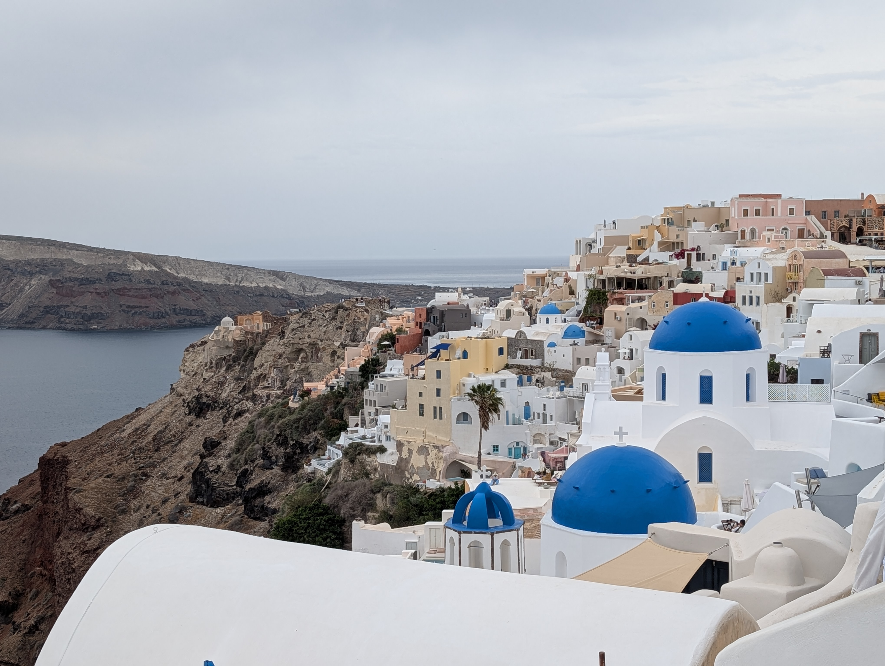
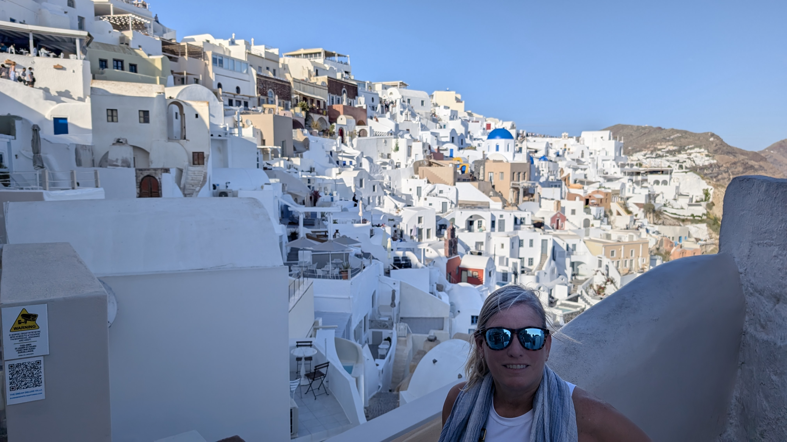
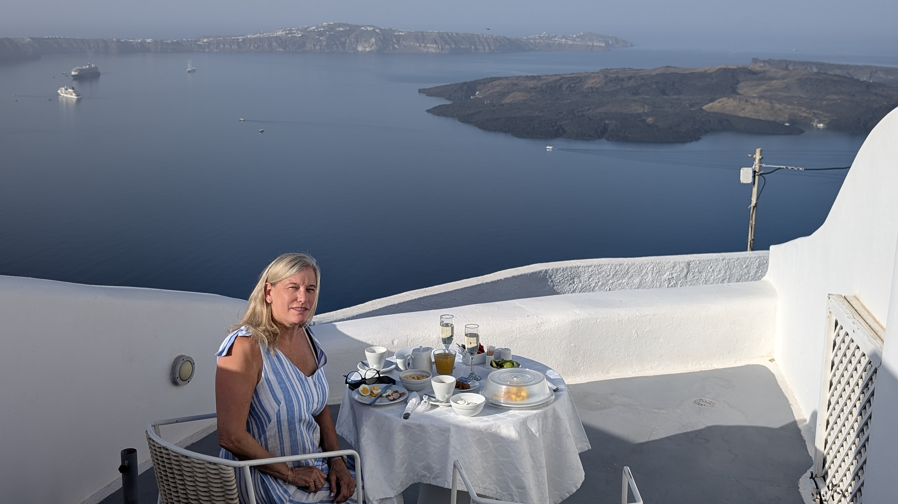
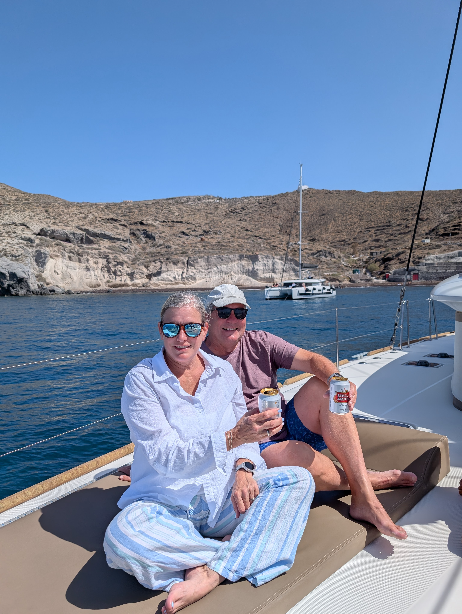
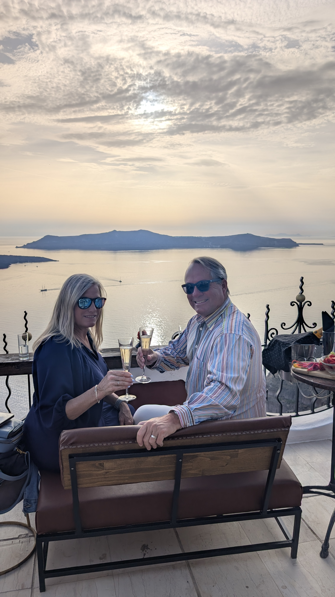
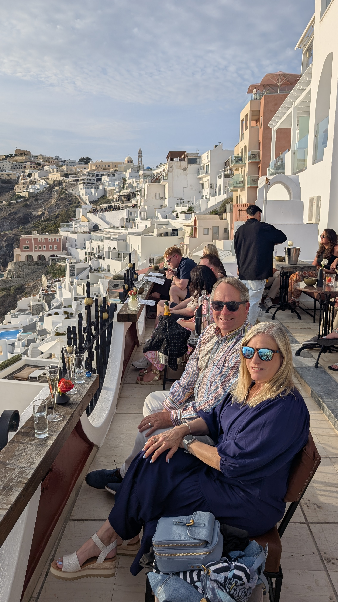

Santorini is extreme in all ways.  It is absolutely over-run with tourists — we were there the first week of May and it was still crowded.  But it really is one of the most unbelievable sets of gorgeous sights we have seen anywhere.  We can’t recommend it enough — but yes avoid the highest peak seasons.

Santorini is the remnants of a collapsed volcanic caldera, from a large eruption circa 1600 B.C. that likely accelerated or caused the collapse of the Minoan culture centered in Crete.  Most of the tourist areas are found perched on the rim of the caldera, so the 3 main towns of Oia, Fira, and Imerovigli are narrow and stretched out along a thin ribbon.  When you arrive by ferry (how most arrive, though there is a small airport), you take either a taxi or a bus up a long windy road from the waterside up to the towns.  

Oia vs Fira – Oia really is disneyland/vegas-ish (no one lives there, all restaurants/hotels/shops), but damn it’s spectacular, far more we thought than Fira. Many/most of the classic photos that say ‘Santorini” are from Oia.

If you’re into taking some of the ‘classic’ angle photos in Oia, they’re not right on the main path and were surprisingly tricky to find, watch this [video](https://www.youtube.com/watch?v=nWoZJjqbdHQ) (the creator has an analogous video for [Fira](https://www.youtube.com/watch?v=zdWbX0SMdlg)). In Oia you won’t get any of the best shots from the main walkway, you need to take just the right alley 50 yards to see things.

## Where we Stayed

We stayed in Dreams Luxury Suites between Fira and Imerovigli – the view is incredible, the breakfast wonderful, but I’m not sure we’d choose it again, it was a good 20-25 minute walk from Fira so there’s not much “right there”.  Honestly I think if we did it again we’d stay in Oia, it’s just that gorgeous – but Fira is more centrally located depending on your agenda.

## Getting Around in Santorini
We opted out of driving in Santorini, the small towns look hectic, but note that taxis are *quite* expensive (35 euros from Fira to Oia).

## What to do in Santorini

We highly recommend the catamaran cruise; we chose [Spiridakos](https://www.santorini-yachts.com/) that was just top notch, but some friends did Sunset Oia the previous year and loved that too. I think many of the companies do 4 hours, which was plenty.  You start from south of the main Caldera and go into it — but it’s really not that far of a trip.

A standard thing to do is to walk from Fira to Oia (that direction because it’s more downhill than up). We opted out of the 3-4 hour hike, this author’s knees are unpredictably achy on long hilly hikes.

There are several wineries in Santorini, and the practice goes back thousands of years there so we highly recommend it.  
  - [Vassaltis](https://vassaltis.com/) winery is the closest to Fira and Oia, it was recommended to us and we enjoyed it very much, both nice comparison tastings and also nice place to just have a glass of wine. 
  - Santo Wines is on the rim so is the most popular; we didn’t go but one sommelier we met (great guy who works at Kaliya in Fira) said it’s better for the views than the  wine. May be a good visit for the view, we don’t know.
  - That same sommelier said he recommended Argyros, Gavalas, and Hatzidakis (in addition to Vassaltis). We have no idea if any of these are any good; they’re further south so not quite as accessible to Fira/Oia.
  - Santorini has a unique centuries-old basket technique for that protects grapes from a brutal sun/wind/soil combination. Fascinating to learn about.

## Where to Eat or Drink
There are innumerable bars/restaurants that are perched on the rim for sunset viewing – if you have multiple nights, I recommend taking one sunset each maybe for Fira, Oia, and Imerovigli, because each has a different angle and each is nice in its own way.
  - [PK Bar](https://pkbar.com/) is in Fira, and has incredible views for sunset. There are many spots in Fira that are great, but PK is sorta thrust ‘forward’ from the others and seems to be particularly awesome, we booked ahead for the champagne-front-row option, which was expensive but spectacular/romantic. 
  - Imerovigli actually has arguably the best view because it’s highest (1100 feet elevation, vs only 450 or so in Oia), and from Iverovigli you can see Oia (you can’t see Oia from most spots in Fira). We enjoyed a sunset from “Wine Bar”, a hotel bar but quite nice.

