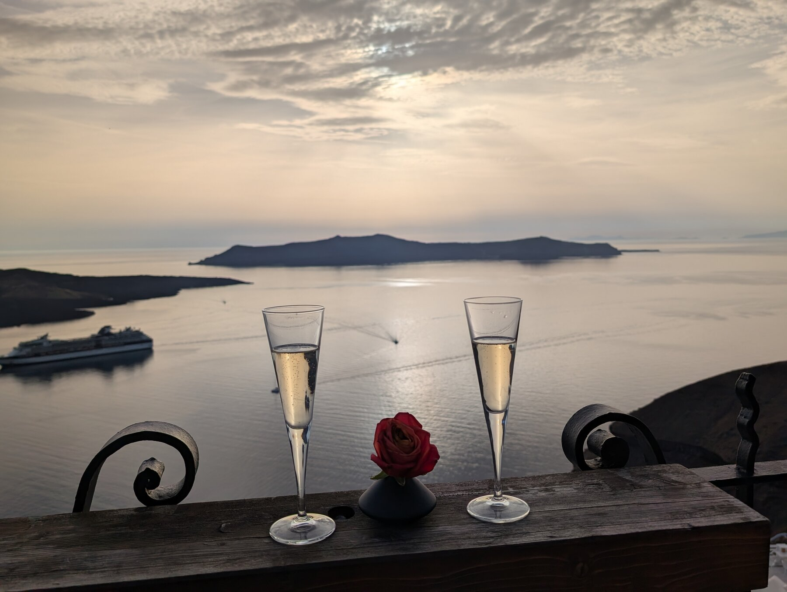
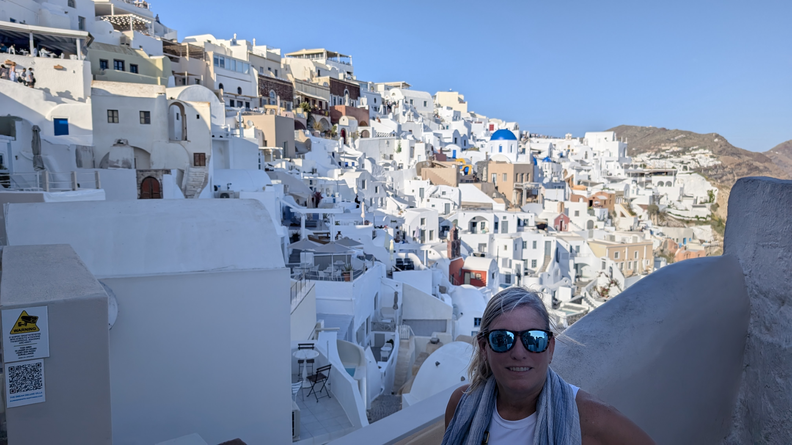
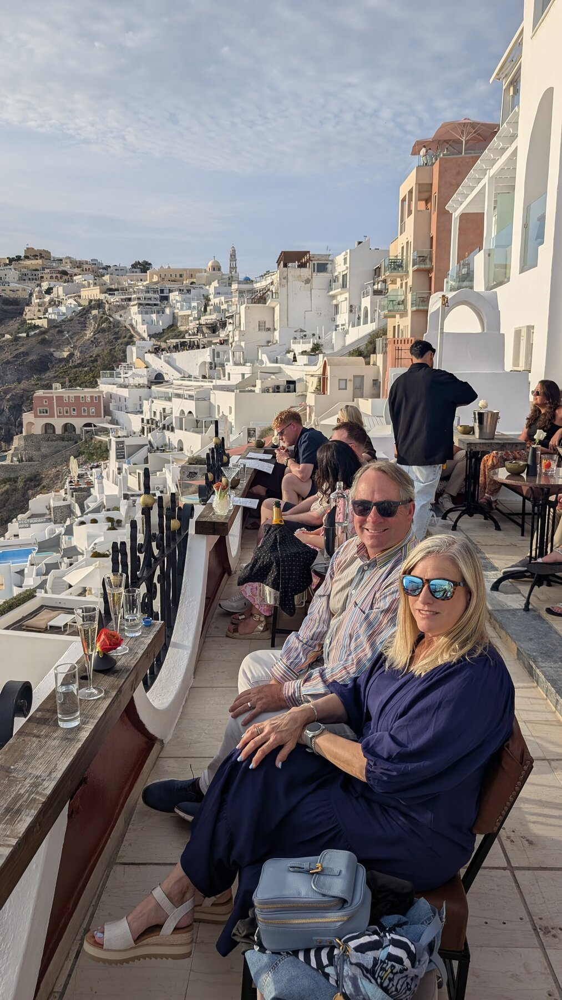

Santorini is the rim of a collapsed volcanic caldera, formed by a large eruption circa 1600 B.C.  That event likely accelerated the collapse of the Minoan culture centered nearby in Crete.  

Most of the tourist areas sit perched on the rim of the caldera, so the three main tourist towns of Oia, Fira, and Imerovigli are narrow and stretched out along a thin ribbon.  Santorini is a view-driven destination; your choices should optimize for (1) rim time, (2) sunsets, (3) one water day.

There's a small airport, but most visitors arrive by ferry. When you arrive at the ferry port, you take either a taxi or a bus up a long switchback road from the waterside up to the rim and the towns.  

> Santorini is extreme in all ways.  

It is over-run with tourists -- we were there the first week of May and it was still crowded.  But the view from the rim -- the 20th-century volcanic cone rising from pristine Mediterranean hundreds of feet below, surrounded by white buildings on the steep hillside -- is like nowhere else on earth.  During shoulder season, three nights allowed us to cover what we wanted before the summer heat and hordes arrive.

## Oia, Fira, and Imerovigli

Oia is a stage set now -- it's all restaurants, hotels, and shops packed onto a narrow rim path.  A local we met from Imerovigli, a 20-minute drive away, said that she hadn't visited Oia for years, because it's "all for tourists".  Sadly, like many European tourist hot-spots, Oia is now nearly entirely unpopulated, as residents move to more affordable parts of the island.  

> But the city's location clinging to the hillside makes it the jewel of the island, far more we thought than Fira or Imerovigli. Most of the classic photos you have in mind that say "Santorini" are from Oia.

Oia's white-washed buildings are interrupted by the blue-domed churches you've seen in photographs -- far less common in Fira.  The village has a layered view.  The descent from the rim is gentler, with buildings stacked down the hillside and narrow alleys between them.

Finding the classic blue-dome Oia shots requires moving off the main Oia walkway and a guide; this [video](https://www.youtube.com/watch?v=nWoZJjqbdHQ)  is the most helpful map for those paths.  The creator has an analogous video for [Fira](https://www.youtube.com/watch?v=zdWbX0SMdlg). 

Fira and Imerovigli are each lovely in their own right.  

Imerovigli, near where we stayed, is the highest of the three cities, perched over 1000 feet above the Mediterranean below, and from many places one can see Oia, which is not true of Fira further south.

Fira is far more developed, it has a long walkway filled with tourist shops and cafes.  While Fira has some outstanding views, they are more of the sea and less of the village.

Santorini is not a large island, and most visitors spend their time moving between these three towns and a handful of activities around the caldera. A few practical choices -- how you get around, whether to go out on the water, and where to watch sunset -- shape the experience more than any single attraction.

## Getting Around in Santorini
We opted out of driving in Santorini, the small towns look hectic, but note that taxis are *quite* expensive (35 euros from Fira to Oia).

## Beyond the Rim Towns

We recommend a catamaran cruise.  From the deck of a catamaran, the volcanic cone is no longer a distant center-piece. Seeing the island from the water resolves the scale of the cliffs in a way that staying on the rim cannot.  

We chose [Spiridakos](https://www.santorini-yachts.com/); the operation felt well-run and unhurried. Some friends chose Sunset Oia the previous year and loved that too. The companies we researched schedule 4 hours twice daily, which was an excellent time frame.  You start from south of the main caldera and go into the caldera for the sites above -- but it's really not that far of a trip so more than 4 hours would be overkill.

A standard thing to do is to walk from Fira to Oia (that direction because it's more downhill than up). We opted out of the 3-4 hour hike; if hills aggravate your knees, it's a commitment.

Wine-making here goes back thousands of years, so we recommend visiting a winery.  Santorini has a unique centuries-old basket technique that protects grapes from a brutal sun/wind/soil combination. Worth asking about when you stop at any local winery.

[Vassaltis](https://vassaltis.com/) winery is the closest to Fira and Oia, it was recommended to us and we enjoyed it very much.  It has horizontal tastings of various Greek white varietals and views of their vineyards. 

Santo Wines is on the rim and most popular -- one local sommelier told us it's better for the views than the wine, so we did not visit it. The same sommelier recommended Argyros, Gavalas, and Hatzidakis; all are further south and less accessible from Fira or Oia.

## Where we Stayed

We stayed in Dreams Luxury Suites between Fira and Imerovigli -- the view is spectacular and the breakfast wonderful, but we'd choose differently next time.  It is a 20-25 minute walk from Fira so there's not much "right there" at the hotel.  

If we visited Santorini again we'd pick based on what you want right outside your door.  We'd stay in Oia, it's just that gorgeous -- but Fira is more centrally located depending on your agenda.

## Where to Eat or Drink

There is a dense ribbon of bars and restaurants that are perched on the rim for sunset viewing -- if you have multiple nights, I recommend taking one sunset at each town; Imerovigli for height, Oia for the architecture, and Fira for the central vantage point.

[PK Bar](https://pkbar.com/) is one of many "view" bars in Fira, but PK sits on a promontory that thrusts the seating forward from the rest of the Fira rim.  We booked weeks ahead for the champagne-front-row option, which was expensive but worth it for the romantic late afternoon. 

Imerovigli actually has arguably the best view because it's highest (1100 feet elevation, vs only 450 or so in Oia), and from Imerovigli you can see Oia (you can't see Oia from most spots in Fira). We enjoyed a sunset from "Wine Bar", a hotel bar but well-placed for sunsets.

:::nutshell Santorini
verdict: Would Plan Around
duration: 2 days
Stay Overnight: Multiple nights -- you want separate sunsets from Oia, Fira, and Imerovigli, each with a different angle.
Don't Miss: Catamaran cruise with Spiridakos; front-row sunset at PK Bar in Fira.
Best Time of Day: Sunset, obviously -- but each town catches it differently.
Worth the Splurge: Front-row champagne at PK Bar; the Spiridakos catamaran.
Return Visit: Yes -- we'd stay in Oia next time. It's Disneyland, but spectacular Disneyland.
:::

