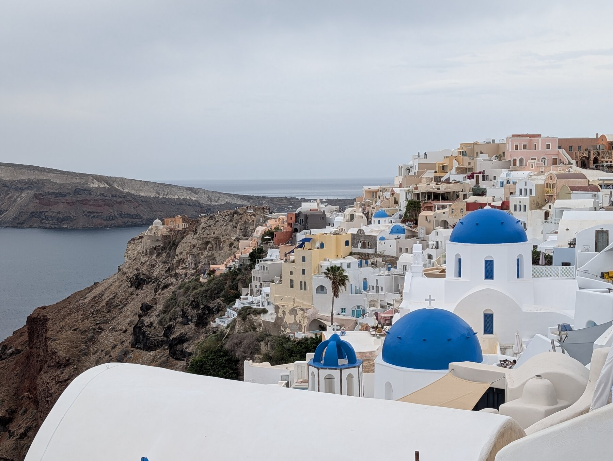
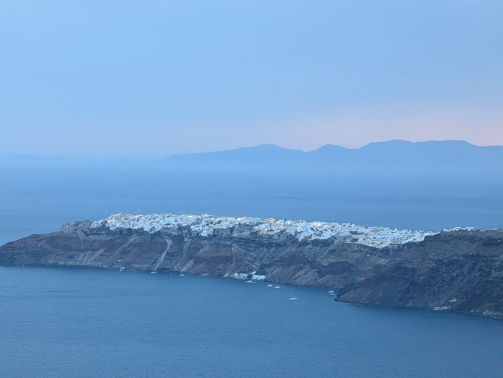
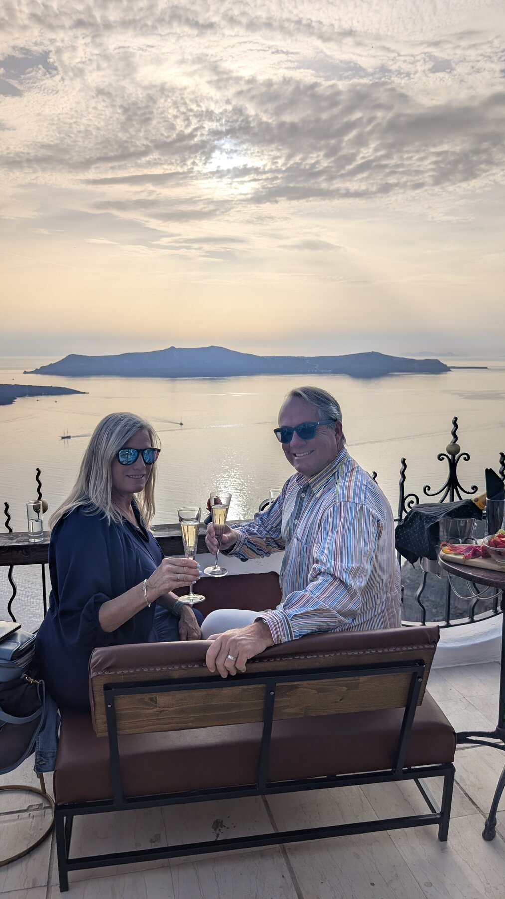
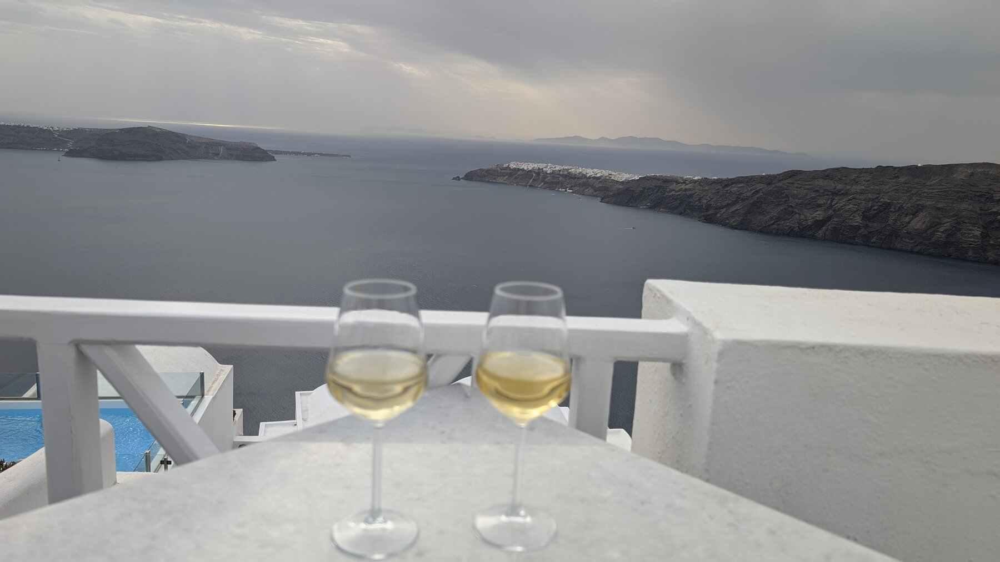
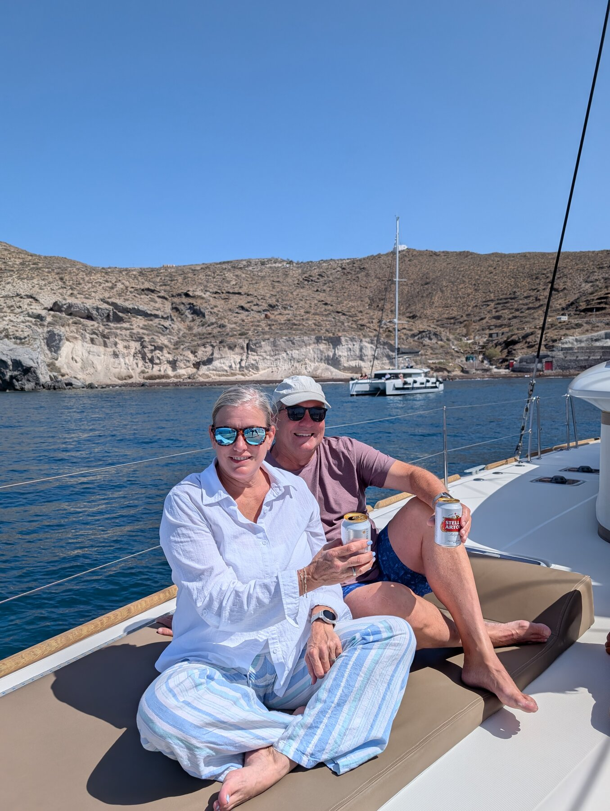
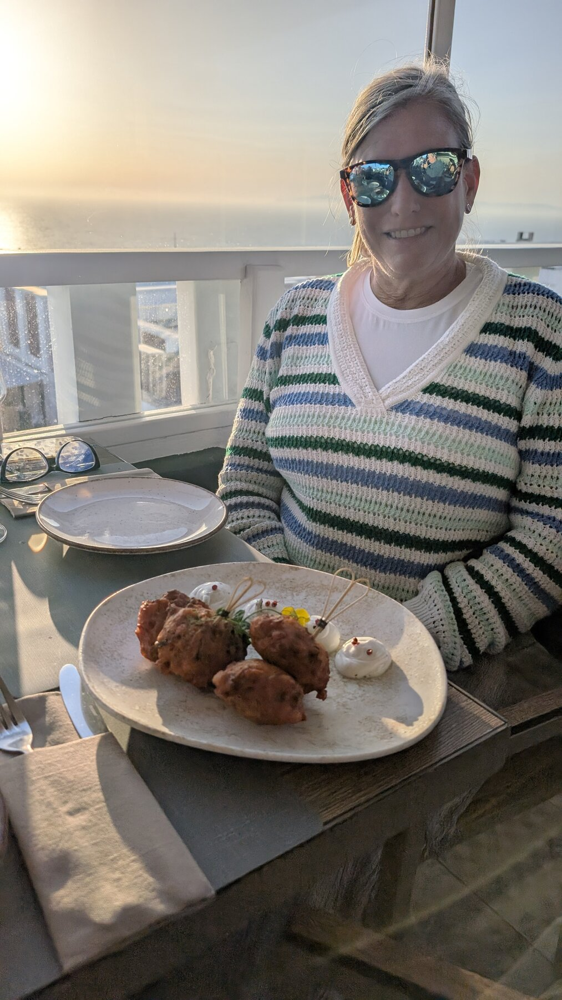
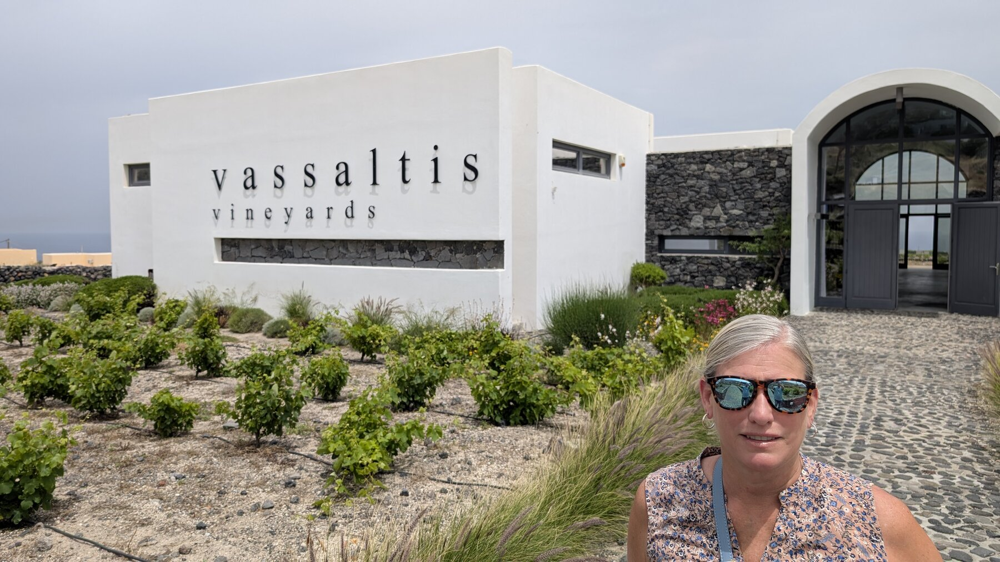
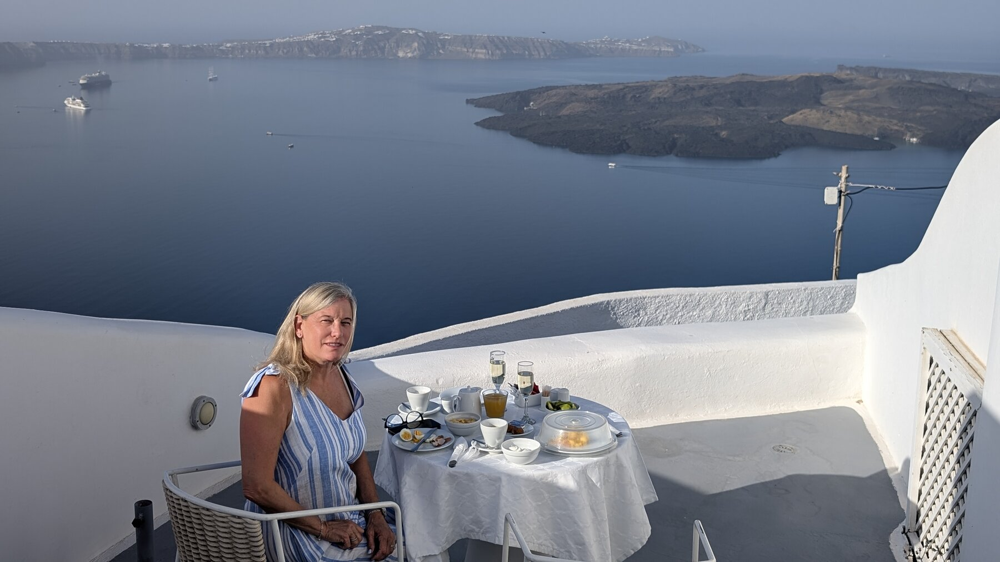

Santorini is a view-driven destination -- and the view is a volcanic caldera, collapsed circa 1600 B.C. in an eruption that may have ended Minoan Crete. What matters comes down to three things: time on the rim, where you watch sunset, and one day on the water.

The island is crowded -- even in early May. But the view from the rim -- the 20th-century volcanic cone rising from pristine Mediterranean hundreds of feet below, surrounded by white buildings on the steep hillside -- earned every bit of the hype. Three nights in early May felt right -- enough to hit each town and get on the water, without competing for every seat and sidewalk.

## Optimizing Rim Time

Most of your time is spent on the rim -- moving between Oia, Fira, and Imerovigli.

Oia is a stage set now -- it's all restaurants, hotels, and shops packed onto a narrow rim path.  The most beautiful part of Santorini is also the least human.

> A local we met from Imerovigli, a 20-minute drive away, said that she hadn't visited Oia for years, because it's "all for tourists".  

But Oia's location clinging to the hillside makes it the jewel of the island -- more so than Fira or Imerovigli. Most of the classic photos you have in mind that say "Santorini" are from Oia.

Oia's white-washed buildings are interrupted by the blue-domed churches you've seen in photographs -- far less common in Fira.  The descent from the rim is gentler, with buildings stacked down the hillside and narrow alleys between them.  It's the one rim town where you look down into the village, not just along it.

Finding the classic blue-dome Oia shots requires moving off the main Oia walkway; this [video](https://www.youtube.com/watch?v=nWoZJjqbdHQ) is the best map for those paths.  The creator has an analogous video for [Fira](https://www.youtube.com/watch?v=zdWbX0SMdlg). 

The other two rim towns offer different angles on the same caldera view.

At 1,100 feet, Imerovigli sits high enough to see all the way to Oia shimmering at the northern tip of the caldera -- a view the lower towns can't match.

Fira is far more developed -- its clifftop promenade stretches on, lined with tourist shops and cafes.  Its views stretch across the caldera and open sea -- but you're looking at landscape, not village.

## The Sunset Strategy

A dense ribbon of bars and restaurants perches on the rim for sunset.  With multiple nights, the best strategy is to take one sunset at each town: Imerovigli for height, Oia for architecture, and Fira for the central vantage point.

[PK Bar](https://pkbar.com/) is one of many "view" bars in Fira, but PK sits on a promontory that thrusts the seating forward from the rest of the Fira rim.  We booked weeks ahead for the champagne-front-row option.  The expensive seat was worth it for the romantic late afternoon, away from the tourist crush. 

Imerovigli's height gives it the widest canvas -- from Wine Bar, a small hotel bar on the rim, we watched the light move across the full caldera toward Oia. Less famous than the Fira sunset spots, but a better view.

## An Essential Water Day

From the deck of a catamaran, the volcanic cone stops being scenery and becomes geology -- the actual crater from the eruption that ended Minoan Crete, still holding the sea.  Seeing the island from the water resolves the scale of the cliffs in a way that staying on the rim cannot.

Near the volcano, the water temperature rises noticeably -- warm enough to swim, but loaded with sulfur and iron that will stain light-colored swimwear. We watched from the deck while braver passengers snorkeled in old dark swimsuits. 

The crew grilled lunch right there in the caldera, the rim towns arrayed above us like a white ribbon. With only 16 passengers and free drinks, the afternoon felt unhurried in a way that nothing on the rim does.

We chose [Spiridakos](https://www.santorini-yachts.com/); the operation was well-run and unhurried. Some friends chose Sunset Oia the previous year and loved that too.  Most operators run 4-hour trips twice daily -- enough time without overdoing it.  The route starts south of the caldera and loops through it -- not far, which is why 4 hours is the right length.

## Dining in Santorini

Our hotel provided breakfast, and a large breakfast usually made lunch unnecessary.  On Santorini, dinner is less about the food than the seat -- the view does most of the work.

In Oia, [Pelekanos](https://www.pelekanosrestaurant.gr/) is a family-run rooftop with views in every direction -- caldera, volcano, and village. Arrive early, because the best seats face the sunset and fill fast. The lamb kebab was the standout; the local wine list was better than expected.

[Kaliya](https://www.kaliya-restaurant.com/) sits just across the path from PK Bar, slightly recessed from the rim -- a better spot for dinner than sunset. The wood-fired scallops were good, but what made the evening was a sommelier who sketched out a wine strategy on a bar napkin. He picked us an excellent Parian Malagousia for that evening and pointed us toward Vassaltis, which we visited the following day.

## The Volcanic Terroir

Everything else on Santorini is about the view. The wine is about what's under your feet. Wine-making here goes back to the Minoans, 3,500 years ago.

The vines are wound into low baskets that sit directly on the volcanic soil -- a centuries-old technique that shields the grapes from wind and traps moisture from the morning fog.

[Vassaltis](https://vassaltis.com/), the sommelier's recommendation, sits away from the rim -- no sunset crowds, no view tax. The horizontal flights made the point concretely -- these grapes pull real flavor from ash and stone.

Santo Wines is on the rim and most popular -- one local sommelier told us it's better for the views than the wine, so we did not visit. The same sommelier recommended Argyros, Gavalas, and Hatzidakis; all are further south and less accessible from Fira or Oia.

## Where We Stayed

Perched between Fira and Imerovigli, our suite in Dreams Luxury Suites was a beautifully renovated 100-year-old cave house. It had the classic Cycladic look -- curves, whitewash, thick walls, without sacrificing modern comfort, or the view into the caldera.  Mornings started with breakfast on the terrace -- a-la-carte, sparkling wine included.

A rare luxury for a cliff-side property: the access is nearly step-free. While other travelers were navigating vertical marathons with their luggage -- a common sight in the steeper parts of Oia -- we could walk almost directly from the road into our suite.

The suite itself was hard to fault.  

> But the 20-minute walk into town made us realize that for our next trip, we'd prioritize staying either in Fira or more likely Oia, where the evening starts at your doorstep.  

## What It Costs and How to Get There

A small airport serves local flights, but most visitors arrive by ferry. From the port, it's taxi or bus up a long switchback to the rim.  We skipped renting a car -- the small towns look hectic. 

Santorini's extremes start with the geography and extend to the bill.  It is comfortably the most expensive of the Greek islands.  Everything carries a "view tax" -- from a morning espresso to a taxi ride. Expect prices to be 30-50% higher than in Paros or Naxos; you are effectively paying a premium for the geography alone.  A ride from Imerovigli to Oia cost $35 each way.

Three Santorini days in shoulder season gave us the views without the worst of the crush -- and the sense that we'd timed it right.

:::nutshell Santorini
verdict: Would Plan Around
duration: 3 days
Stay Overnight: Multiple nights -- you want separate sunsets from Oia, Fira, and Imerovigli, each with a different angle.
Don't Miss: Catamaran cruise with Spiridakos; front-row sunset at PK Bar in Fira.
Best Time of Day: Sunset, obviously -- but each town catches it differently.
Worth the Splurge: Front-row champagne at PK Bar; the Spiridakos catamaran.
Return Visit: Yes -- we'd stay in Oia next time. It's Disneyland, but spectacular Disneyland.
:::

