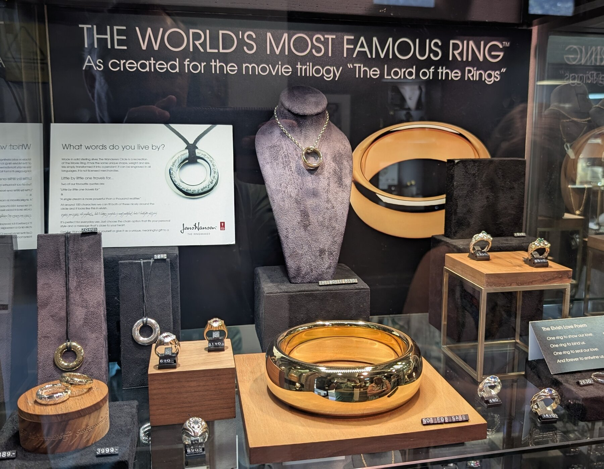
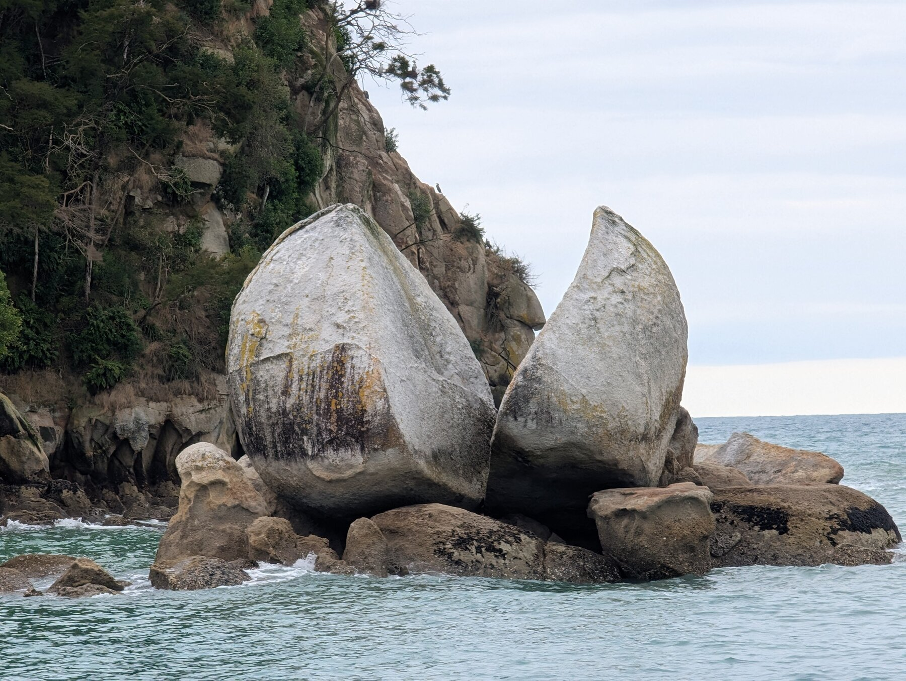
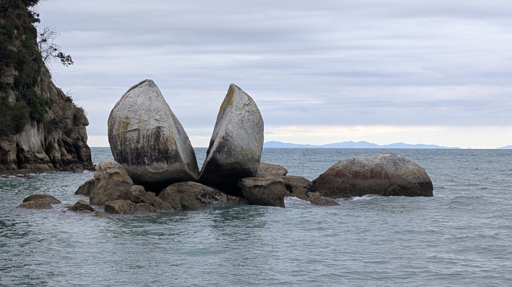
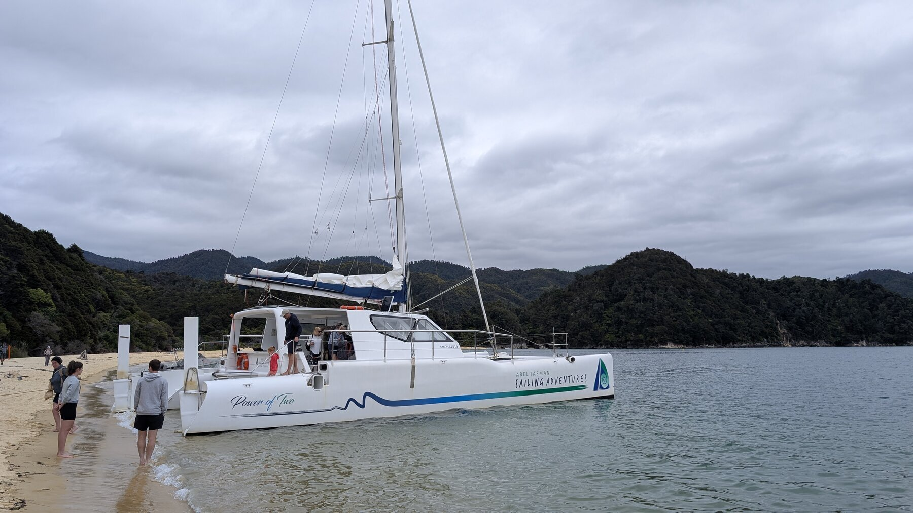
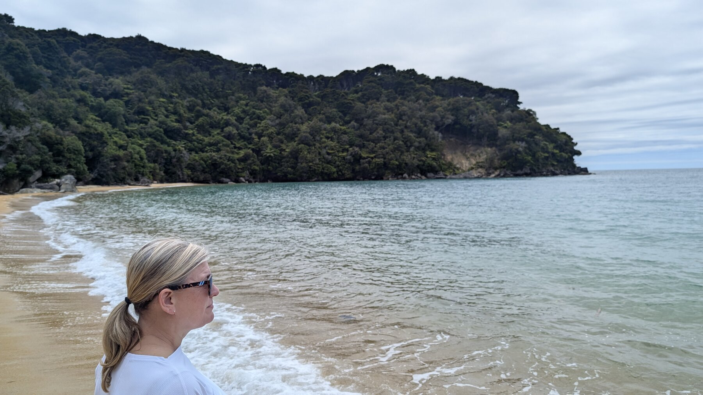
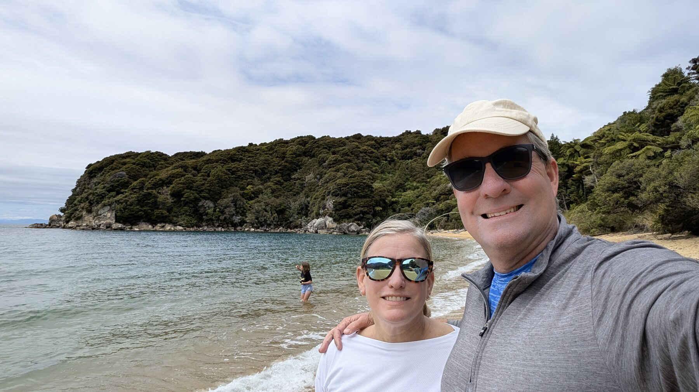

## Overview

We went to Nelson to see Abel Tasman National Park.  Honestly, it’s a pretty park, but I’m not 100% sure it was worth the effort.  We took a small boat out to the park, wandered around, did a hike … but we went hours out of our way to go to Nelson and not sure I’d tell anyone it was the \# priority.

Per above, the town near our Hotel (Mapua) was very cute, very local not touristy, and nice to visit.  There’s nothing bad about Nelson & Abel Tasman – we’re just not sure 100% sure it was all the way worth the trip to get there.

## What We Did

Describe your activities and experiences...

## Where We Stayed

Share accommodation recommendations...

## Food & Dining

There are several nice restaurants in Mapua.

## Practical Tips

- Getting there
- Getting around
- What to bring
- Best time to visit

*Add your photos here*

---

*Last updated: February 2026*

