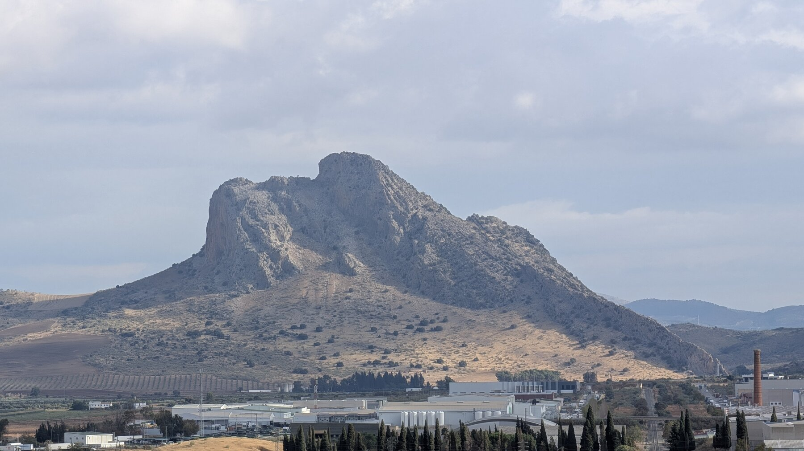
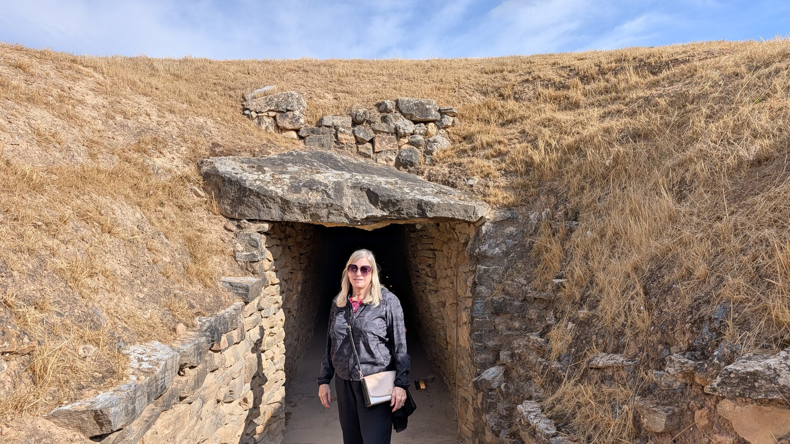

## Overview

Just outside Antequera are three ancient burial sites that would justify a detour on their own. The oldest predates both Stonehenge and the Great Pyramids -- and contains the largest single stone placed anywhere in Europe, a 200-ton capstone that has sat undisturbed since roughly 3700 BC. We visited as a daytrip.com-suggested stop between Granada and Málaga, and were genuinely surprised by how much was here.  The town itself is worth an hour or two, though we'd be honest: without the dolmens, it might not make our list for Southern Spain.  

## The Dolmens

A dolmen is a type of [megalithic tomb](https://en.wikipedia.org/wiki/Megalith#Tombs).  There are three UNESCO-listed dolmens outside of Antequera, two near one another and another a 10-minute drive away. All three are worth visiting; Menga is the standout. The scale is what surprised us most.  These aren't just old rocks, they're enormous, precisely placed, and somehow still standing after (for the oldest) nearly 6,000 years.

> The Dolmen of Menga was to us the most impressive.  It is believed to be from circa 3700 BC, older than either the Great Pyramids or Stonehenge.  

From the entrance of Menga facing out is Peña de los Enamorados (Lovers' Rock), a mountain which from various angles looks remarkably like a human profile.  Menga is the only known dolmen in Europe aimed at a natural feature rather than a celestial one.

The Dolmen of Viera is presumed to be also a burial site, built somewhere between 3500 and 3000 BC.  From the entrance, one sees a long corridor supported by 27 stones, leading to a rectangular chamber. 

Tholos de El Romeral is from 1800 BC, so 2000 years "newer" than the previous two. It shows sophisticated building techniques.  Tholos uses dry-stone construction: no mortar, just weight and geometry.

## The Town

Antequera is a small town with over 30 churches, all with opulent interiors -- which start to blur together. The real highlight is the citadel at the top of town.  Roman foundations sit beside a Roman bath; Moorish construction rises above them, with post-Reconquest Spanish layers added later. You can see the architectural discontinuity in the walls themselves. "Worth about an hour, more if you're having lunch, if you're already here for the dolmens."

## Food & Dining

We enjoyed a lunch at [Loulo Bistro](https://loulubistro.com/) on the Plaza de San Sebastián -- simple menu, well executed, and a great spot to watch locals go about their afternoon. Right across from one of the main churches; you'll walk past this bistro anyway, it's only a short walk down from the hilltop castle.

## Practical Tips

You need a car to reach the dolmens -- they're close to town but not walkable. The town itself is compact and easy on foot. We came through on a shuttle between Granada and Málaga, which worked well for this kind of stop.

See the section on [Tips for Spain](tips.html) for how we chose [daytrip.com](http://daytrip.com) for various of our shuttles from point A to point B.    

:::nutshell Antequera
verdict: Glad We Went
duration: 2 days
Stay Overnight: We would not prioritize this town for an overnight visit.
Don't Miss: The Dolmens; all three are interesting, the Dolmen of Menga most of all with Tholos a close second.
Best Time of Day: The Dolmens are open much of the day; see [the museum site](https://whichmuseum.com/museum/archaeological-dolmens-of-antequera-28815/opening-hours).
Worth the Splurge: Cost: Low. No "splurge" needed; just go.
Return Visit: This feels like a great place to visit -- once.
:::

---

