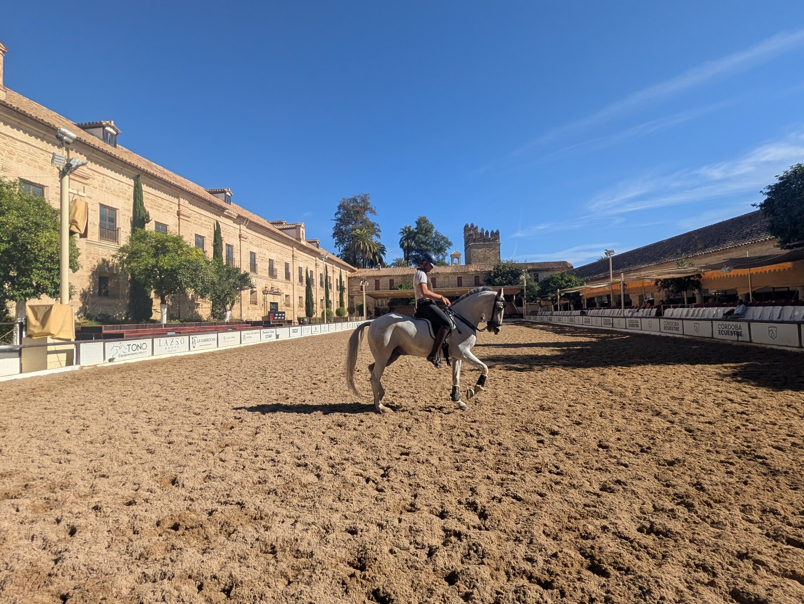
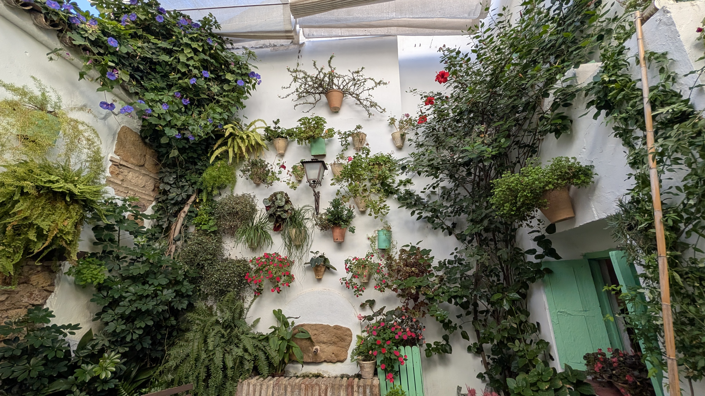
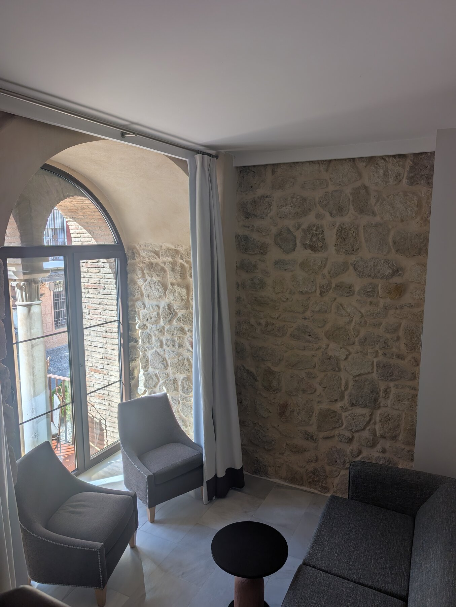
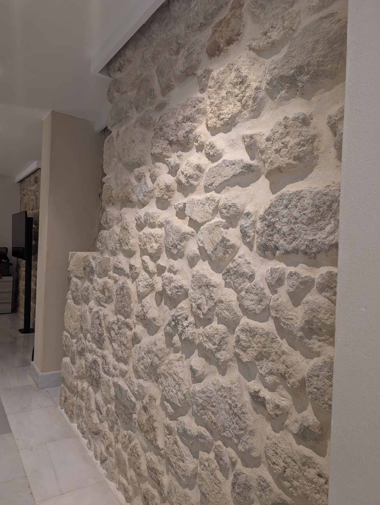

## Overview

Cordoba was 100% the best surprise of the trip, and one of our favorite cities.  It's often in the standard Andalucia loops as a 5-hour day trip from Granada or Seville.  We are so glad we spent two nights there and didn’t ‘just’ zoom in to see the Mezquita, as is commonly done. This is nothing against either Granada or Seville or any of the rest of the trip, but in terms of expectations vs joy, Cordoba was just a delight.  We think back and certainly the fact that it was our first (non-Madrid) Andalucia city may have been part of that – but it’s just such an approachable, compact tourist city.  And to top it off, the Mezquita was one of our favorite destinations in Europe.

In general, Cordoba has a very compact ‘old’ city, which is extremely walkable but also extremely easy to get lost in – one of us (ahem) has a better sense of direction than the other, and I lost my sense of direction over and over – but in a delightful way, you can only go so far.  The street ‘plan’ is from the Moorish era, and there’s not a single 90 degree turn anywhere.  While it’s not 100% car-free, the few random taxi’s are going pretty slowly, so you can just wander, which we loved.

## What We Did

The main attraction of Cordoba, the Mezquita, is one of the most remarkable buildings anywhere.  Mezquita is just Spanish for ‘Mosque’, thus this building is the ‘Great Mosque’.  The main structure was built in 756-757 AD, and after its final expansion in the late 10th century was the second largest mosque in the world for hundreds of years, exceeded only by one in Samarra (modern-day Iraq), which lies largely in ruins.  The Cordoba Mosque is remarkably well-preserved, but radically altered.  After the 1236 reconquest of Cordoba, the Mezquita was reconsecrated as a Catholic church, but remained largely intact, until a major addition of a Cathedral in the 1520s (note, nearly 300 years after the reconquest).  The Renaissance cathedral is beautiful in its own right, and arises from right in the middle of the former mosque, so that the modern result is a unique juxtaposition of two radically different places of worship.  We actually thought the combination “could have been worse” – one could argue that it would be best to have the 8th- and 10th- century mosque intact – but there is at least modest effort to harmonize the transition between the 2 buildings, and the cathedral is undeniably beautiful.  The entire result was to us just beyond fascinating, we spent two hours in the building and could have spent longer.  We are torn on not using a private guide for this visit – we undoubtedly would have learned some extra details by having a guide, but just wandering left us time to really absorb the building (mostly) silently, and look for great photos.   

We started our time in Cordoba with a Rick Steves-recommended 2-hour bike ride around town with [Ontdek Cordoba](https://ontdekcordoba.com/en/).  We highly recommend this; it starts a 15-20 minute walk from the center of town, but it was well worth it.  The guide Francisco is part Dutch but speaks excellent English.  He has lived in Cordoba for over a decade (I think part of his family was from Cordoba), and has visited Cordoba since being a child, so can tell stories of what the town was like 30 years ago (there were trucks/traffic going over the old Roman bridge as recently as the 1990s), and is just generally delightful company.  Cordoba is a very ‘flat’/bikeable town, with relatively little traffic, so it’s a great way to learn the overall layout of the town, but also get to some nice viewpoints of the Mezquita from a distance.  Note also that many visitors to Cordoba are daytrippers from elsewhere – so like many European tourist cities, the town is crowded from say 10am to 4pm, but in the evening the old town really starts to feel like more locals than tourists, to our delight.

We also enjoyed and highly recommend the 8pm-nightly horse show at the Royal Stables of Cordoba.  There is reputedly a ‘better’ horse show in nearby Jerez, but we didn’t make it to Jerez, and the Cordoba show was delightful.  The show is only 70 minutes or so (including intermission), very pleasant.  We bought the premium pass which cost only an extra \~€8\. I originally bought via a 3rd-party because Google’s search results pushed me there (shame on me), but the 3rd-party site didn’t give me the option to select seats or get premium; if you buy your tickets directly [here](https://cordobaecuestre.com/), you can select premium seats (but those are limited, and disappear weeks in advance, so it’s worth planning). More importantly than the ‘better seats’ is that the premium experience allows you to visit the stables earlier in the day and watch them training. It’s only a 5-minute walk from the Mezquita, and was worth a diversion earlier that day.

Cordoba’s Ruta de Patios allows one to see privately-maintained patios that are filled with gorgeous flower arrangements.  In November only a handful were open, but each was unique and quite pretty – evidently these are a point of pride for homeowners, and the competition is fierce for the annual spring competition.  We saw it as part of our bike tour, it varies depending on the time of year (avoid the actual festival, which attracts hundreds of thousands from what we’ve read), but it’s well worth visiting.   

## Where We Stayed

We stayed at the NH Collection Amistad.  This had an excellent location only a few minutes from the Mezquita and right on the edge of the ancient city.  Part of the hotel’s walls are in fact the ancient walls of the medieval city.  There are 6 Junior Suites – by complete luck we were assigned the exact one of them that has a window which is actually a hole cut (we’re not sure when) in the centuries-old wall.  We recommend requesting room 280 if you can, it’s just a cool experience.

Note I say medieval wall, but some of it may be Roman; see this [page](https://www.infocordoba.com/spain/andalusia/cordoba/city_walls.htm) or this blog entry [here](https://anywhereweroam.com/moorish-sites-in-cordoba/)

## Food & Dining

We found dining in Cordoba pleasant and easy.  We probably didn't need to make reservations anywhere, but one night we did book ahead at [Restaurant El Rincon de Carmen](https://restauranterincondecarmen.es/), which was delightful and well worth it -- lovely patio, live performers, great feel all around.

## Practical Tips

The old town is close to the train station, but not close enough to be walking distance; getting a taxi was trivial.  It's a small enough town that Uber is not an option.  Once you're in the old town, everything is very walkable, it's probably 10-15 minutes from one "end" to the other.  

