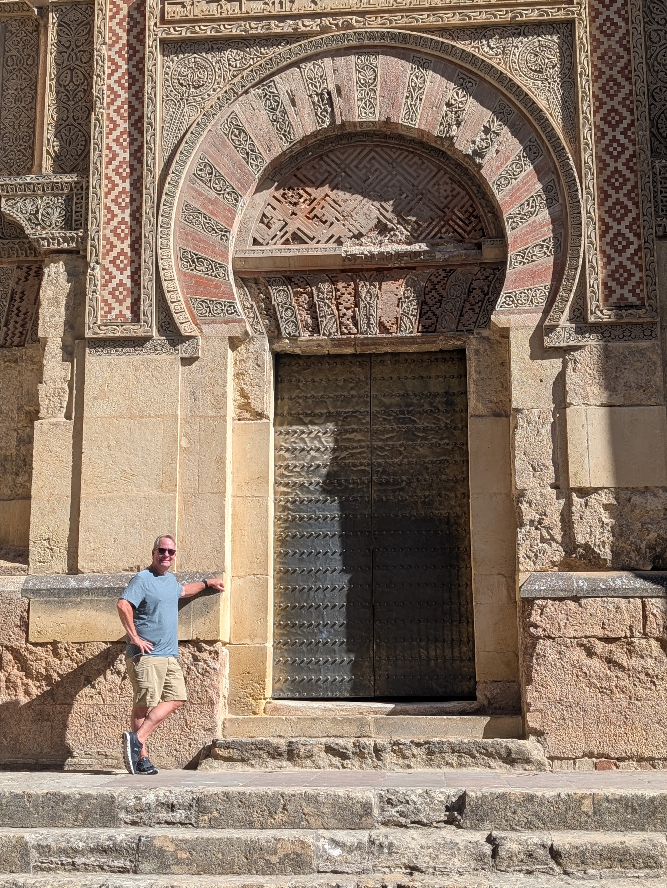
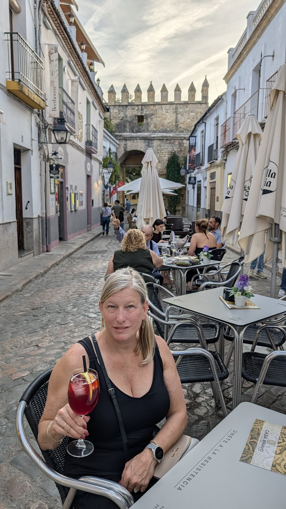
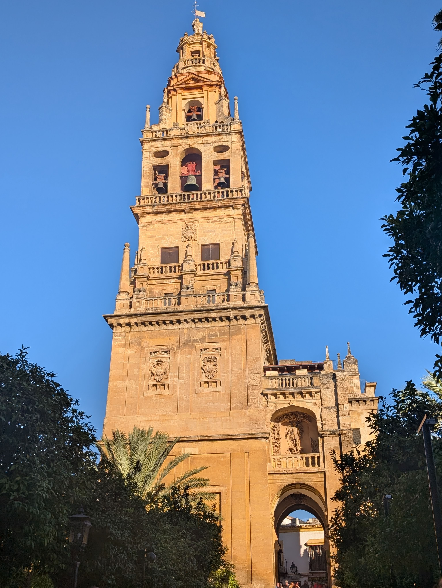
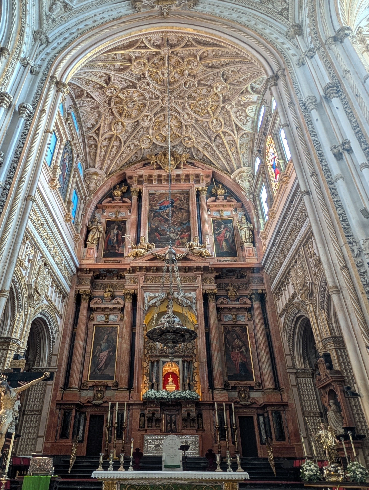
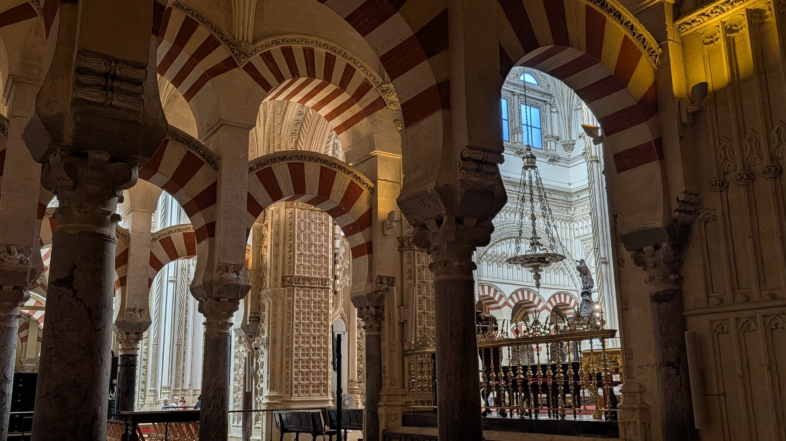
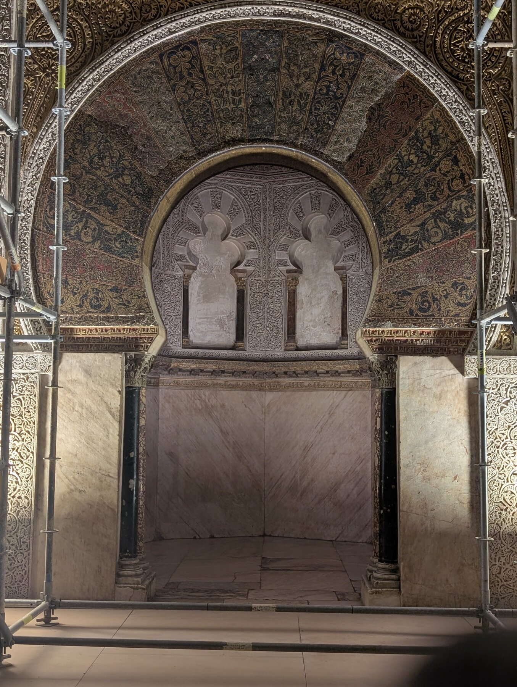
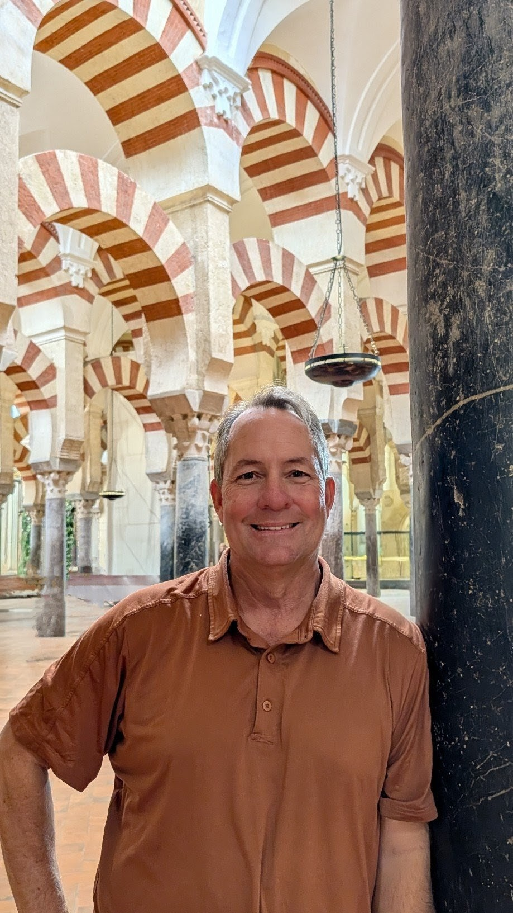

# Cordoba

## Overview

Add your introduction to Cordoba here...

## What We Did

Describe your activities and experiences...

## Where We Stayed

Share accommodation recommendations...

## Food & Dining

Recommend restaurants and local cuisine...

## Practical Tips

- Getting there
- Getting around
- What to bring
- Best time to visit

## Photo Gallery

*Add your photos here*

---

*Last updated: February 2026*

![The 16th-century Cathedral was built right in the middle of the mosque, thankfully leaving much of the mosque as it was originally. Some criticize the "transition" from one building to the other, but honestly it feels as though it could have been worse, you can see both the mosque arches and bits of the Cathedral in this angle. If you ignore the weird religious overtones, the overall building oddly "worked" for us.

We liked this angle because you see the two buildings 'together'.  Note how the Mezquita is (for both religious aesthetic reasons, and logistics reasons of what was possible in the 9th century) quite dark, while the cathedral emphasizes light.](images/cordoba-14.jpg)

