## Overview

Córdoba was supposed to be a box to check.

See the Mezquita. Walk the Roman bridge. Have lunch. Move on.

Instead, it became one of our favorite cities in Europe.

We spent 2 nights here -- and that was exactly right. Cordoba is atmospheric and just chaotic enough to make wandering feel like an adventure. 

Cordoba was the largest city in Europe in the 9th and 10th centuries -- capital of the emirate of Al-Andalus from 756 until the Spanish reconquest in 1236. The Roman bridge, which carried vehicle traffic until the 1990s, predates all of it. In Cordoba, you walk on infrastructure that has outlasted every civilization that built on top of it.

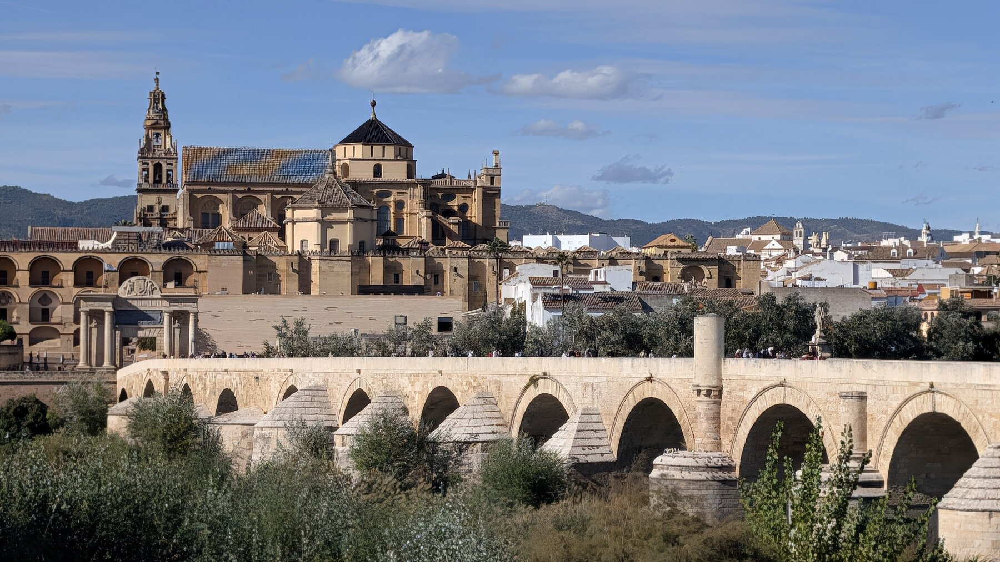

The Mezquita alone would justify a visit. Staying overnight is what makes it memorable.

> It was our first Andalucía stop outside Madrid, which may have amplified the effect -- but even in hindsight, Cordoba stands out. Still, it's an unusually approachable tourist city.  And to top it off, the Mezquita was one of the most remarkable destinations in Europe.

Cordoba's old city is compact and walkable -- and extremely easy to get lost in.  Kevin lost his sense of direction repeatedly -- but in a city like this, you can only wander so far.  The street "plan" is from the Moorish era, and there's not a single 90 degree turn anywhere.  

It's not fully car-free, but the few taxis creep through slowly enough that wandering feels safe.

## The Mezquita and the City Around It

The Mezquita -- simply Spanish for 'mosque' -- is the reason most people come to Cordoba, and the building delivers something genuinely hard to describe: a thousand-year-old Islamic prayer hall with a Renaissance cathedral built into its center.

Abd al-Rahman I, founder of the Islamic Emirate of Cordoba, ordered it built in 756-757 AD.  After its final expansion in the late 10th century, Mezquita was the second largest mosque in the world for hundreds of years.  Only a mosque in Samarra (modern-day Iraq) was larger, and it now lies largely in ruins.  

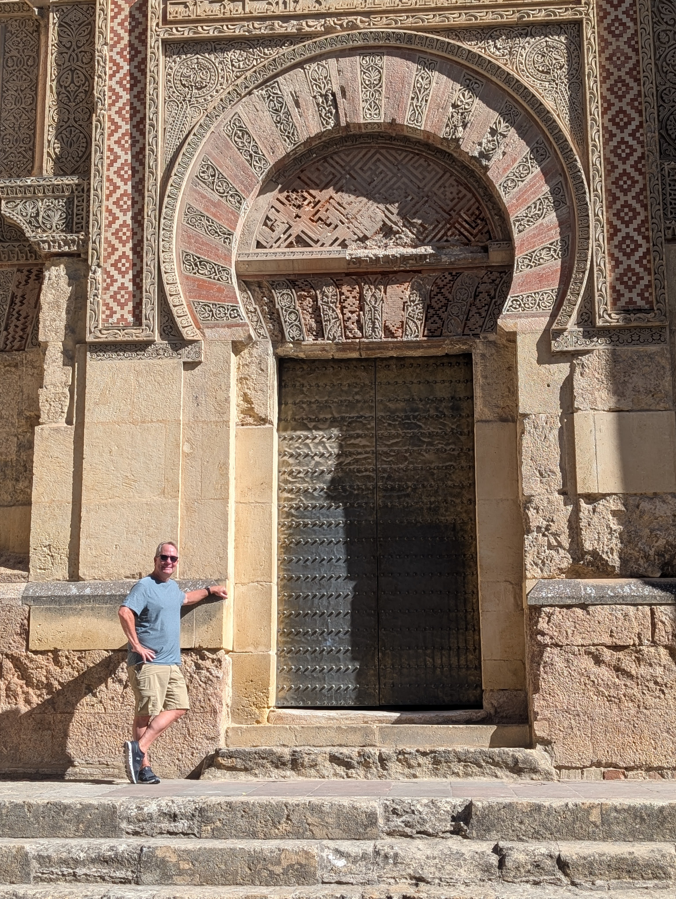

The Cordoba Mosque is remarkably well-preserved, but radically altered.  After the 1236 reconquest of Cordoba, the Mezquita was reconsecrated as a Catholic church.  For over two centuries, it remained largely intact, until a major addition of a Cathedral in the 1520s (note, nearly 300 years after the reconquest).  

The Renaissance cathedral arises from right in the middle of the former mosque.  The 18th-century choir stalls sit in the center of the cathedral like an island of dark wood in a sea of stone arches. They're carved from Cuban mahogany -- dense, reddish-brown, with a natural sheen that absorbs the dim light rather than reflecting it.  

The modern result is a unique juxtaposition of two radically different places of worship.  

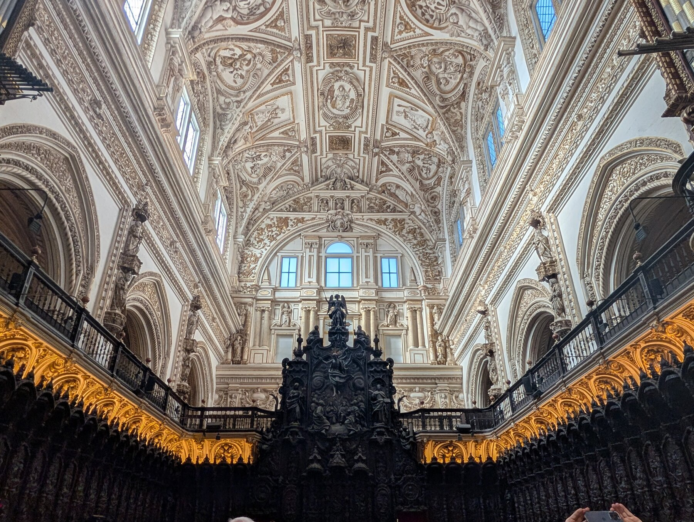

You can see both the 9th-century mosque arches and the 16th-century Cathedral from some angles.  Note how the Mezquita is quite dark while the cathedral emphasizes light.  This is for both religious aesthetic reasons, and logistics reasons of what was possible to build in the 9th century. 

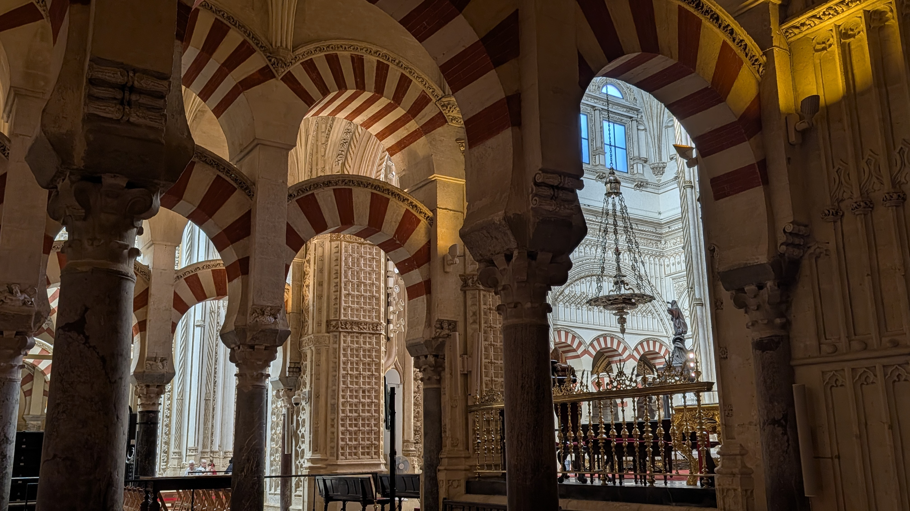

We thought the combination "could have been worse".  The mosque would be more powerful fully intact.  But the transition between the two buildings is handled with more care than you'd expect -- arched stone giving way to carved wood, Islamic geometry yielding to Renaissance symmetry.  The cathedral is undeniably a must-see example of Renaissance architecture.

> The entire result was to us fascinating.  We spent 2 hours and could have spent longer. 

We skipped a guide and aren't sure that was right. We missed details we'll never get back. But the Mezquita rewards silence -- wandering without narration let us absorb the space on its own terms, and find our own angles.

The beautiful arches, over 800 in all, recede into the distance in every direction, red and white stone repeating until the eye gives up trying to find the end.  The archways are original; the hanging lanterns are Christian-added.

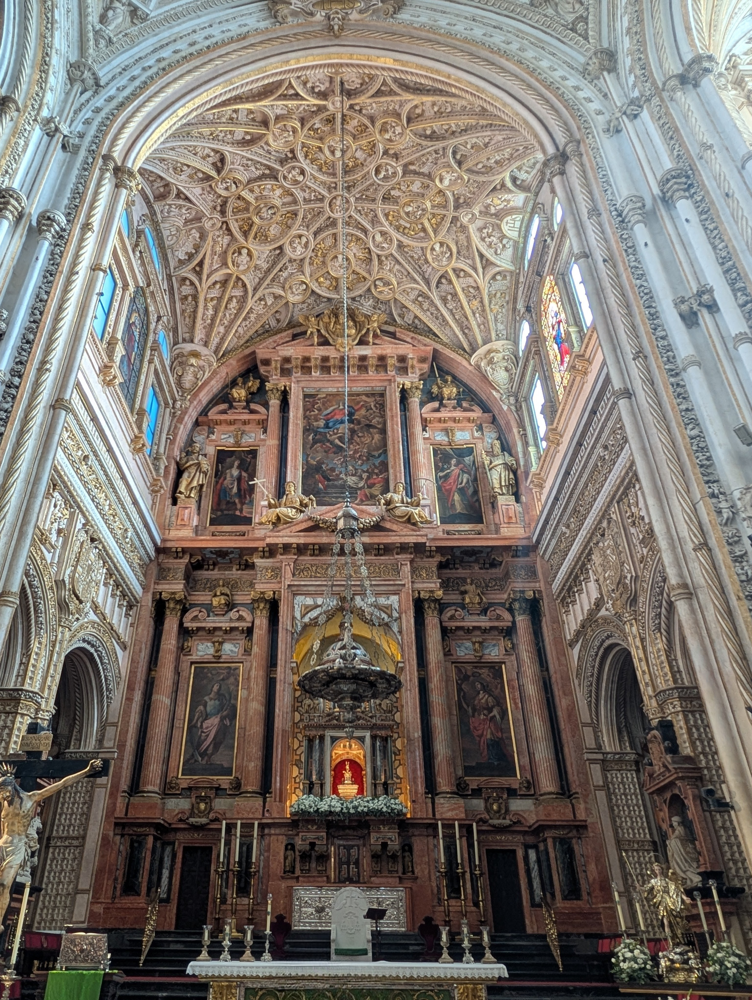

Even if you don't love religious architecture, this is worth 2 hours. It's not just a mosque. It's not just a cathedral. It's a layered argument in stone.

We started our time in Cordoba with a Rick Steves-recommended 2-hour bike ride around town with [Ontdek Cordoba](https://ontdekcordoba.com/en/).  Walking Cordoba, you lose your bearings quickly; on a bike, you cover enough ground to see how the river, the mosque, and the plazas connect. Do it first, before you explore on foot. The guide Francisco is part Dutch, speaks excellent English, and is genuinely good company. 

> Francisco has lived in Cordoba for over a decade and has been visiting since childhood, which gave him a long-view perspective on how the city has evolved.  He informed us that there were trucks/traffic going over the old Roman bridge as recently as the 1990s.  

Cordoba is flat with light traffic, so cycling is a great way to learn the overall layout.  The ride crosses the river, where the view clicks into place -- the Roman bridge running straight into the flank of the Mezquita, and the cathedral rising awkwardly from its center, visible proof of one civilization building on top of another.

Most visitors to Cordoba are day-trippers, and you can feel it. Between 10:00am and 4:00pm, the old town has the rushed energy of people trying to see everything in 4 hours. By evening, the tour buses are gone, the souvenir shops dim their lights, and what's left is a residential neighborhood that happens to have a thousand-year-old mosque in the middle of it. That version of Cordoba is the one worth staying for.

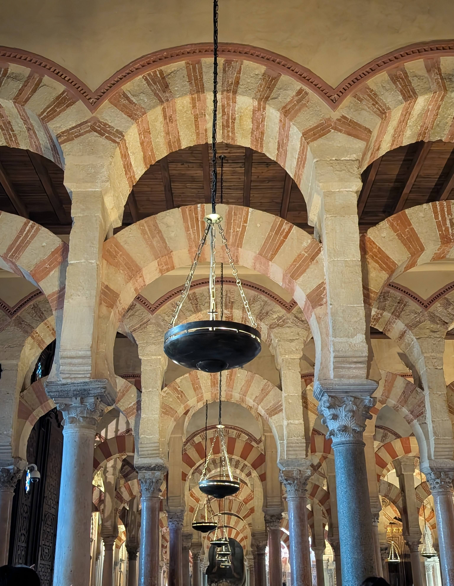

The nightly horse show at the Royal Stables of Cordoba is 80 minutes well spent. The more famous version is in Jerez; we didn't make it there, but the Cordoba show didn't feel like a consolation prize. From the front rows, you feel the gallop in your chest, and the paso español -- the high-stepping walk -- is close enough to hear the hooves snap against the sand. 

Book the VIP seats for only an extra \~€8\. The difference is physical, not just visual.

> More importantly than the "better seats" is that the premium experience allows you to visit the stables earlier in the day and watch the broad-shouldered and impeccably-groomed horses training. 

It's only a 5-minute walk from the Mezquita, and was worth a diversion earlier that day.

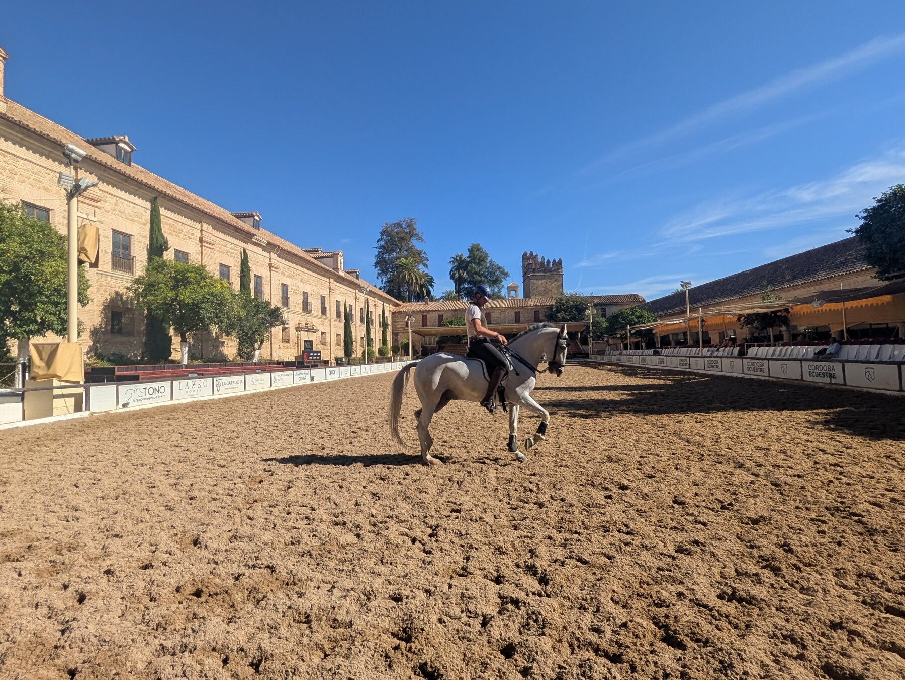

You can visit privately-maintained patios filled with flower arrangements along the Ruta de Patios.  In November, only a few were accessible, but even off-season the patios delivered -- cyclamens and marigolds replacing the spring roses, terracotta pots stacked against whitewashed walls, and enough greenery to make you forget the time of year.  These patios are a point of pride, and the annual spring contest draws real competition among the families who tend them.

Because these are gardens, the experience varies seasonally.  The May festival draws hundreds of thousands of visitors.  We'd plan around it, not for it.   Seeing a few patios outside festival season was manageable and charming.   

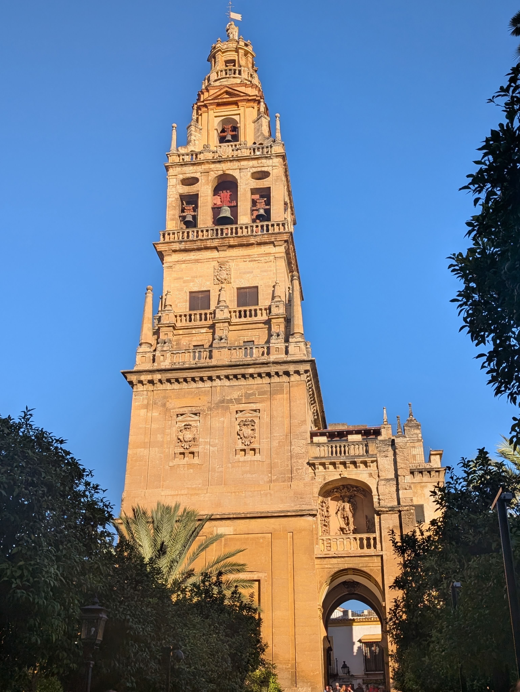

## Where We Stayed

We stayed at the NH Collection Amistad, only a few minutes from the Mezquita and right on the edge of the old town.  Part of the hotel's walls are in fact the ancient walls of the medieval city.  

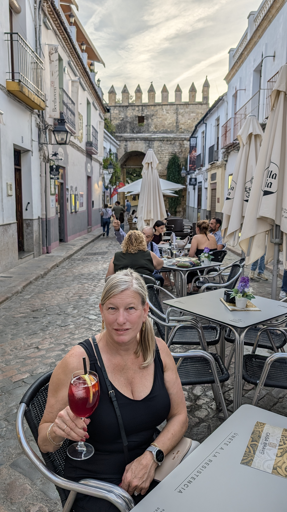

The hotel has only 6 Junior Suites. We were randomly assigned room 280, which turned out to have a window carved centuries ago into the medieval wall itself. From inside, an entire wall of the room was stone hundreds of years old. From outside, our balcony was the only one visible in hundreds of feet of unbroken wall. Request it if you can -- there's nothing else like it in the hotel.

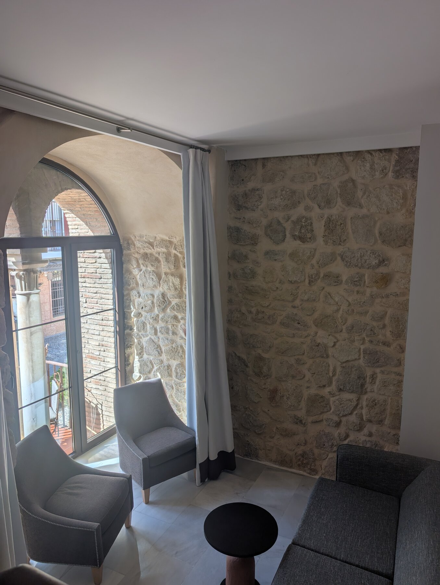

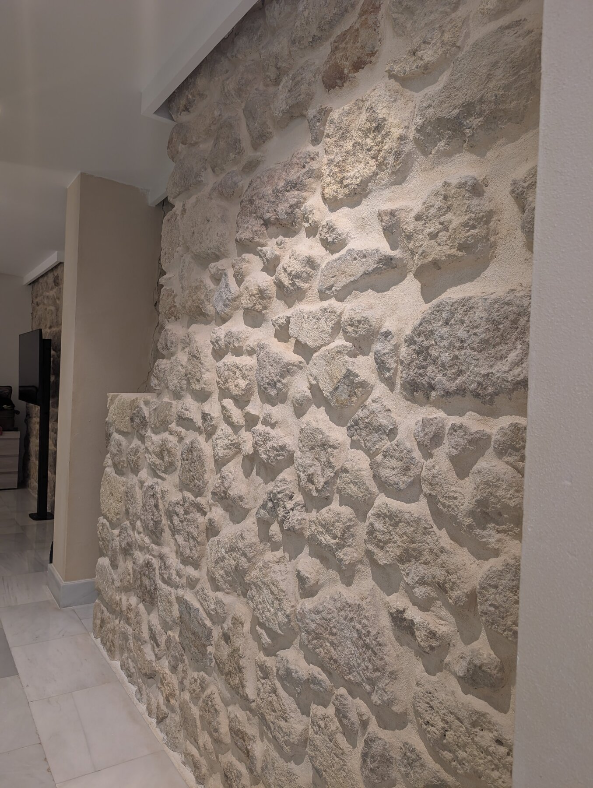

Parts of the wall may be Roman rather than medieval -- the layers blur, and even the experts aren't fully sure who built what. These two sources dig into the details if you're curious.
[InfoCordoba site](https://www.infocordoba.com/spain/andalusia/cordoba/city_walls.htm) or a [blog entry](https://anywhereweroam.com/moorish-sites-in-cordoba/)

## Food & Dining

Eating in Cordoba happens in courtyards: white-washed patios hung with geraniums, trickling fountains, the restaurant blurring into the city's famous floral alleyways. 

Salmorejo -- gazpacho's thicker, creamier cousin, topped with hard-boiled egg and jamón ibérico -- appeared at nearly every lunch and never got old. A flamenquín one afternoon (pork loin wrapped around serrano ham, breaded and fried) was the kind of simple, heavy comfort food that justifies a slower pace for the rest of the day.

We didn't need to make reservations anywhere, but one night we did book ahead at [Restaurant El Rincon de Carmen](https://restauranterincondecarmen.es/).  It is set back from the main street, centered around a traditional Cordoban patio -- greenery, blue flowerpots, and enough quiet to feel like someone's private courtyard. A guitarist played in the patio while we ate, and the whole evening had a domestic ease to it that most restaurant experiences don't.

## Practical Tips

The old town is a short taxi ride from the train station — close, but not walkable with luggage.  Taxis were easy to find. Uber doesn't operate in Córdoba.  

Once you're in the old town, everything is very walkable, it's roughly 10-15 minutes across on foot.

We initially bought the premium tickets to the horse show through a 3rd-party because search results pushed us there.  However, the 3rd-party site didn't give the option to select seats or get premium.  If you buy your tickets directly [from the official site](https://cordobaecuestre.com/), you can select premium seats (but those are limited, and disappear weeks in advance, so it's worth planning). 

:::nutshell Cordoba
verdict: Would Plan Around
duration: 2 days
Stay Overnight: 2 nights felt ideal
Don't Miss: The Mezquita (allow 2+ hours)
Best Time of Day: Evening, after day-trippers leave
Worth the Splurge: Premium Royal Stables tickets
Return Visit: Yes
:::

*Add your photos here*

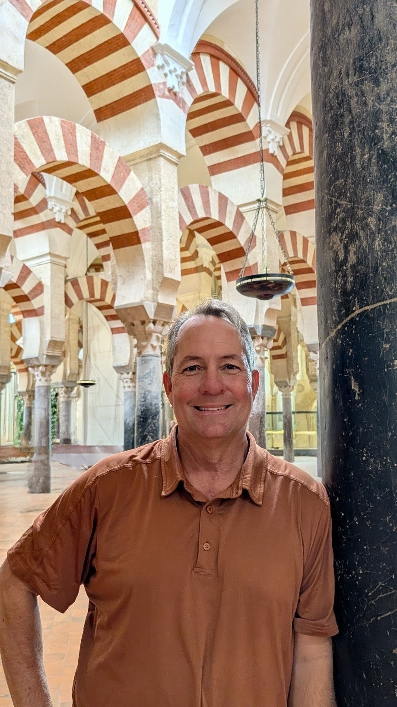

