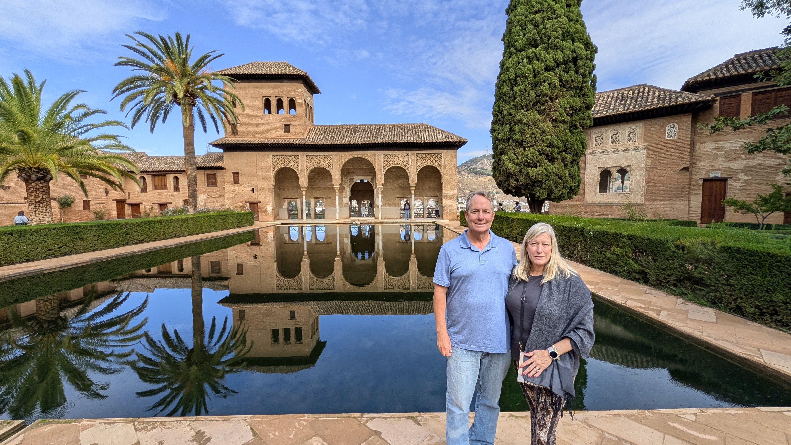
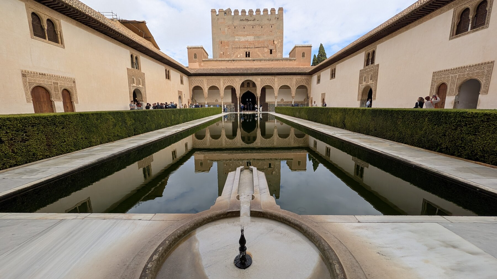
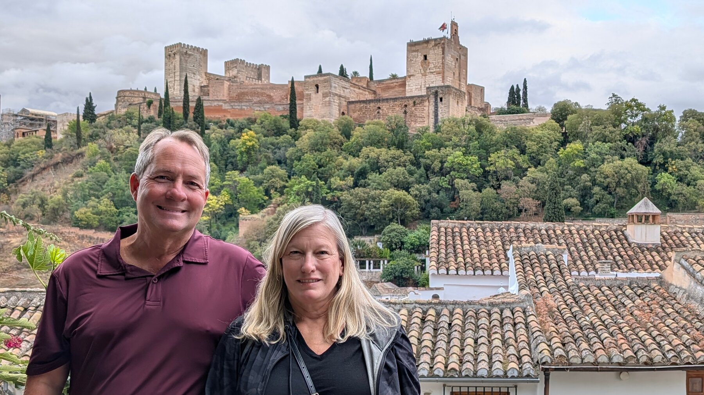
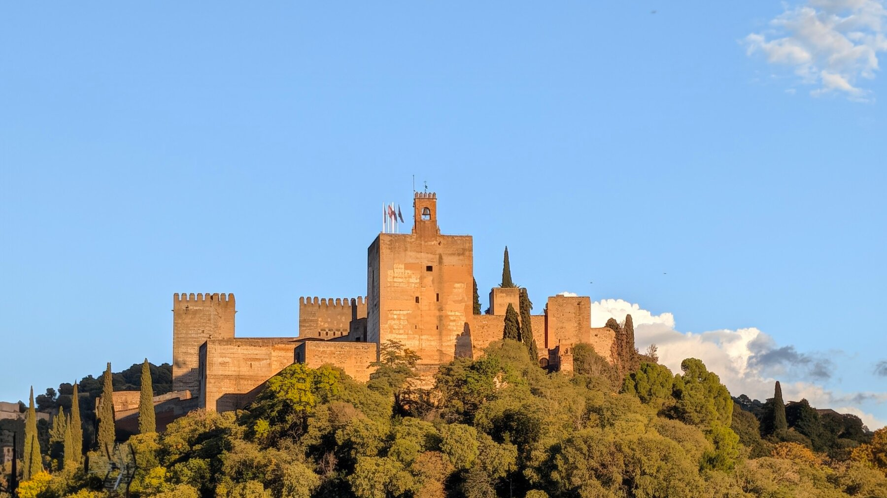
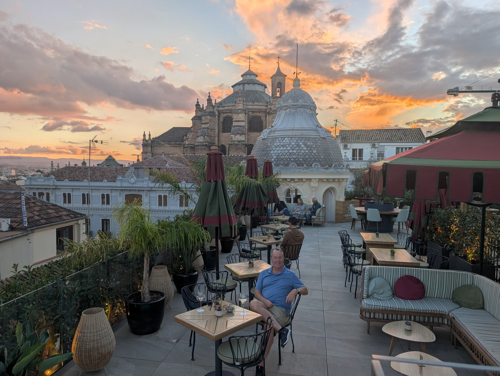
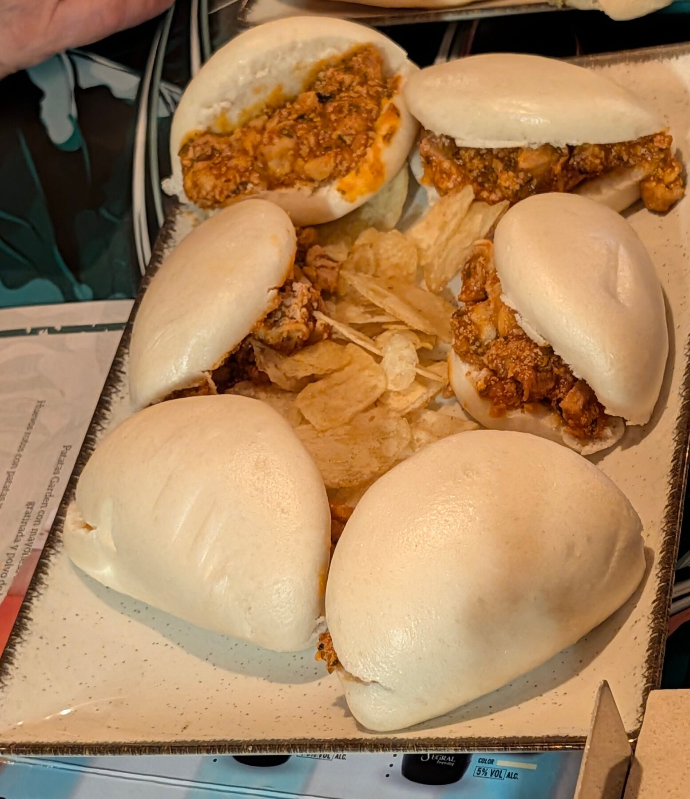

## Overview

One of our go-to’s in most European towns is a walking tour, just to get oriented and get the history with a local.  We started our time there with a guided tour by [Cicerone](https://www.ciceronegranada.com/en/) (recommended by Rick Steves), to get a sense of what was where and how the town was laid out.

## What We Did

The highlight of Granada of course is the Alhambra, one of the best-preserved castle/palace complexes of the medieval Muslim world.  Amazingly, Kevin remembers visiting there in 1988 and it being nearly empty; they now sell out the daily allotment of thousands of visitors weeks or even months in advance.  So it’s necessary to plan ahead.  Like many places in Spain, there are many sites that sell tickets, but the official site is [here](https://tickets.alhambra-patronato.es/en/) which is *not* the first or even third Google result. Many guidebooks recommend doing both a night and day trip to see things lit up; the night visits were sold out by the time we were looking (nearly 2 months ahead\!), so we can’t say whether that’s worth it or not.

We booked a guided tour; our guide wasn’t terrible, but was not so great that we would recommend her.  There are many, many guides online.  It’s a vast complex, and confusing, we don’t know what we would have experienced unguided, but think we would have missed a lot.  The Alhambra is also up a pretty long/steep hike from downtown, it’s doable but you might want to consider a taxi as we took.

One can’t discuss this part of Spain without discussing the Roma people, a group who came to Europe all the way from the Indian subcontinent over 1000 years ago (various sites give different answers of whether they prefer to be called Romani, or Gypsies, or, as they are often called in Spain, Gitano; I won’t pretend to be an expert).  This group traditionally has stayed, or been kept, in separate ethnic enclaves in the less desirable part of any Spanish city.  We found the   Museo Cuevas del Sacromonte (Cave Museum) outside of Granada very worth it to get a sense of their culture.  You can take a bus from town up the hill (it’s a longgg walk) to this museum, the museum is small but you get a sense of this community from seeing small displays of their day to day life before the government forced them to move out in the 1960s.

The Albaicin is the old Moorish quarter, it’s on a steep hill above town.  We walked a small amount of it as part of our overall walking tour, just getting into the first bit of it, and it’s undoubtedly charming (once you get past the first block or two which are standard cheap fare for tourists).  Our plan was to spend our final (of 3\) afternoons just wandering around up in the Albaicin – but that day featured a biblical rain storm, and apart from comfort it’s a very steep neighborhood with slick sidewalks, we passed on visiting it in the rain.  So sadly I think we missed a key part of seeing Granada.

## Where We Stayed

We stayed at [Palacio Gran Via](https://www.barcelo.com/es-es/palacio-gran-via-a-royal-hideaway-hotel/), which is on a very sizable boulevard (Gran Via) that was a bit of a shock after the car-free quiet of the Cordoba old town.  That hotel did, however, have a lovely rooftop bar with views of the Alhambra, and the lobby is gorgeously redone, keeping remnants of its historical roots as a early-20th-century bank –  which means we would recommend the hotel overall.  

## Food & Dining

Granada is also unique in its Tapas culture.  Many cities in Spain, of course, have Tapas – they are small plates that cost money, just as Americans are used to.  But in Granada, the custom is that one gets “free” Tapas with every drink – e.g., if you order 3 drinks, you get 3 Tapas (different sources give different versions of how common this was in other cities 50 years ago).  We assumed this meant tiny little morsels, but instead some of the ‘free’ Tapas are incredible.  We highly highly recommend [Granada Tapa Tours](https://www.granadatapastours.com/) by Gayle, some of the Tapas were just divine, and after 4 restaurant visits we were overly full with just ‘free’ Tapas.  If you don’t do the tour, just get used to food showing up that’s wonderful.

## Practical Tips

After Cordoba, Granada feels like a much larger city.  It's by no means unmanageable, but it's quite a bit larger than Cordoba, and also has a lot more 'traffic' around areas that are touristy compared to Seville, which has a compact walkable quarter that is almost traffic-free.  Please note that the Alhambra is up a quite steep hill from where most of the tourists stay.

Booking a tour at the Alhambra is a *must* -- some tours book up months in advance, especially at peak times.  We had considered doing a night tour (when the lighting is different) and they were booked 8 weeks in advance -- and this was early November.

*Add your photos here*

