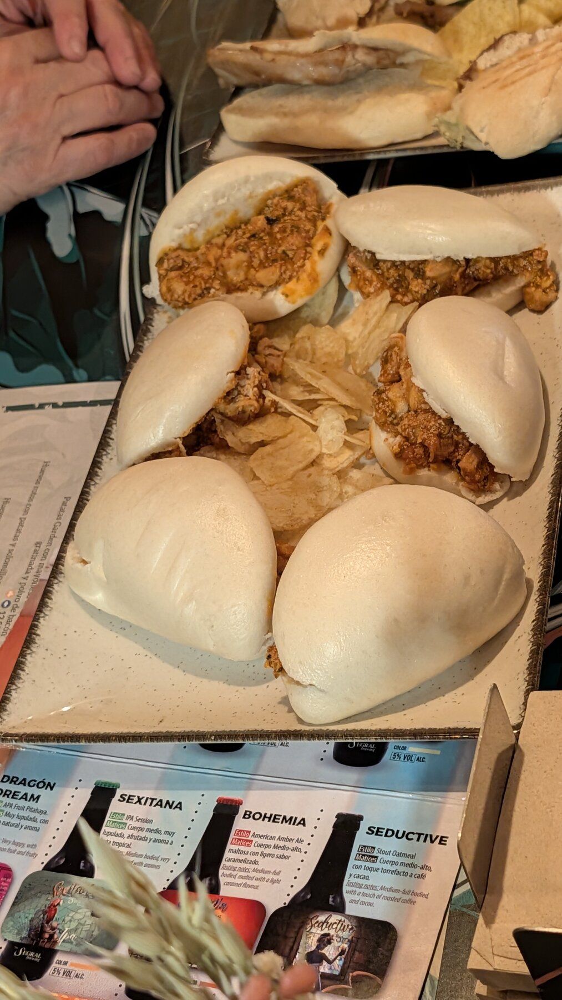

# Granada

## Overview

Add your introduction to Granada here...

## What We Did

Describe your activities and experiences...

## Where We Stayed

Share accommodation recommendations...

## Food & Dining

Recommend restaurants and local cuisine...

## Practical Tips

- Getting there
- Getting around
- What to bring
- Best time to visit

## Photo Gallery

*Add your photos here*

---

*Last updated: February 2026*

