## Overview

Granada carries a big reputation. It's home to the Alhambra --  Spain's most famous historical site -- and for many travelers that alone justifies the visit.  But Granada is more than a monument. It's a city where tapas arrive free with your drink and quietly become dinner -- and where Islamic, Catholic, and Roma histories layer on top of each other. We came for the Alhambra. We left most impressed by Granada's hillside walks, cultural complexity, and food culture.

## What We Did

Granada is at its best when you treat the Alhambra as a timed "anchor" and leave plenty of unstructured time for the rest.  We started with a guided walking tour to get oriented and decide what to explore later.  We chose [Cicerone](https://www.ciceronegranada.com/en/) (a Rick Steves recommendation).  We visited the Granada Cathedral, which is worth 20-30 minutes but won't compete with Spain's top-tier interiors. 

### Alhambra

Granada's main draw is the Alhambra, one of the best-preserved palace complexes from the medieval Muslim world. Kevin last visited in 1988, when the Alhambra felt like a forgotten corner of Europe -- nearly empty on a November afternoon, the kind of place you could wander without a ticket or a plan. Today, timed entries sell out months ahead. The palace is the same; everything around it has changed.

Plan ahead.  Buy Alhambra tickets only from the official site (linked [here](https://tickets.alhambra-patronato.es/en/)). It may not be the first search result, but it's the only site that reliably reflects true availability.  Popular days sell out weeks to months ahead.  Many guidebooks suggest visiting by day and again by night to see the palace lit up.  Unfortunately, the night visits were sold out by the time we were looking (nearly 2 months ahead\!), so we can't say whether it's worth the effort.

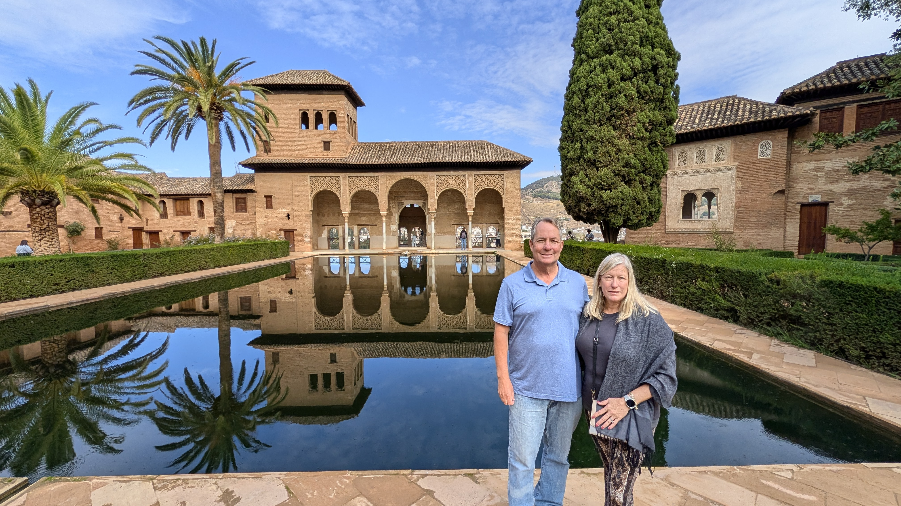

We booked a guided tour, but our guide had the facts without the narrative -- we wouldn't book her again.  Next time, we'd prioritize a guide who can explain the site's sequencing and symbolism.  The Alhambra is vast and easy to misread without context, so a good guide matters. The site is also a steep uphill walk from the center; we took a taxi up and walked down.

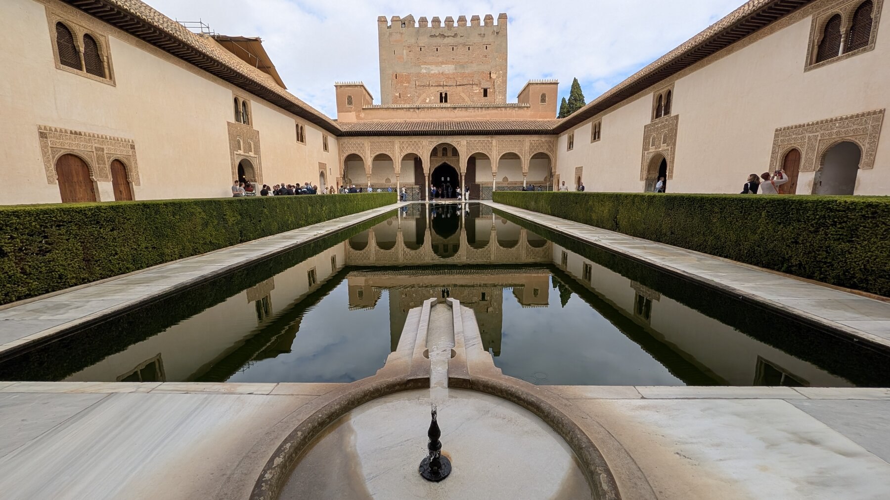

### Sacromonte

After the Alhambra, we spent our remaining time looking for the Granada that doesn't make the postcards.  

The Roma migrated from the Indian subcontinent over a thousand years ago and have been part of Andalusia ever since -- though often at its margins.  In Spain they are often referred to as *Gitanos*, though terminology varies and can be sensitive. Historically marginalized and often pushed to the edges of cities, many settled in the hillside caves of Sacromonte above Granada.

Museo Cuevas del Sacromonte was worth the visit for context. It's small but specific -- more lived history than museum spectacle -- with intimate displays recreating daily life in the cave dwellings before residents were displaced in the 1960s. It adds cultural depth to Granada beyond its Moorish palaces. Take the bus up the hill from town -- the climb on foot is steep enough to regret.

> This was the most "Granada" hour we had outside the Alhambra.  It changed how we interpreted the city's neighborhoods.

### Albaicín

Perched on a steep hillside above the city, the Albaicín is Granada's historic Moorish quarter -- a tangle of narrow streets, viewpoints, and whitewashed homes.  We only skimmed the edge of it on our walking tour.   It gets better the deeper you go -- the tourist shops thin out within a few blocks, the lanes turn residential, and you start noticing the cármenes: traditional Moorish-style houses hidden behind high walls, with interior gardens and fruit trees you can only glimpse through the gates. 

We had saved the Albaicín for unstructured wandering on our last afternoon. A torrential rainstorm ended that plan.  With steep grades and wet stone underfoot, we passed -- practical, but a decision we regret.

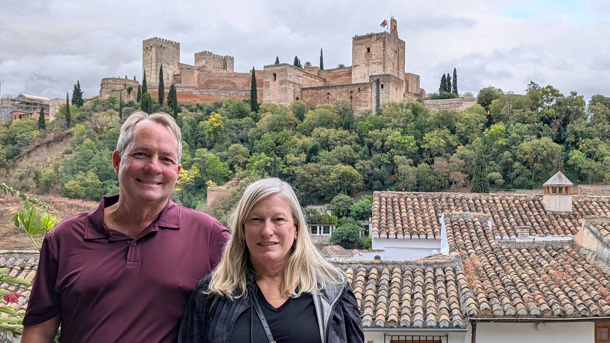

## Where We Stayed

We stayed at [Palacio Gran Via](https://www.barcelo.com/es-es/palacio-gran-via-a-royal-hideaway-hotel/), which is on Gran Via, a busy arterial road.  The traffic was a shock after the car-free quiet of the Cordoba old town.  There are small car-free zones, but you'll be more conscious of cars and noise than in Seville or Cordoba.  

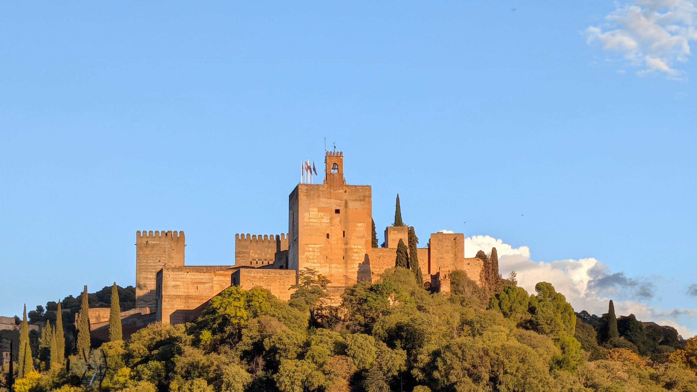

Palacio Gran Via did, however, have a lovely rooftop bar with views of the Alhambra.  The lobby is gorgeously redone, keeping remnants of its early-20th-century life as a bank -- including the original iron vault doors, still in place behind glass.  The hotel earned its rate.

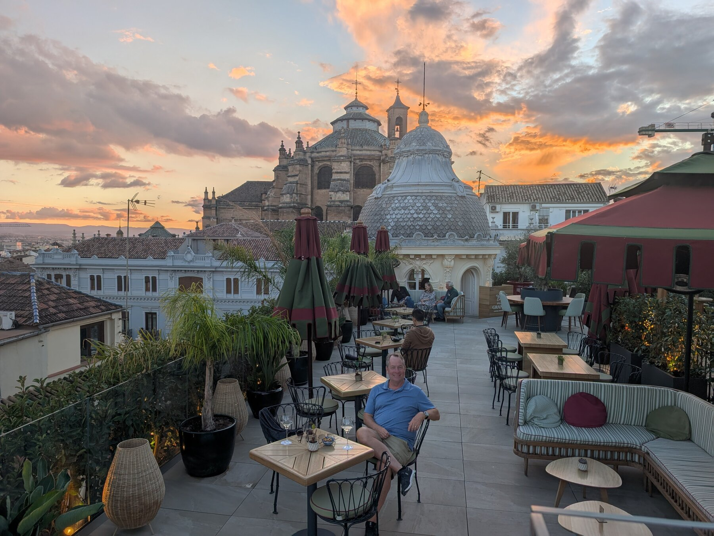

## Food & Dining

Granada is famous for its tapas culture, and for once the reputation holds. In most Spanish cities, tapas are small plates you choose and pay for. Here, they arrive free with each drink -- and far more substantial than you'd expect. Several plates were nearly meal-sized and genuinely good.  

Gayle's [Granada Tapa Tours](https://www.granadatapastours.com/) is the way to learn the system.  After 4 stops, we were overly full on nothing but 'free' tapas. If you skip the tour, just order drinks and let the tapas come to you.

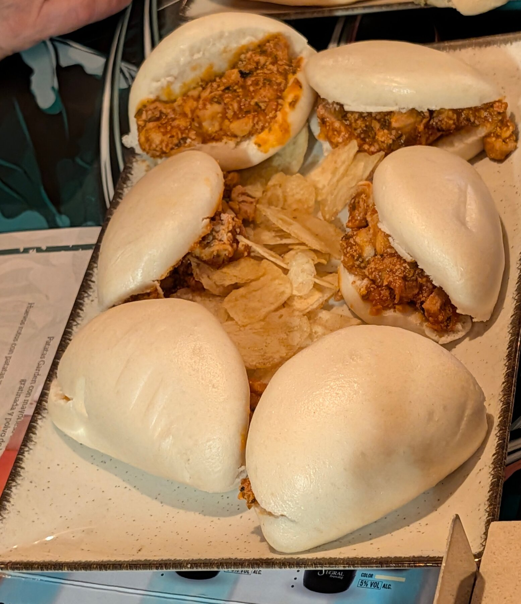

## Practical Tips

Granada demands more logistics than Córdoba. It's larger, busier, and less seamlessly pedestrian, and the Alhambra's hilltop location means you'll need to budget both time and energy to reach it.

Tickets and tours require real advance planning. The complex is expansive enough that a guide adds clarity, and popular time slots -- especially night visits -- disappear quickly. When we checked, evening entries were already sold out nearly eight weeks ahead, even outside peak season.

:::nutshell Granada
verdict: Would Plan Around
duration: 3 days
Best for: Travelers who want a major historical site (Alhambra) plus great food culture, and don't mind hills/crowds.
Stay Overnight: Three nights felt ideal
Don't Miss: The Alhambra (plan several months in advance)
Best Time of Day: Tapas in the evening -- try several spots.
Worth the Splurge: If we return, we would still recommend a private tour of the Alhambra, as the space does not lend itself well to large group tours.
Return Visit: Yes
:::

**Granada is a high-value stop -- but it rewards planners and wanderers differently.**
 The Alhambra lives up to its reputation, but it requires advance planning and stamina (mentally and physically). Beyond that, Granada feels bigger, busier, and a bit more chaotic than Córdoba -- yet also more culturally layered. The Albaicín deserves real time (and good weather), the Sacromonte museum adds important context, and the tapas culture is  delightful rather than gimmicky.

If you come expecting a compact, quiet Andalusian jewel, Granada may feel overwhelming. If you come prepared -- tickets booked, walking shoes ready, afternoons reserved for hilltop wandering -- it becomes a fascinating blend of grandeur, history, and everyday Spanish life.

*Add your photos here*

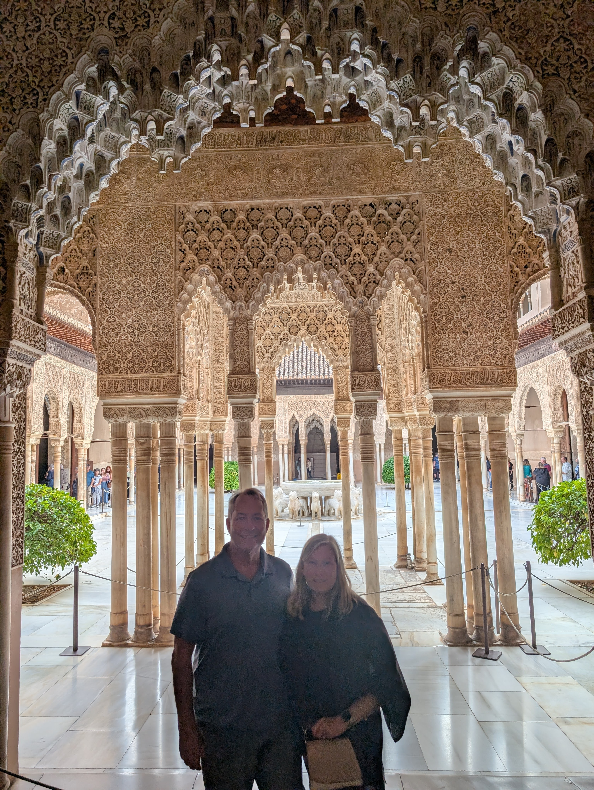

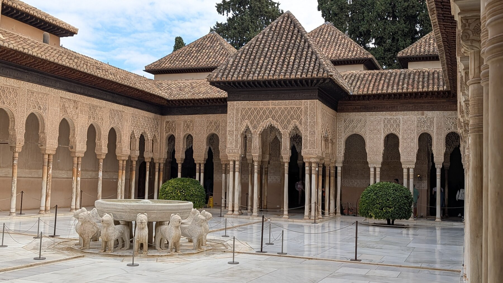

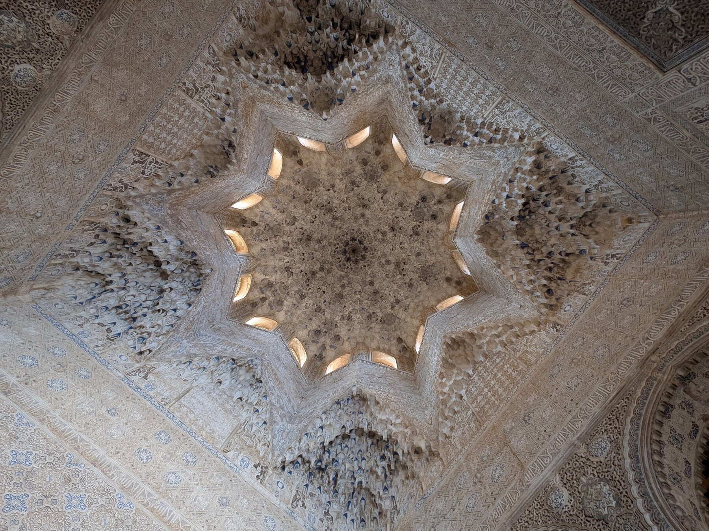

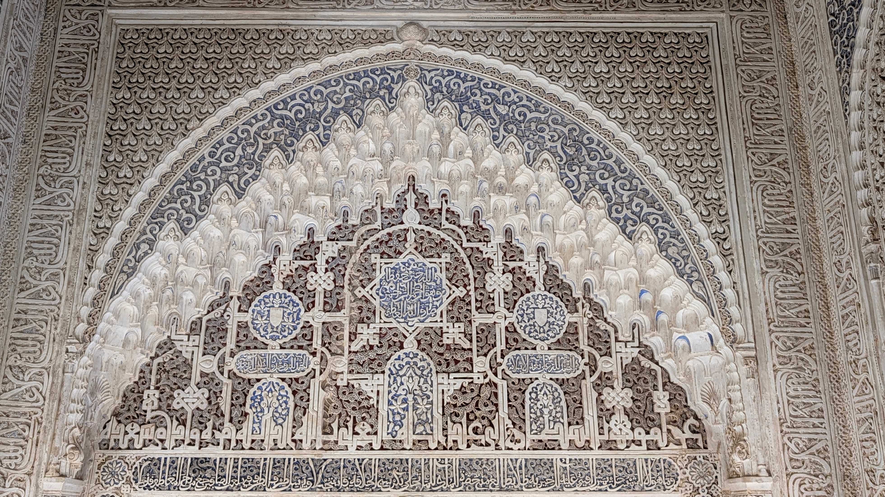

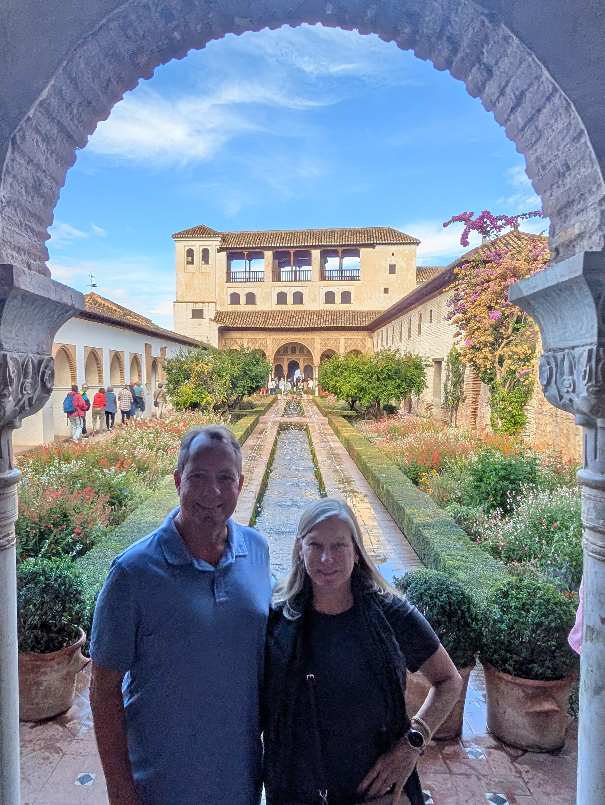

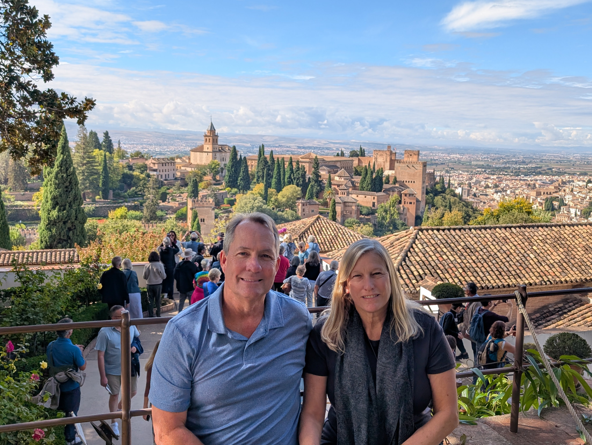

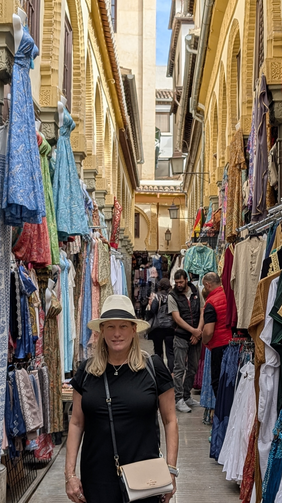
