We visited Madrid for roughly 36 hours each before and after our Andalucian loop, just because it’s where flights from the US arrive/depart (there was a handful of flights in and out of Seville, but they didn’t have good itineraries by our taste).  By design, we didn’t want to make Madrid the focus, we can return there on another trip and/or early November is the ideal weather time once you get further north in Spain.

For reasons I’m not clear on, Tuk Tuk tours are ubiquitous in Madrid – we highly recommend one, some of the major ‘sites’ of Madrid are fairly spread out, so in a 3-hour tour we got to see the Mercado de San Miguel, the modern cathedral, the palace, and various other ‘highlights’.  Just a very comfortable way to get around, you feel like you’re a bit more ‘in’ the city than hiding in an SUV, but you can get to different parts of town easily.

We did make an effort to see several art museums (one before Andalucia, one after).  We visited the Prado, which is The Big Art Museum (analogous to the Louvre), but at the end of a long day and we probably didn’t do it justice – we each had seen it in previous lives and didn’t prioritize it.  We were glad to see a few highlights.  After Andalucia, we visited for the first time the Reina Sofia which is the main modern art museum.  There are several remarkable pieces in there, including some of Dali’s more famous works.  But a common reason to visit is to see Picasso’s Guernica, which each of us thinks we have never seen (though it hung in New York until 1981, Picasso insisted it not display in Spain while Franco lived – so it’s possible I saw it as a child).  As much as I love this piece, and thought I ‘knew’ it, seeing it in person really is stunning.  We were glad to have a guide with us, who could take us left to right and point out details I wasn’t previously aware of.      

We also spent an hour or two at the Madrid Archaeological Museum on our last day.  We were pretty tired by then, but it’s an excellent museum, well-displayed and with some stunning pieces from a variety of ancient eras.

## Overview

Add your introduction to Madrid here...

## What We Did

Describe your activities and experiences...

## Where We Stayed

Share accommodation recommendations...

## Food & Dining

Recommend restaurants and local cuisine...

## Practical Tips

- Getting there
- Getting around
- What to bring
- Best time to visit

*Add your photos here*

---

*Last updated: February 2026*
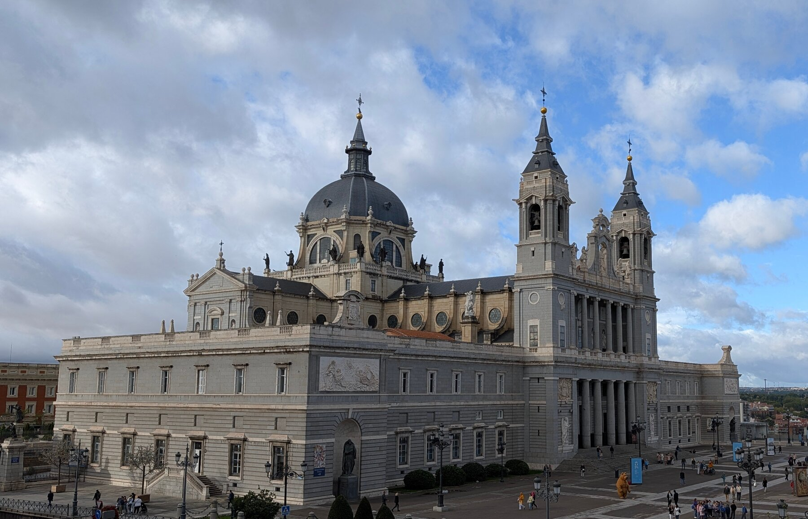

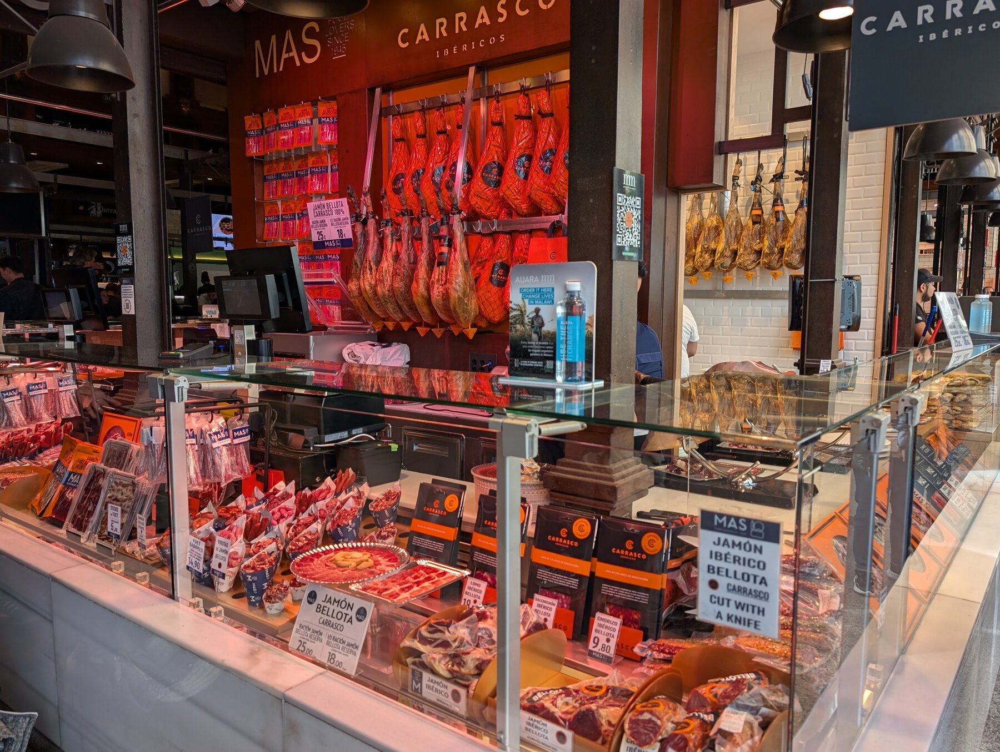

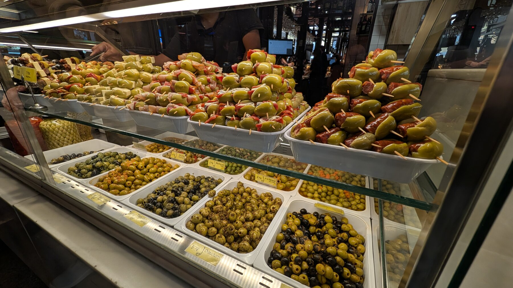

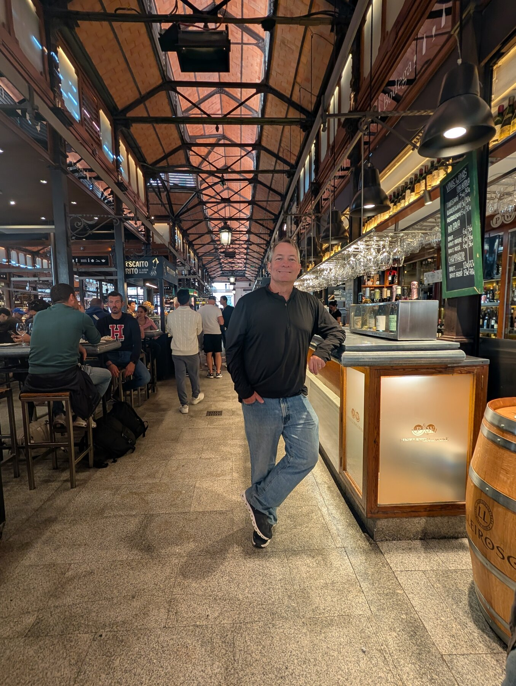

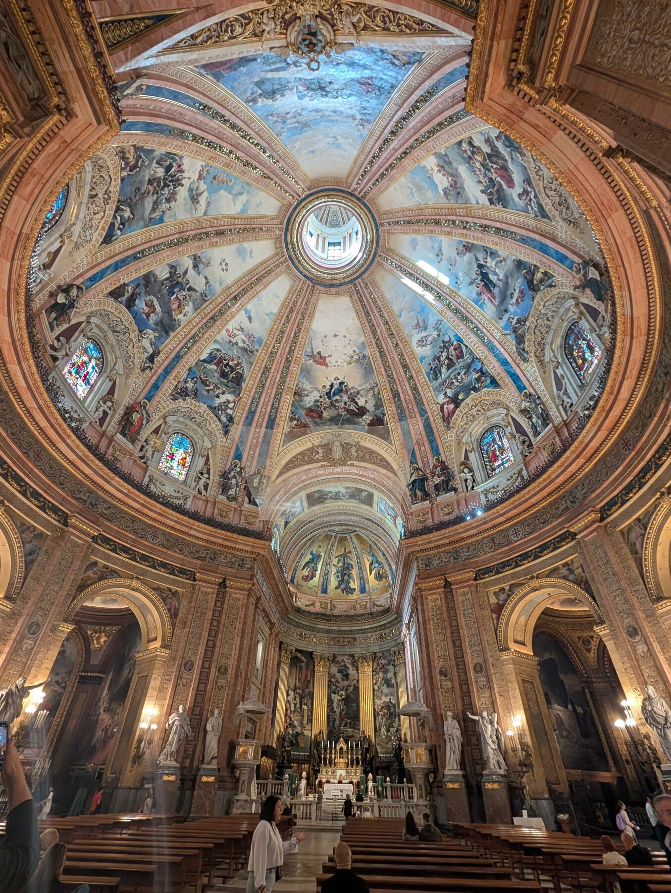

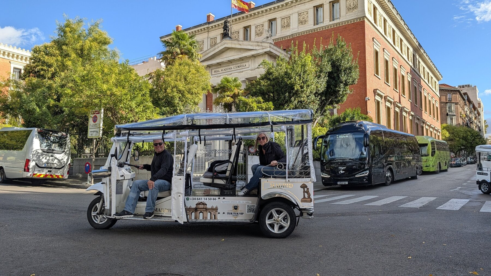

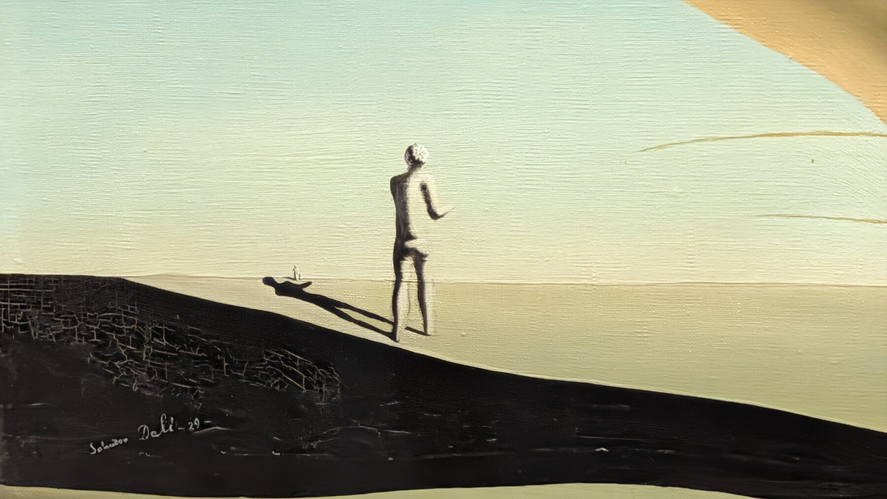

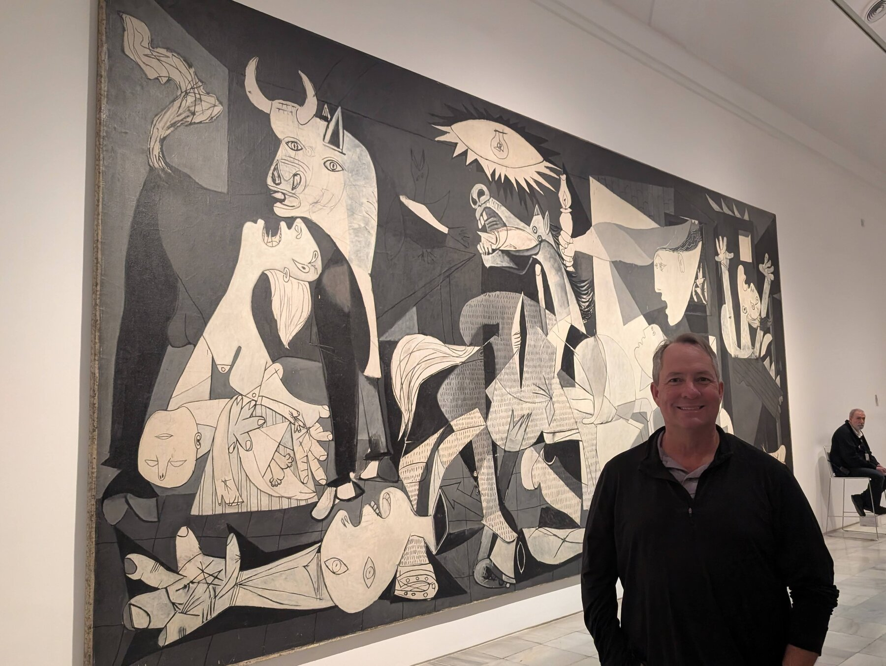

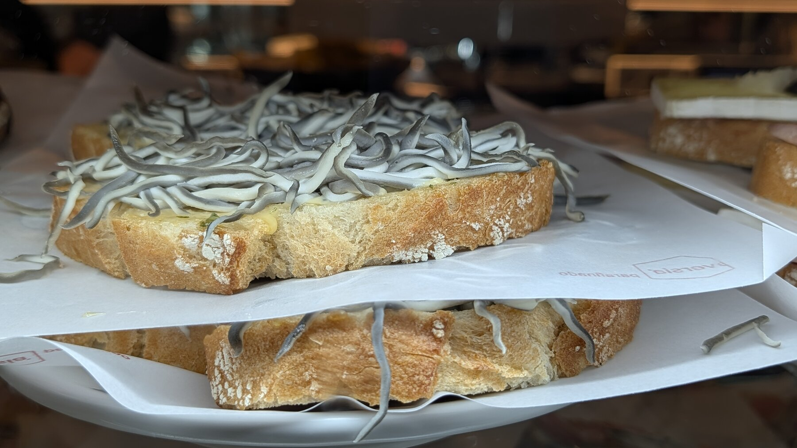

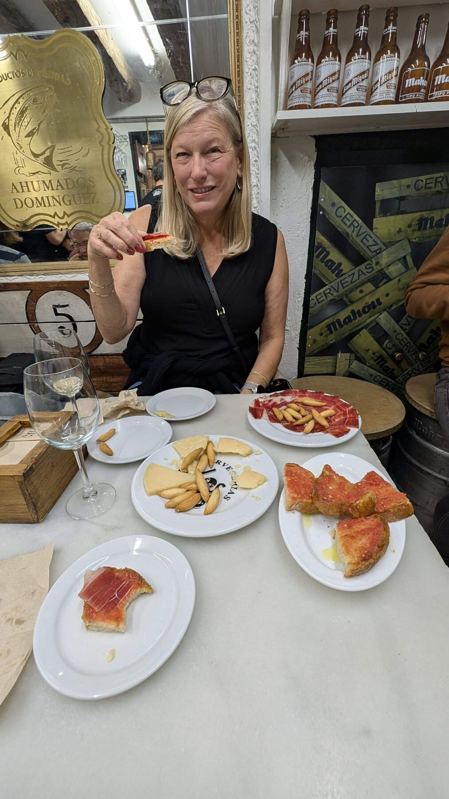

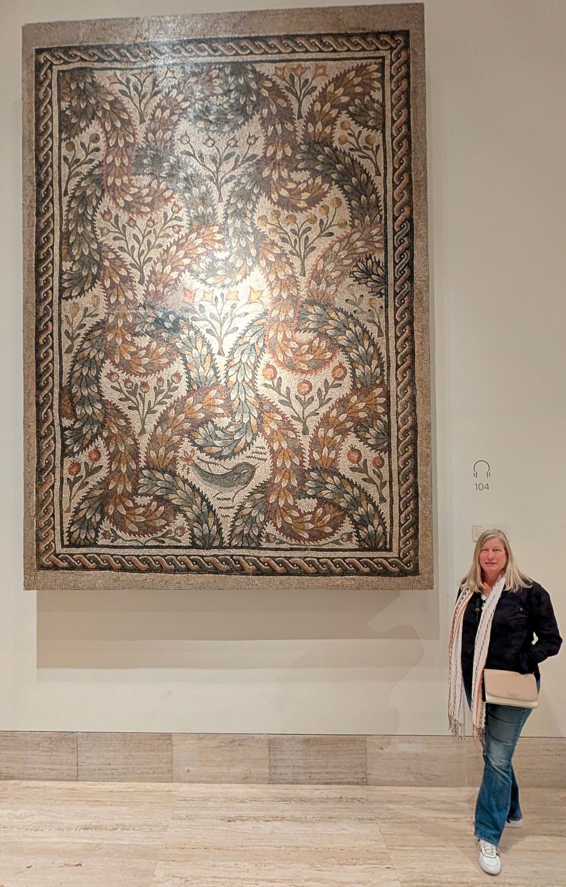

