## Overview

Madrid bookended our trip — 36 hours before the Andalucian loop, 36 hours after — and we were deliberate about not making it the focus. We can return and do it properly; early November in northern Spain is also not the ideal weather window. That said, we came away with more than we expected from the time we had.

## What We Did

The practical reality of Madrid is that its major sites are spread out in a way that Seville and Granada are not. We did a Tuk Tuk tour on the first visit — three hours that covered a lot of ground and worked well as an introduction to the city.  

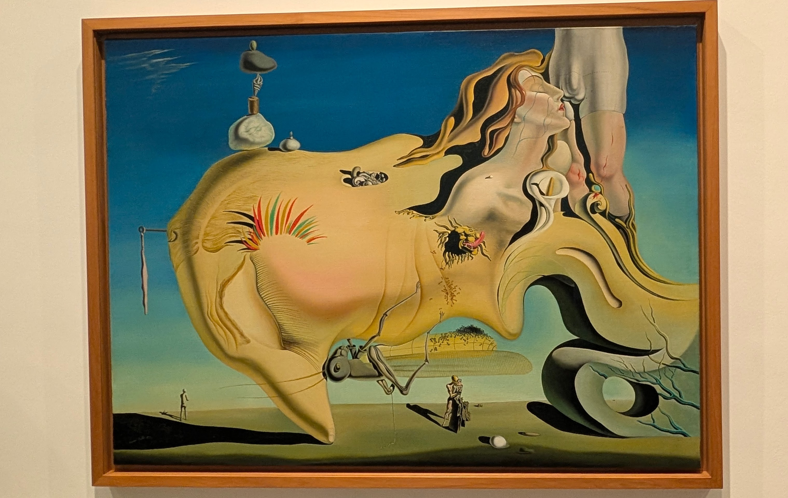

We visited the Mercado de San Miguel near Plaza Mayor — 100% tourist-oriented, but housed in a lovely wrought-iron and glass structure and worth an hour if you're in the area.

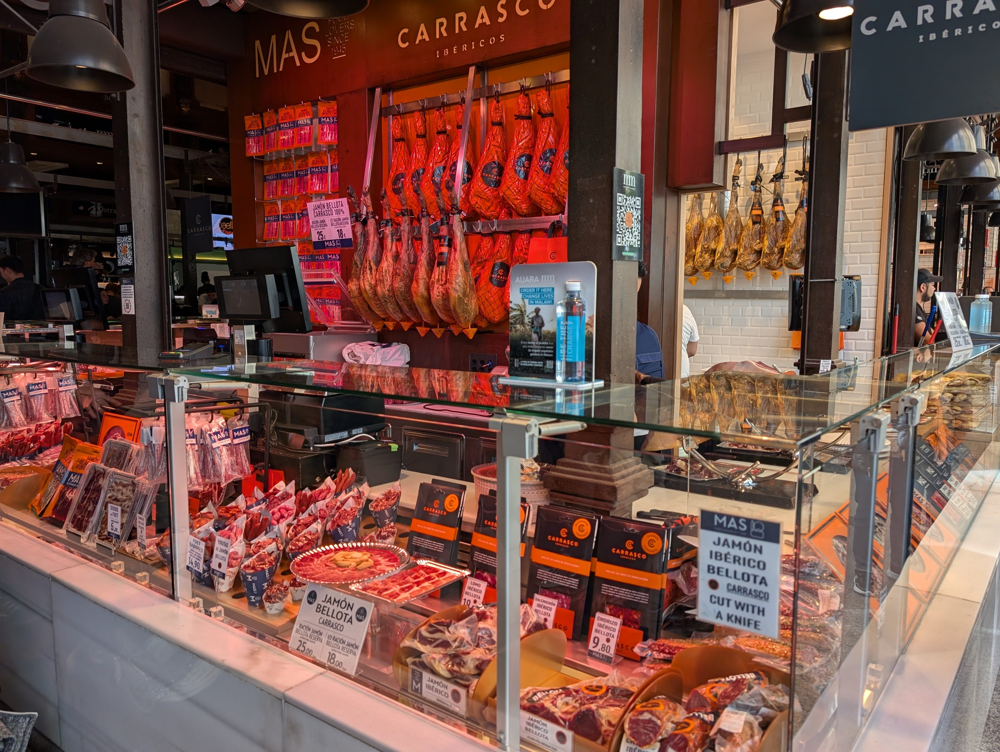

The Tuk Tuk took us also to the modern cathedral and the palace, neither of which we entered.

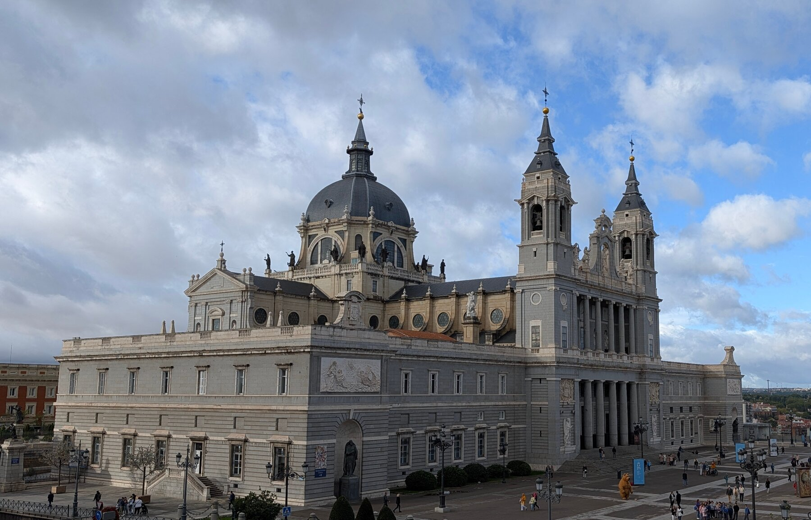

One genuine surprise: we stumbled onto the Real Basílica de San Francisco el Grande almost by accident, and it ended up being one of our favorite churches in Spain. Worth seeking out even if it's not on the standard itinerary.

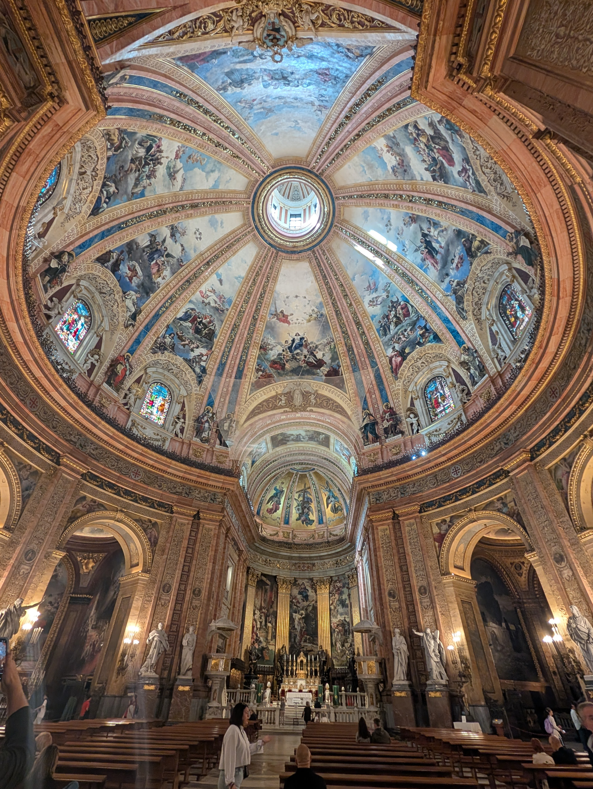

## Museums

We split the art museums across both visits — the Prado on the way in, the Reina Sofía on the way out. The Prado we'd each seen before and caught a few highlights at the end of a long day; we didn't do it justice and knew it. The Reina Sofía, the main modern art museum of Madrid, was new to both of us.

There are several remarkable pieces in Reina Sofía, including some of Dali’s more famous works.  The draw is Guernica. Picasso refused to let it display in Spain while Franco was alive, so it hung in New York until 1981 — which means it's possible I saw it as a child without quite registering what it was. I thought I knew the painting well. Seeing it in person, the scale stops you: it's nearly 12 feet tall and 25 feet wide, and the grey tones that read as flat in reproduction have a texture and weight that photographs don't capture. We had a guide who walked us through it left to right, and I noticed details I'd never seen despite years of looking at it. That hour was worth the trip to the museum on its own.

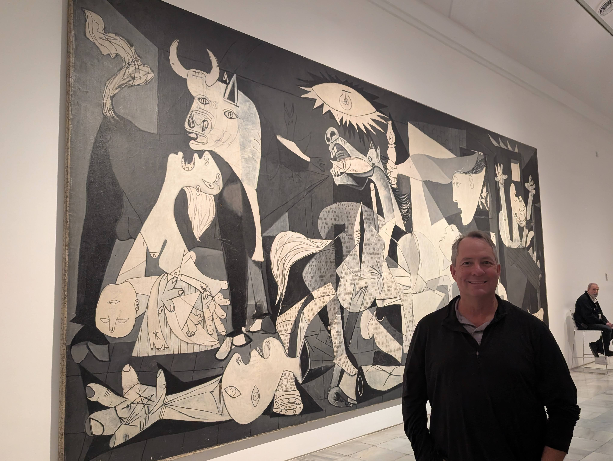

On our last day we spent a few hours at the Madrid Archaeological Museum — we were tired by then, but it's well-curated, well-displayed, and has genuinely remarkable pieces across a wide span of ancient history.

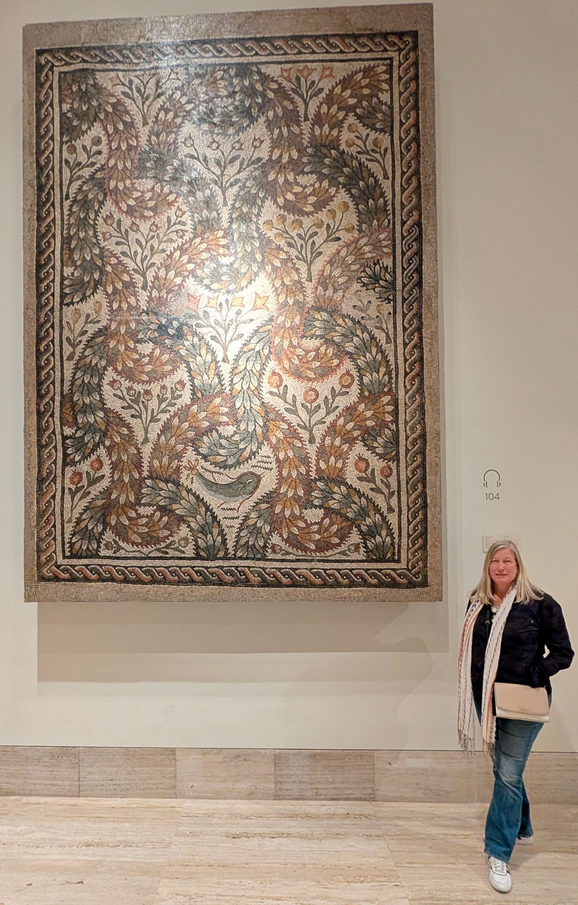

## Where We Stayed

We stayed in different neighborhoods on each visit, which worked well.

After we arrived, we stayed at the [Gran Hotel Inglés](https://www.hyatt.com/mr-and-mrs-smith/en-US/m1391-gran-hotel-ingles).  This is an elegant hotel well-situated near many tourist sites, and has a history dating to 1886.  We were very happy for our 36 hours there.

The [Hotel Fénix Gran Meliá](https://www.melia.com/en/hotels/spain/madrid/fenix-gran-melia) is a bit further from the tourist center but a 5-minute walk from the Archaeological Museum. The 1953 lobby atrium is the kind of space that makes you want to dress for it, which we did. The Beatles and Cary Grant stayed here, which tells you something about the register. As we often notice in Spain, locals look far more put-together — a scarf, a jacket, some deliberate choice.  The contrast was immediately noticable when we re-entered the US.

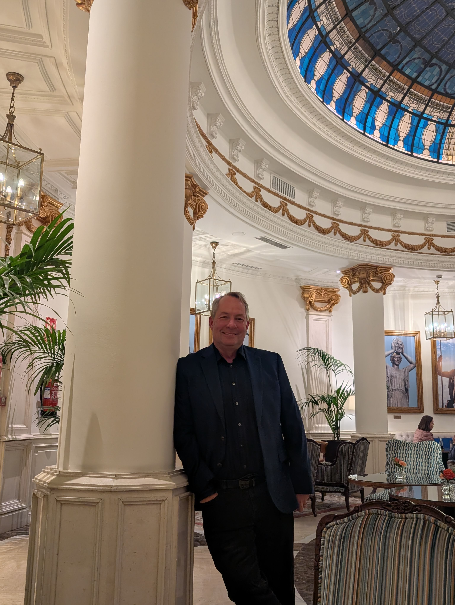

## Practical Tips

Madrid is an enormous city, and its tourist attractions are far more spread out than any of the other cities we visited in Spain.   The Tuk Tuk was a very comfortable way to get around, you feel like you're a bit more 'in' the city than hiding in an SUV, but you can get to different parts of town easily.  The city rewards a longer visit than we gave it.

## 🥜 Madrid in a Nutshell

"Glad We Went"

**Stay Overnight?** Yes, but budget more than 36 hours.

**Don't Miss:** Guernica at the Reina Sofía, with a guide if possible; the Archaeological Museum if ancient history is your thing.

**Best Time of Day:** Museums in the morning before crowds build.

**Worth the Splurge:** A guide for the Reina Sofía — Guernica specifically rewards explanation.

**Return Visit?** Yes, and with more time. This is a city we under-invested in.

*Add your photos here*

---

*Last updated: February 2026*

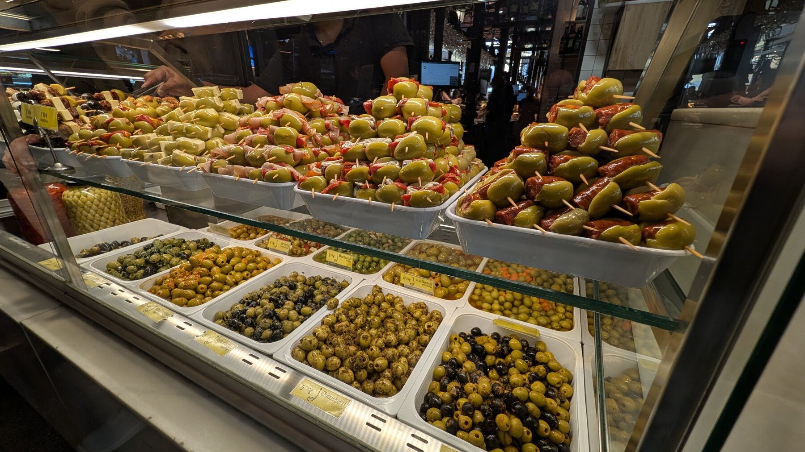

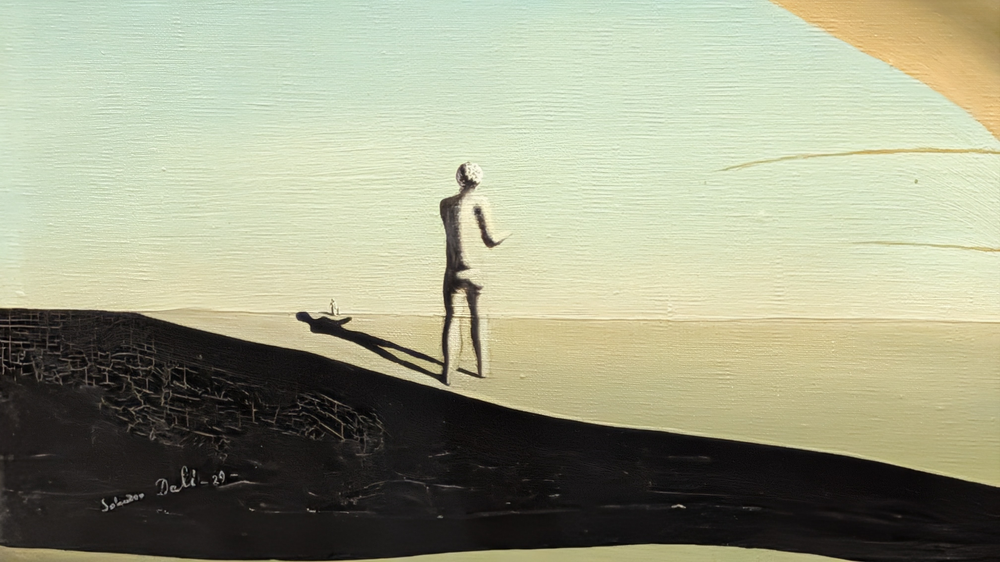

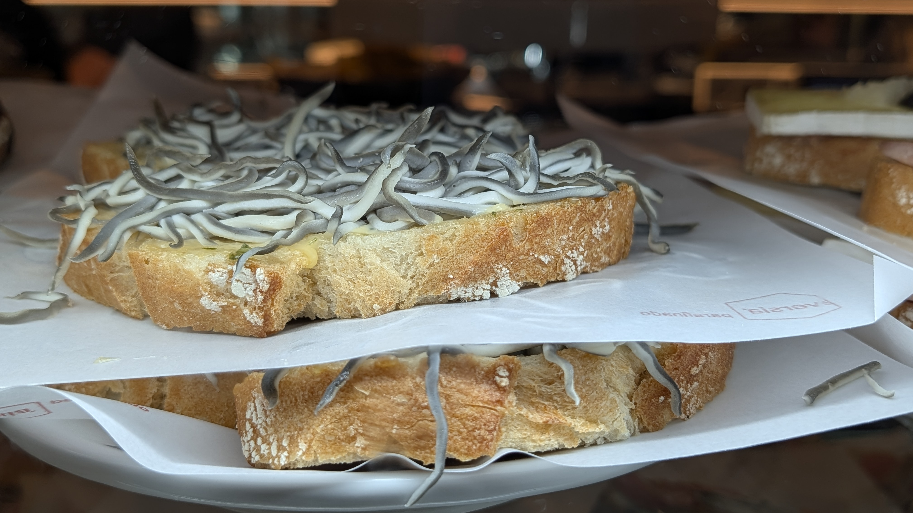

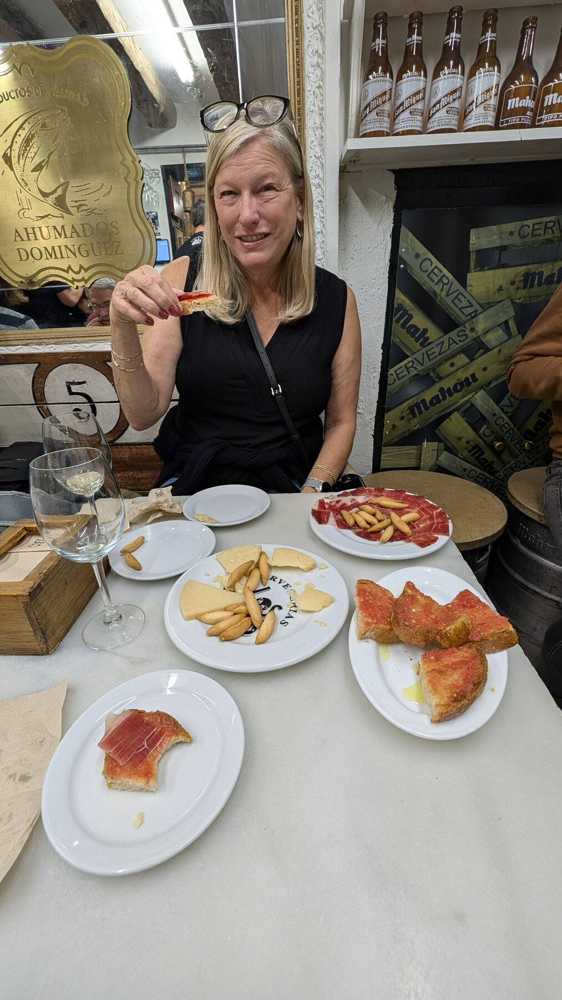

