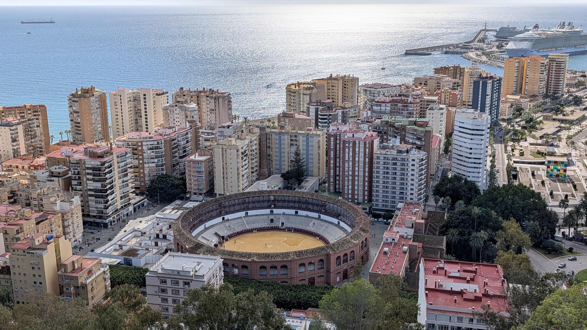
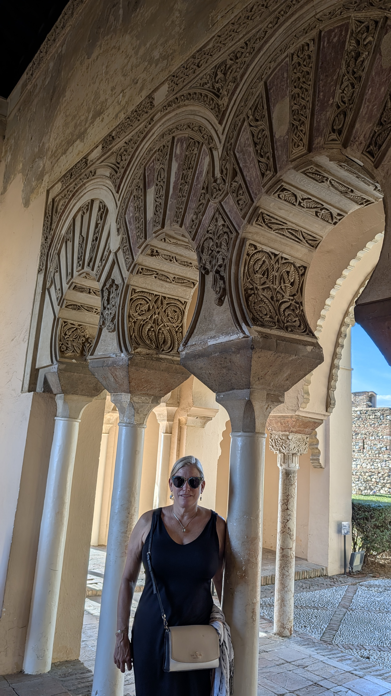
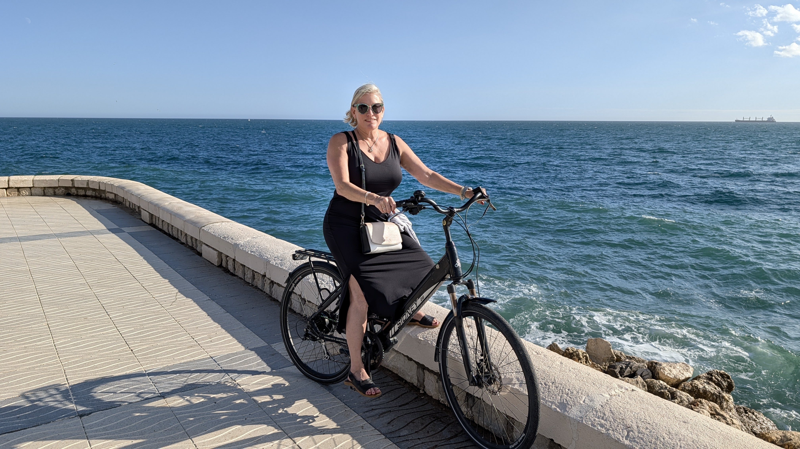

# Malaga

### Malaga

Malaga is interesting in that it’s a combination of a cruise ship port (blech), a seaside destination, largely for Brits, but also has interesting historic sites.  We enjoyed it but I wouldn’t call it a highlight compared to the other areas we saw.  

We strolled around the historic center and shopping street, Calle Larios, which is pedestrian-only and worth some time.

We rented a bike to ride along the seaside.  This was extremely enjoyable and highly recommended.  There are a number of beachside restaurants along the way to stop for a meal or refreshments.

The Gibralfaro Castle is far far above town, and we recommend taking a taxi up there rather than walk (the walk *down* was fine).  The castle has an outstanding view of the Mediterranean, but otherwise isn’t that amazing of a destination.

If you walk 15? Minutes ‘down’ from the castle, you arrive at the Alcazaba of Malaga, an 11thC Moorish palace.  We wandered this for maybe an hour or 90 minutes.  It’s quite beautiful, but suffers if you’ve just been to the Alhambra a few days earlier.  Worth the time, and lovely, but not an e-ticket destination of and in itself.

We really enjoyed our meal at [Tercer Acto](https://www.grupoterceracto.com/) [TA](https://www.tripadvisor.com/Restaurant_Review-g187438-d19462809-Reviews-Tercer_Acto-Malaga_Costa_del_Sol_Province_of_Malaga_Andalucia.html) 4.8 near our hotel, it was Japanese fusion – some Iberian ham, some meat, some fish, some sushi, steak tartar, gyoza, meatballs.

## Overview

Add your introduction to Malaga here...

## What We Did

Describe your activities and experiences...

## Where We Stayed

Share accommodation recommendations...

## Food & Dining

Recommend restaurants and local cuisine...

## Practical Tips

- Getting there
- Getting around
- What to bring
- Best time to visit

## Photo Gallery

*Add your photos here*

---

*Last updated: February 2026*

