## Overview

Málaga keeps almost delivering. It's a cruise ship port -- something you feel immediately after the quieter inland cities -- and a seaside hub for British expats. But it's also a genuinely historic city that keeps surprising you in between.  

The Alcazaba (palace) is lovely -- until you compare it to the Alhambra you saw two days ago. The cathedral has a great story but not a great interior. The shopping street has striking architecture lined with the same brands you'd find in any European city. The bike ride along the coast was genuinely excellent -- but we caught the tail end of the season.

None of this makes Málaga bad. It makes it a city that's hard to judge on its own terms when it comes right between Granada and Seville.

We enjoyed our time here, though fairness requires noting that we arrived in the most old-testament-style rain of a 3-week trip, which may have colored our perspective.

## What Málaga Does Well

But Málaga has moments that belong to no other city. We spent a few hours in the historic center, anchored by Calle Larios -- a pedestrian corridor paved in polished marble that catches the light like an indoor gallery. 

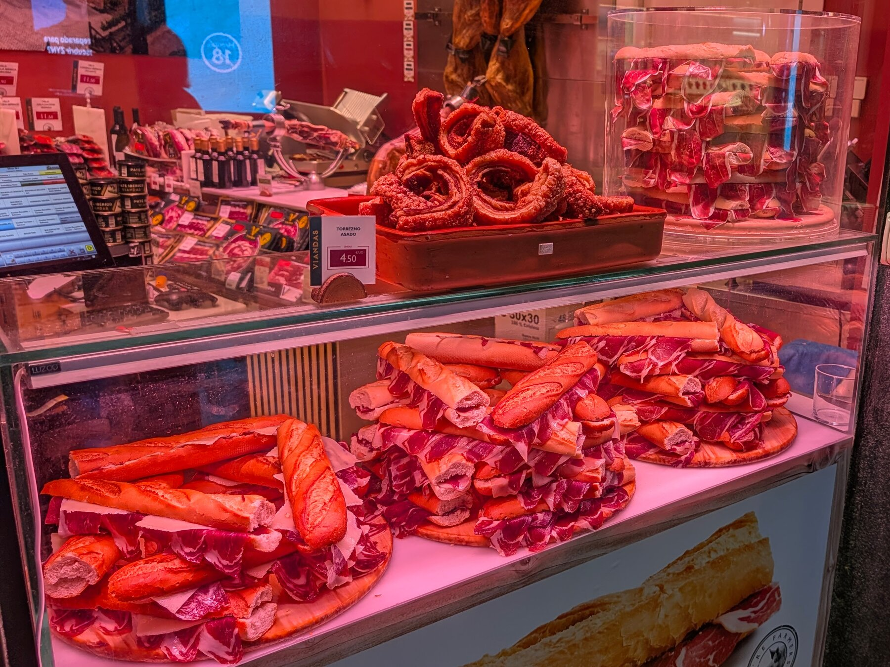

The shops are the usual European brands, but the street itself is worth the walk. Designed in the 1890s, every building corner is curved rather than sharp -- a deliberate choice to pull the sea breeze through the city's dense core. The effect is a street that feels designed, not just built.

In the middle of Calle Larios, a concrete table had drawn a crowd -- locals and teenagers hunched over chess boards with clocks running, spectators standing three deep. It was the least tourist-oriented thing we saw in Málaga's center.

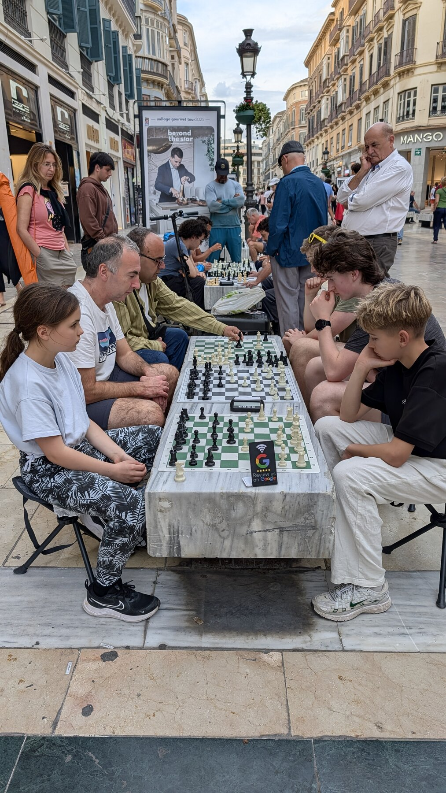

The best few hours we spent in Málaga were on e-bikes, riding the coast. The path is flat, and the e-bikes turned what could have been exercise into a low-effort glide.  In mid-70s late October heat, we focused on the views rather than the pedaling.

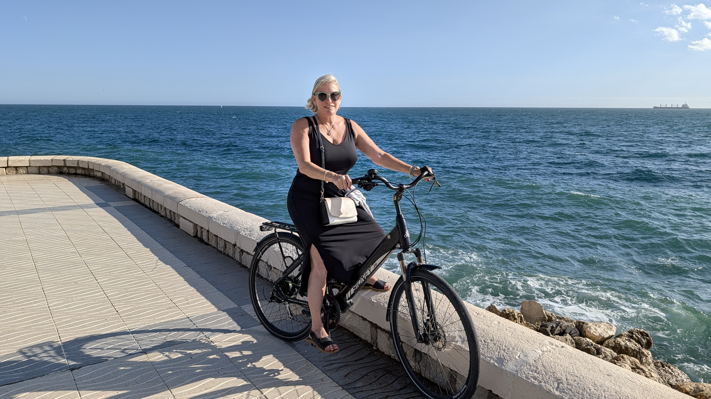

On the return leg, we stopped at a beachside spot where the transition from bike path to cocktail table was about ten feet. We sat under a retractable awning with a refreshing Tinto de Verano, watching the boats, knowing the city center was a short ride away. 

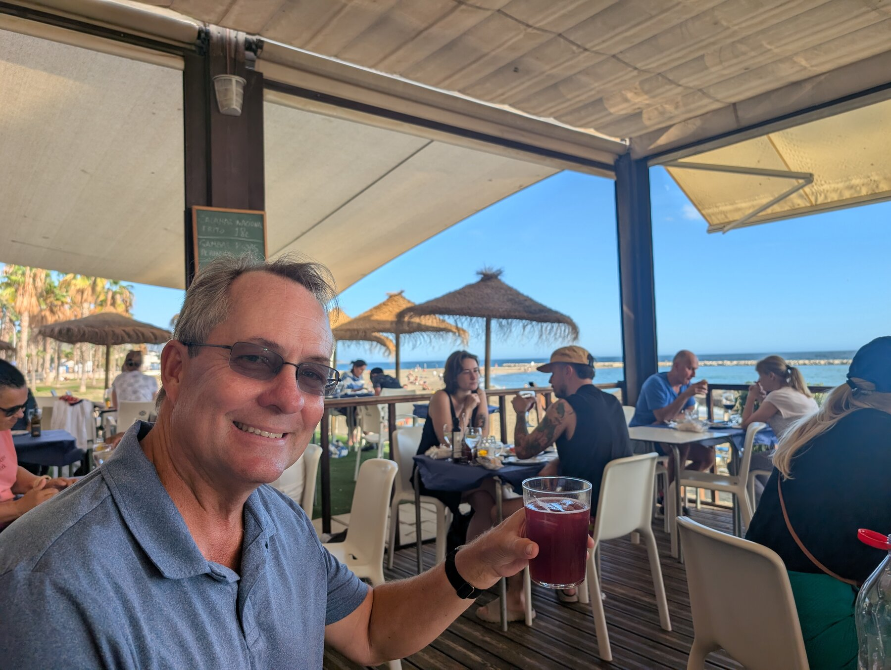

The season was winding down -- beach clubs visible but quiet, the setup still there without the crowds. A month earlier and the energy would have been different. We got the tail end, and it was enough.

That stretch of the afternoon was the most relaxed we felt in Málaga.

It’s also the one part of the city that doesn’t suffer from the comparison problem. The historic sites do.

Gibralfaro Castle is far above town -- taxi up, walk down. The 360-degree view of the Mediterranean, the coastline, and the bullring below is the reason to go. The castle itself is mostly fortified walls -- an excellent viewing platform, but not much to see once you've taken it in.

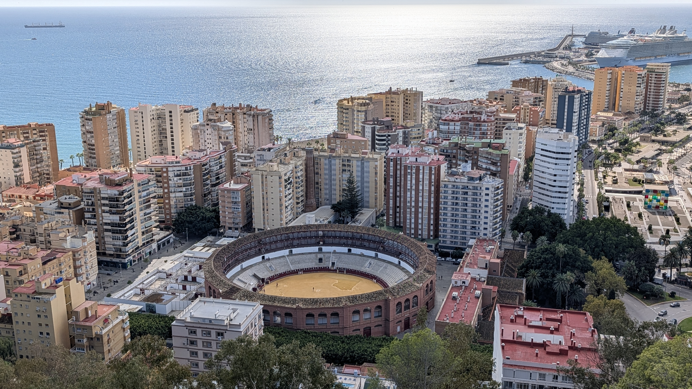

The Alcazaba is an 11th-century Moorish fortress-palace about 15 minutes' walk downhill from Gibralfaro -- the two were once connected as a single defensive system. Where the Alhambra overwhelms with ornament, the Alcazaba works on a smaller scale: compact sun-drenched courtyards, brick arches, orange trees, and the sound of running water doing most of the work. The decoration is restrained and earlier in style -- this is the fortified original, not the refined showpiece.

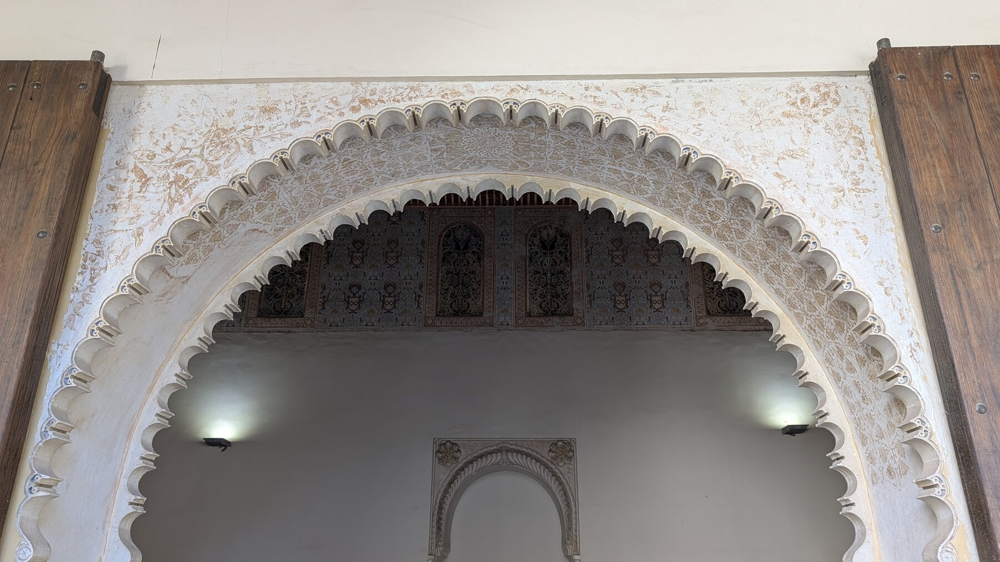

Because it's overlooked in favor of Granada, the Alcazaba lacks the timed-entry pressure and tour-group crush of the Alhambra. We lingered in courtyards without being ushered along, and the upper terraces have Mediterranean views that Granada can't offer. An hour was enough to appreciate it without feeling rushed.

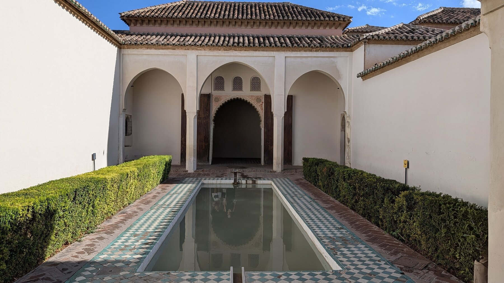

It's not the Alhambra. But on a quiet morning with the sea below, it doesn't need to be.

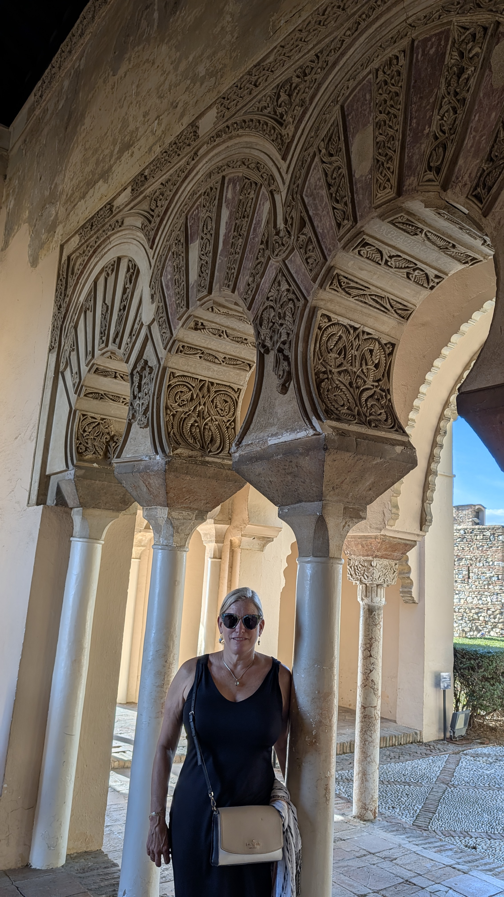

At the base of the Alcazaba, a Roman amphitheater sits in the open -- 1st century BCE stonework with the Moorish fortress walls rising directly above it. The layering is blunt: Rome built the theater, the Moors built on top of it, and modern Málaga put a walkway through the middle. Two thousand years of the city's history visible in a single frame.

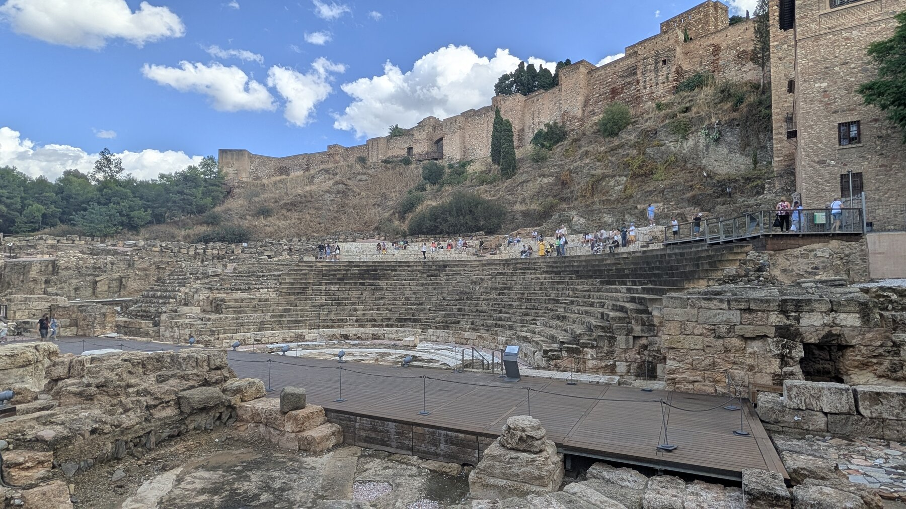

The Málaga Cathedral is worth a look as you pass.  It is notable for remaining unfinished, one tower short.  Many sources say this is a consequence of funds being diverted to the American Revolution, though there are other theories. That detail alone is worth stopping for.

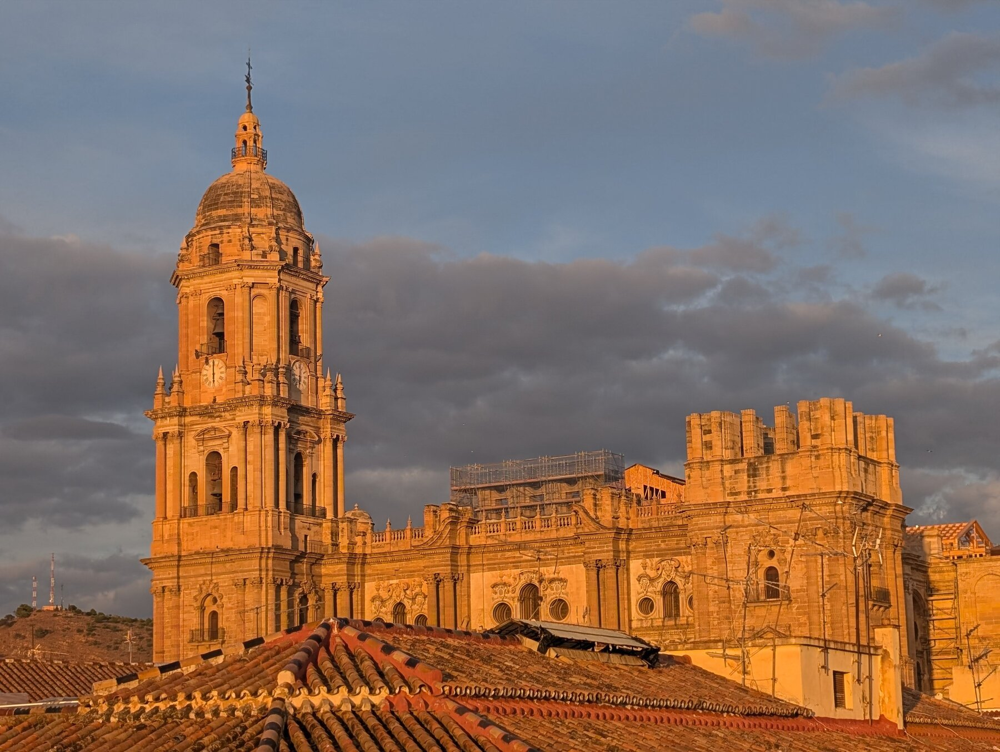

## Where We Stayed

We stayed at [Vincci Larios Diez](https://en.vinccihoteles.com/hotels/malaga/vincci-larios-diez/), largely for the top-floor 'Luxe Essence City Views' room -- a corner balcony with the cathedral's lone tower and the rooftops of Calle Larios spread out below. Champagne on the balcony at sunset, with the city at a murmur beneath you, was the high point of the stay.

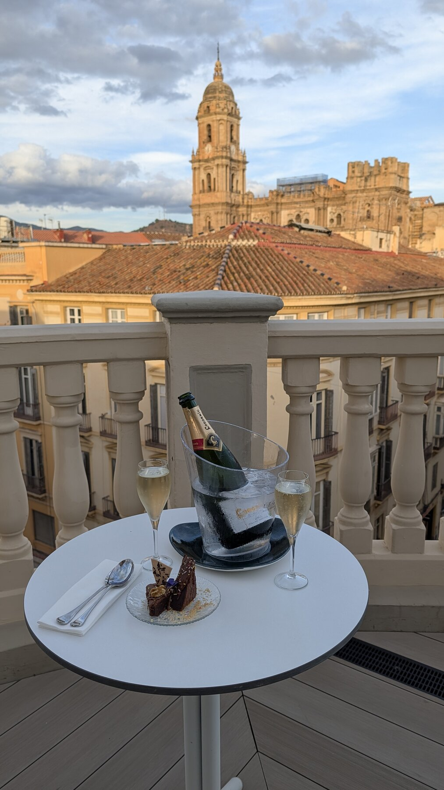

The hotel itself is polished but impersonal -- high-end chain efficiency without much local texture. It hits every four-star note but none of the human ones. The location, steps from Calle Larios, is the real asset. We'd book the view room again; we wouldn't write home about the lobby or the adequate service.

## Food & Dining

[Tercer Acto](https://www.grupoterceracto.com/), near our hotel, is owned by Antonio Banderas -- a Málaga native investing back in his hometown. The menu is Japanese-Mediterranean fusion that sounds like a mistake on paper: Iberian ham alongside sushi, gyoza next to meatballs.  It works.  We'd go back just for the steak tartare.

Tercer Acto is the polished option. For something grittier, [Caravana -- Cocina Viajera](https://www.instagram.com/caravanamalaga/) is a few blocks from the polished marble of Calle Larios and feels like a different city. It's narrow, loud, and entirely focused on the kitchen. The ceviche had a Latin American sharpness the Spanish versions usually lack, and the burger was better than it had any right to be. The kind of place you stumble into and immediately wish you had a second night to come back.

## Practical Tips

The downtown is pedestrian-only, and lively in good weather. We arrived in a downpour, which turned the last stretch to the hotel into a soggy luggage drag.

Taxi up to Gibralfaro, walk down. 

If the weather is good, the bike ride along the coast is the best few hours you'll spend here.  We chose [eBike Malaga](https://ebikemalaga.es/) from the many options near the cruise terminal. 

Málaga didn't need to compete with Granada or Seville. We just couldn't help comparing. On its own terms -- the coast, the food, the marble streets -- it earned its two days.

:::nutshell Malaga
verdict: Lovely but Optional
duration: 2 days
Stay Overnight: One night is enough -- two if the weather is good and you want the bike ride plus the historic sites at an unhurried pace.
Don't Miss: The bike ride east along the coast (west toward the airport is industrial); the Alcazaba if you haven't just come from Granada.
Best Time of Day: Castle and Alcazaba in the morning; bike ride in the afternoon.
Worth the Splurge: Spring for the view room at whatever hotel you pick -- Málaga earns it.
Return Visit: Probably not a priority, but we'd go back in better weather without hesitation.
:::

*Add your photos here*

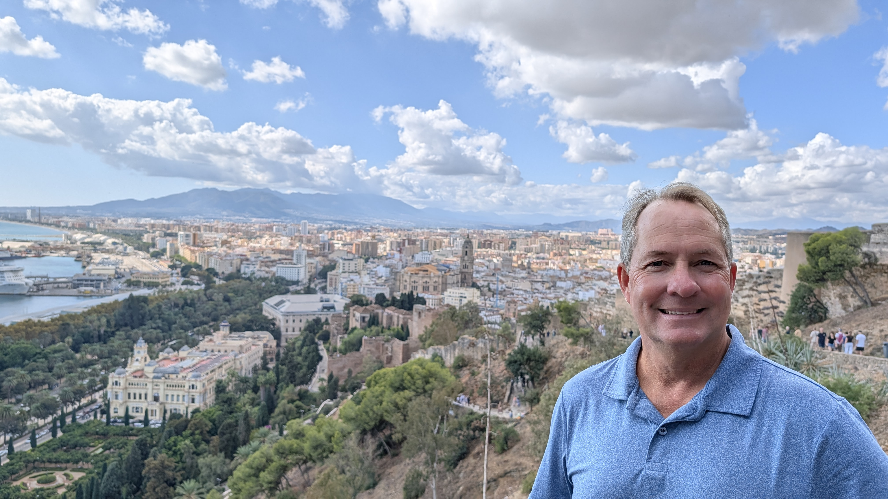

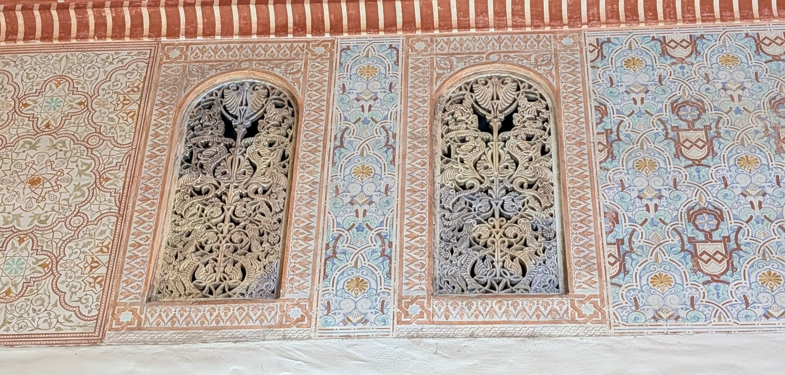

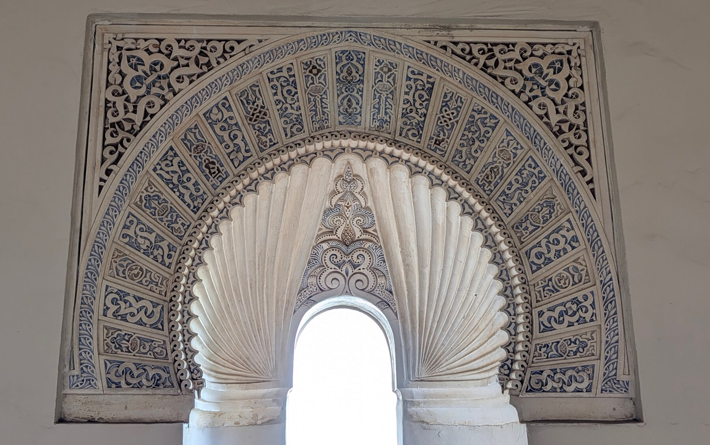

