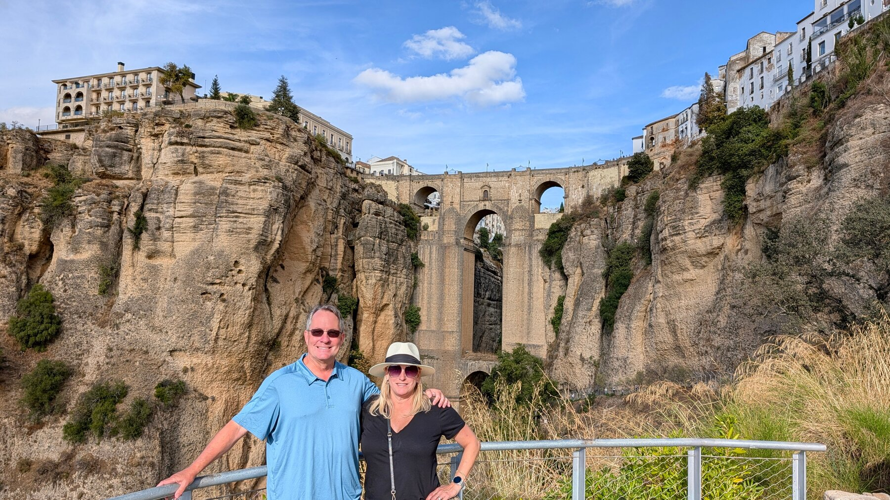
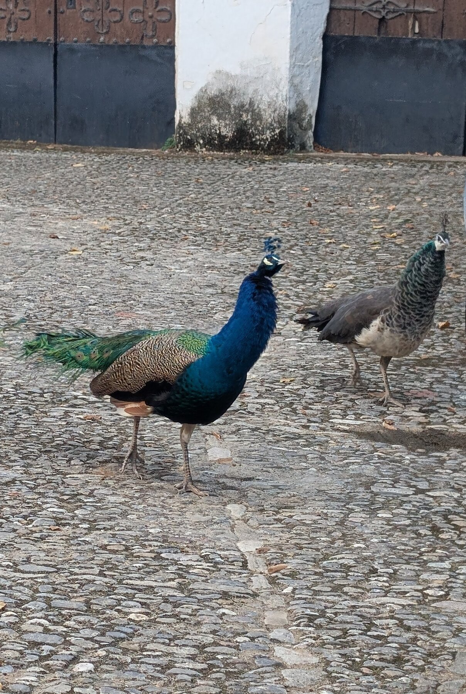
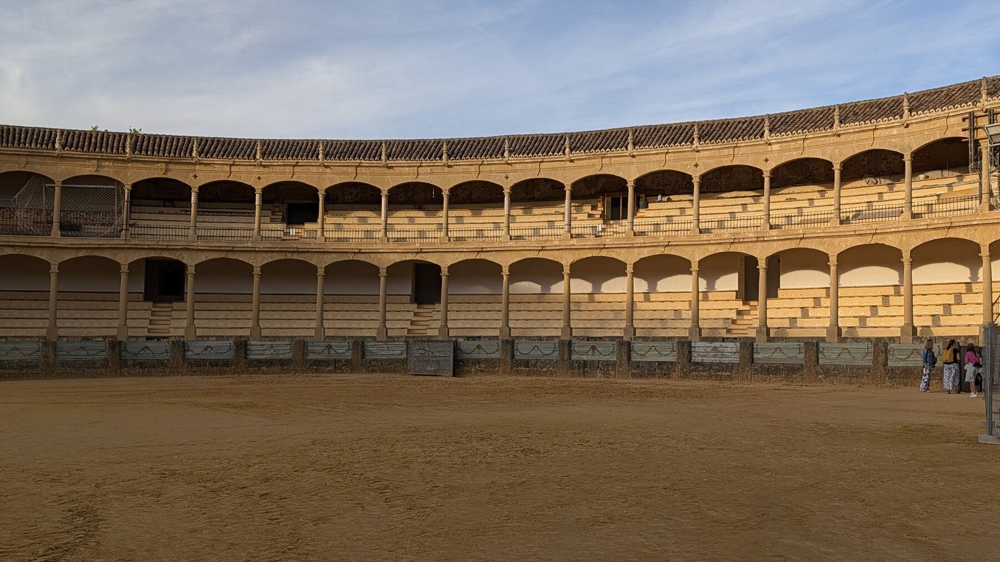

Ronda is the best-known southern hill town, and is a very common day trip destination because it can be done from Seville or Malaga.  Rick Steves recommended spending a night there, and we’re glad we did.  It’s an enchanting location, with a remarkable 18th-century stone bridge over a yawning gorge, which is beautifully well-lit.  Unlike many of the other small villages, there’s enough infrastructure there and things to see that a night seemed well worth it.

We saw a [Spanish Guitar show](https://www.rondaguitarmusic.com/) the evening we were there, and highly recommend it.  It was only 50-60 minutes, which is just fine (we went 7-8pm and still enjoyed dinner afterwards), and while clearly set up for tourists, we learned quite a bit about different styles of Spanish guitar music.

There is a cave outside of town [Cueva Pileta](https://wagonersabroad.com/ronda-spain-cave/) with ancient (tens of thousands of years old) cave paintings, which I wish we’d made time for, the reviews look amazing but we sorta missed this in planning.

By and large, Ronda is fun just to wander – great views in many places, and enough interesting sites to make it a perfect 24 hours destination.

## Overview

Add your introduction to Ronda here...

## What We Did

Describe your activities and experiences...

## Where We Stayed

Share accommodation recommendations...

## Food & Dining

Recommend restaurants and local cuisine...

## Practical Tips

- Getting there
- Getting around
- What to bring
- Best time to visit

## Photo Gallery

*Add your photos here*

---

*Last updated: February 2026*

