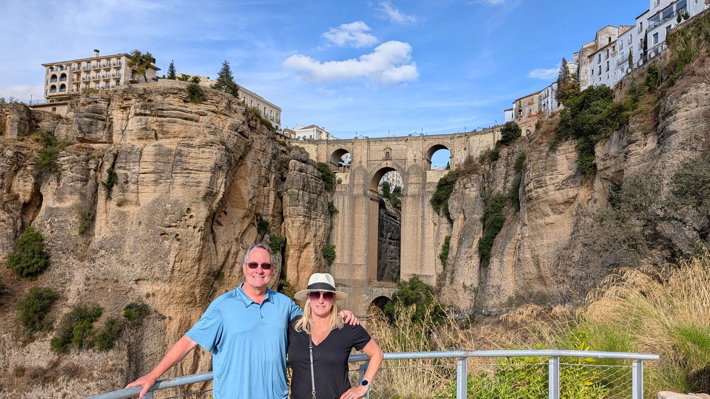
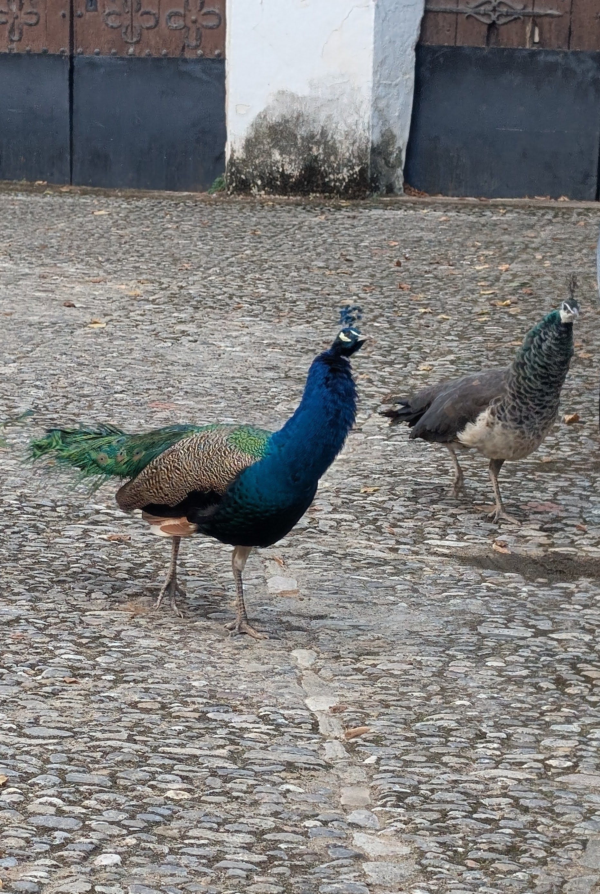
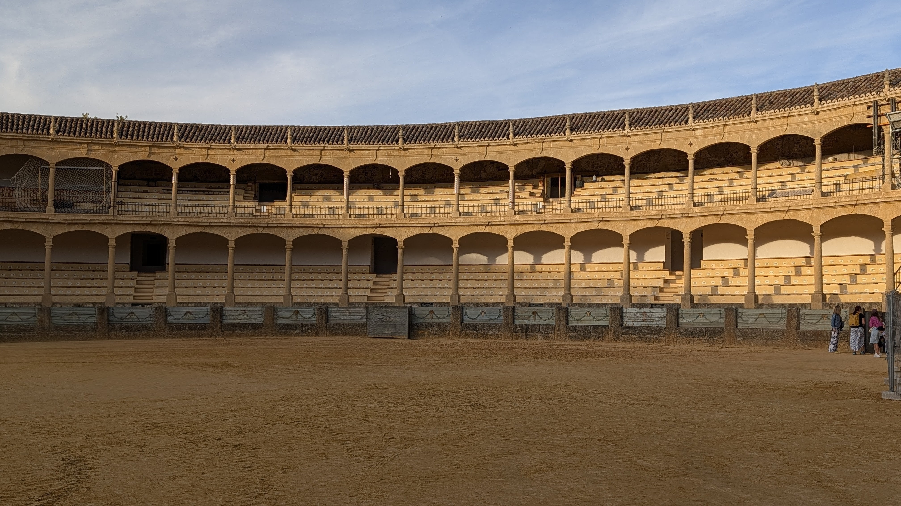

## Overview 

Ronda may be the most famous of Andalusia’s **Pueblos Blancos** — and unlike many famous places, it actually earns the reputation.  Rick Steves recommended spending a night rather than day-tripping from Seville or Málaga, and he's right. The bridge alone justifies the overnight.

## What We Did

The Puente Nuevo — "new bridge," built in 1793 — spans a 400-foot gorge that splits old Ronda from new. It's the kind of thing that photographs well and then somehow exceeds the photograph in person. At night, floodlit from below, it's genuinely hard to look away.

A path winds down from the old town to several viewpoints along the gorge, and it’s not obvious where to stop.  Partway down the gorge is a paid attraction called [Tagus Gorge](https://desfiladerodeltajo.info/). We paid about €5 for access to one of its viewpoints, which was excellent.  There are other viewpoints "further down" but the day we were there it was plenty hot so we didn't feel the need to go much farther down for a better view.

We were there on Halloween, which turns out to be worth knowing about. The town center was full of kids trick-or-treating in the downtown shops, and the bridge was lit up behind a queue of children waiting for a haunted house. 

> Halloween is apparently rapidly overtaking Día de los Muertos as a Spanish holiday — something we didn't expect to learn in an 18th-century Andalusian hill town.

We saw a [Spanish Guitar show](https://www.rondaguitarmusic.com/) the evening we were there, and highly recommend it.  It was only 50-60 minutes, which is just fine (we went 7-8pm and still enjoyed dinner afterwards), and while clearly set up for tourists, we learned quite a bit about different styles of Spanish guitar music.

One thing we wish we'd planned for: [Cueva Pileta](https://wagonersabroad.com/ronda-spain-cave/) a cave outside town with paintings tens of thousands of years old. We missed it in planning. By all accounts, it's exceptional, especially for those (ahem) obsessed with ancient sites.

Beyond the specific sites, Ronda rewards wandering. Lookouts appear around most corners, and the old town is compact enough that you won't feel like you're missing anything.

## Where We Stayed

We stayed at [Hotel Montelirio](https://www.hotelmontelirio.com/en/).  It's a lovely hotel, but the real reason to book it is the gorge view. Book a room facing the bridge; the difference between that and a standard room is the difference between a good stay and a memorable one.

## Food & Dining

Our restaurant luck in Ronda was less than perfect, so we have nothing to suggest here.

## Practical Tips

Ronda is compact — 10-15 minutes across the tourist zone on foot. Parking is scarce and train access is limited, so a car shuttle or taxi drop-off works well. Once you're there, you don't need a car.

## 🥜 Ronda in a Nutshell

"Would Plan Around"

**Stay Overnight?** Absolutely: the bridge lit up alone is worth the overnight.

**Don't Miss:** The Puente Nuevo from below; Cueva Pileta if you plan ahead (we didn't).

**Best Time of Day:** Late afternoon light from the gorge viewpoints; after dark from the hotel.

**Worth the Splurge:** A room with a gorge view at Montelirio — don't book a standard room here.

**Return Visit?** Yes.  This is a place worth lingering in, not just checking off.

*Add your photos here*

---

*Last updated: February 2026*

