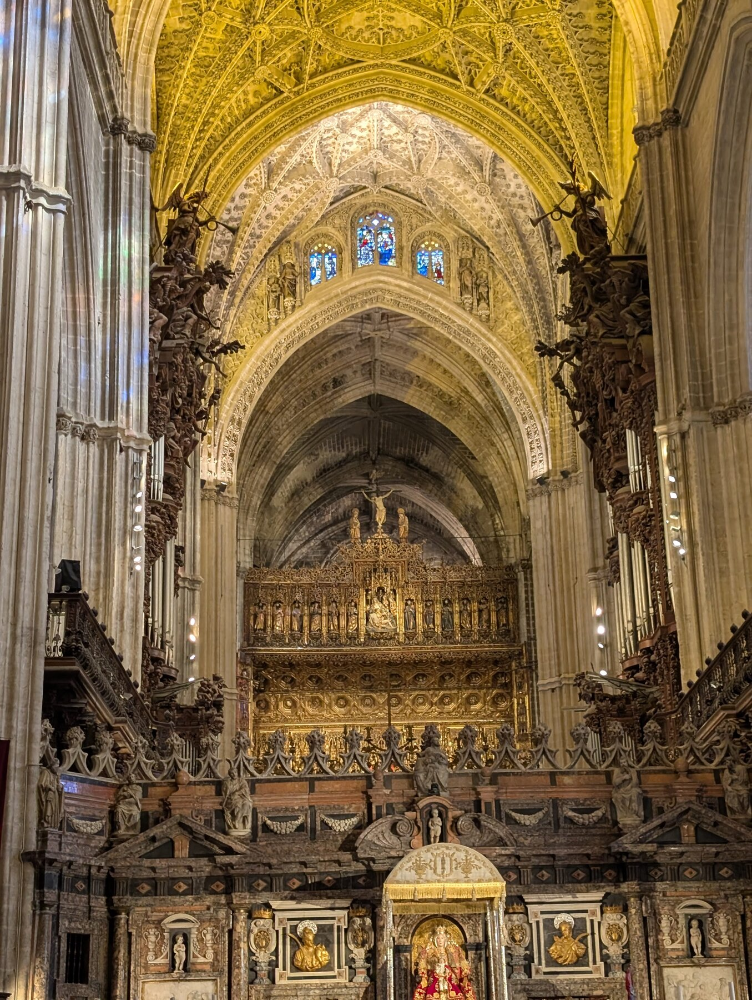
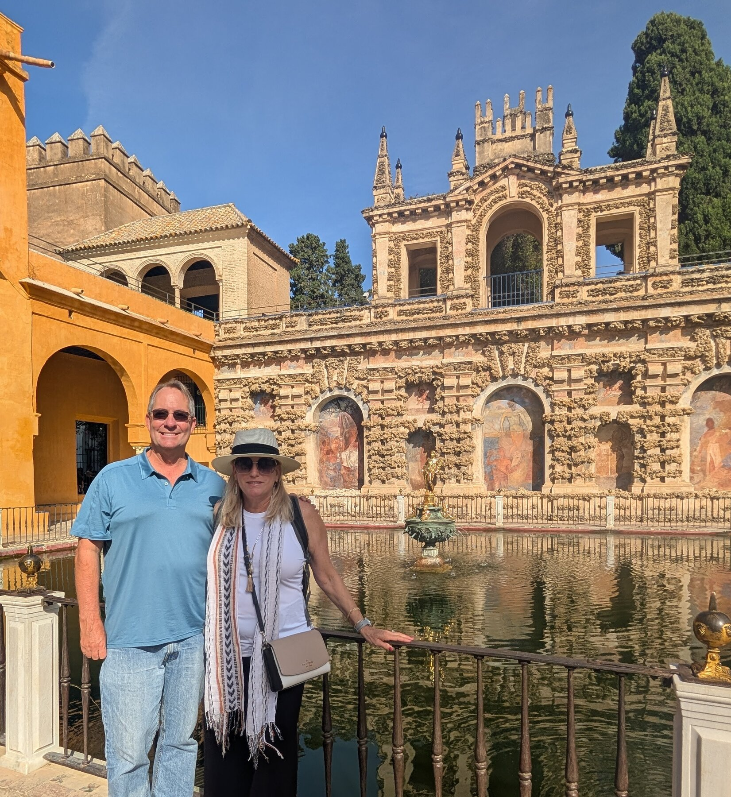
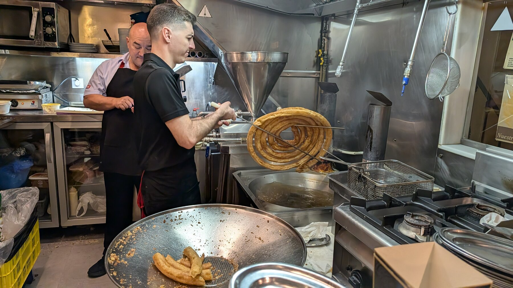
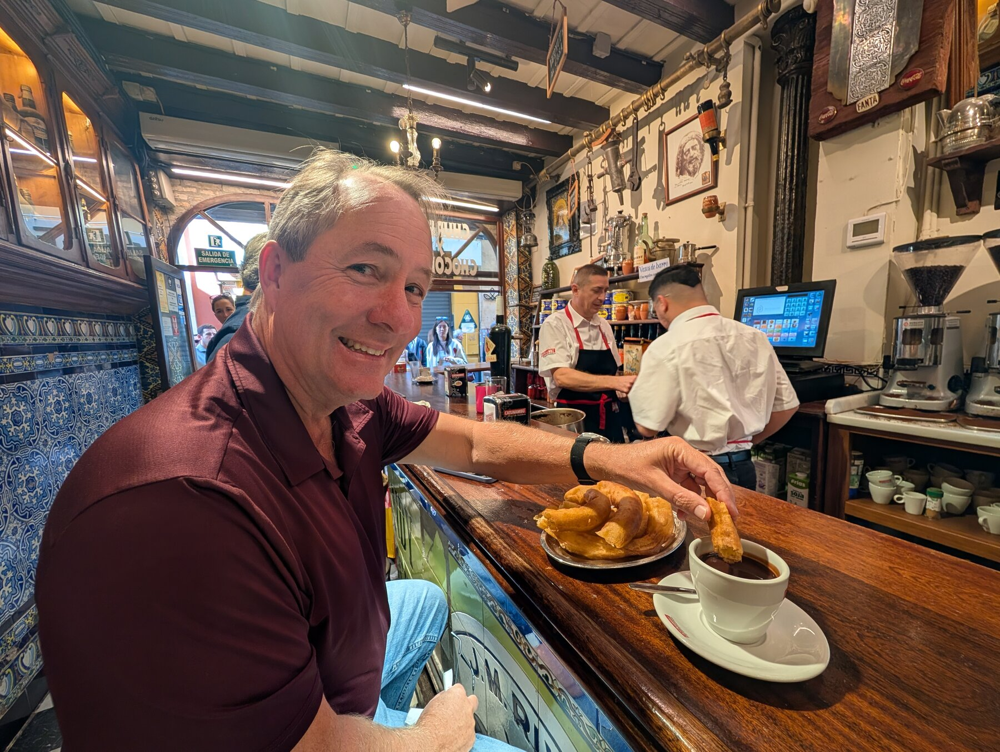
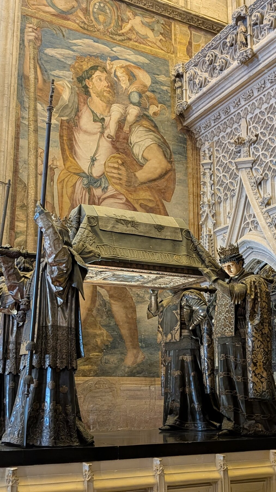
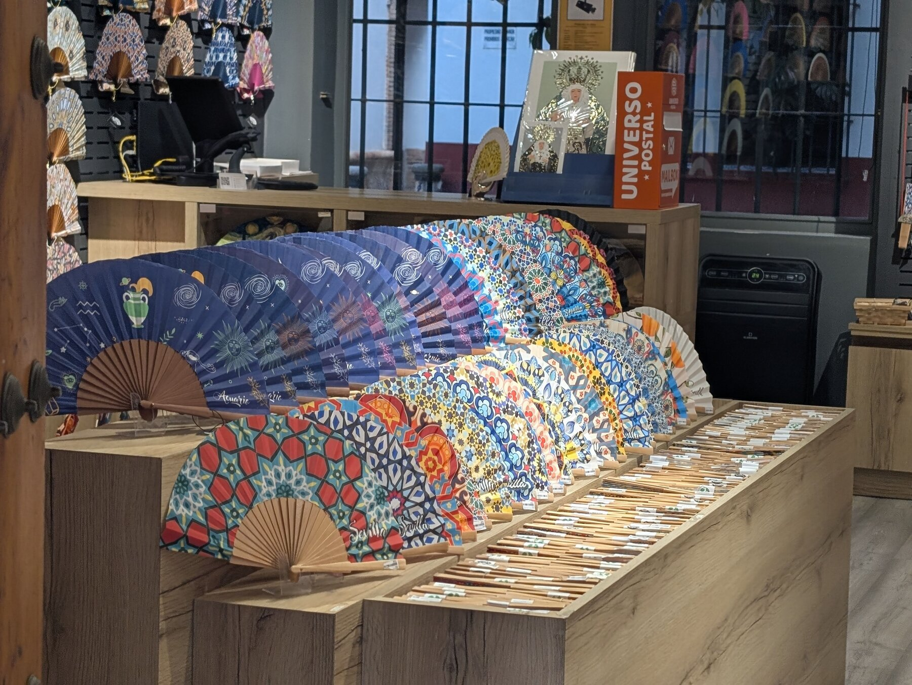
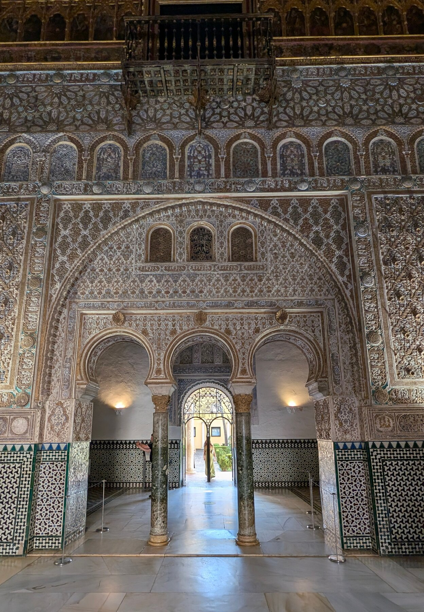
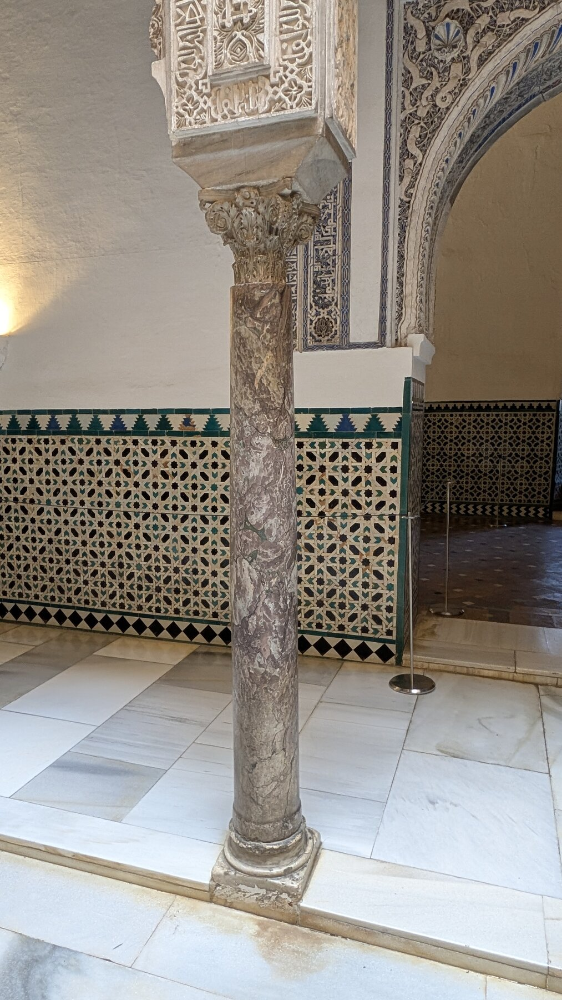
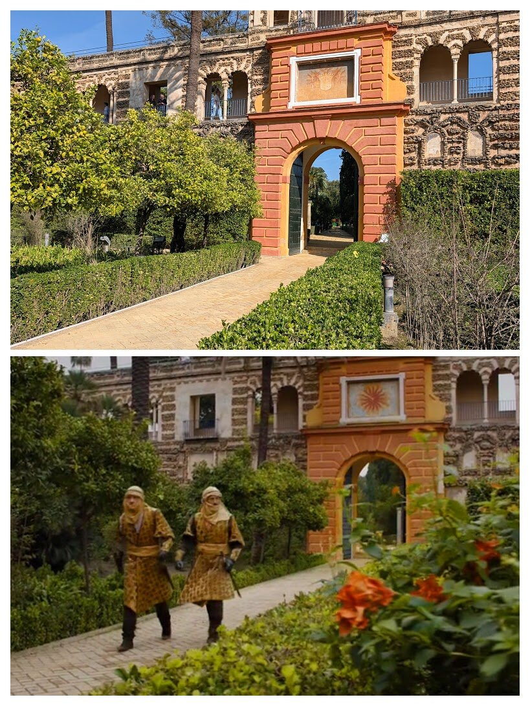
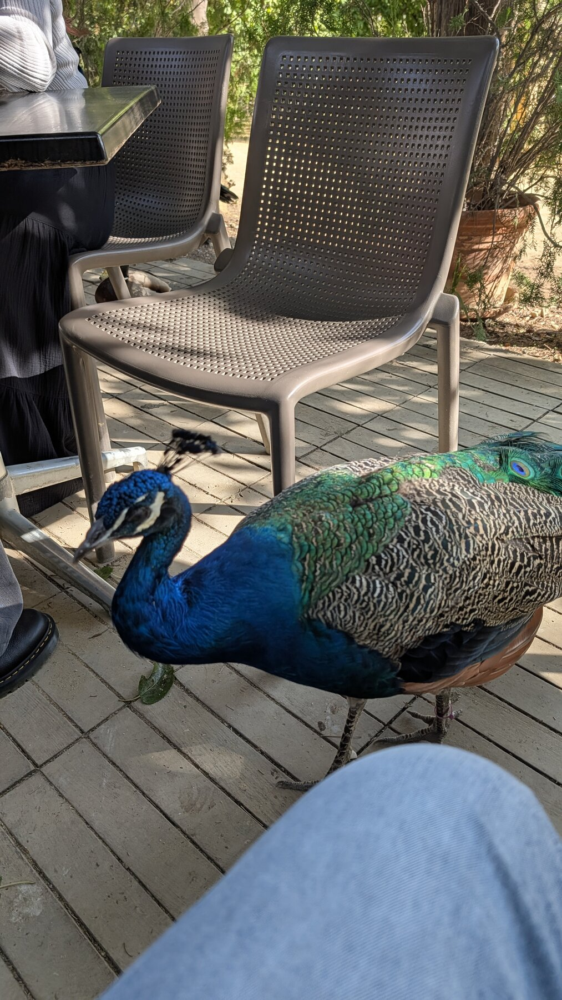

## Overview

We loved Seville.  Like many mid-sized European cities, while the entire metropolitan area is quite large (1.5 million people by some estimates), the historic core is highly manageable.  Our hotel (the [Vincci Seleccion Unuk](https://en.vincciunuk.com/?utm_source=tripadvisor&utm_medium=Business_Advantage&utm_campaign=TA_BA_direct_link&partner=9818)) is/was roughly towards the northern quadrant of the medieval city.  We were thus only a 10ish minute walk from the tourism ‘center’ of the Cathedral and Royal Alcázar. Because we spent 4 nights in the city, we got to know our way around in a delightful way.  The city certainly has winding streets but not nearly as crazy as (for example) Cordoba.  Here in Seville, the narrow winding streets mix with broad squares, so we just found it a very inviting city.  Thus though we spent a full 4 days there, we have fewer ‘notes’, because more than usual, we just … wandered, delightfully.

## What We Did

We did a walking [tour](https://www.sevillawalkingtours.com/city-intro) with [Concepcion](https://www.sevillawalkingtours.com/about-us) including the Cathedral who Rick Steves recommended.  She gave an outstanding tour, and we would highly recommend her.  This 3-hour tour combined a general “walking around the city” with a visit to the Cathedral. The Cathedral is enormous, but I’m not sure I would say one of the most compelling cathedrals in Europe.  Seville largely brags about how enormous it is, it’s one of the largest church buildings on earth, but …. we have seen ones we love more.  

The tower is a crowded walk up as with any large cathedral tower, but worth the 10-15 minutes each way of walking up the ramps.  This tower started as a minaret, and some poor gentleman had to climb the tower multiple times a day for the call to prayer.  The climb up is thus by ramps, so he could ascend by donkey.

We found the Alcázar very interesting and well worth several hours.  It’s a complicated complex of multiple buildings built over several different eras.  Much of the most famous portions were built in the 13th or 14th century *after* the Catholic reconquest.  In that era, Moorish artisans were still in the city, and the design is far more reminiscent of Moorish influences than Christian ones.  The gardens behind the palace are also beautiful and well worth some time just wandering.    If you’re into the Game of Thrones, several scenes from Dorne were filmed at the Alcázar.  See, for example, in Season 5 of GoT where [Jaime meets with Prince Doran](https://www.youtube.com/watch?v=fdsbDTS4Mtg) and Ellaria Sand meets with her daughters to plot her revenge.

The gardens behind the Alcázar are worth an hour of and in themselves.

We thought we didn’t particularly like flamenco, and were admittedly skeptical of going to something we thought would be overly touristy.  We’re glad we overcame this.  Multiple locals, including the guitarist from Ronda, recommended the Casa del Flamenco ([TA](https://www.tripadvisor.com/Attraction_Review-g187443-d4114622-Reviews-La_Casa_del_Flamenco-Seville_Province_of_Seville_Andalucia.html)) as the least-overly-touristy (most authentic?) flamenco show in town.  We thoroughly thoroughly enjoyed it – the performances felt passionate to us (ignorant Americans, sure), it was a great bite-sized performance. 

## Where We Stayed

We liked our hotel (the Vincci Seleccion) but I’m not sure I’d say it a 100% slam-dunk win. One of the reasons we picked it was their website heavily sells their rooftop restaurant/bar.  Unfortunately, the rooftop bar/restaurant were 100% closed the entire time we were there in early November, with confusing non-explanations. We ate dinner in the downstairs restaurant one night and saw many seemingly-locals showing up for their rooftop dinner, to be told it was closed – so the restaurant closure was at best poorly communicated.

## Food & Dining

Food in Seville is a unique proposition. Before the trip, I used the internet to find  a dozen or more interesting-sounding restaurants within walking distance of our hotel.  In retrospect, we wish we hadn’t bothered.  Seville more than any other place we’ve been really does seem to have ‘tapas culture’.  Here it's not just in the sense of what’s available, but in the sense of how people eat.  The several locals we met said that few locals sit at a restaurant for 90 minutes or 2 hours.  Locals drop in somewhere, have one drink \+ 1 tapas, and move on.  We could walk up to a restaurant and see it ‘full’ – but the turnover is such that a table seems to clears within 5-10 minutes.  The servers are like F-1 pit crews in clearing a table and prepping it for the next group.  So basically you can walk up to any restaurant, feel out whether you like the vibe, hang out, and sit down, all within 10 minutes.  So in 4 nights …we probably ate at 10 or 12 restaurants, almost all based on ‘feel’. That being said … as much as we enjoy Spanish food, there is a certain sameness to a lot of the meals.  We love Jamon Iberico (Spanish ham), but …. Towards the end of week 2 we couldn’t even look at it.

We do highly recommend Bar el Commercio, a famous 120-year-old (opened 1903\) spot that makes divine fresh churros on demand.  Even if you think you don’t like churros, go there and have some with chocolate.  Crazy tasty.  Not a good daily breakfast ;).

## Practical Tips

Once you are in the old town of Seville, this is a place to just wander -- the entire old town is only 15ish minutes of walking from one end to the other.  The Plaza de España is a bit further away, but still walkable.

Seville has excellent train service to many cities including Madrid, and I can't imagine going any other way to most other 'large' cities.  We took a daytrip "to" it as a way to see some White Villages, and because the train doesn't run from Ronda, but if coming from Malaga or Granada trains will be the way to go.

*Add your photos here*

---

*Last updated: February 2026*

