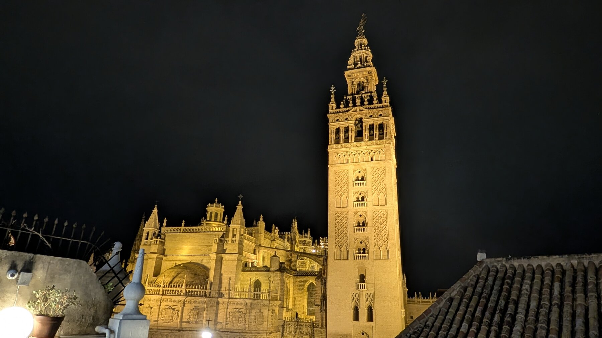
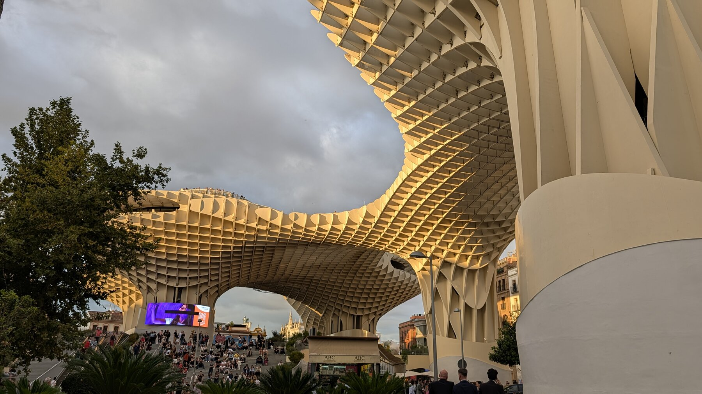

## Overview

Seville is the kind of city where our best moments came from wrong turns -- a courtyard we weren't looking for, a flamenco guitarist playing to no one in a side street, a tapas bar with no sign and four stools.  We spent 4 nights there, and more than anywhere else on this trip, we wandered -- through narrow streets that open unexpectedly into broad squares, past Moorish walls and orange trees, with no destination in mind.  The historic old town is compact -- maybe 15 minutes across on foot -- which makes wandering the default mode of transport. 

> Getting lost is easy; staying lost is almost impossible.

Our hotel sat in the northern part of the medieval city, about a 10-minute walk from the Cathedral and Royal Alcázar -- a good position that we'd replicate.

## The Royal Palace

The Royal Alcázar was the highlight of our time in Seville, and the one site we'd tell anyone not to skip.  The most famous sections were built in the 1360s by Moorish artisans still living in the city — decades after the Catholic reconquest.  The first impression is "Moorish".  The result is a palace that looks more like Granada than anything you'd expect from 14th-century Christian kings. 

If the Alcázar looks familiar, it will to some -- parts of it doubled as Dorne in Game of Thrones. We'd watched those scenes without realizing the setting was real and visitable. Standing in the same courtyards, the production design suddenly made more sense -- they barely had to change anything.

The gardens behind the Alcázar are worth as much time as the palace itself. They sprawl across several acres, shifting from tight Moorish courtyards with sunken flowerbeds to open Renaissance-era expanses -- each section feels like a different century built the room next door.

Water is everywhere. Hundreds of small fountains and channels create a constant low murmur that blocks out the city entirely. The older Moorish sections use thick stone walls and recessed beds to trap cool air -- we noticed the temperature drop the moment we stepped in from the street.

Resident peacocks wander through as if they own the place, which they effectively do.

## Beyond the Palace

We did a [walking tour](https://www.sevillawalkingtours.com/city-intro) with [Concepcion](https://www.sevillawalkingtours.com/about-us), whom Rick Steves recommends -- a 3-hour walk that included the Cathedral. She was excellent. 

The Cathedral itself is enormous -- one of the largest church buildings on earth -- and impressive from outside. 

The Seville Cathedral is the 3rd largest in Europe, and bills itself as the world's largest Gothic cathedral. 

It is gorgeous from the outside, though the inside is less overwhelming to our taste.  The interior is vast enough that the stone pillars feel less like architecture and more like a forest canopy -- your eye follows them up and loses the ceiling in shadow. It's the widest cathedral in the world, and you feel it: the stained glass light barely reaches the center nave, leaving the core of the building dim and cool. After the warmth of the Alcázar gardens, the shift is almost physical.

The tower is worth the climb.  It started as a minaret, which is why the ascent is ramps rather than stairs: the muezzin (caller) needed to get up 250 feet by donkey five times each day.  The walk up is crowded, but worth the 10-15 minutes each way of climbing the ramps. 

## Other Experiences

Las Setas is worth seeing even if you don't know what to make of it. Officially the Metropol Parasol, it was built in 2011 and is billed as the world's largest wooden structure. The architect's name didn't stick; locals immediately started calling them "The Mushrooms." 

They're polarizing, but the square beneath them feels genuinely used -- kids on scooters, families at the surrounding cafes, pickup soccer in the flat open spaces. It is a neighborhood plaza that happens to have a landmark on top. 

It's hard not to wonder if they'll eventually become beloved the way the Eiffel Tower was once loathed. The rooftop walkway has the best sunset view of the Cathedral skyline in the city, and the basement holds Roman ruins -- a reminder that in Seville, you're never more than a few feet from another century.

We were skeptical about [La Casa del Flamenco](https://lacasadelflamencosevilla.com/en/la-casa-del-flamenco/)-- not sure we liked flamenco, and suspicious of anything aimed at tourists.  Multiple locals, including the guitarist from Ronda, pointed us here as the most authentic show in the city. They were right. 

La Casa del Flamenco is in a 15th-century courtyard in Santa Cruz -- no microphones, no amplifiers, no drink service during the performance. The guitar and voice bounce off marble columns and stone arches, and from the front row you're close enough to hear the dancer's shoes hit the floor before the sound reaches the back wall. It's intense, unmediated, and over in an hour -- exactly the right amount.

## Where We Stayed

The [Vincci Seleccion Unuk](https://en.vincciunuk.com/) has the bones of a great hotel -- marble staircases, a central courtyard, and a junior suite with futuristic touches like mood lighting and electric blinds. The location in the old town was right. The room was comfortable.

But we'd booked it largely for the rooftop bar and restaurant, which their website sells hard -- and it was closed our entire week. Early November, still warm enough to eat outside, and no explanation beyond vague deflections. We weren't the only ones caught off guard; we watched locals arrive for rooftop dinner reservations only to be turned away at the door. That's not a seasonal closure. That's poor communication.

The ground-floor restaurant was fine. The hotel was fine. But "fine" is what you say when the thing you came for doesn't show up.

## Food & Dining

Before the trip, we researched a dozen restaurants near our hotel.  In retrospect, we wish we hadn't bothered.  Seville is a place where tapas culture isn't a marketing term -- it's how people eat.  

Every local we talked to said the same thing: nobody sits down for two hours.  Locals drop in somewhere, have one drink and 1 tapa, and move on.  We could walk up to a restaurant and see it "full" -- but the turnover is such that a table seems to clear within 5-10 minutes.  

> The servers are like F-1 pit crews in clearing a table and prepping it for the next group.  You can walk up to any restaurant, feel out whether you like the vibe, hang out, and sit down, all within 10 minutes.  

In 4 nights we ate at 10 or 12 places, almost all chosen by walking past and liking the look of them.

As much as we enjoy Spanish food, there's a sameness to Spanish menus that caught up with us.  We love Jamon Iberico, but towards the end of week 2 we couldn't even look at it.

Bar El Comercio has been making fresh churros since 1904 -- light, not greasy, served with chocolate for dipping. Nothing like what gets sold as churros in California. Worth going even if you think you don't like churros. Not a responsible daily breakfast, but we understood the temptation.

## Practical Tips

Seville has a reputation as one of the hottest cities in Europe. We were there in early November -- warm, but not the brutal 100-degree days of summer. Even so, the city noticeably quieted down between 2:00 and 5:00 PM, and dinner rarely starts before 9:00 PM. Show up at a tapas bar at 7:00 and you'll be eating with other tourists. The real energy emerges after 10:00.

Book the Alcázar and Cathedral online in advance -- without timed tickets, the lines are brutal. Aim for the first slot of the day, especially at the Alcázar, where the gardens deserve time before the heat and crowds arrive. Don't rush the gardens; they're half the experience.

The old town is compact enough that wandering is the activity, not filler between sites. Plan one anchor per half-day -- the Alcázar, the Cathedral, Plaza de Espana -- and leave the rest open. The Cathedral tower is visible from most of the old town and works as a constant landmark; we stopped checking maps after the first day.

At tapas bars, stand at the bar rather than asking for a table. It's faster, more social, and closer to how locals eat. In traditional spots, the bartender marks your tab in chalk directly on the bar top -- a small detail, but one of those things that makes Seville feel like it hasn't fully given in to the modern world.

Seville has excellent train connections -- Madrid is under 3 hours by high-speed rail. We arrived by car from Ronda, which has no train service, using the drive to see some [White Villages](./white-villages.html) along the way. From most other cities, the train is the obvious choice.

Seville held together better than any city on this trip. The Alcázar alone would justify the stop, but what stayed with us was the rhythm -- the wandering, the unplanned tapas, the flamenco we almost skipped. Even the hotel disappointment fit the pattern: the best things in Seville were the ones we didn't book in advance. Four nights felt right. We'd do it again with even less of a plan.

:::nutshell Seville
verdict: Would Plan Around
duration: 4 days
Stay Overnight: Yes -- 4 nights felt right. 2 minimum to do it properly.
Don't Miss: The Alcázar; Casa del Flamenco even if you're skeptical; Bar El Comercio for breakfast once.
Best Time of Day: The Alcázar gardens in the late afternoon; the streets after dinner when locals are out.
Worth the Splurge: A private guide for the Alcázar -- the layers of history reward explanation; a walking tour with the excellent Concepcion.
Return Visit: Yes. There is a richness to this city that supports multiple visits.
:::

*Add your photos here*

---

*Last updated: February 2026*

