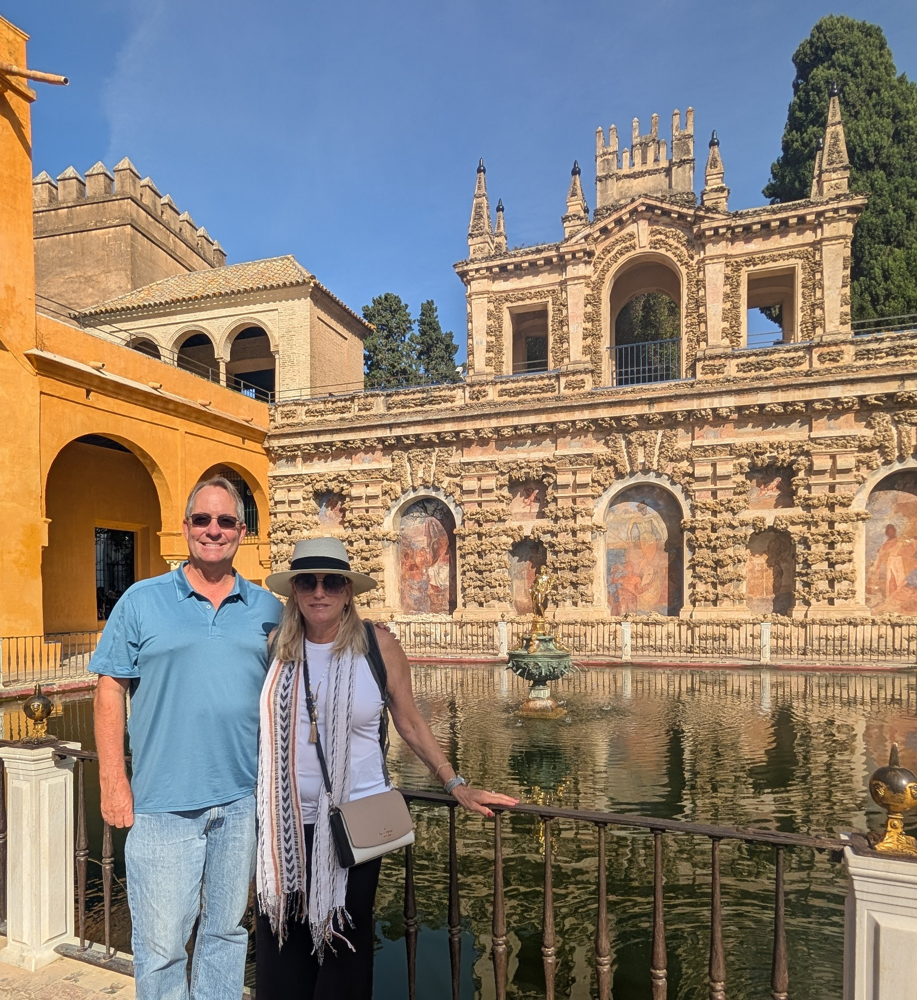
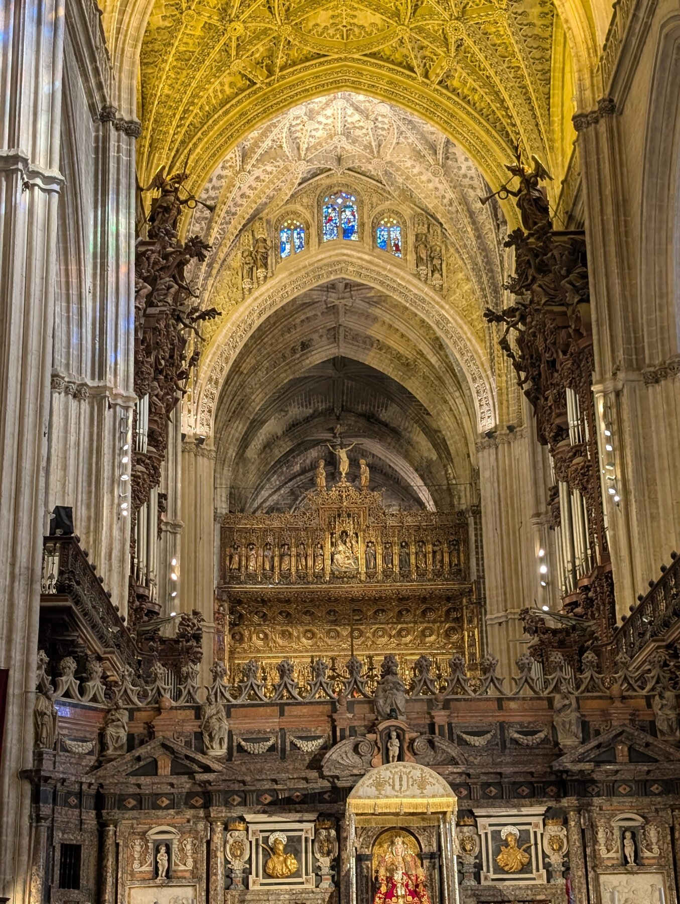
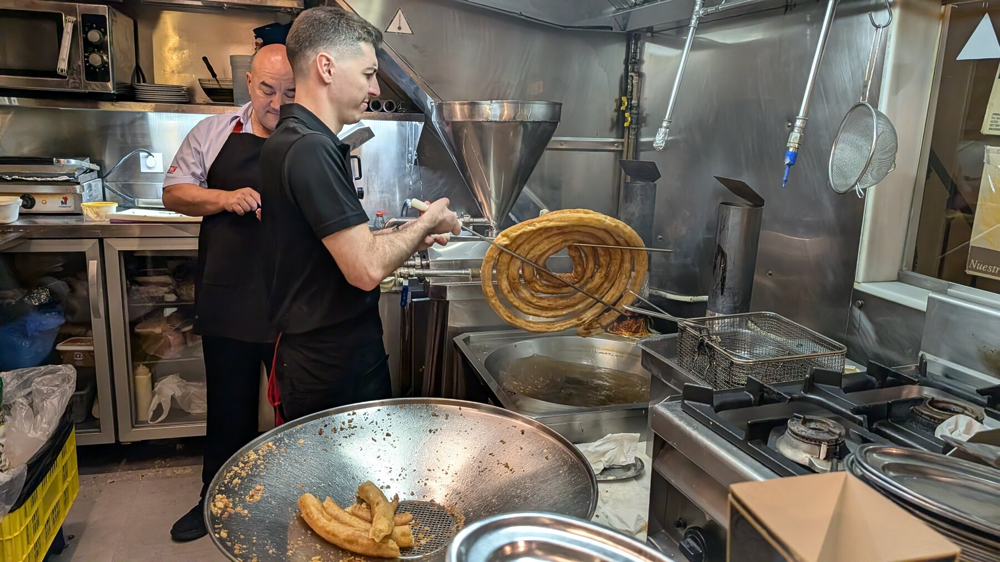
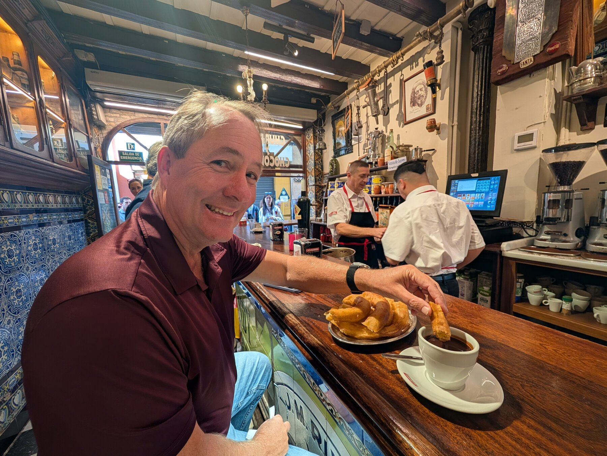
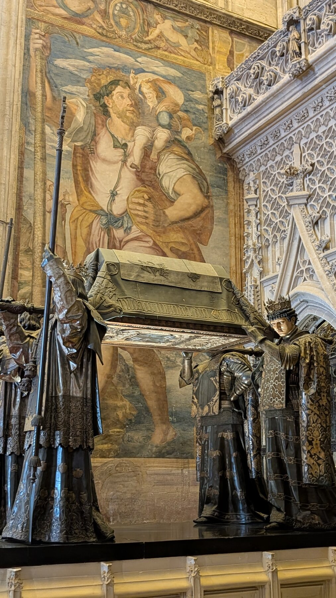
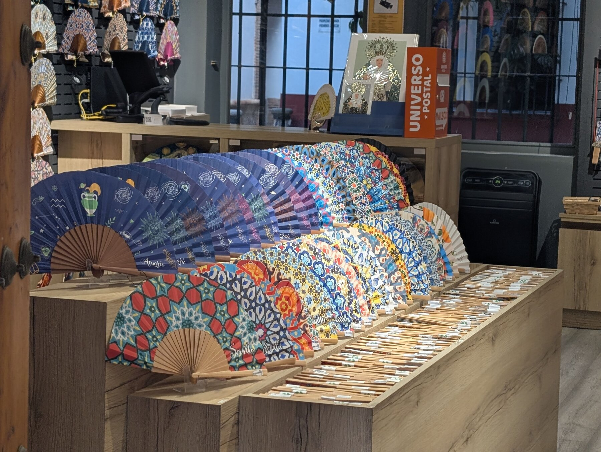
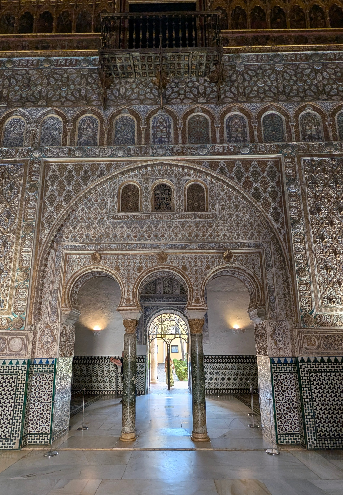
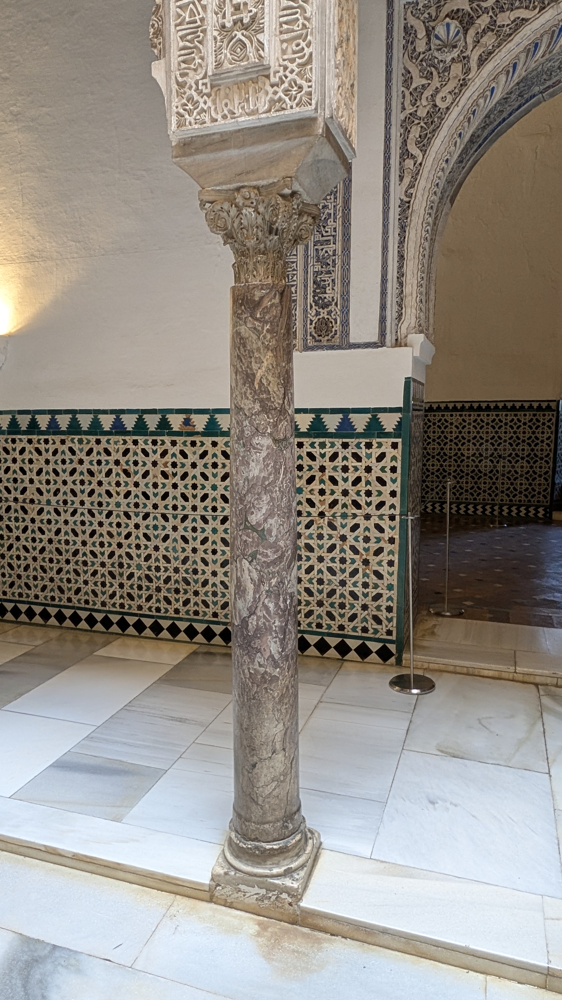
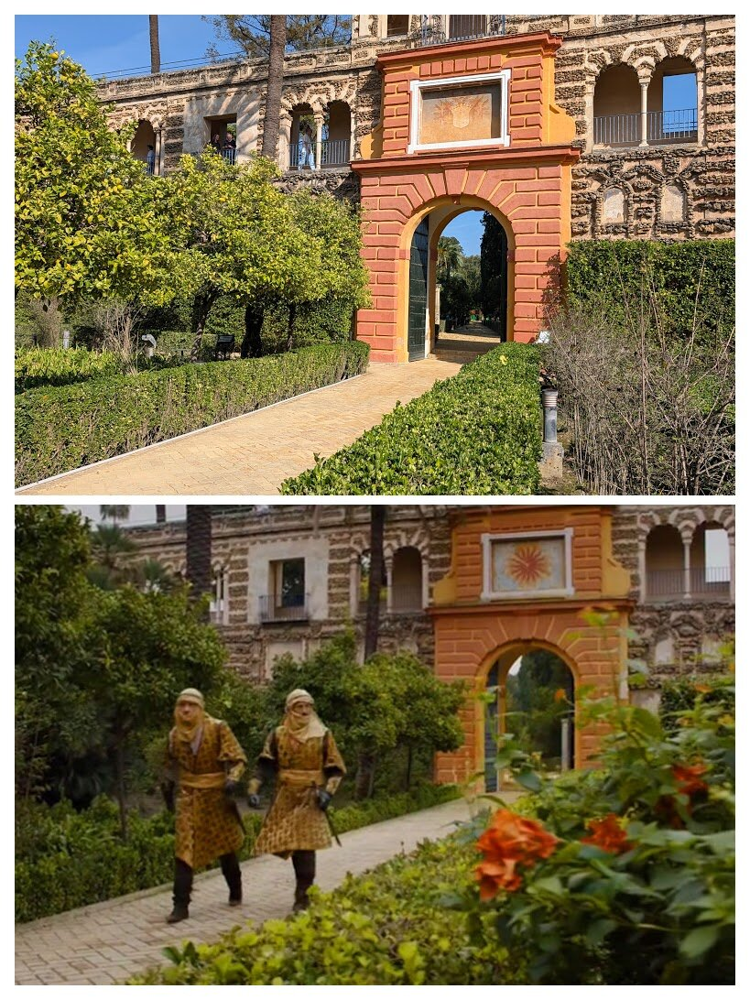
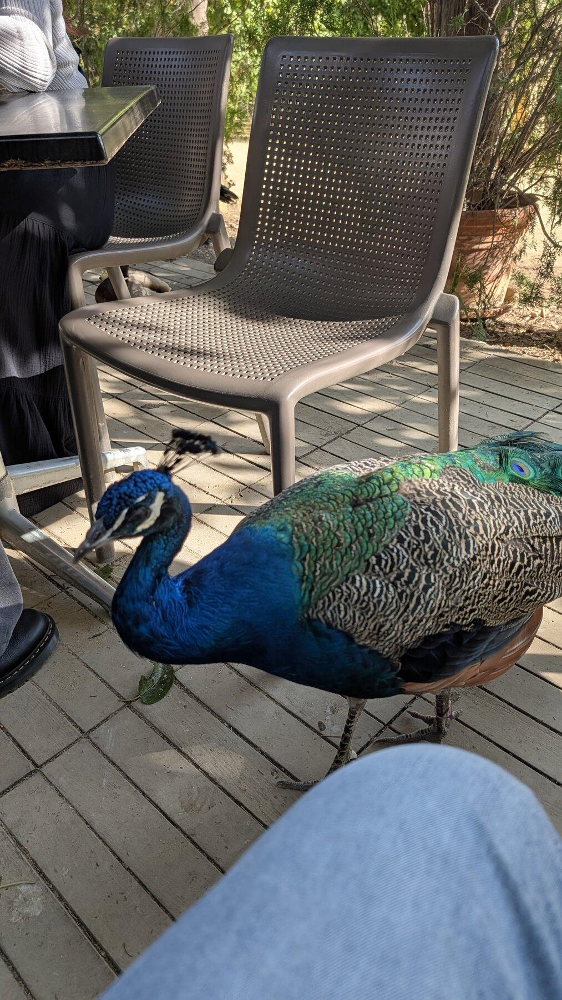

## Overview

Seville is the kind of city that rewards not having a plan. We spent four nights there, and more than anywhere else on this trip, we wandered -- through narrow streets that open unexpectedly into broad squares, past Moorish walls and orange trees, with no destination in mind. The historic core is compact enough (15 minutes across on foot) that getting pleasantly lost is low-risk. We loved it.

Our hotel sat in the northern part of the medieval city, about a 10-minute walk from the Cathedral and Royal Alcázar -- a good position that we'd replicate.

## What We Did

The Royal Alcázar is the unqualified highlight of Seville, and arguably the best single site in Andalusia after the Alhambra. The most famous sections were built in the 1360s -- after the Catholic reconquest -- but designed almost entirely in Moorish style, by Moorish artisans still living in the city. The result is a palace that looks more like Granada than anything you'd expect from 14th-century Christian kings. 

If you're into the Game of Thrones, several scenes from Dorne were filmed at the Alcázar.  See, for example, in Season 5 of GoT where [Jaime meets with Prince Doran](https://www.youtube.com/watch?v=fdsbDTS4Mtg) and Ellaria Sand meets with her daughters to plot her revenge.

The gardens behind deserve an hour on their own.

We did a [walking tour](https://www.sevillawalkingtours.com/city-intro) with [Concepcion](https://www.sevillawalkingtours.com/about-us), whom Rick Steves recommends -- a 3-hour combination of city walking and Cathedral visit. She was excellent. The Cathedral itself is enormous -- one of the largest church buildings on earth -- and genuinely impressive from outside. The interior left us less moved than some we've seen, but the tower is worth the climb. 

The tower started as a minaret, which is why the ascent is ramps rather than stairs: the man responsible for the call to prayer five times a day needed to get up 250 feet by donkey.  Like most cathedral towers, the walk up is crowded, but worth the 10-15 minutes each way of climbing the ramps. 

One thing worth seeing even if you don't know what to make of it: Las Setas -- officially the Metropol Parasol, built in 2011 and billed as the world's largest wooden structure. The architect's name didn't stick; locals immediately started calling them "The Mushrooms." They're polarizing, but the square beneath them feels genuinely used by locals, and it's hard not to wonder if they'll eventually become beloved the way the Eiffel Tower was once loathed.

We went to the Casa del Flamenco ([TA](https://www.tripadvisor.com/Attraction_Review-g187443-d4114622-Reviews-La_Casa_del_Flamenco-Seville_Province_of_Seville_Andalucia.html)) skeptically -- we weren't sure we liked flamenco, and assumed anything recommended to tourists would be watered down. Multiple locals, including the guitarist from Ronda, pointed us here as the most authentic show in the city. They were right. The performances felt genuinely passionate, the venue is intimate, and it's a contained enough experience that you don't leave exhausted.

## Where We Stayed

We liked our hotel, the [Vincci Seleccion Unuk](https://en.vincciunuk.com/?utm_source=tripadvisor&utm_medium=Business_Advantage&utm_campaign=TA_BA_direct_link&partner=9818).   But we're not sure we'd call it a 100% slam-dunk win. One of the reasons we picked it was their website heavily sells their rooftop restaurant/bar.  Unfortunately, the rooftop bar/restaurant were 100% closed the entire time we were there in early November, with confusing non-explanations. We ate dinner in the downstairs restaurant one night and saw many seemingly-locals showing up for their rooftop dinner, to be told it was closed -- so the restaurant closure was at best poorly communicated.

## Food & Dining

Food in Seville is a unique proposition. Before the trip, I used the internet to find a dozen or more interesting-sounding restaurants within walking distance of our hotel.  In retrospect, we wish we hadn't bothered.  Seville more than any other place we've been really does seem to have 'tapas culture'.  Here it's not just in the sense of what's available, but in the sense of how people eat.  The several locals we met said that few locals sit at a restaurant for 90 minutes or 2 hours.  Locals drop in somewhere, have one drink \+ 1 tapas, and move on.  We could walk up to a restaurant and see it "full" -- but the turnover is such that a table seems to clear within 5-10 minutes.  

> The servers are like F-1 pit crews in clearing a table and prepping it for the next group.  So basically you can walk up to any restaurant, feel out whether you like the vibe, hang out, and sit down, all within 10 minutes.  

So in 4 nights ... we probably ate at 10 or 12 restaurants, almost all based on "feel". 

That being said ... as much as we enjoy Spanish food, there is a certain sameness to a lot of the meals.  We love Jamon Iberico (Spanish ham), but .... Towards the end of week 2 we couldn't even look at it.

Bar El Comercio has been making fresh churros since 1904 -- light, not greasy, served with chocolate for dipping. Nothing like what gets sold as churros elsewhere. Worth going even if you think you don't like churros. Not a sustainable daily breakfast, but we understood the temptation.

## Practical Tips

Once you are in the old town of Seville, this is a place to just wander -- the entire old town is only 15ish minutes of walking from one end to the other.  The Plaza de España is a bit further away, but still walkable.

Seville has excellent train service to many cities including Madrid, that's easily the best way to reach most major cities.  We took a daytrip "to" Seville as a way to see some White Villages, and because the train doesn't run from Ronda, but if coming from Malaga or Granada trains will be the way to go.

:::nutshell Seville
verdict: Would Plan Around
duration: 4 days
Stay Overnight: Yes -- four nights felt right. Two minimum to do it properly.
Don't Miss: The Alcázar; Casa del Flamenco even if you're skeptical; Bar El Comercio for breakfast once.
Best Time of Day: The Alcázar gardens in the late afternoon; the streets after dinner when locals are out.
Worth the Splurge: A private guide for the Alcázar -- the layers of history reward explanation; a walking tour with the excellent Concepcion.
Return Visit: Yes. There is a richness to this city that supports multiple visits.
:::

*Add your photos here*

---

*Last updated: February 2026*

