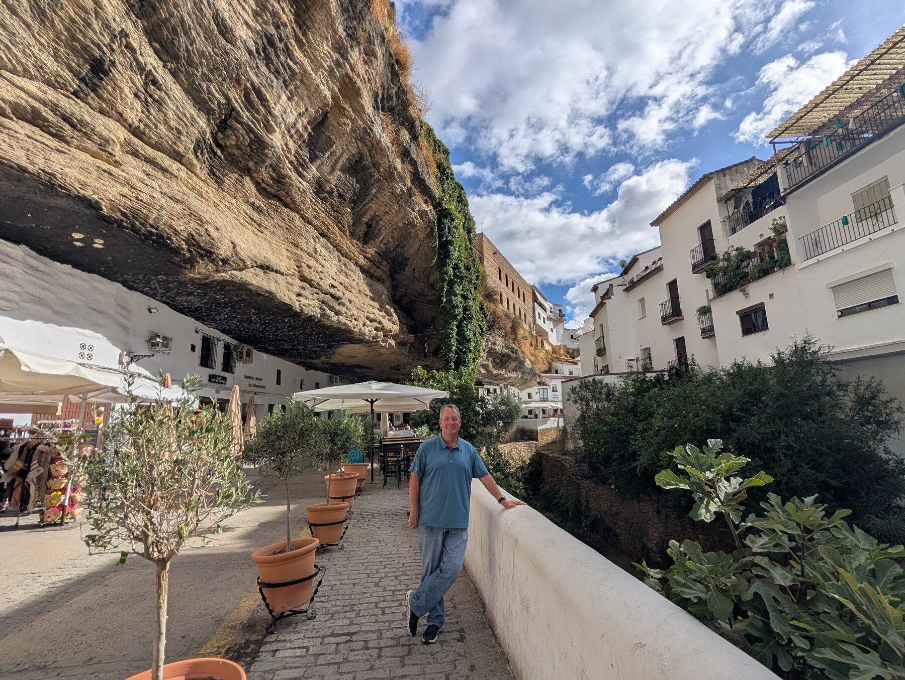
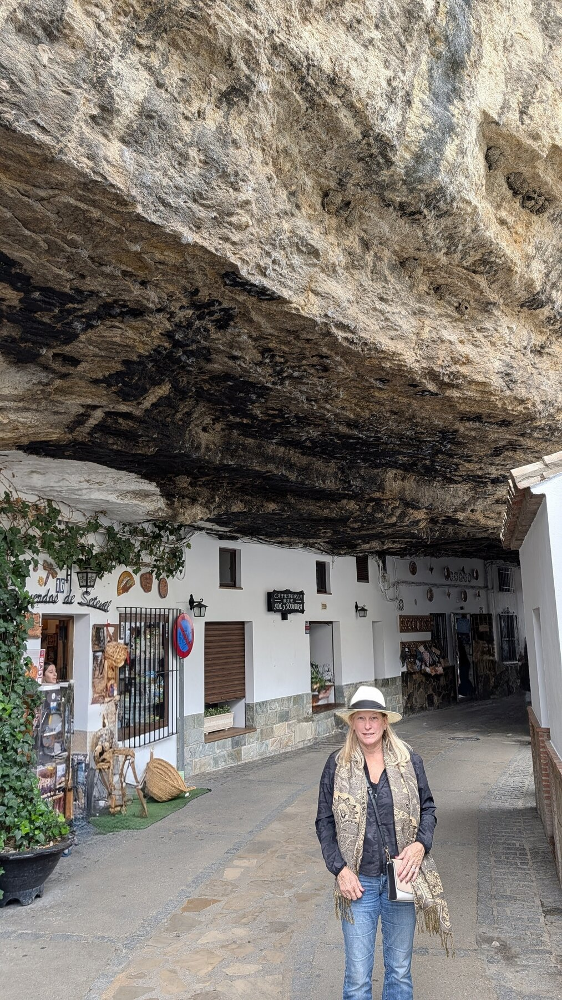
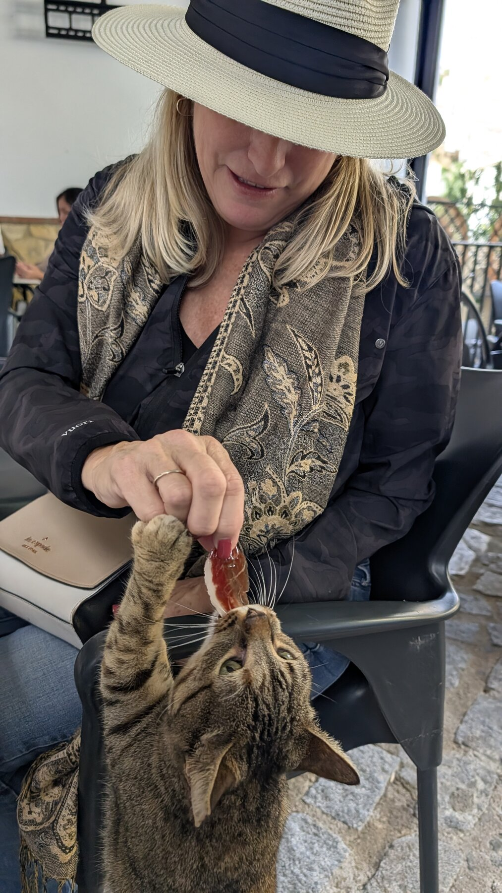
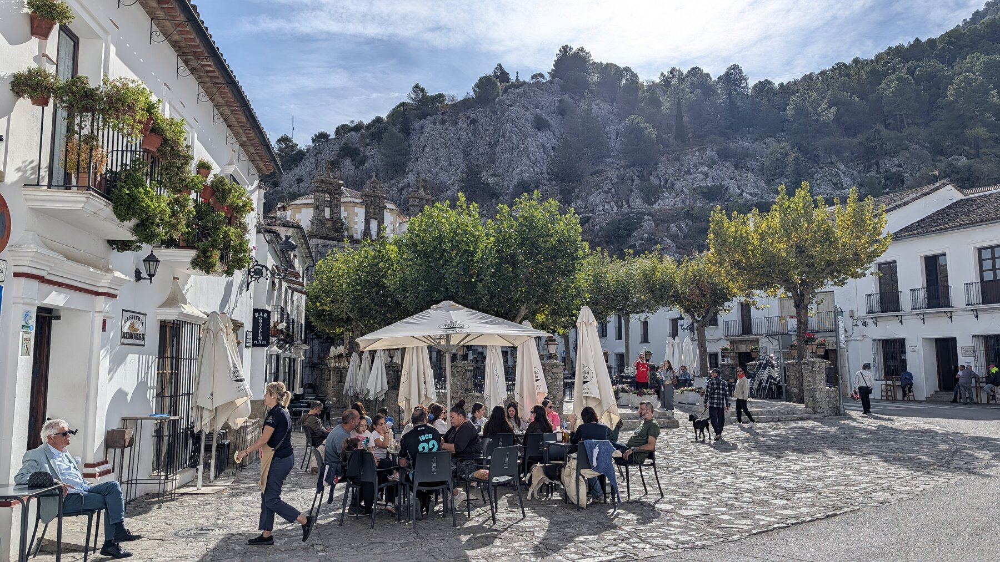

## Overview

Most visitors to the **Ruta de los Pueblos Blancos** (Route of the White Villages) go straight to Ronda. We did too, but we also spent two days visiting three smaller villages nearby, and each one justified the detour in a different way. Setenil de las Bodegas has houses built into boulders. Zahara de la Sierra has a castle you'll have entirely to yourself. Grazalema has mountains that make you forget you're in Andalusia.  

The whitewash isn't decorative, it reflects heat. The Moorish street plans aren't quaint, they were built to channel shade.  

## Setenil de las Bodegas

Setenil de las Bodegas, population 2500, is an hour from Malaga. The town is built into the cliffs -- entire blocks of houses sheltered under enormous boulders, with another layer of homes perched on top. Worth the stop, but 2 hours covers it.

Our driver dropped us at the town entrance and picked us up at the same spot.  The parking lot is a 15-minute walk that would have eaten into a short visit.

Cuevas del Sol ('Caves of the Sun') is a row of whitewashed cafes built under a massive limestone overhang on the sunnier side of the river. The rock forms a natural roof, close enough overhead that you're aware of it the entire time you're drinking your coffee.

Cuevas de la Sombra ('Caves of Shadow') lies across the river, in permanent shade. The boulders overhead dwarf the buildings beneath them.  Buildings fit under a single rock formation.

We made a friend in Setenil -- a cat who appeared the moment the jamón came out, with the confidence of a creature who'd run this routine before.

Many shops are built into the sides of boulders.  One ceramics shop had painted plates on one wall and raw rock on the other, the inventory ending where the cliff began.

## Grazalema

We spent only 45 minutes in Grazalema and saw more of it from the outside than from within. The town is small -- population around 2,000 -- and the square isn't a grand civic center. It's a car-free plaza where the loudest sounds are coffee spoons and a fountain. Local men in flat caps looked like they hadn't moved in hours. Doing nothing appeared to be a respected afternoon activity.

The reason is the setting. Grazalema sits in a bowl of the Sierra de Grazalema, white buildings against jagged limestone peaks that look like crumpled grey velvet from the town's lookout points. It's famously the wettest place in Spain, and it shows -- the valley has a lushness you don't expect in Andalusia, with moss on the rock faces and thick clusters of firs that feel more Alpine than Mediterranean.  

Looking out into the valley, you see the road you just drove up snaking away like a tiny grey thread. The setting is the reason to come -- the town itself is a 45-minute visit, but the mountains around it stay with you longer.

## Zahara de la Sierra 

Zahara de la Sierra was a favorite. A former Moorish outpost perched strategically between Ronda and Seville, it still has the medieval street plan -- narrow, labyrinthine, and built for defense rather than convenience. Good for an hour of wandering.

From the town square it's a 15-minute walk up to the tower of the 13th-century Moorish castle -- well restored, with remnants of the medieval village still visible behind the walls. 

> On a Saturday afternoon in October we had the top entirely to ourselves for a good 10 minutes, which tells you something about how few visitors make it this far up. The views on the way are reason enough to go; the top is better still.

## Practical Tips

We hired a driver for all three, and it was the right call.  Car parks are always a walk from the town centers, and being dropped at the main square and picked up when we were done let us see three towns in two travel days without the logistics eating into the time.

See our [Tips for Spain](tips.html) page for more on booking drivers through [daytrip.com](http://daytrip.com).

Ronda gets the attention, and deserves it. But the White Villages are worth a day on their own -- each one took less than 2 hours, none felt rushed, and together they show you how differently three Andalusian towns can wear the same whitewash. Even Setenil, which draws the largest crowds, feels nothing like Zahara's quiet castle or Grazalema's mountain bowl.

:::nutshell White Villages
verdict: Would Plan Around
duration: 1 day
Stay Overnight: Not necessary.
Don't Miss: Setenil de las Bodegas is remarkable and unique.
Best Time of Day: These are all day-trip destinations.
Worth the Splurge: Hiring a driver who dropped us off right at the town center, thus avoiding shuttles or walks from the remote parking lots.
Return Visit: Not sure. Each is beautiful, but not sure there's enough that we'd return.
:::

*Add your photos here*

---

*Last updated: February 2026*

